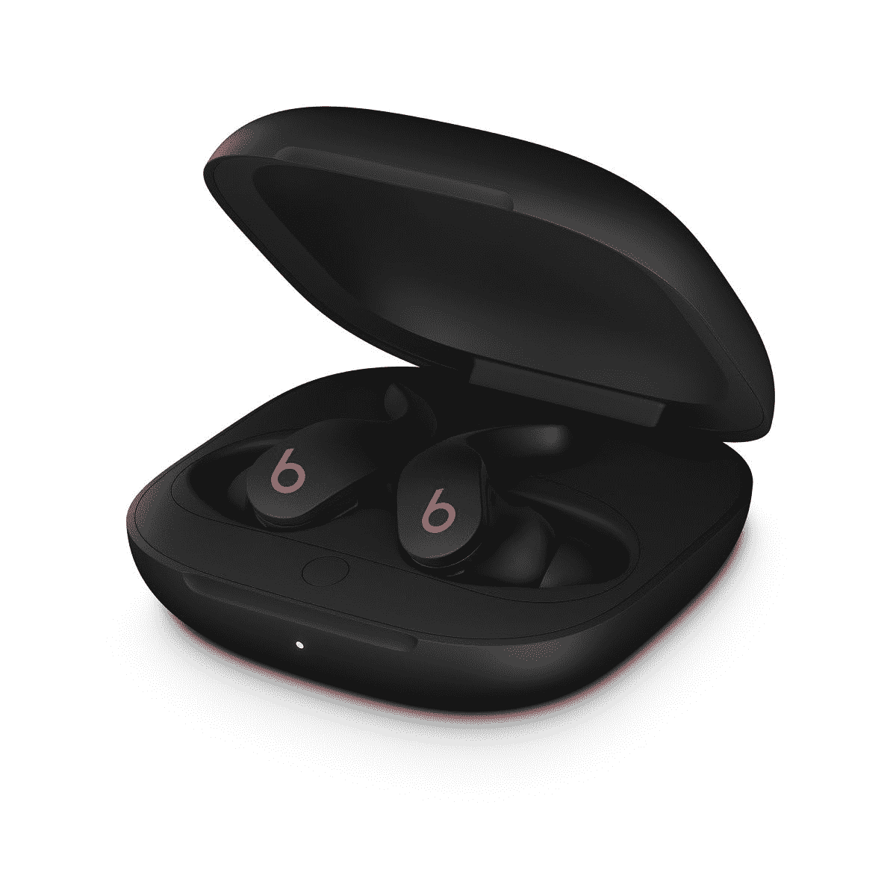

# 苹果的新 Beats ANC Fit Pro 是很好的 AirPods Pro 替代品

> 原文：<https://www.xda-developers.com/apple-beats-anc-fit-pro-launch/>

苹果公司发布了新款 Beats Fit Pro ANC 耳塞。这次发布比第三代 ai rpods 的发布晚了不到一个月。这些新的真正的无线耳塞具有类似 AirPods Pro 的功能集。然而，它们有着完全不同的设计，与 Beats 品牌相匹配，更注重健身。

Beats Fit Pro 有四种颜色可供选择——Beats 黑色、Beats 白色、石紫色和灰白色。说到功能，它们支持你在 AirPods 上看到的大多数功能，例如与 iPhones 的即时配对(多亏了 H1 芯片)，嘿 Siri 支持，带有动态头部跟踪的空间音频，找到我的支持，等等。

新 Beats 的设计没有 AirPods 上的词干。相反，它们有翼尖帮助它们在你的耳朵里保持稳定。尽管 Fit Pro 和 AirPods Pro 在充满电的情况下都能提供约 24 小时的听音时间，但前者不支持无线充电。幸运的是，它们都是防水和防汗的，所以你可以无忧无虑地工作。

至于定价，Beats 在美国的售价为 199 美元，而 AirPods Pro 的售价为 249 美元。因此，它们是更便宜的 AirPods Pro 替代品，将提供几乎完全相同的功能。

 <picture></picture> 

Beats Fit Pro

##### Beats Fit Pro

新款 Beats Fit Pro 提供了与 AirPods Pro 类似的功能，如 ANC、Hey Siri、空间音频、即时配对等。它们的价格也更低。

### 苹果给予，苹果拿走

据 [*MacRumors*](https://www.macrumors.com/2021/11/01/apple-discontinues-beats-headphones/) 报道，在 Fit Pro 发布后，苹果已经停产了几款 Beats 机型。这些型号包括 Powerbeats、Beats Solo Pro 和 Beats EP，售价分别为 150 美元、250 美元和 130 美元。这给 Beats 粉丝留下了七个选项可供选择——Beats Studio Buds、Powerbeats Pro、beats Pro、Beats Flex、Beats Studio 3、Beats Fit Pro 和 Beats Pill+。

试图在苹果在线商店查看任何停产的 Beats 产品都会出现一个大横幅。上面写着这些产品已经停产，并建议查看类似的产品。

*你打算买 Beats Fit Pro 还是 AirPods Pro？请在下面的评论区告诉我们。*