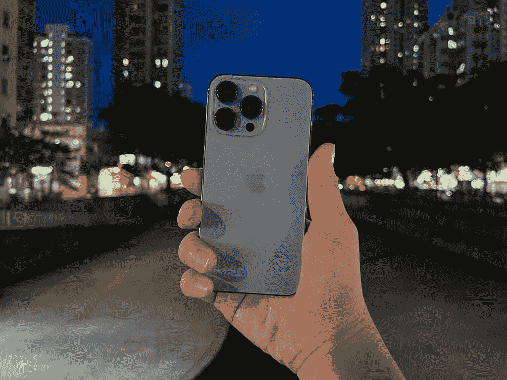
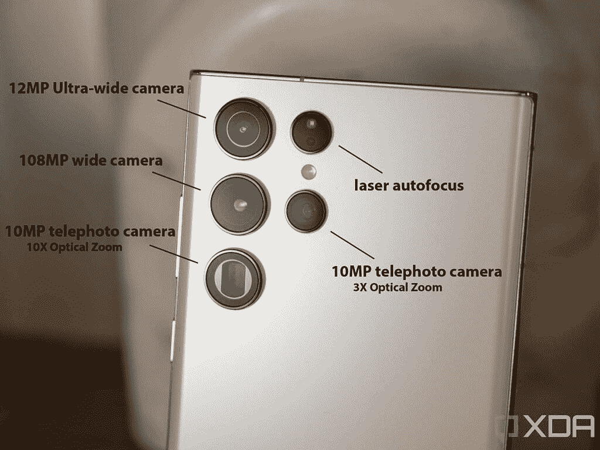
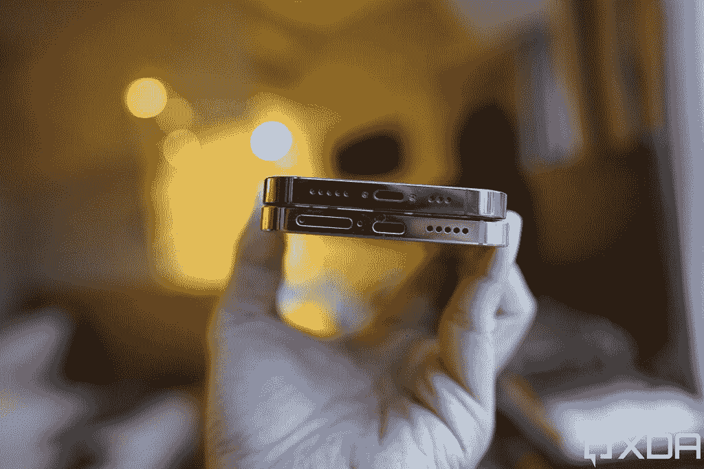

# 是时候苹果发布一款 Galaxy S22 Ultra 竞争产品了

> 原文：<https://www.xda-developers.com/apple-competitor-samsung-galaxy-s22-ultra/>

当谈到选择下一部智能手机时，不同的人会选择不同的东西。一些人寻找最好的相机来记录他们去最喜欢的餐馆和荒野的旅程。其他人关心操作系统(OS)和/或它的皮肤。例如，有些用户不会购买运行重度 Android 版本的设备，而另一些用户则有自己的最爱。同样，那些深度投资于苹果生态系统的人可能只会将不同的 iPhones 视为潜在的购买设备。

这对 iOS 用户来说是个问题，因为该操作系统只能在 iPhones 上使用。因此，当科技霸主不发布令人满意的设备时，它的用户会发现自己嫉妒另一边的人。最高端的 [iPhone 13 Pro Max](http://xda-developers.com/iphone-13-pro-max) 不符合你的预期？不幸的是，没有更先进的 iPhone 供你购买，你必须等待一个完整的年度周期，才能发现下一部是否会更好，或者只是一个“S”版本。这正是苹果需要发布一款[三星 Galaxy S22 Ultra](https://www.xda-developers.com/samsung-galaxy-s22-ultra-hands-on/) 竞争对手的原因。如果买家不关心操作系统和生态系统，他们没有太多令人信服的理由选择 iPhone 13 Pro Max 而不是 [Galaxy S22 Ultra](https://www.xda-developers.com/samsung-galaxy-s22-ultra-unboxing/) 。

## 过度杀戮的摄像机

 <picture></picture> 

iPhone 13 Pro Max, main camera

人们有时抱怨现代手机有太多后置摄像头。我们可能都见过 Pro Max iPhones 被比作炉子的模因。然而，这未必是一件坏事。这些额外的镜头并不是出于美观的原因而放在那里的，至少在 iPhones 上还不是。它们服务于一个有效的目的——拍摄更好的照片和视频，除了提高手机的摄影能力。

Galaxy S22 Ultra 具有更强大的相机功能和更大的多功能性，这是任何 iPhone 都无法比拟的

苹果最先进的手机 iPhone 13 Pro Max 只配备了三个后置摄像头。虽然镜头数量并不总是意味着更好的摄影效果， [Galaxy S22 Ultra 配备了更强大的相机功能](https://www.xda-developers.com/samsung-galaxy-s22-camera-features/)和更大的多功能性，这是任何 iPhone 都无法比拟的，这要归功于它的四个后置摄像头。比如 Galaxy S22 Ultra 支持 10 倍光学变焦和 100 倍空间变焦。苹果仍然不支持后者，前者仅限 3x。没错，iPhone 的摄像头对于一般用户来说绰绰有余，但苹果的生态系统中也有一些专业摄影师和爱好者。该公司似乎并不太关心这些特殊的用户，给他们一个与这种多功能性相匹配的系统。苹果正在视频部门做一些事情，但在摄影方面还有很多需要改进的地方，包括但不限于专业模式。三星不仅提供硬件多功能性，而且还有几个软件功能，如 Single Take 和 Director's View，苹果应该为其 Pro 手机考虑这些功能。

 <picture></picture> 

Samsung Galaxy S22 Ultra's rear camera setup

此外，Galaxy S22 Ultra 配备了 40MP 前置摄像头。这使得它的用户可以在我们日益社会化的网络世界中拍摄清晰的自拍和视频。iPhone 13 Pro Max 上的原深感摄像头保留了前代 iPhone 的 12MP。虽然由于人像模式，它可以拍出一些令人惊叹的自拍，但该公司仍可以改进前置摄像头系统。

## 给我们一支笔！

三星 Galaxy S22 Ultra 和 iPhone 13 Pro Max 分别采用 6.8 英寸和 6.7 英寸显示屏。相对而言，它们都是巨型手机。然而，出于某种原因，苹果仍然不支持 iPhones 上的铅笔。手机不再小巧，许多人在旅途中用手机涂鸦和写笔记。三星有一个 Galaxy Note 阵容，我用了两年左右的 Galaxy Note 2 LTE。无论我走到哪里，都可以方便地使用 S Pen 是一个游戏规则的改变者，S Pen 当时甚至没有丰富的功能——从那以后，它们只会变得更好。

 <picture></picture> 

Apple Pencil and iPad Pro

如果这家市值 3 万亿美元的公司不想把有限的资源和智慧花在设计一款带有触控笔孔/发射井的 iPhone 上，它至少可以在 iPhone 屏幕上添加 Apple Pencil 支持。虽然单独携带铅笔可能有点麻烦，但对于那些真正需要和想要它的人来说，它至少是一种选择。S Pen 可能不适合所有人，但它的位置和功能都非常出色，Cupertino 巨人早就应该成为竞争对手了。

S Pen 可能不适合所有人，但它的位置和功能都是非凡的，Cupertino 巨人早就应该成为竞争对手了

## 2012 年呼吁，他们想要回他们的港口

 <picture></picture> 

Vivo V23 and iPhone 13 Pro

在一个完美的世界里， ~~Twitter 提供了一个*编辑*按钮~~所有手机制造商和谐地采用 USB-C 作为通用充电和数据传输端口。很明显，我们生活在一个远非完美的世界，而苹果仍然顽固地求助于其在 iPhones 上的专有闪电端口。然而令人惊讶的是，它采用了一些 iPad 型号上更常用的端口。我不明白为什么该公司会给 iPads 上的 USB-C 开绿灯，却不给 iPhones 开绿灯。我想有些问题永远得不到答案，在可预见的未来，我们将不得不随身携带不同类型的电缆。对此的另一种看法是，由于 45W 快速有线充电支持，即使是三星也在向更快的充电迈进，这使得官方的 18W“快速”充电在 iPhone 13 Pro Max 上显得绝对古老。我们早就应该升级了，所以当你升级的时候，请转到 USB C 和 USB PD，苹果？

说到充电，为什么不能有反向无线充电，苹果？现在大多数 AirPods 外壳都支持 Qi 充电，如果能够在旅途中通过 iPhone 充电，生活会变得轻松一些。这是我嫉妒苹果还没有实现的主要功能之一。

## 我们需要看到苹果的一些矫枉过正

 <picture></picture> 

iPhone 13 Pro’s notch (left) is smaller than the iPhone 12 Pro’s notch.

曾几何时，苹果习惯于跳出框框思考。在我看来，至少在很大程度上，情况不再是这样了。是的，[通用控制](https://www.xda-developers.com/how-to-use-universal-control/)是神奇的，该公司有时确实会提出一些创新的想法。然而，当谈到 iPhones 时，它们变得非常平凡。新发布的产品不再令人兴奋——它只是一部昂贵但可靠的手机，可以完成你的日常任务，到处都有新功能。稍微小一点的缺口是我们要求的*缺口*。

是时候让苹果在 Pro 之外冒些风险，做些超杀伤力的事情了

苹果每年都在主题演讲中声称，其设备旨在帮助创意人员探索、表达和提高他们的才能。坦白说，我看不到，再也看不到了。与三星 Galaxy S22 Ultra 等手机相比，iPhones 具有局限性。后者真正释放了我们现代技术的潜力，并试图充分利用它们。不幸的是，前者没有。我不认为自己会离开苹果的生态系统，至少短期内不会，所以在可预见的未来，当我决定下一步购买哪一款手机时，我将面临很少的选择。从好的方面来看，新版本不是很诱人——考虑到没有太多的变化——我也没有经常升级的冲动，所以我的钱包为此感到庆幸。

如果我没有被束缚在库比蒂诺科技巨头的生态系统中(并且有耐心使用 Android)，我很可能会选择 Galaxy S22 Ultra 而不是任何 iPhone。这也正是苹果应该发布三星最新旗舰的竞争对手的原因。一个不像我一样关心操作系统的人可能会买 Android 手机。苹果坚持其熟悉的产品只会失去潜在客户。是时候让他们冒点风险，做些超杀伤力的事情了。

 <picture></picture> 

Samsung Galaxy S22 Ultra

Galaxy S22 Ultra 是三星 2022 年的顶级旗舰产品，带来了顶级的性能、显示和相机功能以及 S Pen 功能，为高级用户提供了 Ultra 体验。这是发烧友和超级用户的完美手机，也是苹果没有竞争对手的设备。

如果你决定[购买三星 Galaxy S22 Ultra](https://www.xda-developers.com/best-samsung-galaxy-s22-deals/) ，别忘了[用外壳](https://www.xda-developers.com/best-samsung-galaxy-s22-ultra-cases/)保护它！

*你更愿意用三星 Galaxy S22 Ultra 还是 iPhone 13 Pro Max 作为日常驱动？请在下面的评论区告诉我们。*