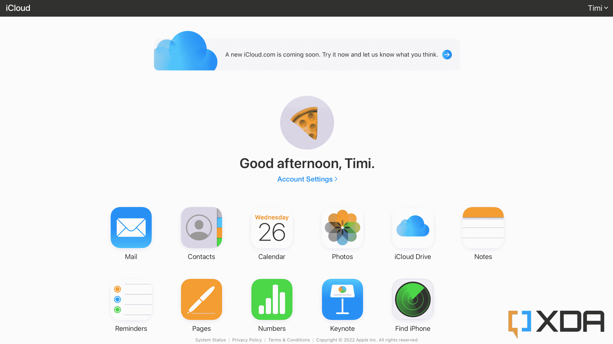

# 苹果首次推出改进后的网络 iCloud，现已推出测试版

> 原文：<https://www.xda-developers.com/apple-debuts-new-icloud-ui-in-beta/>

苹果最近表现不错，发布了新的 iPad、iPad Pros 和 Apple TV 4K，推出了新的硬件。除了新设备，该公司还发布了新的软件更新，为 iOS[16.1](http://www.xda-developers.com/ios-16-1/)[IP ados 16.1](https://www.xda-developers.com/ipados-16-1/)和 macOS Ventura 发布。如果这些还不够，它还对 iCloud 的网页版本进行了更改，提供了一个看起来新鲜、轻便和有趣的改进设计。

 <picture></picture> 

Current iCloud (2022)

这个新的更新是由 MacRumors 的人通过 iCloud beta 网站发现的。如果你不熟悉，更新的门户网站看起来比旧的要好，你可以看到上面的图片。旧版本几乎感觉像一个笨重的网络版 iOS，而新版本感觉完全不同。最重要的是，新的界面提供了可定制的能力。此外，导航时一切都变得更快，可以轻松地从照片跳转到笔记和其他部分。目前，新的 iCloud 网站将处于测试阶段，但幸运的是，任何人都可以前往 beta.icloud.com 访问它。

如前所述，苹果本周相当忙碌，不幸的是，并非所有的举措都是积极的。除了产品的最新软件更新，该公司还宣布将提高部分服务的价格。或许用户感受最深的是苹果电视和苹果音乐服务。Apple TV Plus 的价格将上涨 2 美元，而 Apple Music 将上涨 1 美元。这是该公司的一个大胆举措，特别是其音乐服务的价格自 2015 年发布以来一直没有改变。

虽然许多人很可能会继续使用其服务，但价格变化可能会对行业产生巨大影响。最近，Spotify 表示将考虑提高其在美国的价格，但需要与唱片合作伙伴协商。目前还不知道 YouTube Music、Tidal 或亚马逊 Music 等竞争对手是否也会做出同样的改变，但毫无疑问，消费者现在非常清楚，一点点勇气最终可能会让他们付出更多。

* * *

**来源** : [MacRumors](https://www.macrumors.com/2022/10/26/apple-icloud-website-redesign/)