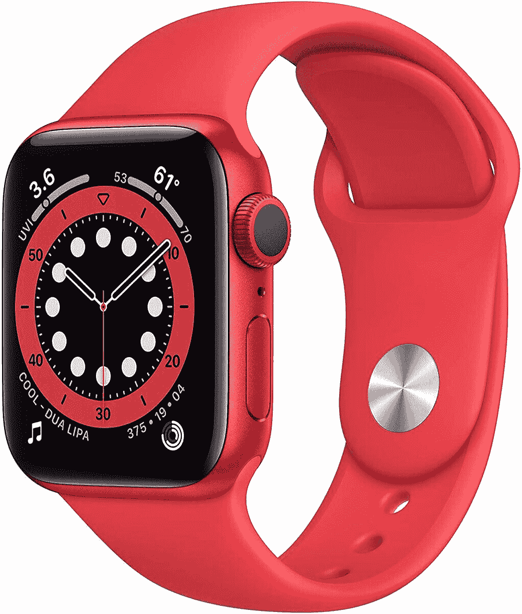
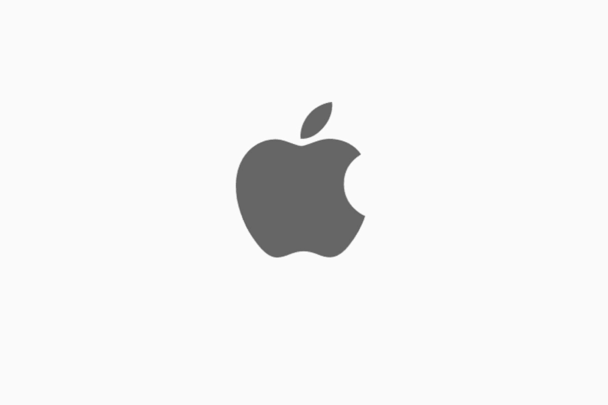

# 在新的一年里，通过百思买免费赠送的 Apple Fitness Plus 健身

> 原文：<https://www.xda-developers.com/apple-fitness-plus-best-buy/>

不能去健身房真的很糟糕。我明白了，真的。除非你有钱也有地方建一个家庭健身房，否则失去这种健康的逃避方式是非常令人沮丧的。当然，这是最好的，当我们等待它再次安全时，我们可以找到替代的方法在家里工作。毫不奇怪，健身应用程序风靡一时，人们不仅在新的一年需要动力，在一般情况下也是如此。苹果公司正试图通过苹果健身增强版进军市场，希望能拨乱反正，提供你想要的锻炼体验。

Apple Fitness Plus 是一项高级服务，通常每月 10 美元，用于各种锻炼。这个价格本身还不算太差(尤其是因为不用支付健身房会员费而省下的钱)，但在百思买，你可以免费享受几个月！

首先，如果你是我的百思买会员，你可以免费获得两个月的 Apple Fitness Plus。我的百思买是零售商的免费奖励计划，你可能已经是它的一部分了！是的，真的是这样！

但是，等一下，你也可以获得六个月的免费时间！这两项服务都只对新用户开放，所以在选择其中一项之前要明智地选择。

如果你打算购买苹果手表，从百思买购买你的智能手表将免费获得六个月的苹果健身增强版！虽然 Apple Watch 不需要使用该应用程序，但智能手表的统计数据被大量集成。根据你锻炼的强度、你做了什么以及其他统计数据，Fitness Plus 可以推荐新的锻炼方式，并促使你更加努力地锻炼。Apple Watch 为你的锻炼增加了一个全新的层次，它与 Fitness Plus 完美配合，非常适合健身数据爱好者。

 <picture></picture> 

Apple Watch

##### 苹果手表系列 7

使用 Apple Watch 健身、跟踪您的健康状况以及更多功能！在百思买购买任何 Apple Watch 都可以免费获得六个月的 Apple Fitness Plus。

 <picture></picture> 

Apple Fitness+

##### 苹果健身+

无论你是获得两个月还是六个月的免费，你都可以在这里的应用程序上看到百思买的优惠！

你唯一需要的另一件事是一台可以运行苹果健身增强版应用程序的苹果设备。这里没有 Android 功能！如果你正在读这篇文章，你可能已经在某种程度上扎根于苹果的生态系统，但只是以防万一... [iPad Air 在亚马逊](https://www.xda-developers.com/apple-ipad-air-amazon-deal/)仍处于最低价格！这是一款非常有用的平板电脑，所以你绝对会物有所值。

 <picture></picture> 

Apple iPad Air 4

##### 苹果 iPad Air (2020 年)

iPad Air 是一款非常棒的平板电脑，目前仍在亚马逊以最低价格出售，这取决于你想要什么颜色。