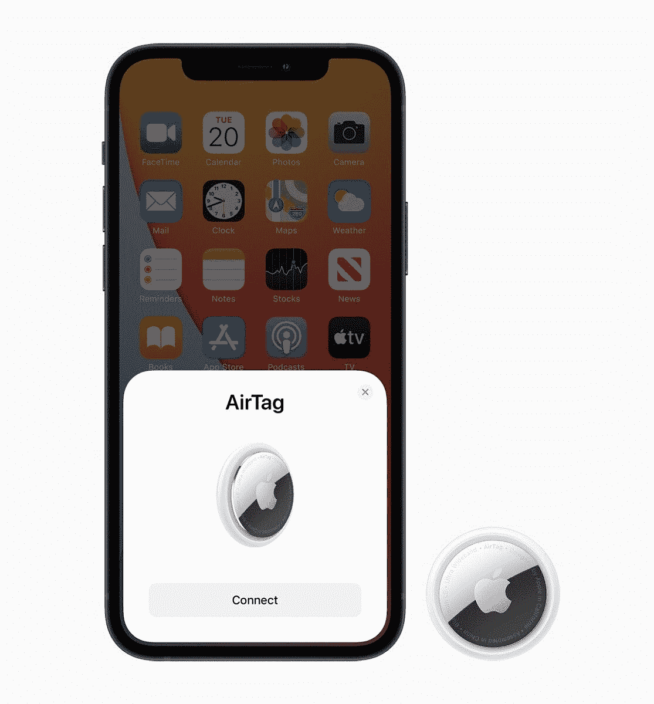

# 苹果节日礼物指南:2022 年最好的产品

> 原文：<https://www.xda-developers.com/apple-holiday-gift-guide/>

假日季节即将来临，苹果设备是你所爱的人会喜欢的优质产品。无论你打算买一部 [iPhone](http://xda-developers.com/best-iphone) 、 [iPad](http://xda-developers.com/best-ipad) 、 [Mac](http://xda-developers.com/best-macs) ，还是一个配件——比如[ai rpods 3](https://www.xda-developers.com/apple-airpods-3/)——我们都在这里帮你选择！你可以花很少的钱买一块苹果抛光布，或者花一大笔钱买一台强大的 MacBook Pro 2021。无论哪种方式，无论你的预算是多少，你都可以在正确的地方找到合适的选择。

## 最实惠:苹果 AirTag

苹果 AirTag 是最实惠、最有用的苹果礼物。它在美国的售价仅为 29 美元，可更换的电池可以使用一整年。这是给远方的亲戚或朋友买的完美礼物，你想和他们分享这个季节的快乐。如果你没钱给爱人买更昂贵的礼物，航空标签也是一个不错的选择。

借助“查找我的网络”支持，如果兼容的 Apple 设备经过 AirTag 旁边，就可以找到它。因此，它比竞争对手(如 Tile)的覆盖率更高。航空标签可以用来寻找你可能失去的任何东西——也许除了你的幸福。然而，在这个快乐的节日里，无论你把它送给谁，它都会给谁的心里带来温暖。

关于航空标签最好的部分是你永远不会有足够的。它们可以贴在钥匙、背包、行李、钱包甚至汽车上。由于它，一个人已经找到了他被盗的汽车，许多用户利用它来记住他们的停车位置。

这些硬币大小的跟踪设备只有一种颜色，但有很多彩色的附件可以让它们看起来更有趣。你也可以制作一个钥匙链配件来搭配你的 AirTag 礼物，让它更有个性。航空标签也有四个一包的折扣价——只要 99 美元——所以如果你想给别人买不止一个，你仍然可以买得起礼物。他们可以在每个有价值的物品中扔一个，再也不会丢失了

 <picture></picture> 

Apple AirTag

##### 苹果 AirTag

在我们的指南中，Apple AirTag 是最实惠的设备。这是一个有用的“查找我的网络”跟踪器，你的朋友和家人会喜欢它作为礼物。

## 多功能性最佳:苹果礼品卡

 <picture></picture> 

Apple Gift Card

如果你不确定你的朋友或家人喜欢什么，但你知道他们在苹果生态系统中，苹果礼品卡是个好主意。你可以给某人赠送 25-200 美元的苹果积分——介于 25 美元、50 美元、75 美元、100 美元、150 美元、200 美元之间，或者自定义金额。您也可以选择卡的数量。所以如果你想付给某人超过 200 美元，你总是可以寄多张卡片。也可以一次买多张卡。同时向多达 999 个不同的人发送一个，这样您就不必为每个人手动购买一个。

你可以在你的卡片上添加个性化的信息，这样当它到达他们的收件箱时就不仅仅是一封普通的邮件了。苹果还允许你从五种不同的模式中选择一种，这样你就可以匹配他们的氛围。这种数字礼物的伟大之处在于，你可以预先安排，它会在你想要的任何时候到达。所以，如果你在这个季节容易健忘，你可以现在就买，在圣诞节的时候送到他们手中。

那么一旦他们兑换了苹果积分，他们能做什么呢？任何与苹果相关的东西，无论是购买真正的苹果产品还是数字产品，如应用程序、游戏、订阅等。

苹果礼品卡确实是多功能的最佳选择。你心爱的人可以随心所欲地使用它们，如果你的预算有限，你也不必担心花费太多。它们也很环保，因为它们是通过电子邮件发送的，不需要经过生产和包装过程。

 <picture></picture> 

Apple Gift Card

##### 苹果礼品卡

苹果礼品卡是一种多功能的礼物，价格低至 25 美元。你的朋友和家人可以在苹果生态系统内随心所欲地消费，无论是硬件还是软件。

## 最适合父母的:Apple Watch Series 8

无论是父母还是祖父母， [Apple Watch Series 8](https://www.xda-developers.com/apple-watch-series-8/) 都是给他们最好的礼物。这款智能手表是在 2022 年 9 月发布的，所以它仍然是一款新鲜的新产品，有很多值得喜欢的地方。

这款手表有多种配置可供选择，因此您可能会找到至少一种符合其风格的组合。他们还将获得许多健康功能。因此，如果你担心他们的健康，给他们买一块苹果手表将是一个好主意。Apple Watch 是目前最畅销的智能手表是有原因的。它紧凑的机身所包含的技术是无与伦比的。

Apple Watch Series 8 支持:

*   血氧测量
*   内皮细胞生长添加剂
*   行走稳定性通知
*   有氧健身级别通知
*   不规则心律通知
*   高心率和低心率通知
*   跌倒检测
*   紧急求救信号
*   医疗 ID
*   大噪音通知
*   碰撞检测

如果他们没有 iPhone，你也不用担心。Apple Watch Series 8 的 GPS +蜂窝模式可以通过你的 iPhone 设置。

这款手表的健康功能并不是它如此出色的唯一原因。如果你的父母倾向于错过来电或通知，Apple Watch 将确保这种情况不会再次发生。它不仅可以在手腕上振动，还可以播放可选的通知声音。只要戴着它，他们永远不会错过电话或短信。他们甚至可以直接从手腕上接听电话，所以如果手机不在附近，他们可以一动不动地接听电话。他们还可以让 Siri 发送文本，这样他们甚至不用打字或点击按钮。

Apple Watch Series 8 的起价为 399 美元，这使得它成为一个不太贵的好礼物。它还附带了为期三个月的 Apple Fitness Plus 试用版，因此您的父母可以找人指导他们进行锻炼——即使是针对老年人的锻炼。

Apple Watch Series 8 是苹果公司最新推出的智能手表。与 Series 7 相比，这不是一个巨大的变化，但它提供了一些新功能，如碰撞检测、新的温度传感器等。

## 最适合特别的人——生产力:苹果 MacBook Air M2

如果你想给一个特别的人买一份昂贵的礼物，你可能会考虑一台 MacBook Air M2。它于 2022 年发布，是迄今为止最新、最强大的 MacBook Air。基本款在美国的起价为 1，199 美元，因此它不是最便宜的节日礼物。但是如果你想为你爱的人花一大笔钱买一台生产力设备，那你就来对地方了。

MacBook Air M2 提供了一个全新的外观设计，在这个过程中引入了一个凹口显示屏。它具有两个 USB-C 端口，一个 MagSafe 3 端口和一个 3.5 毫米耳机插孔。我个人非常喜欢它的设计，因为它干净、纤薄、现代，并且有四种铝合金表面:午夜、星光、太空灰和银色。虽然这四种颜色有些暗淡，但你可以用盒子保护它，或者在它上面蒙上一层皮。它仍然是轻量级生产力的最伟大的苹果设备。

这款 MacBook 从 8GB 内存和 256GB 固态硬盘开始。顾名思义，它采用了 M2 处理器，所以你将获得新的 macOS Ventura 操作系统的每一个新功能。

无论你爱的人是学生还是在不需要巨大计算能力的领域工作的人，这款 MacBook 都可以顺利处理他们的日常任务。根据苹果的历史，我们也可以有把握地认为，苹果至少还会在未来五年内获得软件更新。简而言之，这是一款功能强大、经得起未来考验的设备，你的爱人会喜欢的。

##### 苹果 MacBook Air M2

2022 款 MacBook Air 提供了 M2 芯片、13.6 英寸显示屏和支持 MagSafe 的重新设计的机箱。

## 最适合年轻人:苹果 AirPods Pro 2

AirPods 一直是很棒的耳塞，但 [AirPods Pro 2](https://www.xda-developers.com/airpods-pro-2-review/) 是整个阵容中我最喜欢的。苹果的这些真正的无线耳塞提供了主动噪音消除(ANC)，这是我几乎每天都在使用的功能。无论你是在咖啡馆工作，通勤，还是仅仅是慢跑，ANC 都可以帮助你专注于你正在听的任何东西，而不必担心外界的噪音。市面上也有其他 AirPods，但是常规型号不支持 ANC，AirPods Max 也是 over-ear，有些人(包括我)不是这些产品的粉丝。

苹果的 AirPods Pro 2 还支持动态头部跟踪的空间音频。所以你可以听音乐，就像艺术家在录音时想象的那样。这项功能在 Apple Music 和其他一些第三方服务上可用。它还可以与 Apple TV 应用程序配合使用，因此您可以成为正在观看的(受支持的)电影和电视剧的一部分。

这些无线耳塞防水防汗，你可以带着它们去健身。苹果的有限保修不包括水损害，所以在雨天慢跑时要小心。为了确保这些小耳塞在跑步时不会从耳朵中掉出，请检查包装中包含的其他耳尖尺寸。你也可以从你的 iPhone 上进行合身测试，以确保你选择了正确的尺寸。

苹果在其在线商店购买 AirPods 时提供可选雕刻。因此，如果你想添加一个独特的触摸，使你的礼物更加个性化，你可以免费这样做。它们只有白色的，售价 249 美元。他们的充电盒支持 Qi 和 MagSafe 无线充电器以及 Apple Watch 充电圆盘。

##### 苹果 AirPods Pro 2

尽管 AirPods Pro 2 的结构紧凑，但它有很多功能，包括主动噪音消除(ANC)、杜比 Atmos 内容和无线充电。

## 最适合特别的人——中等预算:苹果 iPhone 13 Mini

如果你的生活中有一个额外的特别的人，但不想花 1000 美元，你可能会考虑 iPhone 13 Mini。这款 iPhone 的起价为 599 美元，因此它既不是最便宜的，也不是最贵的。这是因为它是 2021 年发布的，所以它不是最新的阵容，但随着年龄的增长，折扣也随之而来。

[iPhone 13 Mini](https://www.xda-developers.com/apple-iphone-13-mini-review/) 有六种不同的外观:产品(红色)、星光、午夜、蓝色、绿色和粉色。基本型号有 128GB 的存储空间，但可以升级到 512GB。尽管更老了，它仍然由苹果的 A15 仿生芯片驱动，这是当今最快的手机之一。它也是普通 iPhone 14 型号上的处理器。

这款小巧的 iPhone 配备了便于携带的有机发光二极管 5.4 英寸 Super Retina XDR 显示屏，分辨率为 2340 x 1080，每英寸 476 像素，色彩生动准确。它的显示屏还支持 True Tone 技术，可以根据周围的照明情况为颜色添加一个温暖的层。这使得颜色看起来更自然，就像它们本来的样子。这款迷你 iPhone 还具有防溅、防水和防尘功能，等级为 IP68，因此它可以在最大 6 米的深度持续 30 分钟。然而，值得提醒你的是，苹果的有限保修不包括水损坏。

说到前置摄像头，iPhone 13 Mini 支持 Face ID 和人像模式相机效果，这要归功于原深感摄像头系统。后部凸起包括两个支持 4K 视频录制、电影模式、夜间模式拍摄等功能的相机镜头。

简而言之，iPhone 13 Mini 是送给对你来说特别的人的最好礼物。它可能不是最新最棒的 iPhone，但它会帮你省钱，让你爱的人在这个假期感觉很棒。

 <picture></picture> 

iPhone 13 Series

##### 苹果 iPhone 13 Mini

苹果 iPhone 13 Mini 是 2021 系列中最便宜的型号。对于中等预算但想给自己心爱的人买一台更高端设备的人来说，这是一份慷慨的礼物。

## 最适合学生的:苹果 iPad 9

平价 iPad 9 早在 2021 年就发布了，它最适合不需要 Mac 的人，比如学生。虽然它的功能有些有限，但考虑到它是一个移动设备，iPadOS 仍然使它成为一个可靠的生产力工具。它在美国的起价为 329 美元，有两种颜色可供选择:太空灰和银色。

iPad 9 的设计与老款相似。它具有厚厚的前挡板和一个容纳触控 ID 扫描仪的物理 home 按钮。这是一款轻薄的设备，任何人都可以将其放入背包中随身携带。因此，无论你是把它作为礼物送给高中生还是大学生，它都将是无纸化教育的一个不错的设备。它也非常适合可能不需要完整笔记本电脑的老年人。iPad 9 很适合参加在线课程、做笔记、阅读电子书、听播客和观看电视内容。

这款 iPad 拥有 10.2 英寸的显示屏，支持 Apple Pencil 1 进行绘图或记笔记。最精彩的部分？苹果的 Notes 应用程序可以识别手写，因此学生可以搜索他们的笔记，就像他们在键盘上输入一样。

iPad 上的前置 12MP 超宽摄像头拥有 122 度的视野。因此，如果他们在上课或进行常规视频通话时四处走动，摄像头就会跟着他们。然而，值得一提的是，由于缺乏原深感摄像头系统，这款相机不支持人像模式相机效果或 Face ID。

 <picture></picture> 

Apple iPad (9th gen), 2021

##### 苹果 iPad (2021 年)

苹果 iPad 9 是一款适合日常需求对计算能力要求不高的学生的礼物。它属于我们指南的中等预算类别，但它物有所值。

## 最适合特别的人——慷慨版:苹果 iPhone 14 Pro Max

这一个是给你们所有想买一些奇特东西的特别慷慨的人的。苹果 iPhone 14 Pro Max 的基本款起价为 1099 美元，是我们指南中最昂贵的礼物之一。然而，如果你想为你爱的人花一大笔钱，或者想给他们买最新最高端的设备，这是一份完美的礼物。

这款 iPhone 有四种外观:深紫色、金色、银色和太空黑。它有一个陶瓷盾牌正面，纹理磨砂玻璃背面，不锈钢设计，使它看起来像它得到的保费和固体。虽然这是过去几年里制造的最耐用的 iPhone，但它仍然采用玻璃面板和背面，所以某些跌落可能会打碎它们。修理一部 iPhone 14 Pro Max 的正面或背面需要花费*一笔财富*，所以你可能想要[投资一个外壳](https://www.xda-developers.com/best-apple-iphone-14-pro-max-cases/)来最小化潜在的损害。这也是另一个好礼物。

至于内部，它有 128GB 的存储空间，但最大可升级到 1TB。它由苹果专门在 iPhone 14 Pro 型号上使用的 2022 A16 仿生芯片提供动力。这是目前最快的移动处理器。就像 iPhone 13 Mini 一样，它具有 IP68 的防护等级，可以防水、防溅和防尘。

这款奇特的怪兽拥有有机发光二极管 6.7 英寸 Super Retina XDR 显示屏，带有动态岛和推广支持。自适应提升技术允许刷新率达到 120Hz。该屏幕支持 HDR 内容、用于更温暖和更准确颜色的 True Tone 技术，并具有 2796 x 1290 像素的分辨率，每英寸 460 像素。

关于摄像头，这款 iPhone 还具有 TrueDepth 前置摄像头，用于 Face ID 认证和人像模式相机效果。背面有三个镜头。由于激光雷达扫描仪，它甚至可以拍摄夜间模式的人像。其他功能包括深度融合、微距摄影、Apple ProRAW、动作模式和电影视频拍摄。

iPhone 14 Pro Max 是苹果最大最好的智能手机，在典型的苹果时尚中，它既是一个发电站，也是一个耐力怪兽。

* * *

假期是与我们关心的人分享珍贵时刻的大好时光。虽然人际关系是无价的，没有礼物可以表达我们对周围人的爱有多深，但交换手势总是很好地提醒我们拥有这些积极健康的关系。苹果产品是分享快乐的最佳选择。

这些产品是优质的，耐用的，有很高的转售价值。我最喜欢的是[苹果礼品卡](https://www.amazon.com/Apple-Gift-Card-accessories-Delivery/dp/B08F3C99KN?tag=xda-rnn4jel-20&ascsubtag=UUxdaUeUpU5745&asc_refurl=https%3A%2F%2Fwww.xda-developers.com%2Fapple-holiday-gift-guide%2F&asc_campaign=Commerce),因为它能确保接受者找到合适的用途。尽管大多数人无论如何都会珍视一份礼物，但知道他们实际上在使用它还是一件好事。所以我宁愿给人们选择用这笔钱做什么的自由，而不是试图猜测他们真正想要什么。但是，如果我意识到他们在愿望清单上增加了某样东西，那就另当别论了。

我喜欢苹果礼品卡的另一个原因是它们是环保的。考虑到整个过程发生在网上，他们留下的废物与实物产品相比是不存在的。然后，人们可以自由使用他们添加的 Apple ID 点数，做任何最适合他们和他们需求的事情。