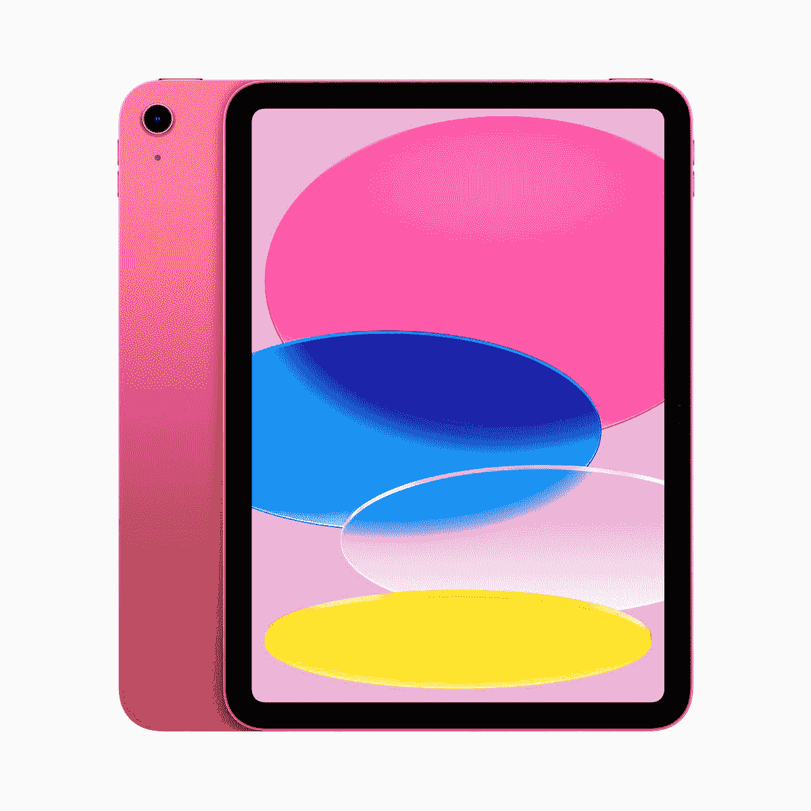

# 苹果 iPad 10 支持 USB Type-C 吗？

> 原文：<https://www.xda-developers.com/apple-ipad-10-usb-c/>

苹果在 2022 年 10 月通过新闻稿透露了 iPad 10。这一次，该公司不仅仅是升级了内置的芯片组——多年来一直如此。相反，它彻底检修了底盘，并引入了一些令人兴奋的变化。这款 iPad 当然包含了许多广受欢迎的产品。尽管如此，它仍未涵盖 2022 年许多被认为合理的理由。比如它包了 2020 A14 仿生芯片组，不支持 Apple Pencil 2。除此之外，它还具有现代感、平坦的边缘和圆角。花 449 美元，你可以买到粉色、蓝色、黄色或银色的 iPad 10。如果你不喜欢这些饰面，你可以随时拿一箱。毕竟，这是 T2 最好的 iPads 之一。所以你要不惜一切代价保护它。现在，你一定在想 iPad 10 支持 USB Type-C 还是 Lightning？以下是你应该知道的。

## iPad 10 配有 USB Type-C

入门级/平价 iPad 是最后一个错过 USB Type-C 的型号。直到 2021 年，该公司一直坚持使用其专有的过时的 Lightning 端口。幸运的是，2022 年的模型最终淘汰了古老的技术，支持普遍采用的标准。因此，无论你是使用 iPad 10 端口充电还是传输数据，你都需要一根 USB Type-C 电缆。

现在，你一定在想——我怎么才能把 Apple Pencil 1 和 iPad 10 配对充电呢？该公司为此发布了一种新的适配器，因为 Apple Pencil 1 依赖于 Lightning 端口。值得注意的是，iPad 10 上的 USB Type-C 端口不是 Thunderbolt 4 端口，也不支持外部显示器。所以你只能用它来充电，传输数据，和配对一些兼容的配件。随着 iPad 10 最终采用 USB Type-C，该公司最近推出的所有 iPad 现在都放弃了 Lightning 端口。

 <picture></picture> 

Apple iPad 10

##### 苹果 iPad 10

iPad 10 引入了完整的底盘大修，并提供了四种大胆的颜色。它封装了 A14 仿生芯片，支持 Apple Pencil 1。

*你会选择哪种 iPad 10 颜色？请在下面的评论区告诉我们。*