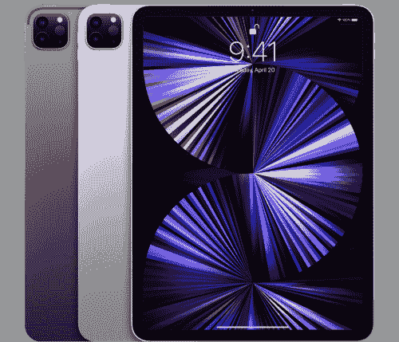

# 苹果 iPad Air 5 (2022) vs 苹果 iPad Pro (11 寸，2021):你该买哪款 M1 平板？

> 原文：<https://www.xda-developers.com/apple-ipad-air-5-2022-vs-apple-ipad-pro-11-inch-2021/>

iPads 是执行各种任务的好工具。无论你是想在[玩游戏](https://www.xda-developers.com/best-ipad-games/)，阅读电子书，参加在线课程或工作会议，撰写下一本畅销小说，甚至开发和发布 iOS 应用程序，这些多功能平板电脑都可以帮助你完成所有这些任务。不过，选择购买哪一款 iPad 可能会相当令人困惑。这是[苹果 iPad Air 5 (2022)](https://www.xda-developers.com/apple-ipad-air-5-review/) 对[苹果 iPad Pro (11 英寸，2021)](https://www.xda-developers.com/ipad-pro-2021-review/)——两款 M1 驱动的平板电脑有很多相似之处。无论你是购买 iPad Air 5 还是 iPad Pro，你可能都想看看我们的最佳充电器列表。此外，不要忘记用保护套[保护 iPad Air 5](https://www.xda-developers.com/best-apple-ipad-air-5-cases/) 或 [iPad Pro 3 11 英寸](https://www.xda-developers.com/best-11inch-ipad-pro-cases/)。

## 苹果 iPad Air 5 vs 苹果 iPad Pro 11 寸 3:规格

|  | 

苹果 iPad Air 5

 | 

苹果 iPad Pro 11 英寸 3

 |
| --- | --- | --- |
| **CPU** | 苹果 M1 芯片 | 苹果 M1 芯片 |
| **正文** | 

*   247.6 x 178.5 x 6.1 毫米
*   461 克(手机型号为 462 克)

 | 

*   247.6 x 178.5 x 5.9 毫米
*   466 克(手机型号为 470 克)

 |
| **显示** | 

*   液体视网膜显示器
*   采用 IPS 技术的 10.9 英寸(对角线)LED 背光多点触控显示屏
*   2360 x 1640 像素分辨率，每英寸 264 像素(ppi)
*   宽彩色显示屏(P3)
*   真实色调显示
*   抗指纹疏油涂层
*   全层压显示器
*   抗反射涂层
*   1.8%反射率
*   500 尼特亮度
*   支持 Apple Pencil(第二代)

 | 

*   液体视网膜显示器
*   采用 IPS 技术的 11 英寸(对角线)LED 背光多点触控显示屏
*   2388 x 1668 像素分辨率，每英寸 264 像素(ppi)
*   推广技术
*   宽彩色显示屏(P3)
*   真实色调显示
*   抗指纹疏油涂层
*   全层压显示器
*   抗反射涂层
*   1.8%反射率
*   SDR 亮度:最大 600 尼特
*   支持 Apple Pencil(第二代)

 |
| **摄像机** | 

*   12MP 宽摄像头，1.8 光圈
*   数码变焦高达 5 倍
*   五元素透镜
*   带聚焦像素的自动对焦
*   全景(高达 6300 万像素)
*   智能 HDR 3
*   照片和实时照片的宽色彩捕捉
*   照片地理标记
*   自动图像稳定
*   成组方式

 | 

*   专业相机系统:宽和超宽相机
*   宽:12MP/1.8 光圈
*   超宽:10MP，2.4 孔径，125°视野
*   2 倍光学缩小
*   数码变焦高达 5 倍
*   五元素镜头(广角和超广角)
*   更亮的真实色调闪光灯
*   全景(高达 6300 万像素)
*   蓝宝石水晶透镜盖
*   带聚焦像素的自动对焦(宽)
*   智能 HDR 3
*   照片和实时照片的宽色彩捕捉
*   镜头校正(超宽)
*   高级红眼修正
*   照片地理标记
*   自动图像稳定
*   成组方式

 |
| **内存** |  | 

*   8GB/16GB 内存
*   128GB/256GB/512GB/1TB/2TB 固态硬盘

 |
| **电池** | 

*   内置 28.6 瓦时可充电锂聚合物电池
*   长达 10 小时的 Wi-Fi 网上冲浪或观看视频

 | 

*   内置 28.65 瓦时可充电锂聚合物电池
*   长达 10 小时的 Wi-Fi 网上冲浪或观看视频

 |
| **连通性** | 

*   蜂窝模式下的 4G/5G
*   无线网络 6
*   蓝牙 5.0

 | 

*   蜂窝模式下的 4G/5G
*   无线网络 6
*   蓝牙 5.0

 |
| **安全** | 触控 ID | Face ID |
| **操作系统** | iPadOS 15 | iPadOS 15 |
| **颜色** | 

*   太空灰
*   星光
*   粉红色
*   紫色
*   蓝色

 |  |
| **材料** | 铝金属 | 铝金属 |
| **价格** | 起价 599 美元 | 起价 799 美元 |

* * *

## 建造和设计

设计可能是一件非常主观的事情。然而，我们可以进行客观的观察，并列出构建细节，以帮助您决定两款 M1 ipad 中哪一款最适合您。从构造开始，两款平板电脑的边缘和背面都采用了铝制机箱。所以说到它们的耐用性，两者应该差不多。说到铝，再来看设计，iPad Air 5 有五种不同的表面可供选择，而 iPad Pro 11 英寸 3 有两种。因此，如果你对银色和太空灰不满意(并且不喜欢保护套)，那么你只能选择 iPad Air。

除了颜色不同，这两款 iPads 看起来几乎一模一样。从正面开始，两款平板电脑都采用了圆角和薄边框的窄边框显示屏。考虑到它们的大小相似，仅仅从正面看，很难分辨出哪个是哪个。iPad Pro 上的原深感摄像头是一个显著的不同，但仍然需要你集中注意力才能发现它。

回到背面，iPad Air 和 iPad Pro 都采用了相同的背面设计。最显著的区别是相机系统。Air 型号只有一个摄像头，没有闪光灯，而 Pro iPad 有一个 Pro 摄像头系统，包括两个镜头、一个激光雷达扫描仪和一个闪光灯。除此之外，两款平板电脑看起来都差不多。

## 显示

在 iPad 上拥有一块坚固的显示屏是必不可少的。考虑到该设备的目标是大屏幕媒体消费，平庸的质量会使体验不那么身临其境。对我们所有人来说幸运的是，两款 iPads 都有很棒的屏幕。尽管它们的外观相似，但这两种显示器有一些主要的区别。

首先，两个屏幕都有圆角，大小相同。嗯，iPad Air 小了 0.1 英寸。因此，在这两款设备上，你会看到一个几乎 11 英寸(对角线)的玻璃板。考虑到 iPad Pro 是一款 *Pro* iPad，它确实得到了苹果的额外喜爱。它的屏幕支持推广技术——支持 120Hz 刷新率。iPad Air 5 上仍然没有这一功能。此外，Pro 型号的像素分辨率为 2388 x 1668，而 Air 型号的像素分辨率为 2360 x 1640。分辨率差异非常小，您可能无法区分这两者。然而，推广技术是值得注意的，足以发挥作用。

抛开分辨率和刷新率不谈，iPad Pro 11 英寸也支持 600 尼特的最大亮度，而 iPad Air 5 的最大亮度为 500。如果你主要在室内使用 iPad，而不是在阳光直射下，那么你可能不会注意到两者之间的区别。除此之外，它们都支持 Apple Pencil 2，并且具有几乎相同的特性。

## 表演

苹果最初为 [Mac 系列](https://www.xda-developers.com/best-macs/)设计了 M1 芯片。然而，在 2021 年，该公司将它带到了 iPad Pro 上，让我们大吃一惊。库比蒂诺科技巨头随后在 2022 年初推出了*中端* iPad Air，让我们大吃一惊。考虑到其无与伦比的处理能力，iPad Air 5 和 iPad Pro 11 英寸 3 都提供了流畅的体验。但是，在权衡它们的不同性能时，还有其他方面需要考虑。

两款 iPads 都支持最新的 iPadOS 15，并包含 8GB 内存。不过，如果你购买 1TB 或 2TB 的版本，iPad Pro 最大支持 16GB。因此，如果你打算使用 iPad 来制作专业内容，比如通过苹果的 Swift Playgrounds 开发应用程序，你可能需要考虑速度更快的 iPad Pro。除此之外，这两款平板电脑在处理部门都很稳定，尽管 iPadOS 有其局限性。

## 摄像机

购买 iPad 时，摄像头通常不是一个重要因素。毕竟，这款设备不像 iPhone 那样便携——人们倾向于用它来拍照。尽管如此，指出两者之间的区别还是很重要的。从后置摄像头开始，iPad Air 5 有一个 12MP 宽的摄像头。另一方面，iPad Pro 11 英寸 3 配备了一个 10MP 超宽镜头，视野为 125°。更不用说它有一个用于 3D 绘图的激光雷达扫描仪和一个用于黑暗拍摄的手电筒。如果你打算用你的 iPad 来绘制房间或其他结构的 3D 模型，那么 Pro 模型是你应该瞄准的。如果相机不是什么大不了的东西，那么空气就更好了。

移动到正面，iPad Air 有一个 12MP 超宽 122 FoV FaceTime 摄像头，支持中央舞台。当您四处走动时，即使 iPad 处于静止位置，此功能也能使您的面部保持居中。iPad Pro 获得了同样的镜头，但有一些额外的好处。由于原深感摄像头系统和额外的传感器，它能够拍摄人像模式的照片。更不用说 Face ID 对认证的支持了。空气模型求助于位于电源按钮中的触控 ID 传感器。

## 电池寿命和充电

糟糕的电池寿命可能会成为许多潜在客户的绊脚石。毕竟，对于一些人来说，苹果正在宣传 iPad 是个人电脑的替代品。因此，拥有一个可靠的电池，让用户度过工作或学习的一天是合理的期望。iPad Air 5 和 iPad Pro 11 英寸分别为 28.6 瓦时和 28.65 瓦时。所以它们几乎是一样的。该公司声称，你可以在两台 iPads 中的任何一台上充电一次，连续上网冲浪或观看视频 10 小时。所以这一轮没有赢家，因为公司给他们的评级是一样的。最终，根据我个人的使用情况，电池寿命应该足够让你正常使用一天。

不出所料，两款 iPads 都有 USB Type-C 口，仅此而已。他们的盒子包括 20W 充电砖和 USB Type-C 到 USB Type-C 电缆。根据我的测试，iPad Air 5 在不使用时从 0 到 100%充电需要大约 2 小时 15 分钟。考虑到它的大尺寸，这在平板电脑部门是一个不错的速度。iPad Pro 也应该以类似的速度充电——考虑到两者共享类似的电池、处理器和操作系统。

* * *

## 苹果 iPad Air 5 vs 苹果 iPad Pro 11 寸 3:你该买哪款 M1 平板？

iPad Air 5 和 iPad Pro 11 英寸 3 在美国的起价分别为 599 美元和 799 美元。尽管前者正式成为中端平板电脑，但它仍然以合理的价格提供专业的性能。对于那些不需要更大的存储空间、更高的内存、更好的显示屏或先进的相机系统的人来说，iPad Air 应该足以满足他们的一般需求。最终，这两款平板电脑在很多方面都是一样的，没有多少人会愿意多花 200 美元购买高端机型。谈到性价比，iPad Air 5 轻松胜出。在规格战中，更高端的 iPad Pro 11 寸 3 明显胜出。

 <picture></picture> 

Apple iPad Air 5

##### 苹果 iPad Air (2022)

新款第五代 iPad Air 搭载苹果 M1 处理器。它首次支持 5G，并且有一系列美丽的颜色。

 <picture></picture> 

Apple iPad Pro 11-inch 3 (2021)

##### 苹果 iPad Pro 11 英寸(2021 年)

11 英寸的 iPad Pro 3 配备了苹果的 M1 芯片组，以及对 5G 和高达 2TB 存储的可选支持。

*您会购买两款 M1 平板电脑中的哪一款，为什么？请在下面的评论区告诉我们。*