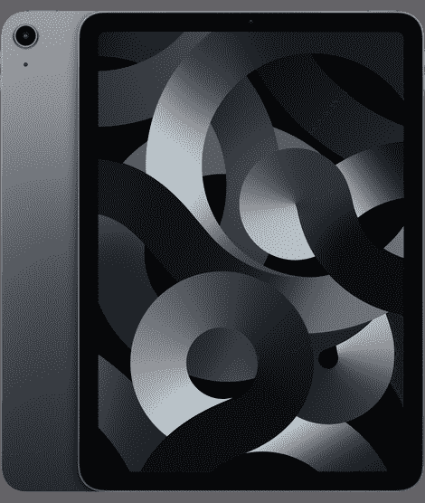

# 苹果 iPad Air 5 (2022)支持无线充电吗？

> 原文：<https://www.xda-developers.com/apple-ipad-air-5-wireless-charging/>

# 苹果 iPad Air 5 (2022)支持无线充电吗？

苹果公司在其 Peek 性能活动期间发布了 iPad Air 5 (2022)。下面是你需要知道的关于在上面无线充电的事情。

苹果公司终于在其 Peek 性能虚拟活动中推出了 [iPad Air 5 (2022)](http://xda-developers.com/apple-ipad-air-5-review) 。这款支持 5G 的平板电脑配备了与前代型号相同的机箱。然而，不要让那愚弄你低估它的力量。苹果 M1 芯片为这款中端平板电脑增压，使其成为该领域无可匹敌的巨兽。只需 599 美元，你就可以[买到太空灰、星光、粉色、紫色或蓝色的 iPad Air 5。如果你决定要用它，别忘了](https://www.xda-developers.com/best-apple-ipad-air-5-deals/)[为它买一个盒子](https://www.xda-developers.com/best-apple-ipad-air-5-cases/)和一个替代的[充电器](https://www.xda-developers.com/best-apple-ipad-air-5-chargers/)！万一发生事故，箱子将有助于保护其脆弱的结构免受潜在的损害。安全总比后悔好。事先检查技术规格以确保它们符合您的需求也很重要。那么比如苹果 iPad Air 5 (2022)是支持通过 MagSafe 还是 Qi 标准进行无线充电呢？关于这件事，以下是你需要知道的。

## iPad Air 5 支持无线充电吗？

苹果最近的一些产品支持两种无线充电方式——该公司的 MagSafe 和广泛使用的 Qi 标准。顾名思义，MagSafe 拥有实心磁铁，可将兼容的充电器和配件固定到位。另一方面，Qi 在默认情况下不会附加到产品上。那么苹果 iPad Air 5 (2022)是否支持这两种无线充电标准中的任何一种呢？

没有。苹果现有的 iPad 和 Mac 机型都不支持无线充电——不管标准是什么。这家位于库比蒂诺的科技巨头可能正在开发一款支持无线充电的 M2 驱动的 iPad Pro。然而，没有关于此事的官方细节。因此，在该公司在其活动中宣布之前，没有办法知道这是否会成为现实。

 <picture></picture> 

Apple iPad Air 5

##### 苹果 iPad Air (2022)

新款第五代 iPad Air 搭载苹果 M1 处理器。它首次支持 5G，并且有一系列美丽的颜色。

因此，不幸的是，你只能通过有线充电器给你的设备充电。iPad 充电早就应该实现 MagSafe 了，因为它可以克服正确对齐无线充电线圈的限制。因此，我们希望苹果在未来的产品线中探索同样的技术。