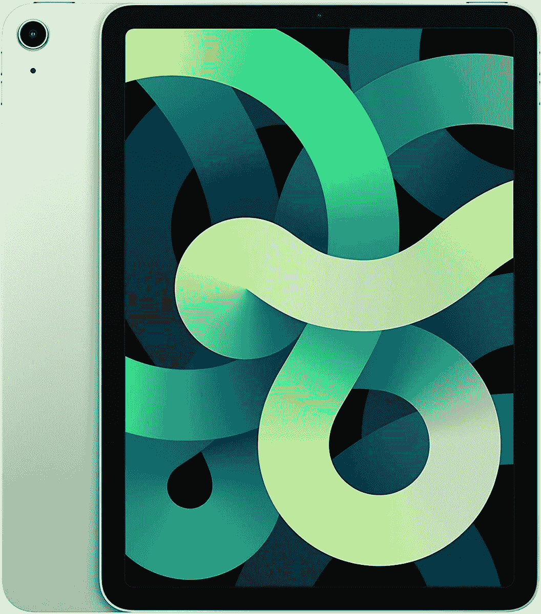
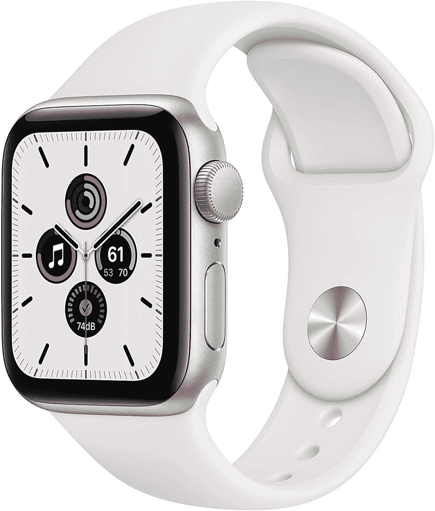

# 苹果 iPad Air 和 Apple Watch SE 已经在亚马逊上打折了

> 原文：<https://www.xda-developers.com/apple-ipad-air-watch-se-amazon-discount/>

苹果在产品销售方面往往很吝啬，尤其是在产品刚刚发布的时候。不过，今年似乎有点不同，因为我们已经看到苹果的一些最新技术在打折。在亚马逊，你可以以 40 美元的价格买到[苹果 iPad Air](https://www.amazon.com/dp/B08J6FD94H?tag=xda-4elfqho-20&ascsubtag=UUxdaUeUpU30449&asc_refurl=https%3A%2F%2Fwww.xda-developers.com%2Fapple-ipad-air-watch-se-amazon-discount%2F&asc_campaign=Short-Term) ，以 20 美元的价格买到[苹果手表 SE](https://www.amazon.com/dp/B08J5W9QWZ?tag=xda-4elfqho-20&ascsubtag=UUxdaUeUpU30449&asc_refurl=https%3A%2F%2Fwww.xda-developers.com%2Fapple-ipad-air-watch-se-amazon-discount%2F&asc_campaign=Short-Term) ！

考虑到 [iPad Air 大约一周前才发布](https://www.xda-developers.com/apple-launches-new-ipad-air-2020-a14-bionic-available-pre-order/)，很高兴看到它已经打折了。如果你不介意获得绿色型号并等待一到三周的送货时间，那么你可以只花 560 美元买到这款苹果平板电脑。即使你不喜欢这种颜色，通常建议你给这种昂贵的科技产品套上一个盒子...根据具体情况，你无论如何也看不到多少颜色。

此外，这款 iPad Air 非常值得要价。凭借 10.9 英寸的液晶视网膜显示屏、A14 仿生芯片和长达 10 小时的电池续航时间，iPad Air 是一款令人印象深刻的平板电脑。有了 Apple Pencil 的支持，它也是艺术家的一个很好的工具。

 <picture></picture> 

iPad Air (2020) - Green

##### 苹果 iPad Air (2020 年)

在亚马逊购买 iPad Air，享受 40 美元优惠！这只是绿色的型号，你要等一会儿才能发货，但是如果你想把它作为节日礼物，你现在就可以把它从愿望清单上划掉。

不过，不仅仅是 iPad，Apple Watch SE 也在销售。这种特殊的销售适用于所有颜色，40 毫米和 44 毫米两种尺寸，所以你在这里不受限制。这款时尚智能手表有太空灰、粉沙和银色三种颜色可供选择，售价仅为 259 美元。

Apple Watch SE 内置 GPS，可以轻松跟踪您的锻炼情况，这些信息会自动发送到 iPhone 健身应用程序。还有一个心率监测器，它会提醒你任何不正常的情况，如心跳水平高或低。当然，Apple Watch SE 还安装了 Apple Pay，让支付任何事情都像轻敲手腕一样简单。你所需要做的就是挑选你最喜欢的颜色，并在手表售罄前订购！

 <picture></picture> 

Apple Watch SE 40mm

##### 苹果手表 SE

有三种颜色和两种尺寸，现在是时候升级到 Apple Watch SE 了！这款智能手表目前在亚马逊打折 20 美元，可以跟踪你的锻炼和心跳，并支持 Apple Pay。