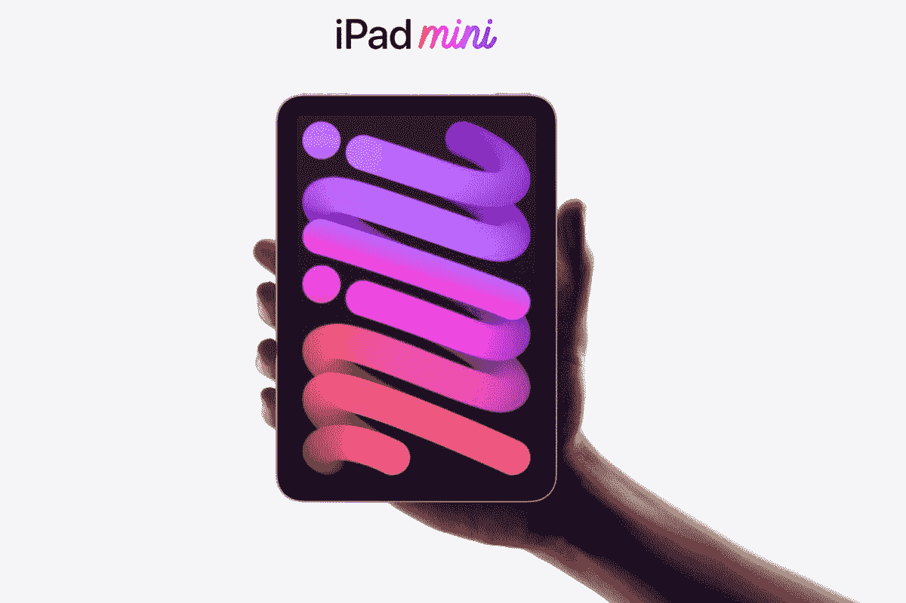

# 苹果 iPad Mini 获得 100 美元的折扣，起价 399.99 美元

> 原文：<https://www.xda-developers.com/apple-ipad-mini-100-discount/>

如果你一直在关注苹果 iPad，你可能会有兴趣知道苹果的 iPad Mini 已经获得了相当大的折扣。尽管这款平板电脑的起价通常为 499.99 美元，但美国零售商百思买(Best Buy)在有限时间内比 iPad Mini 低了 100 美元。64GB 和 256GB 存储型号都在销售，前者售价 399.99 美元，后者售价 549.99 美元。至于颜色，你可以选择太空灰、粉色、紫色和星光色。

## 成熟的 iPad，更小的包装。

iPad Mini 的尺寸比标准 iPad 小，配备 8.3 英寸 2266 x 1488 分辨率的显示屏。iPad Mini 的设计类似于 iPad Air 或 iPad Pro，也就是说没有 home 键。相反，你会看到一个更现代的外观，显示屏周围有一个小边框，触控 ID 传感器移到了电源按钮上。此外，由于 iPad Mini 最近进行了更新，这款平板电脑采用了现代 SoC 苹果 A15 Bionic，这也是苹果最新的 iPhone 13 系列手机的动力。

此外，由于其四扬声器设置，iPad Mini 提供了强劲的声音，对于支持 Apple Pencil 的艺术家来说可能是完美的，这[不是什么大问题](https://www.xda-developers.com/apple-pencil-2-isnt-magic-wand-editorial/)取决于你问谁。或许这款平板电脑更令人惊讶的特性之一是它的 USB-C 端口。这个端口取代了许多苹果产品上的传统 Lightning 端口，不仅可以用来为设备充电，还可以连接支持的 USB-C 配件。

如果你对 iPad Mini 感兴趣，你可以看看下面的产品。如果你不太相信，一定要看看我们对 [iPad Mini、](https://www.xda-developers.com/apple-ipad-mini-6-review/)的全面评价，它被称为“便携式生产力的完美发电站”。

 <picture></picture> 

Apple iPad Mini

##### 苹果 iPad Mini (2021 年)

最新的苹果 iPad Mini