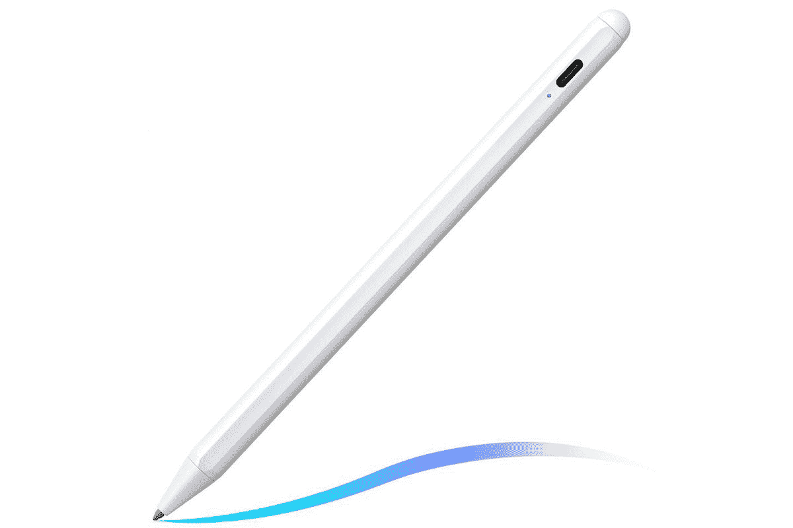

# iPad Mini 6 评论:便携生产力的完美发电站

> 原文：<https://www.xda-developers.com/apple-ipad-mini-6-review/>

小并不总是更好——事实上，我们已经习惯于相信大总是更好。当人们看到更大的屏幕时，他们会认为是更好的相机或更好的照片，即使相机硬件远没有那么好。或者当您听到更高的处理器号(例如，更多的 RAM)时，很容易认为这直接意味着更好。越大越好，对吗？

只是有时候，越大并不是越好。以苹果上个月的活动为例:推出了两款 iPads。8.3 英寸屏幕的小型 iPad Mini 6 和 10.2 英寸屏幕的 T2 iPad 9。你可能会认为第九代 iPad 会更好，但在苹果的阵容中，iPad Mini 6 是小而强大的挑战者，可以说是目前几乎所有人的[最佳 iPad](https://www.xda-developers.com/best-ipad/) 。

说起来令人震惊，但我已经检查了过去三代中的每一台 iPad Pro，没有一台比它更像是一个被美化了的媒体播放器。一旦我的卧室里有了一台电视，iPad Pro 往往会被进一步降级。

那么，为什么 iPad Mini 是我用过的最好的平板电脑呢？为什么我放不下？经过 10 天的使用，包括 iPad Mini 帮助我度过目前住院期间的 8 天(还在继续)，这就是为什么 iPad Mini 6 是提高工作效率的最佳便携式平板电脑。为什么，每个人都应该买一个，特别是如果你能抓住这些优秀的 [iPad Mini 6 交易](https://www.xda-developers.com/best-ipad-mini-6-deals/)中的一个。

 <picture></picture> 

8.3-Inch iPad Mini 6

##### 苹果 iPad Mini (2021 年)

iPad Mini 6 是有史以来最好的小型平板电脑，也是苹果有史以来最好的 iPad。它结合了较大的 iPad Pro 的最佳性能，以及 iPad 系列中其他产品所没有的便携外形。因此，您拥有了梦寐以求的专业而便携的平板电脑。

除了你的 iPad Mini 6，你还需要一个外壳和一个键盘。我们已经收集了[最佳 iPad Mini 6 保护套](https://www.xda-developers.com/best-ipad-mini-6-cases)，但是苹果没有官方键盘保护套，所以我们建议购买官方硅保护套，并将其与 Apple pencil 和无线魔法键盘配对。这是我用过的组合，效果非常好。iPad Mini 6 还有其他[键盘保护套和独立键盘，以防你想看看你的其他选择。](https://www.xda-developers.com/best-ipad-mini-6-keyboards/)

 <picture></picture> 

Apple Smart Folio Case

##### 苹果智能对开 iPad Mini (2021)保护套

这是专为 iPad Mini 设计的，是支撑平板电脑的绝佳选择，尤其是在搭配蓝牙键盘时。它有多种颜色可供选择，可以真正装饰你的 iPad Mini！

 <picture></picture> 

Apple Pencil (2nd gen)

##### 苹果铅笔(第二代)

如果你有了 iPad Mini，想轻松记笔记，或者把它当作日记，第二代 Apple Pencil 是必须的，它也可以从你的 iPad Mini 无线充电！

 <picture></picture> 

Apple Magic Keyboard

##### 苹果魔法键盘

我在 iPad Mini 上试过几种不同的键盘，但每次我都会选择这个。它完全支持 iPadOS 上的所有键盘快捷键，比任何第三方选项都要好。

## 小巧却无比强大

苹果对最新一代 iPad Mini 的改进程度让我大吃一惊。总的来说，iPad Mini 是一款将 iPad 体验的不同部分结合成一个部分是 iPad 部分是 iPhone 的自助餐设备。但是，iPad Mini 6 就不一样了。

iPad Mini 6 不仅仅是一个混搭。这是一款有凝聚力的产品，在 iPad 系列中有自己的位置

为什么它给人的感觉是一种苹果从未制造过的有凝聚力的产品。iPad Mini 不仅仅是一些随机收集的部件，它理所当然地比第九代 iPad 获得了更多的展示时间，原因很明显。这是对完整体验的改造，它更像 iPad Pro-Mini，而不仅仅是一个迷你 iPad。

新的变化包括机身内有一个略大的 8.3 英寸屏幕，实际上与上一代 iPad Mini 的尺寸相同。屏幕采用液态视网膜 IPS 面板，配有防刮玻璃、真色调和宽色域。除了更昂贵的 iPad Pro 上的 120Hz 刷新率，iPad Mini 显示屏的其余部分也是让 iPad Pro 屏幕在媒体消费中如此令人印象深刻的标志。iPad Mini 6 还有一些令人惊叹的颜色,让它的使用变得有趣而古怪。

对苹果来说，这种设计感觉很像 2021 年的风格，融入了新 iPhone 系列中相同的玻璃正面、铝制背面和框架。它比 iPad Pro 要轻便和舒适得多，使用 iPad Mini 和 iPad Pro 的乐趣有很大的区别。

相机凸起更大，这是新的 12MP 单广角相机与 f/1.8 光圈和自动对焦的预期。许多人——比如我已故的父亲——认为像 iPad 这样屏幕更大的设备一定意味着它有更好的摄像头。我们都参加过一个婚礼，有人拿着一个巨大的 iPad 站起来拍照——相机本身并不好，但 iPad Mini 6 很好地改善了这一点。同样，视频录制也非常令人印象深刻，支持高达 4k @ 60fps，1080p @ 240fps，并具有基于陀螺仪的电子图像稳定功能。你不会为了相机而购买 iPad Mini 6，但如果你碰巧相信大屏幕等于更好的相机，这将大大有助于提供这种体验。至少现在那些照片不会再烂了。

## 旗舰生产力的旗舰规格

iPad Mini 6 不如 iPad Pro，但其本身仍然令人印象深刻，这是在处理器上:它采用了新 iPhone 13 系列中的相同苹果 A15 处理器。以令人难以置信的价格提供旗舰性能，这是一款在这个价格上比任何其他产品都好的旗舰处理器。A15 可以对抗任何旗舰 Android 智能手机处理器，更不用说入门级和中级 Android 平板电脑中使用的传统低规格处理器了。

然而，苹果 A15 允许苹果做的是创造终极便携式生产力发电站。iPad Pro 不是那种可以放在口袋里的设备 iPad Mini 6 绝对是那种设备。突然间，一名销售人员可以拥有一个便携式设备，它拥有生产力冠军的所有功能，并且不需要任何其他东西。只需将它拉出，打开电子表格、演示文稿，并做大多数你会用更大的 iPad Pro 做的事情，所有这些都在一个更小、更便携的外形中。

A15 让苹果创造了终极便携式生产力发电站

我总共在医院呆了 6 天，其中前两天我用我的 [Galaxy Z Fold 3](https://www.xda-developers.com/samsung-galaxy-z-fold-3/) 做所有事情，包括发送消息、视频电话、电子表格、查看数据报告，甚至写文章。后来，我在医院拿到了我的 iPad Mini，我的工作流程突然发生了变化。

外形是为双手打字设计的，但关键是，与 iPad Pro 不同，iPad Mini 足够小，苹果保留了分离键盘选项。结果是，你可以打开分离键盘，用两个拇指轻轻敲击。在这六天里，我无法放下 iPad Mini 6，我仍然非常喜欢它。我在家的两天里——在回到这家医院之前 iPad Mini 仍然没有离开我的身边，我会坐在沙发上用它做我在医院时用它做的大多数事情。

多亏了一个出色的宣传，苹果公司将向你提供 200 美元购买并激活 iPad Mini 的蜂窝版本，你基本上可以以与普通 Wi-Fi 版本几乎相同的价格获得它，这款产品包含了你想要从联网平板电脑获得的所有 5G 产品。以一个坐在医院病床上，无线网络质量很差的人为例——当你绝对需要的时候，有一个超越无线网络的连接选项会很方便。

传统上，我不是一个使用 iPad 移动连接的人，但随着我开始花更多的时间在火车上——而不是开车——以及我一直在医院，我清楚地知道这是值得的。在我住院期间，我注意到当我被转移到一个不同的房间时，手机信号迅速变化，因此有了 eSIM，我可以将 iPad 从威瑞森换成 T-Mobile，并且仍然保持连接。同样，在漫游时，能够从 iPad 上注册服务，而不需要去当地的运营商商店，这非常有用。

## iPadOS 15 经过打磨，非常适合多任务处理

我非常怀疑苹果能否创造出直观且值得使用的多任务处理体验。当 iPadOS 首次问世时，它令人震惊，而 iOS 的多任务处理体验一直有许多不足之处。这就是为什么 [iPadOS 15](https://www.xda-developers.com/ios-15/) 让我大吃一惊——苹果已经开发了一个多任务系统，它是完美的，精致的，几乎可以做任何事情。更重要的是，它让我相信了另外两个事实:经过一些调整，苹果已经准备好推出一款可折叠设备，而且，对专业人士来说，Safari 是比 Chrome 更好的移动浏览器。后者是我用了 iPad Mini 和三星 Galaxy Z Fold 3 对比后，最大最震撼的外卖。

总的来说，iOS——以及更大版本的 iOS 的早期版本——从来没有真正感觉到它是为高级用户设计的。与 Android 相比，iOS 本质上功能较少，但它的设计使得用户可以要求的大多数功能仍然可用。苹果花了超过十代的软件才最终支持小工具，这些小工具仍然保持相当静态，只支持一个输入:点击。小工具没有交互性，它们更多的是展示和显示信息，而不是超级有用，然而它们是我经常使用的 iPad Mini 体验的一部分。

对于大多数用户来说，iPadOS 上的小部件的核心目的实际上会证明与他们的用例相匹配。对我来说，虽然我确实怀念 Android widgets 的交互性，以及随着开发人员变得更有创造力而带来的广泛选择，但我对 widgets 最常见的使用案例一直只是显示信息。告诉我什么是重要的，然后我会决定我是否要从那里激活它。

我最喜欢 iPadOS 的一点就是多任务处理。这句话让我很震惊，因为前面提到过它不太好，但苹果在多任务处理方面做得很好。首先，它增加了 dock，看起来非常类似于 Windows dock 和三星 Fold 3 上的[固定应用菜单。从屏幕底部轻扫半下，你可以看到所有的关键应用程序，还可以看到应用程序库。十多年来，人们一直认为没有人需要应用程序库，现在 iPadOS 和 iOS 拥有了应用程序库，这真是太好了！dock 右侧的突出位置意味着您只需轻点几下鼠标，就可以使用任何应用程序。](https://www.xda-developers.com/samsung-galaxy-z-fold-3-one-ui-feature-highlights/)

窗口的大小调整，多任务如何以与其他窗口相同的方式交互，以及这种体验在操作系统其余部分的融合，使得多任务体验比你想象的更有用。与较大的 iPad Pro 不同，较小尺寸的 iPad Mini 显示屏非常适合这种情况。iPad Pro 仍然感觉缺少一些东西来真正利用更大的显示屏，而 8 英寸 iPad Mini 的多任务处理感觉近乎完美。

## 为什么 Safari 比 Chrome 好得多

iPad Mini 为移动专业人士设定的标准是 Safari。对于那些已经使用 Galaxy Z Fold 3 数周、每天都在 Mac 上使用 Chrome 的人来说，iPad Mini 上的 Safari 是正确的移动浏览方式。

有几个简单的原因导致 Safari 最终设定了 Chrome 无法与之相比的标准，遗憾的是，它们指出了谷歌和苹果对待平板电脑的巨大差异。谷歌对平板电脑的整体反应最终将是像 Galaxy Z Fold 3 这样的下一代体验的垮台，苹果肯定应该考虑为 Android 设备推出一个版本的 Safari。

首先，Safari 支持多个实例，所以你可以启动两个、三个、四个甚至更多完整的 Safari 实例，每个实例支持多达 500 个标签、独立空格等。除了在 iPad 上，我在 Mac 上使用它和在 Mac 上使用浏览器没有什么不同。这意味着你可以进行分屏浏览，在多任务视图中使用 Safari 和几个不同的应用程序，并将书签、密码等同步到桌面版 Safari。当然，只有在 Mac 上也使用 Safari 时，桌面同步才有效。但如果苹果再次在所有平台上推出 Safari 多年前它已经从 Windows 中移除了——我会积极考虑转换，特别是考虑到 Chrome 仍然会消耗多少电池。

iPad Mini 上的 Safari 在 go done right 上浏览，并设置了 Chrome 无法匹配的栏

其次，Safari 在所有网站上都默认为桌面体验，但最重要的是，它允许你调整缩放比例。与 Android 平板电脑和 Galaxy Z Fold 3 上的 Chrome 不同，Safari 只允许我切换“请求桌面视图”模式，不允许我强制放大或缩小，Safari 允许你在 iPad 上使用浏览器——在 iPhone 上也是如此——与你在 Mac 上的使用方式没有什么不同。就专业体验而言，毫无疑问，Safari 比移动设备上的 Chrome 能提供更好的体验。

将这种体验与 Galaxy Z Fold 3 上的移动 Chrome 进行比较，这可能是 Android 必须提供的最大竞争对手。这两款设备都提供了出色的多任务处理体验，但 Android 上的 Chrome 只能使用单个实例，不支持 force zoom 功能，而且通常是一个移动浏览器，而 iPad Mini 的 Safari 基本上是一个桌面版的 Safari on the go。

## iPad Mini 6:不太好的部分

遗憾的是，没有技术是完美的，也没有产品是完美的。即使精心制作的东西在纸面上没有明显的缺陷，也会在某些方面存在固有的缺陷，iPad Mini 6 也有一些缺陷，这些缺陷肯定让我感到失望。

iPad Mini 6 的电池寿命对大多数人来说是全天的，除非你从来没有放下过它

首先是续航。我对 iPad Mini 6 的喜爱只是因为我不想放下它而受到质疑。因此，电池寿命证明它不是真正的全天电池寿命。如果你是一个重度用户，打算将它作为主要的便携式平板电脑，并在白天过度使用，那么你可能需要在白天给它充电。

然而，对于大多数人来说，电池寿命将被证明是可以接受的。它可以轻松地持续 6 到 9 个小时的屏幕时间，如果你不在最大亮度下使用它，这可以再增加 25%。我在低亮度下阅读时的最高续航时间是 11 小时屏幕时间，总续航时间为 18 小时。以任何手机标准来看，这都是很好的电池续航时间，但对于平板电脑用户来说，你可能会期待更多。

充电足够快，尤其是比以前更快的速度。使用包装盒中的 30W 充电器，19.3 Wh 电池可以在大约 2 小时内从空充满。就电池百分比和所用时间的相关性而言，这主要是一种一致的充电体验；在我们的测试中，iPad Mini 在 10 分钟内充到 15%，50 分钟充到 60%，70 分钟充到 77%，95 分钟充到 90%。最后的 10%又用了 20 分钟，iPadOS 在接近尾声时逐渐降低充电速度。

这里的想法是，如果你需要快速充值，你可以很快达到 25%,轻松达到 50 %,除非隔夜，否则你不需要完全充电。如果你整夜充电，苹果优化的电池功能会在最后 20%减慢速度，一旦它识别出你可能想第一次使用 iPad 的时间，但我立即禁用了这一功能，因为我的使用案例远不止如此，尤其是在审查时。

我也不太喜欢 Apple Pencil。它与 iPadOS 的交互方式非常棒，原因有很多，但也有几次我试图用它滚动或浏览时，它认为我在试图涂鸦。当铅笔与我的 iPad 物理连接时，它不会显示屏幕键盘，而是认为我在尝试涂鸦。与 Galaxy Z Fold 3 上 S Pen 内置的所有[动作不同，苹果真的没有将 Apple Pencil 的概念超越仅仅是书写，这很遗憾，因为仍然有很大的潜力。然而，很高兴看到 iPadOS 的新功能试图稍微解决这个问题，用铅笔从左下角向上滑动，快速截屏。Apple Pencil 很棒，但它不是你绝对需要的东西，甚至不是你真的想要放在 iPad Mini 旁边的东西。](https://www.xda-developers.com/samsung-s-pen-pro-review/)

与最新的 iPhones 和更大的 iPad Pro 不同，iPad Mini 没有 120Hz 的自适应刷新率，许多用户发现了一个[果冻滚动问题](https://www.xda-developers.com/ipad-mini-jelly-scrolling-issues/)，显示屏的右侧以稍微不同的速度向左滚动。在我使用 iPad Mini 的时候，这一点很明显——就像操作系统的几个部分一样，它缩小到了一个奇怪的长宽比——但没有大到有损体验。你可能会注意到它，但你不会被它困扰。

## iPad Mini 是可折叠 iPad 的蓝本吗？

iPad Mini 非常棒，原因有很多，但它也提出了一个大问题，即该产品系列将何去何从。与 iPad 系列的其他产品不同，Mini 的更新最少，最新一代的 iPad Mini 已经足够好，苹果至少在几年内没有必要做出任何改变。但是，那之后呢？

自苹果推出第一款 iPad Mini 以来，科技行业已经走过了漫长的道路。当时，8.3 英寸被认为是巨大的，不一定便携。现在，Galaxy Z Fold 3 上有一个 8 英寸的折叠显示屏，可以放在口袋里。随着三星在其可折叠手机背后投入如此多的营销重要性，苹果不可避免地需要效仿。

iPad Mini 是苹果可折叠产品的蓝图，我已经等不及了。目前，每个人都应该买迷你。

那么真正的问题是——苹果可折叠手机会是什么样子？基本上是 iPad Mini 折叠可以打电话吗？只是 iPhone 13 Pro Max 的放大版吗？就我个人而言，我希望是前者，因为 iPad Mini 基本上提供了苹果需要对其可折叠产品做什么的蓝图；苹果和三星绝对应该把它们当做越来越小的小平板电脑或电脑，而不是越来越大的手机，而不是像手机一样可以折叠。

几年后，或者每当苹果选择尝试可折叠设备时，标准的 iPad Mini 外形将不再需要，因为可折叠显示屏应该已经成熟，变得更加普遍。如果苹果基本上可以将 iPad Mini 的体验打包到 Pro Max 版本的 iPhone 中，那么它就有了一个赢家。对 Apple Pencil 的支持，令人难以置信的多任务处理，以及整体的专业体验将会是您可以拥有的最佳体验之一。

 <picture></picture> 

8.3-Inch iPad Mini 6

##### 苹果 iPad Mini (2021 年)

iPad Mini 6 是有史以来最好的小型平板电脑，也是苹果有史以来最好的 iPad。它结合了较大的 iPad Pro 的最佳性能，以及 iPad 系列中其他产品所没有的便携外形。因此，您拥有了梦寐以求的专业而便携的平板电脑。

与此同时，iPad Mini 恰恰提供了这一点:用金钱可以买到的最佳便携式办公体验。我爱我的 Galaxy Z Fold 3，它将永远放在我的口袋里，但现在 iPad Mini 将永远放在我的包或夹克口袋里。它在如此短的时间内对我的生活产生了如此大的影响，这充分说明了 iPad Mini:它太棒了，你不会想把它放下。