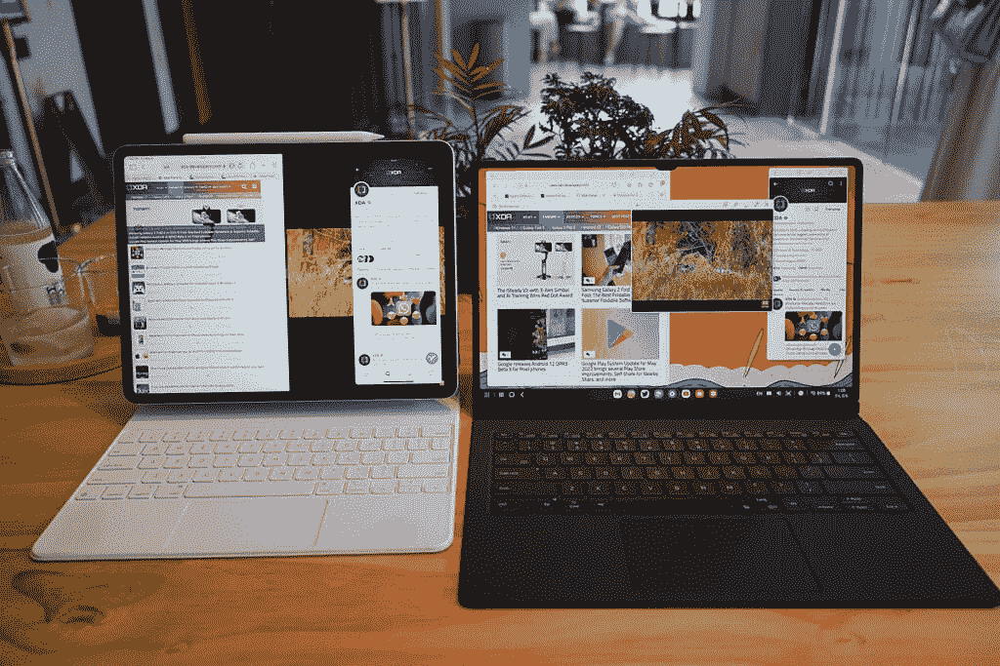

# 苹果 iPad Pro (2021) vs 三星 Galaxy Tab S8 Ultra:目前市场上最好的两款平板电脑

> 原文：<https://www.xda-developers.com/apple-ipad-pro-2021-vs-samsung-galaxy-tab-s8-ultra/>

大多数技术评论家和不带偏见的消费者都认为，苹果的 iPad 一直是平板电脑的旗手，主要是因为 Android 和 Windows 在外形方面都没有优化(后者尤其如此)。但是三星一直在努力解决这个问题——让 Android 应用程序在平板电脑屏幕上运行得更好 Galaxy Tab S8 系列几乎肯定是最好的 Android 平板电脑。但是，三星绝对最好的平板电脑产品[Galaxy Tab S8 Ultra](https://www.xda-developers.com/samsung-galaxy-tab-s8-ultra-review/)与苹果绝对最好的 iPad 产品 [iPad Pro 搭配 M1](https://www.xda-developers.com/ipad-pro-2021-review/) 相比如何？

自从这两款平板电脑首次发布以来，我一直在使用它们，并在它们之间来回切换，作为我的主要“移动工作机器”。很明显，我是一个被宠坏的评论者，两者都可以拥有。普通消费者必须选择一个——虽然我不能说这种比较会给你一个明确的答案，但我会尽我所能在每个有意义的类别中比较这两个，并告诉你如果我必须保留一个，我会选择哪个。

 <picture></picture> 

iPad Pro (left) and Galaxy Tab S8 Ultra (right).

## 苹果 iPad Pro 2021 (12.9 英寸)和三星 Galaxy Tab S8 Ultra:规格

| 

规格

 | 

苹果 iPad Pro (12.9 英寸，2021 年)

 | 

三星 Galaxy Tab S8 Ultra

 |
| --- | --- | --- |
| **构建** | 

*   铝制框架和背部
*   玻璃前部

 | 

*   铝制中框和背部
*   玻璃前部

 |
| **尺寸&重量** | 

*   280.6 x 214.9 x 6.4mm 毫米
*   682g(无线网络)
*   685g (Wi-Fi +蜂窝)

 | 

*   326.4 x 208.6 x 5.5mm 毫米
*   726g (Wi-Fi)/728g (5G)

 |
| **显示** | 

*   12.9 英寸“液态视网膜 XDR”迷你 LED 显示屏
*   4:3 宽高比
*   2048 x 2732
*   120 赫兹刷新率

 | 

*   14.6 英寸 Super AMOLED
*   WQXGA+ (2960 x 1848p)
*   240ppi
*   120 赫兹刷新率

 |
| **SoC** | 苹果 M1 | 骁龙 8 代 1 |
| **闸板&存放** | 

*   128GB/256GB 存储空间
*   512GB/1TB
*   Ram 未公开

 | 

*   8/12/16GB 内存
*   128/256/512GB 存储空间
*   支持 microSD 卡(最高 1TB)

 |
| **电池&充电** | 

*   9720 毫安时
*   18W 快速充电
*   不包括充电砖

 | 

*   11200 毫安时
*   45W 有线快充支持
*   不包括充电砖

 |
| **安全** | Face ID | 显示指纹扫描仪 |
| **后置摄像头** | 

*   **初级:** 12MP，f/1.8
*   **二级:** 10MP，超宽，f/2.4
*   第三代: ToF 3D 激光雷达扫描仪

 | 

*   初级:1300 万像素，自动对焦
*   超宽:6MP

 |
| **前置摄像头** | 12 兆像素，超宽 | 

*   初级:12MP，FF
*   超宽:12MP

 |
| **端口** | USB-C | USB-C |
| **音频** | 

*   四声道立体声扬声器
*   没有耳机插孔

 | 

*   由 AKG 调音的四扬声器系统
*   杜比全景声认证
*   3 个麦克风

 |
| **连通性** | 

*   802.11 ax Wi-Fi 6；同步双频带(2.4GHz 和 5GHz)
*   5G 型号(A2301 和 A2379)
    *   5G NR(频段 n1、n2、n3、n5、n7、n8、n12、n20、n25、n28、n38、n40、n41、n66、n71、n77、n78、n79)4
    *   5G NR 毫米波(频段 n260，n261)
    *   FDD-LTE(频段 1、2、3、4、5、7、8、11、12、13、14、17、18、19、20、21、25、26、28、29、30、32、66、71)
    *   TD-LTE(频段 34、38、39、40、41、42、46、48)
    *   通用移动通信系统/HSPA/HSPA+/DC HSDPA(850，900，1700/2100，1900，2100 兆赫)
*   蓝牙 5.0

 | 

*   Wi-Fi 6E
*   蓝牙 5.2
*   5G(某些地区可选)

 |
| **软件** | iOS 14.5 | 一个基于 Android 12 的 UI 4.1 |
| **其他特色** |  | 

*   盒子里有一支钢笔
*   Microsoft Office 365 订阅

 |

***关于本文:*** 这份对比是在对孔提供的一台 2021 款 iPad Pro 和一台自己购买的三星 Galaxy Tab S8 Ultra 进行了数月的测试后撰写的。这两家公司在这篇文章中都没有任何投入。

* * *

## 苹果 iPad Pro (2021)与三星 Galaxy S8 Ultra:定价和可用性

iPad Pro (2021)和 Galaxy Tab S8 Ultra，以及该系列的其他型号(包括较小的 11 英寸 iPad Pro 或标准 Galaxy Tab S8)现在都在销售。12.9 英寸 iPad Pro (2021)和 Galaxy Tab S8 Ultra 的起价都是 1099 美元，128GB 的存储空间和 WiFi 连接，5G 连接和更多存储空间的价格会上涨。

 <picture></picture> 

12.9-inch iPad Pro

##### 苹果 iPad Pro 12.9 英寸(2021 年)

iPad Pro 绝对是一台配备迷你 LED 屏幕和超级强大移动 SoC 的机器。

 <picture></picture> 

Samsung Galaxy Tab S8 Ultra

Galaxy Tab S8 Ultra 是一款可以完成所有功能的巨型平板电脑。它是一台工作电脑、游戏平板电脑、电影观看机

## 苹果 iPad Pro (2021) vs 三星 Galaxy Tab S8 Ultra:硬件和设计

在设计方面，没有太多可谈的，因为几乎所有的平板电脑都遵循相同的铝制矩形设计语言。Galaxy Tab S8 Ultra 因其大尺寸(14.6 英寸屏幕)而成为头条新闻，它明显比我拿过的大多数平板电脑更宽/更高(取决于方向)。但由于我测试的是更大的 12.9 英寸 iPad Pro(也有 11 英寸的)，两者之间的尺寸差异不是很大。

它们的重量都足够接近，Galaxy Tab S8 Ultra 的重量为 726 克，iPad Pro 的重量为 685 克(对于美国读者来说，这一差异不到 0.1 磅)，事实上，Galaxy Tab S8 Ultra 比 iPad Pro 的 6.4 毫米薄 5.5 毫米。

此外，我正在测试这两款设备的第一方键盘壳，苹果的 Magic Keyboard 明显更重，因此包括键盘壳在内的 iPad Pro 整体包装比 Galaxy Tab S8 Ultra 包装更重、更大。

### 显示器和音频

对于显示屏，很容易看到规格表上的数字和边框尺寸，就断定三星获胜——Galaxy Tab S8 Ultra 有 120Hz 的 OLED 面板，而 iPad Pro 有 120Hz 的迷你 LED 屏幕——但在现实世界的使用中还有其他因素起作用:虽然 iPad Pro 有更厚的边框，但它们是均匀对称的，而 Galaxy Tab S8 Ultra 屏幕被一个缺口打断。虽然 Galaxy Tab S8 Ultra 屏幕变得稍微亮了一点，但在大多数情况下，即使是 60%的亮度，这两种显示器也足够亮了。因此，除非我真的在烈日下使用平板电脑，否则最大亮度的差异并不重要。此外，我认为 iPadOS 显然比三星的 OneUI 更适合 120Hz，因为动画更流畅。

那至少是通用的。如果我坐在黑暗的房间里看电影，那么 Galaxy Tab S8 Ultra 的 OLED 面板将会产生更深的黑色，并且由于其宽屏宽高比，也会有更小的信箱区(那些将视频夹在中间的黑条)。

这两款屏幕都非常棒

我最终会挑毛病，这两个屏幕都非常棒。扬声器质量也很出色:两款平板电脑都有一个四扬声器系统，我想说它们在音频保真度方面不分上下，很容易成为任何平板电脑中最好的两个扬声器系统。

### 硅

iPad Pro 由苹果的 M1 硅芯片驱动，尽管它比高通骁龙 8 代 1 代驱动 Galaxy Tab S8 Ultra 整整老了一年，M1 仍然是一个更有能力的硅芯片。现在，当*执行大多数日常任务时，*如观看 YouTube 或发送电子邮件时，你不会看到太大的差异，但如果你执行更密集的任务，如视频编辑，M1 芯片的能力明显更强。如果我在编辑一个 4K 的片段，并在时间轴上移动，它在 M1 iPad Pro 上的移动速度会快得多。

渲染时间*要快得多*，大概快了 5 倍。然而，这不是一个直接的比较，因为我使用不同的视频编辑应用程序。但基准数据也显示，M1 也大获全胜。尽管如此，这对 90%的消费者来说并不重要，因为骁龙 8 Gen 1 已经足够强大了。

### 摄像机

这两款平板电脑的背面都装有一个宽和超宽的摄像头，它们对于平板电脑来说很好，但它们显然不如苹果和三星高端手机上的传感器。苹果的相机系统取得了明显的胜利，因为它还配备了激光雷达传感器，这有助于使 ar 应用程序运行得更好。事实上，iOS/iPadOS 上的 AR 应用比 Android 上的要好得多，所以如果 AR 应用对你很重要，你应该坚持使用 iPhones 和 iPads。

平板电脑更重要、应用更广泛的摄像头是前置摄像头，在这里，Tab S8 Ultra 摄像头的硬件更胜一筹。它不仅可以产生更清晰的图像和视频(与 iPad Pro 的 1080p 相比，Tab S8 Ultra 有一个 4k 镜头)，它的横向定位(顶部边框的中心)比 iPad Pro 的左侧边框放置更好。不过，和往常一样，三星在照片中使用了看起来不自然的美颜滤镜。

对于视频来说，两者都做得很好，但 Galaxy Tab S8 Ultra 的相机可以在需要时拍摄 4K——尽管我猜没有多少人希望自己的脸以 4K 分辨率显示。iPad Pro 在视频中应用了噪音消除功能，因为在三星的视频中，你可以更清楚地听到背景噪音。

同样值得一提的是，iPad Pro 的前置摄像头系统内置了苹果针对 FaceID 的原深感摄像头系统。这并没有真正考虑到一般的视频通话或自拍，但如果有利用面部映射的 AR 应用程序，我很确定 iPad Pro 会比 Galaxy Tab S8 Ultra 做得更好。

## 配件

当我测试智能手机时，我只关注设备，不会将可选配件纳入评估。但对于将自己标榜为生产力发电站的高端平板电脑来说，有必要考虑键盘和手写笔等配件，因为它们对整体体验至关重要。

从价值因素来看，Galaxy Tab S8 Ultra 赢得了第一场胜利，因为其触控笔 S-Pen 包含在包装中。另一方面，苹果的铅笔售价 129 美元。至于键盘:苹果的 Magic Keyboard 和三星的 Book Cover Keyboard 价格都相对较高，每个 349 美元(如果你拥有较小的 11 英寸 iPad Pro，那么键盘的价格降至 299 美元)。然而，三星一直热衷于在许多地区购买后免费赠送键盘配件，而苹果的 Magic Keyboard 一直是全额购买。

但是我想你得到了你所付出的。虽然三星的 S-Pen 和键盘壳都很好，但它们不如苹果的同行，而苹果可以说是业内最好的。与三星的 S-Pen 相比，Apple Pencil 在我画草图时对压力的变化更敏感一些，而苹果的 Magic Keyboard case 尽管相当笨重，但它有一个巧妙的设计，可以将平板电脑从桌面上抬起来。三星的键盘外壳设计是一个笨重的两部分外壳，带有支架，不能很好地放在腿上。虽然这两个键盘都很出色，但 Magic Keyboard 的触控板是同类中最好的，与三星的触控板相比，我可以更精确地控制屏幕上的光标，三星的触控板可能有点滑。我将在软件部分更多地讨论手写笔和触控板的性能。只要知道这些确实会影响你的整体体验，除非你只是想要一个大显示屏的平板电脑(这可能会浪费潜力)。

* * *

## 苹果 iPad Pro (2021) vs 三星 Galaxy Tab S8 Ultra:软件

iPad Pro (2021)运行 iPadOS 15.4，本质上是 iOS 15 的分叉版本，具有卓越的多任务处理能力。Galaxy Tab S8 Ultra 在 Android 12 上运行 One UI 4.1，它也与三星智能手机上运行的软件非常相似。如果你使用过 iPhone 或 Galaxy 手机，这两款平板电脑都可以感觉像是这些设备的超大版本。

在本文的开头，我提到了 Android 平板电脑一直被认为不如 iPads，这主要是由于软件，因为 Android 应用程序一般不会针对更大的风景屏幕进行优化。完美的例子是 Twitter，它在横向模式下为 iPad 屏幕进行了优化设计，但在相同的横向模式下，在 Android 平板电脑屏幕上看起来绝对愚蠢。

但三星试图用 DeX 模式解决这个问题。本质上，DeX Mode 是三星在 Android 内部构建的沙盒用户界面，它模仿了传统计算机的用户界面，可能是 Windows 计算机。这意味着 Android 应用程序可以在自由浮动窗口中打开(而不是填满整个屏幕)。

DeX mode 是一个天赐良机，因为它不仅解决了 Android 平板电脑(和 Android foldables，或任何屏幕尺寸不寻常的 Android 设备)面临的许多应用程序缩放问题，而且改善了多任务处理，因为我真的可以同时打开多达三个应用程序，而且内容不会感觉太小。我甚至可以推到四点，但是事情开始变得紧张。

Android 平板电脑一直被认为不如 iPads，这主要是由于软件的原因——但三星试图通过 DeX 模式来解决这一问题

在 iPad Pro 上，多任务处理有点受限:你只能在分屏视图中同时打开两个应用程序，最多可以有第三个应用程序悬停，但这第三个应用程序将覆盖其中一个分屏应用程序的一大块，所以说真的，我不会称之为同时运行三个应用程序，更像是同时运行 2.5 个应用程序。你可以在下面的照片中看到，我在每台平板电脑上都打开了三个应用程序，但 iPad 版本以一种不可取的方式掩盖了视频。

 <picture></picture> 

iPad Pro (left) and Galaxy Tab S8 Ultra multi-tasking.

任何做过办公室工作的人都知道同时打开多个窗口的重要性，我认为三星 DeX 允许我做更多的事情。然而，三星 DeX 最终只是一个未经优化的 Android 应用程序伤口上的创可贴。除非应用程序开发人员投入更多精力来优化 Android，或者谷歌实施全系统的 Android 规则来适当地扩展应用程序，否则问题将一直存在，即使是三星 DeX 也是如此。目前，大多数应用程序运行良好，但有些应用程序无法正常加载。我在 iPad Pro 上没有这些问题，几乎所有我能从苹果应用商店下载的东西都能很好地在 iPad Pro 上运行。

我发现的唯一一个应用程序在 Android 平板电脑上比在 iPad 上更好看的例子是 Instagram。事实上，它跨越了整个显示屏，三星的屏幕更大，这使得浏览 Instagram 成为一种乐趣——尤其是在查看迷人的照片时。

### 触控板和触控笔支持

之前我提到过，虽然我认为 Galaxy Tab S8 Ultra 的键盘触控板和 S-Pen 不错，但它们的性能不如苹果的 Magic Keyboard 触控板和 Apple Pencil。让我们从触控板开始:Magic Keyboard 触控板尽管很小，但却非常精确。我真的很喜欢在 Windows 机器上使用它，而不是两倍大小的触控板。我敢肯定，这主要是 iPadOS 的软件优化，使光标能够如此精确地移动。我认为苹果所做的是对应用程序和按钮施加一些重力，所以当我把鼠标光标拖到那里时，它几乎会在我快到那里时自动就位。

相比之下，三星 Book Cover 键盘上的触控板很滑，有时轻微的滑动会将网页向下滚动得比我预期的更远，有时我的鼠标光标会移动到预定目标的旁边。

触控板手势在 iPadOS 上也更有意义，因为它们遵循的规则与我们在手机上使用拇指时遵循的规则相同。例如，iPad 触控板退出应用程序/返回主屏幕的手势是三指向上滑动——这完全有道理，因为过去几年我们一直被训练向上滑动以在我们的手机中做同样的动作。但 Galaxy Tab S8 Ultra 颠覆了这一点:要退出应用程序/回家，你需要用三个手指向下滑动。同样，要进入 iPad 触控板上的应用概述(在这个屏幕上，你可以看到你最近所有的应用)，你需要向上滑动并按住，就像我们在手机上所做的一样。在 Galaxy Tab S8 Ultra 触控板上？是三指向上扫。三星怎么没有意识到触控板手势应该尽可能匹配常规的手机滑动手势？

在手写笔上，Apple Pencil 似乎更能适应我画草图或记笔记时的各种压力。Apple Pencil 只是感觉更像一支真正的铅笔，如果我在屏幕上几乎向侧面倾斜 Apple Pencil，它还可以着色。

但是，事实上，S-Pen 基本上是免费的(包含在平板电脑中)，而 Apple Pencil 要额外支付 129 美元，这是一个不小的因素。大多数人会选择非常好的免费手写笔，而不是昂贵的手写笔。

* * *

## 苹果 iPad Pro (2021) vs 三星 Galaxy Tab S8 Ultra:续航

尽管两款设备都有如此大而生动的 120Hz 屏幕，但电池续航时间还是不错的。就我的使用情况而言，iPad Pro 比三星的平板电脑要好一点，每小时消耗大约 8-9%的电池电量，而我在 Galaxy Tab S8 Ultra 上看到的电池电量为 10-12%。这意味着，在这种工作场景下，两款平板电脑都可以全天工作八小时。当我在 iPad Pro 上编辑视频时，电池消耗得更快，显然，在一个小时的编辑会话中，电池消耗了约 35%。对于 Galaxy Tab S8 Ultra，我没有同样的轶事数据，因为我已经多年没有尝试在 Android 设备上编辑视频了。

* * *

## 苹果 iPad Pro (2021)与三星 Galaxy Tab S8 Ultra:使用案例和最终想法

那么，哪款平板电脑比较好呢？这是一个很难回答的问题，因为这些平板电脑中的每一个都擅长于不同的事情！我可以说，经过几个月的使用，对我来说 iPad Pro 更好，因为:

*   一台创意机器，允许我在 Lightroom 中绘制草图、编辑照片，并在高水平上使用 LumaFusion 编辑视频
*   一般用途的平板电脑，可以在家里随身携带，或躺在沙发上/床上，因为 iPad 有更好的应用程序生态系统，而 iPad Pro 由于尺寸较小，更容易长时间持有

但是 Galaxy Tab S8 Ultra 更好，因为:

*   一台传统的办公类型的工作机，因为 DeX 让我可以打开更多的窗口，而相比苹果抽象复杂的文件系统，Android 有着更自然、直接的文件系统
*   纯粹的观影机，因为它有更好的屏幕，更合适的长宽比。

如果价值是一个因素，那么 Galaxy Tab S8 Ultra 是一个更好的价值，因为你可以免费获得 S-Pen，还可能获得键盘保护套，但 iPad Pro 有一个更好的硬件生态系统——你可以将 iPad Pro 用作 MacBooks 的辅助显示器，以及 iPhone 和 iPad 之间的隔空投送文件。是的，是的，我知道三星也在努力建立这种水平的协同作用，但它还没有完全到位。

现在，要回答“如果必须选一个，我会选哪个？”，我不得不选择 iPad Pro，因为它有更好的视频编辑能力和更好的应用生态系统。然而，我绝对崇拜 Galaxy Tab S8 Ultra，并认为它是迄今为止最好的 Android 平板电脑，三星在这方面已经做了足够多的工作来挑战以前不容置疑的“最好的平板电脑是 iPad”的说法。现在，这至少是一场辩论。

 <picture></picture> 

12.9-inch iPad Pro

##### 苹果 iPad Pro 12.9 英寸(2021 年)

iPad Pro 绝对是一台配备迷你 LED 屏幕和超级强大移动 SoC 的机器。

 <picture></picture> 

Samsung Galaxy Tab S8 Ultra

Galaxy Tab S8 Ultra 是一款可以完成所有功能的巨型平板电脑。它是一台工作电脑、游戏平板电脑、电影观看机