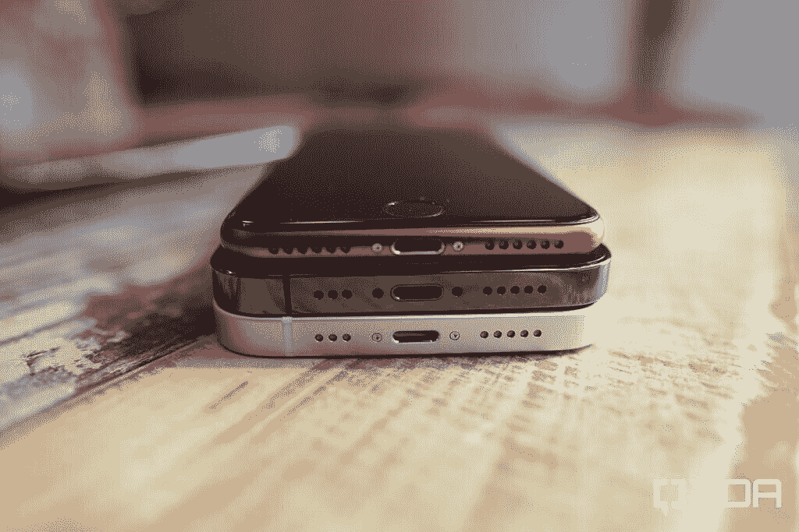
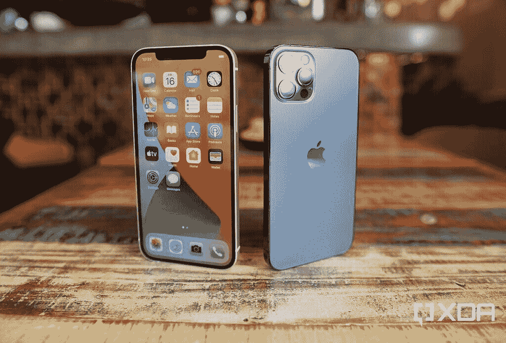
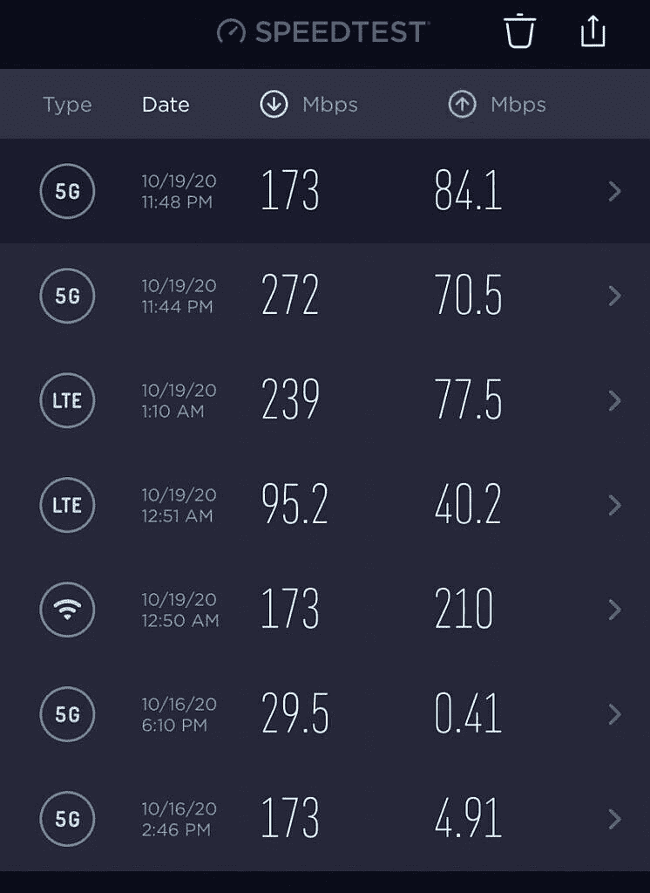

# iPhone 12 上手:苹果一款超值旗舰的最佳竞争者？

> 原文：<https://www.xda-developers.com/apple-iphone-12-preview/>

iPhone 12 系列是苹果有史以来最大的阵容，有四种型号，每一种都适合特定的细分市场:iPhone 12 Mini 是为那些一直抱怨手机尺寸越来越大的人准备的；iPhone 12 是给那些不想花太多钱的人用的；iPhone 12 Pro 是更高端的型号；而 iPhone 12 Pro Max 是所有型号中尺寸最大、规格最高的型号。

提供的种类繁多是很好的，但可能是标准的 iPhone 12 卖得最好。6.1 英寸，起价 799 美元，可以说是 Goldilocks iPhone——不太小不太大，也不太贵(相对而言)。甚至名字也暗示了这一点:不需要像迷你或最大这样的意符；这只是*今年的* iPhone。

在过去的四天里，我一直在测试 iPhone 12(以及 12 Pro)，这里是我的印象，96 小时后。

## 苹果 iPhone 12:规格

| 

规格

 | 

苹果 iPhone 12

 |
| --- | --- |
| **打造** | 

*   铝制中框
*   玻璃正面和背面
*   用于玻璃保护的“陶瓷护罩”

 |
| **尺寸&重量** | 

*   146.7 x 71.5 x 7.4 毫米
*   162 克(全球)
*   164 克(美国)

 |
| **显示** | 

*   6.1 英寸 Super Retina XDR 有机发光二极管显示屏
*   2，532 x 1，170 分辨率

 |
| **SoC** | 苹果 A14 仿生 SoC:

*   *   2 枚高性能内核
    *   4 个能效内核
*   5 纳米工艺节点
*   四核 GPU
*   16 核神经引擎

 |
| **存储选项** |  |
| **电池&充电** | 

*   2，815 毫安时电池，符合认证列表
*   带 MagSafe 的 15W 无线充电
*   7.5W Qi 无线充电

 |
| **安全** | Face ID(原深感摄像头面部识别) |
| **后置摄像头** | 

*   **主要:** 12MP
*   **次要:** 12MP，超广角

 |
| **前置摄像头** | 12MP，f/2.2 |
| **端口** | 专有闪电端口 |
| **音频** | 支持的音频格式:AAC-LC、HE-AAC、HE-AAC v2、受保护的 AAC、MP3、线性 PCM、Apple Lossless、FLAC、Dolby Digital(AC-3)、Dolby Digital Plus(E-AC-3)、Dolby Atmos 和 Audible(格式 2、3、4、Audible Enhanced Audio、AAX 和 AAX+) |
| **连通性** | 

*   5G:低于 6GHz
*   超宽带
*   支持 2×2 MIMO 的 wi-Fi 6(802.11 ax)
*   蓝牙 5.0

 |
| **软件** | iOS 14 |
| **其他特性** | 

*   IP68
*   颜色:黑色、白色、红色、蓝色、绿色

 |

## 硬件:5nm，5G！

仅从外观上看，iPhone 12 与去年的 iPhone 11 没有太大变化，只是铝制底盘现在完全平坦，看起来更像盒子。

 <picture></picture> 

The iPhone 12 (White) and the iPhone 12 Pro (Blue)

我觉得这种设计比 iPhone 11 的圆形边缘稍不舒适，但我认为更方正的外观散发出一种更成熟、更专业的氛围。此外，它们允许 iPhone 12 在平坦的表面上独立站立，使我拍摄产品的工作更容易。

我还喜欢标准 iPhone 12 的重量为 164 克，因为最近的安卓旗舰产品重量超过 200 克。

 <picture></picture> 

The iPhone SE 2020 (Red), with iPhone 12 Pro (Blue), and iPhone 12 (White)

iPhone 12 周围的边框应该比去年的 iPhone 略薄，但我看不出来。可能是因为我没有 iPhone 11 和 12 并排看，相反，我在比较 iPhone 11 Pro Max 和 12。

 <picture></picture> 

The iPhone 12 (left) and the iPhone 12 Pro (right)

但除了外观，iPhone 12 比 iPhone 11 改进了很多，比 12 Pro 在 iPhone 11 Pro 上的改进还要多。iPhone 12 的显示屏从去年的液晶面板升级到了有机发光二极管显示屏(或者苹果称之为超级视网膜 XDR)，主 12MP 摄像头也拥有更大的 f/1.6 光圈，以获得更好的进光量。12MP 超广角相机的硬件与以前一样，但它现在支持夜间模式，以获得明显更好的低光超广角拍摄。

最大的升级是在硅上:苹果 A14 仿生是基于 5 纳米技术。现在还为时尚早，但在编辑视频时，它肯定感觉非常强大(稍后将详细介绍)。在 Geekbench 应用程序上，A14 Bionic 的单核得分为 1596，多核得分为 4027，而我的 [Galaxy Fold 2](https://www.xda-developers.com/samsung-galaxy-z-fold-2-review/) 中的[骁龙 865 加](https://www.xda-developers.com/qualcomm-snapdragon-865-plus-launch/)的得分分别为 883 和 2179。

iPhone 12 和今年所有其他 iPhone 型号一样，支持 5G。从技术上来说，这是这些新 iPhones 最大的新功能，但事实上，我在文章中一直等到现在才提到它，这应该可以让你知道我对它的看法。5G 现在还没有准备好进入黄金时段。在香港，我在当地运营商 CSL 的 sub-6 网络上测试了 iPhone，虽然我在香港的许多地方都收到了良好的信号，但即使在最好的一天，速度也只比 4G LTE 略快一点。到目前为止，我还没有在 2020 年在美国测试 5G，但我非常怀疑结果会在那里好得多。尽管如此，苹果采用 5G 对行业很重要[，我想现在运营商有了苹果的支持，我们将在明年的某个时候看到 5G 的改进。](https://www.xda-developers.com/iphone-12-5g/)

 <picture></picture> 

5G speeds on the iPhone 12 according to the Speedtest app

## 杂志保险箱

今年 iPhones 的另一个新功能是它们都支持 MagSafe 充电。熟悉老一代苹果 macbook 的人会知道 MagSafe 是 2006 年至 2016 年为 macbook 提供动力的专有磁性连接连接器。新的 MagSafe 充电器是不同的 [MagSafe 配件](https://www.xda-developers.com/samsungs-galaxy-z-fold-2-unpacked-part-2-september-1/)系列的一部分，类似于一个小型无线充电器，通过磁性附着在 iPhone 12 的背面。MagSafe 光盘还可以为我的几部安卓手机充值，包括[三星 Galaxy S20 FE](https://www.xda-developers.com/samsung-galaxy-s20-fe-review/) 和 Galaxy Fold 2。苹果的官方新闻材料没有透露 MagSafe 背后的技术细节，只是说它可以以 15W 的速度为新的苹果手机充电。它与其他手机和配件的 Qi 兼容高达 7.5W。接下来的几天我会做更多的测试。

它确实工作得很好:MagSafe 光盘卡在 iPhone 12 上，发出令人满意的咔哒声，充电就这样开始了。它确实比无线充电带来了更多的自由，因为我可以拿起手机继续充电。然而，我也可以通过简单地插入有线 Lightning 电缆来实现相同的效果。

## iPhone 12 摄像头:杜比视界！

如前所述，只有 12 款的主广角摄像头进行了任何重大的硬件升级，苹果公司表示，较低/更快的 F-stop 比去年的 iPhone 11 提高了 27%的低光摄入。iPhone 12 和 iPhone 11 Pro Max 在白天拍摄的照片差异几乎可以忽略不计。在下面的一组照片样本中，12 的图像比 iPhone 11 Pro 的照片周围的光线略好-你可以看到照片右下角阴影下的区域略亮更清晰-但差异很小。我附上了 Galaxy Z Fold 2 的一张照片进行比较。

但是你会看到最大的颠簸是在晚上拍摄的超广角照片。这是去年 iPhone 11 超宽的一个弱点，但现在有了夜间模式，差别几乎是不分昼夜的。

事实上，苹果已经改进了所有相机的软件算法，以实时找到更好的平衡。我用 iPhone 12、iPhone 11 Pro 和 Galaxy Z Fold 2(按以下顺序)拍摄了这张具有挑战性的照片(站在厚重的阴影下，同时指向刺目的阳光)。12 的图像有最好的曝光，不会吹出通向海洋的明亮的阳光，同时也保持阴影严重的区域照明良好。

在完整的评论中，我将更多地关注静态摄影，但同时，看看过去几天拍摄的更多 iPhone 12 照片样本。

我认为，在很大程度上，这款手机在动态范围和曝光方面比去年的相机有所升级，但它不是一张引人注目的静态照片。在视频方面，iPhone 12 是世界上第一款采用杜比视界(Dolby Vision)拍摄的手机，这是一种 HDR 标准，可以动态调整元数据。因此，如果场景的照明或曝光水平发生变化，元数据也会随之变化。

这就是我提到的 A14 仿生功能的来源:iPhone 12 也可以在 iOS 的原生照片应用程序中编辑这些杜比视觉剪辑。我说的不仅仅是基本的编辑，比如修剪视频长度或应用滤镜，而是你可以裁剪或旋转视频，并在照片应用程序中进行处理。看看上面剪辑中 iPhone 12 拍摄的一些杜比视界视频样本。在视频快结束时，你会看到 Galaxy S20 FE 的对比视频。虽然三星的视频功能非常出色，但你可以看到苹果的视频稳定性更好，色彩更自然，当我从室内阴影场景转移到室外强光下时，曝光速度更快。

## 其他随机花絮和早期印象

到目前为止，电池寿命还可以，这意味着它既不伟大也不坏。我每天都在连接 5G 的情况下大量使用 iPhone 12，到目前为止，在四天的测试中，只有两天一次充电可以坚持整整 14 小时。在一个特别繁忙的日子，我上午 10 点离开家，拍摄了一个小时的视频，在网上冲浪的同时播放了一个小时的 Spotify，打了几个 WhatsApp 语音电话；我的电池到下午 4 点就耗尽了 25%。

苹果在硬件和软件之间建立了强大的协同作用，因此 iPhone 的体验通常比其规格表所显示的要多

iPhone 12 的“仅 60Hz”面板没问题。我希望新手机有 120 赫兹的刷新率吗？是的。我觉得我的一加 8T 上的动画看起来比这款手机上的快吗？是的。但是 12 的 UI 流畅性和动画还是很流畅的。我认为苹果在建立硬件和软件之间的协同作用方面做得非常好，以至于 iPhone 通常不仅仅是其各个部分的总和，而且体验也不仅仅是规格表所显示的那样。这里的 60Hz 面板感觉比 Android 上的 60Hz“更平滑”，缩小了与 Oppo、一加和[三星手机](https://www.xda-developers.com/best-samsung-galaxy-phones/)的 120Hz 屏幕的差距。

在疫情期间说这话听起来很奇怪，但与 1000 美元的 iPhone 12 Pro(我很快就会有一篇文章对比这两款手机)或 1400 美元的 Galaxy Note 20 Ultra(T1)相比，800 美元的 iPhone 12 似乎是一个不错的价格。当然，现在有一个事实，iPhone 的操作系统与 Android 完全不同，所以如果你是一个 Android 爱好者，正在阅读这篇文章，无论如何这都是一个有争议的问题。

 <picture></picture> 

Apple iPhone 12

##### 苹果 iPhone 12

苹果 iPhone 12 可能是苹果 2020 年产品线中位置最好的智能手机，其全面的包装在 iOS 生态系统中提供了巨大的价值。有机发光二极管显示屏、更大的相机光圈、5G 和设计调整的增加有助于 iPhone 12 脱颖而出，成为自己的手机。

在本周余下的时间里，我会带来更多关于 iPhone 12 的报道！敬请期待，并在下面的评论中让我们知道你对新 iPhone 的看法！

更新:这里是完整的 [iPhone 12 评论](https://www.xda-developers.com/apple-iphone-12-review/)。