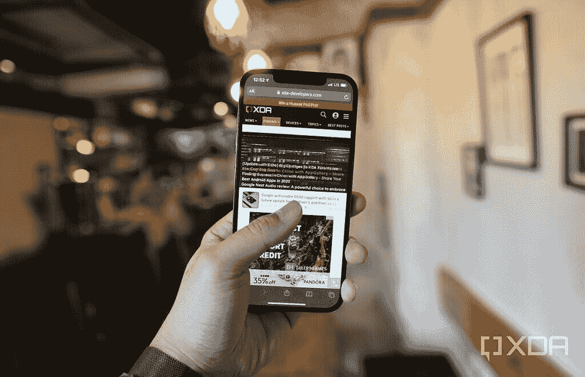
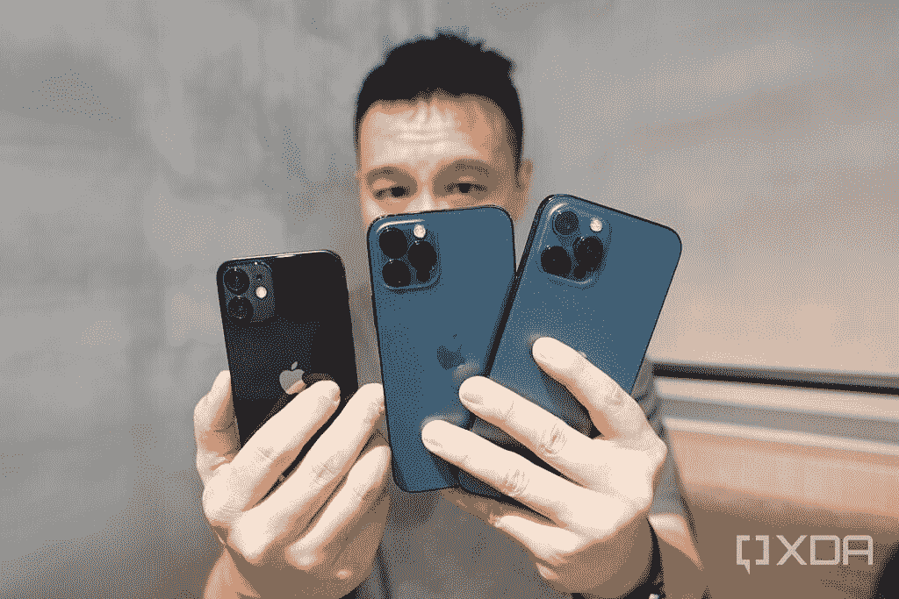
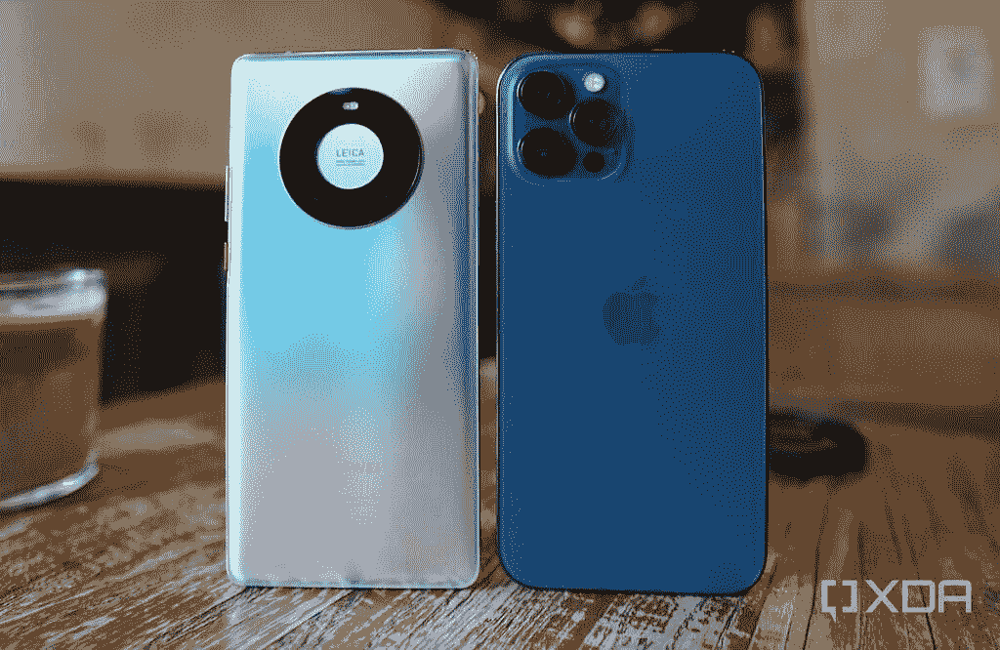
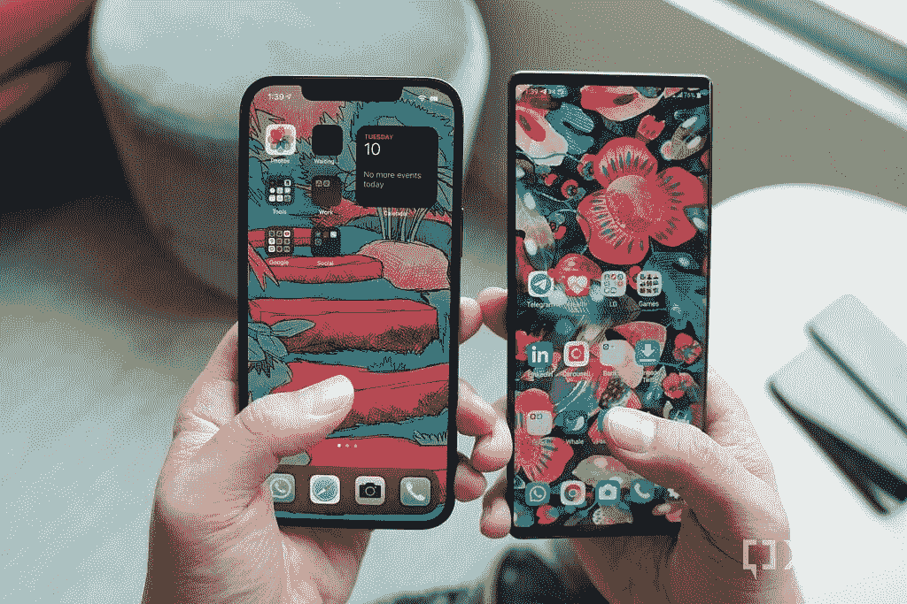
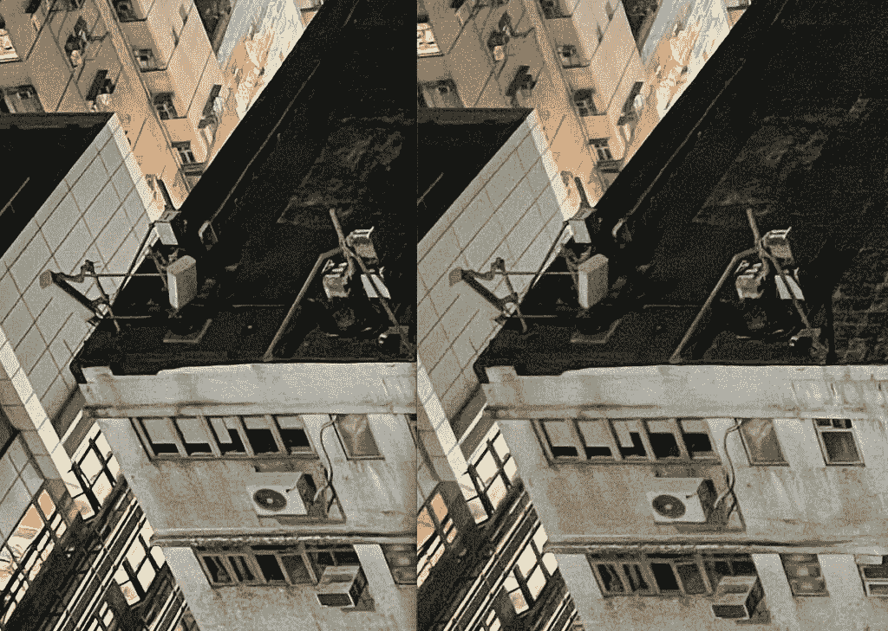
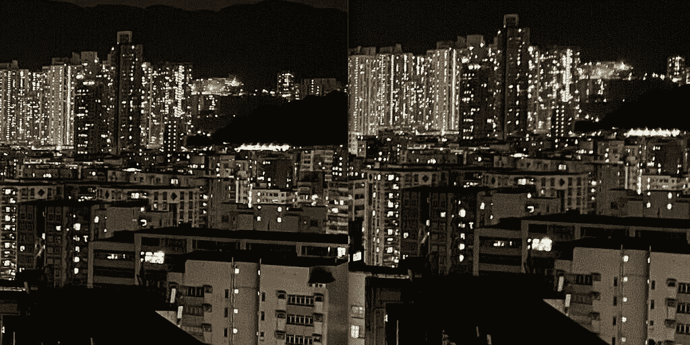
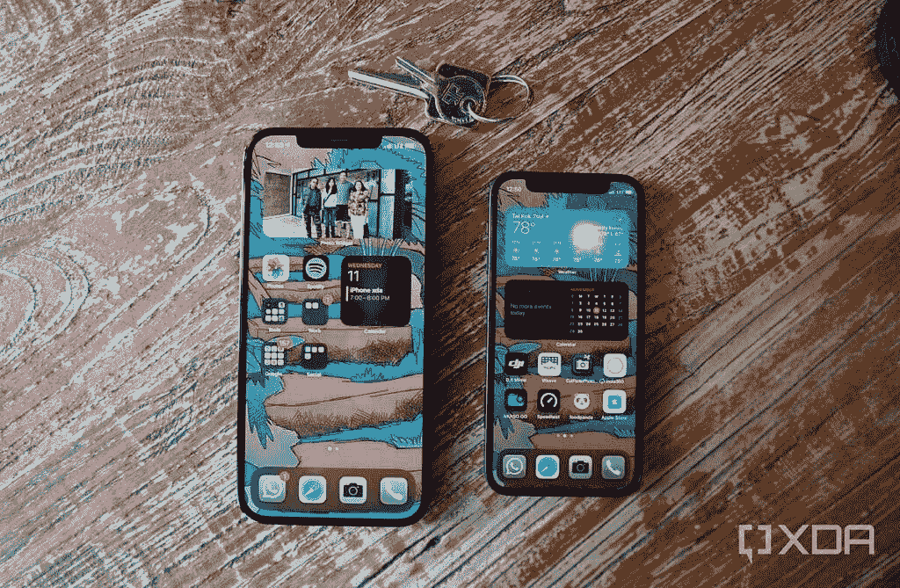
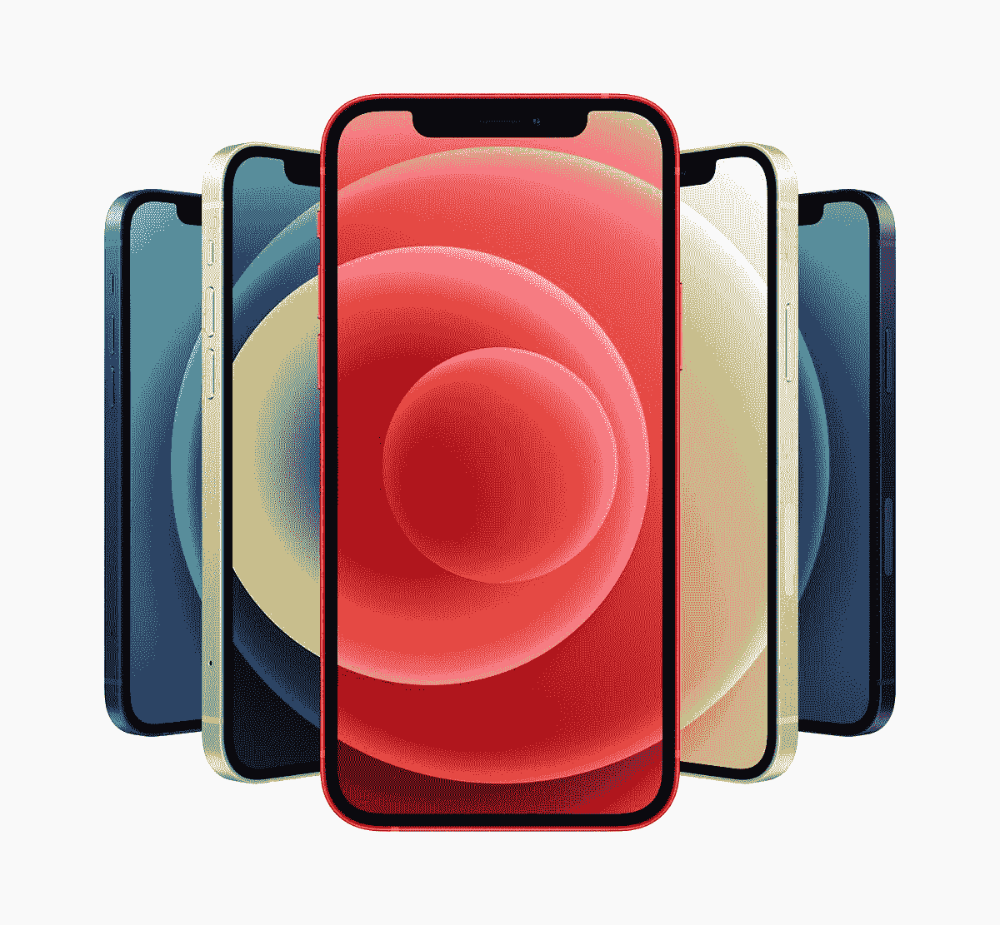

# 苹果 iPhone 12 Pro Max 上手:大手机，大改进？

> 原文：<https://www.xda-developers.com/apple-iphone-12-pro-max-hands-on-preview/>

苹果有史以来最大的 iPhone，iPhone 12 Pro Max 来了。与前两款“Max”iPhone 不同，iPhone 12 Pro Max 与 [iPhone 12 系列](https://www.xda-developers.com/apple-iphone-12-series/)中其他设备的区别不仅仅在于更大的屏幕。在过去的 36 个小时里，我一直在大量使用它，下面是我对苹果最新和最棒的产品的看法。

 <picture></picture> 

The iPhone 12 Pro Max.

我也一直在测试 iPhone 12 Mini，所以如果你对我对这个娇小的小东西的想法感兴趣，你可以在这里(很快)读到它。

### 苹果 iPhone 12 系列:规格和对比

| 

规范

 | 

苹果 iPhone 12 Mini

 | 

苹果 iPhone 12

 | 

苹果 iPhone 12 Pro

 | 

苹果 iPhone 12 Pro Max

 |
| --- | --- | --- | --- | --- |
| **建造** | 

*   铝制中框
*   玻璃正面和背面
*   用于玻璃保护的“陶瓷护罩”

 | 

*   铝制中框
*   玻璃正面和背面
*   用于玻璃保护的“陶瓷护罩”

 | 

*   不锈钢中框
*   玻璃正面和背面
*   用于玻璃保护的“陶瓷护罩”

 | 

*   不锈钢中框
*   玻璃正面和背面
*   用于玻璃保护的“陶瓷护罩”

 |
| **尺寸&重量** | 

*   7.4 x 131.5 x 64.2mm 毫米
*   133 克(全球)
*   135 克(美国)

 | 

*   7.4 x 146.7 x 71.5mm 毫米
*   162 克(全球)
*   164 克(美国)

 | 

*   7.4 x 146.7 x 71.5mm 毫米
*   187 克(全球)
*   189 克(美国)

 | 

*   7.4 x 160.8 x 78.1mm 毫米
*   226 克(全球)
*   228 克(美国)

 |
| **显示** | 

*   5.4 英寸超级视网膜 XDR 有机发光二极管显示屏
*   2，340 x 1，080 分辨率，476 PPI

 | 

*   6.1 英寸超级视网膜 XDR 有机发光二极管显示屏
*   2，532 x 1，170 分辨率，460 PPI

 | 

*   6.1 英寸超级视网膜 XDR 有机发光二极管显示屏
*   2，532 x 1，170 分辨率，460 PPI

 | 

*   6.7 英寸超级视网膜 XDR 有机发光二极管显示屏
*   2，778 x 1，284 分辨率，458 PPI

 |
| **SoC** | 

*   苹果 A14 仿生 SoC
    *   2 倍性能内核
    *   4 个能效内核
*   5 纳米工艺节点
*   四核 GPU
*   16 核神经引擎

 | 

*   苹果 A14 仿生 SoC
    *   2 倍性能内核
    *   4 个能效内核
*   5 纳米工艺节点
*   四核 GPU
*   16 核神经引擎

 | 

*   苹果 A14 仿生 SoC
    *   2 倍性能内核
    *   4 个能效内核
*   5 纳米工艺节点
*   四核 GPU
*   16 核神经引擎

 | 

*   苹果 A14 仿生 SoC
    *   2 倍性能内核
    *   4 个能效内核
*   5 纳米工艺节点
*   四核 GPU
*   16 核神经引擎

 |
| **闸板** | 4GB | 4GB | 6GB | 6GB |
| **存储选项** |  |  |  |  |
| **电池&充电** | 

*   2，227 毫安时电池，符合认证列表
*   带 MagSafe 的 15W 无线充电
*   7.5W Qi 无线充电

 | 

*   2，815 毫安时电池，符合认证列表
*   带 MagSafe 的 15W 无线充电
*   7.5W Qi 无线充电

 | 

*   2，815 毫安时电池，符合认证列表
*   带 MagSafe 的 15W 无线充电
*   7.5W Qi 无线充电

 | 

*   3，687 毫安时电池，符合认证列表
*   带 MagSafe 的 15W 无线充电
*   7.5W Qi 无线充电

 |
| **安全** | Face ID(原深感摄像头面部识别) | Face ID(原深感摄像头面部识别) | Face ID(原深感摄像头面部识别) | Face ID(原深感摄像头面部识别) |
| **后置摄像头** |  |  |  |  |
| **前置摄像头** | 12MP，f/2.2 | 12MP，f/2.2 | 12MP，f/2.2 | 12MP，f/2.2 |
| **端口** | 专有闪电端口 | 专有闪电端口 | 专有闪电端口 | 专有闪电端口 |
| **音频** | 支持的音频格式:AAC-LC、HE-AAC、HE-AAC v2、受保护的 AAC、MP3、线性 PCM、Apple Lossless、FLAC、Dolby Digital(AC-3)、Dolby Digital Plus(E-AC-3)、Dolby Atmos 和 Audible(格式 2、3、4、Audible Enhanced Audio、AAX 和 AAX+) | 支持的音频格式:AAC-LC、HE-AAC、HE-AAC v2、受保护的 AAC、MP3、线性 PCM、Apple Lossless、FLAC、Dolby Digital(AC-3)、Dolby Digital Plus(E-AC-3)、Dolby Atmos 和 Audible(格式 2、3、4、Audible Enhanced Audio、AAX 和 AAX+) | 支持的音频格式:AAC-LC、HE-AAC、HE-AAC v2、受保护的 AAC、MP3、线性 PCM、Apple Lossless、FLAC、Dolby Digital(AC-3)、Dolby Digital Plus(E-AC-3)、Dolby Atmos 和 Audible(格式 2、3、4、Audible Enhanced Audio、AAX 和 AAX+) | 支持的音频格式:AAC-LC、HE-AAC、HE-AAC v2、受保护的 AAC、MP3、线性 PCM、Apple Lossless、FLAC、Dolby Digital(AC-3)、Dolby Digital Plus(E-AC-3)、Dolby Atmos 和 Audible(格式 2、3、4、Audible Enhanced Audio、AAX 和 AAX+) |
| **连通性** |  |  |  |  |
| **软件** | iOS 14 | iOS 14 | iOS 14 | iOS 14 |
| **其他特性** |  |  |  |  |
| **定价** | 起价 699 美元 | 起价 799 美元 | 起价 999 美元 | 起价 1099 美元 |

**苹果 iPhone 12 系列论坛 **

## 苹果 iPhone 12 Pro Max 设计:很大，但没那么大

iPhone 12 Pro Max 与其他三款 iPhone 12 采用了相同的设计语言，因此它是一个矩形的玻璃和金属夹层板，四面平坦。

 <picture></picture> 

The iPhone 12 Pro Max (right), iPhone 12 Pro (middle) and iPhone 12 Mini (left).

媒体已经对 iPhone 12 Pro Max 的尺寸做了很多报道——它的 6.7 英寸 OLED 面板是苹果有史以来在手机上使用的最大尺寸——但就我个人而言，我并不觉得它太笨重或太吓人。我想是因为我处理了很多大手机——我的 SIM 卡在过去几个月里已经把这些设备叫回家了:[华为 Mate 40 Pro、](https://www.xda-developers.com/huawei-mate-40-pro-hands-on-preview/)T2、 [三星 Galaxy Z Fold 2](https://www.xda-developers.com/samsung-galaxy-z-fold-2-review/) 、[三星 Galaxy Note 20 Ultra](https://www.xda-developers.com/samsung-galaxy-note-20-ultra-review-exynos/) 。

尽管 iPhone 12 Pro Max 看起来像是 iPhone 12 的超大版本，但相机系统有三项硬件升级:主 12MP 相机使用了更大的图像传感器，苹果声称这一传感器比其他三款 iPhone 12 中的主传感器大 47%。主摄像头也有一个新的 IBIS(体内图像稳定)系统，而不是像 iPhone 12 系列中的其他设备那样“只是”OIS(光学图像稳定)。最后，长焦镜头有更长的 2.5 倍变焦(相当于 65mm 焦距)。

苹果已经应用于其他 iPhone 12s 的其他改进——更快的 f/1.6 光圈和在每个镜头上拍摄夜间模式的能力——当然也在这里。这意味着 iPhone 12 Pro Max 是苹果最全面的相机系统——至少在理论上是如此。稍后我会详细介绍相机。

 <picture></picture> 

The Huawei Mate 40 Pro and the iPhone 12 Pro Max.

而且因为手机比较大，里面的电池也比其他的大。iPhone 12 Pro Max 的其余组件和硬件功能与 iPhone 12 Pro 相同，所以你仍然会得到不锈钢栏杆(疯狂吸引指纹)，5G 支持，“陶瓷盾”屏幕，5 纳米苹果 A14 仿生，强大的触觉引擎，以及对苹果 MagSafe 充电器的支持。我已经写了半打关于 iPhone 12 的文章，包括一篇[全面评论](https://www.xda-developers.com/apple-iphone-12-review/)，所以我不认为我必须在硬件上纠缠太多——只要知道这是市场上最高端的手机之一。相反，我想用几段话来表达我对苹果顽固不化的设备的不满。

## 软件:iPhone 12 Pro Max 很难单手使用不是因为尺寸，而是因为 iOS

之前我说过 iPhone 12 Pro Max 拿在手里感觉不太巨大。但是手机还是很难单手使用，而且是因为 iOS。Galaxy Note 20 Ultra 和 LG Wing 与 iPhone 12 Pro Max 一样高，但它们不会太困扰我，因为我只是将我所有的应用程序放在屏幕底部，我的拇指可以轻松够到它们。如果我需要下拉通知面板，我不需要触及屏幕的最顶端，因为我可以从主屏幕的任何地方向下滑动。

iOS 不让我们做这两件事。应用程序必须位于自上而下、从左至右的网格中。这意味着，除非我用应用程序填满整个主屏幕，否则除了 dock，主屏幕的下半部分没有任何应用程序。我不能在 dock 中放置更多的应用程序，因为它仅限于四个应用程序。

 <picture></picture> 

The LG Wing is just as tall as the iPhone 12 Pro Max, but I can use the phone with one hand with ease because I can just place apps at the bottom half of the screen.

激活控制中心需要从屏幕右上角向下滑动，这对于大多数人来说是不可能的，因为他们仍然紧紧地抓着手机。苹果的解决方案是“可达性”(reachability)，它将屏幕降低了大约一半，但不会缩小内容的宽度，因此在 12 Pro Max 这样的宽手机上用一只手打字仍然很困难。我想重申一下，事情不一定是这样的:我可以单手使用三星 Galaxy Note 20 Ultra，完全没有问题。正是 iOS 的严苛设计让 iPhone 12 Pro Max 很难单手使用。

我也希望苹果能把一些 iPadOS 的分屏多任务手势带到 iPhone 12 Pro Max 上，因为屏幕太大了。就像现在一样，你只是以更大的尺寸观看现有的内容，但你实际上并没有观看更多的内容。

## 相机:如果你足够努力，进步是存在的

在过去的一个月里，我一直在测试 iPhone 12 和 iPhone 12 Pro，我发现它们(尤其是后者)是非常非常好的拍摄者，即使我通常[更喜欢谷歌 Pixel 5 产生的](https://www.xda-developers.com/apple-iphone-12-vs-google-pixel-5-comparison/)色彩科学，或者华为 Mate 40 Pro 仍然产生了明显更详细的变焦镜头和超广角镜头。

原因是 iPhone 12 Pro 仍然可以在所有三个镜头上拍摄出最一致的照片，不会过度锐化或过度处理人类皮肤，并且可以在稳定性、曝光和对焦方面捕捉到最稳定的视频。当我听说 iPhone 12 Pro Max 将拥有更大的传感器、更好的变焦和稳定性时，我很兴奋。因此，我有点失望地报告，在大多数情况下，iPhone 12 Pro Max 拍摄的照片与 iPhone 12 Pro 在常规现实拍摄条件下没有太大差异。

让我们从主摄像头开始，因为那里是大多数升级的地方。在白天，iPhone 12 Pro Max 可以捕捉到与 iPhone 12 Pro(或 iPhone 12 和 12 Mini，因为它们都是相同的传感器)相同的照片。但是，即使当太阳落山时，这些照片实际上是无法区分的，除非你在电脑屏幕上放大照片，进行像素窥视。例如，下面是 iPhone 12 Pro Max 和 12 Pro 拍摄的两张图像。

它们在照明和平衡方面看起来非常接近，只有当我放大图像并放大时，我才看到 12 Pro Max 的图像保留了更好的建筑物纹理。

 <picture></picture> 

iPhone 12 Pro Max image zoomed in (left) and iPhone 12 Pro image zoomed in

这是另一组:

就像第一组一样，你需要放大并搜索 12 Pro Max 图像(左)稍微干净的区域。

 <picture></picture> 

iPhone 12 Pro Max and 12 Pro shots zoomed in.

我在城市周围拍摄了十多张这样的测试照片，除了两种特殊情况，我真的看不出 iPhone 12 Pro Max 或 12 Pro 拍摄的图像之间有什么明显的差异:在一条非常暗的小巷中拍摄的照片，以及在一个漆黑的房间里关闭所有灯的照片(下面相册中的前两个样本)。

大 47%的传感器和 IBIS 系统(苹果公司表示，这有助于防止夜间模式拍摄时的微抖动)产生的弱光图像略好，这有点令人失望。但令人欣慰的是，这证明了苹果在计算摄影方面日益增长的实力，因为所有 iPhone 12 设备都会在弱光场景下自动打开夜间模式。这意味着苹果的夜间模式非常好，它弥补了较小的传感器和相对较差的稳定系统。

苹果的夜间模式非常好，它弥补了较小的传感器和相对较差的稳定系统

一旦我放弃尝试拍摄利基低光镜头，只是为了看看 iPhone 12 Pro Max 赢在哪里，我很享受这种体验。那么如果 12 Pro Max 的主摄像头比 12 Pro 的好不了多少呢？后者已经是市场上最好的相机之一。下面是 12 Pro Max 拍摄的更多照片样本——这些照片都非常平衡，色彩鲜艳，没有噪点。当我靠近一个物体时，我也喜欢自然的奶油状散景。

相机硬件的另一项改进——更长的长焦变焦——和宣传的一样。任何超过 2 倍的变焦，都可以看到 iPhone 12 Pro Max 的图像更清晰。12 Pro Max 的最大变焦也是 12 倍，而不是 12 Pro 的 10 倍或普通 12 和 12 Mini 的 5 倍。

在我看来，更长的变焦 65 毫米焦距也有助于更自然的人像取景。

## 早期印象:不要选择 iPhone 12 Pro Max *只选择*拍照

如果你已经决定要一部 iPhone 12，并且正在四部手机中做出选择，不要让摄像头成为决定性因素。iPhone 12 Pro Max 拥有苹果有史以来最雄心勃勃的相机硬件系统，但苹果的计算摄影，像谷歌的一样，已经变得如此之好，以至于硬件变得不那么重要了。对于大多数人来说，无论是用 12 Pro Max 还是 12 Mini 拍摄，他们拍摄的大多数照片看起来都是一样的。

[sc name = " pull-quote-center " quote = "如果你已经决定要一部 iPhone 12，并且正在四部中做出选择，不要让相机成为决定因素"]

 <picture></picture> 

The 12 Pro Max and the 12 Mini

不过，如果你想要最好的电池续航时间，请务必购买 12 Pro Max。这在今年很重要，因为 5G 已经被证明是一种电池消耗。iPhone 12 和 12 Pro 一次充电只能勉强让我使用一整天，而 iPhone 12 Mini 一直到晚餐时间都会没电。iPhone 12 Pro Max 是唯一一款能够坚持到底的新 iPhone。如果你在手机上观看大量视频，也要考虑 12 Pro Max，因为这是有史以来最大的屏幕，立体声扬声器非常棒。

最终，似乎我们大多数科技媒体人在 iPhone 12 发布会后做出的假设——iPhone 12 对大多数人来说是合适的 iPhone——确实是正确的。

 <picture></picture> 

Apple iPhone 12 Pro Max

##### 苹果 iPhone 12 Pro Max

有史以来最大的 iPhone 拥有苹果有史以来最雄心勃勃的相机系统。虽然相机比标准的 iPhone 12 Pro 略有改进，但选择这款设备的更好原因是其出色的电池寿命和出色的屏幕