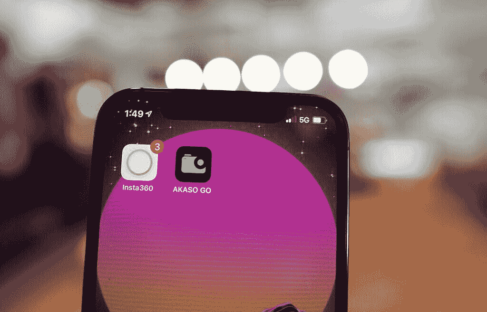
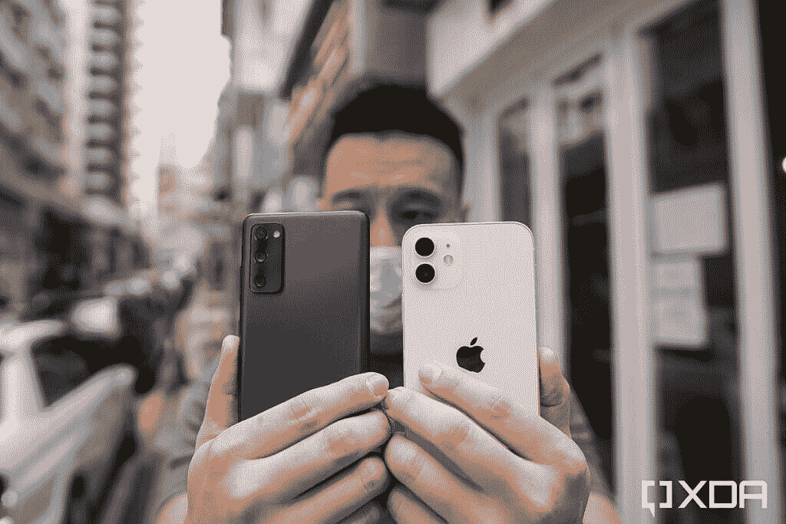
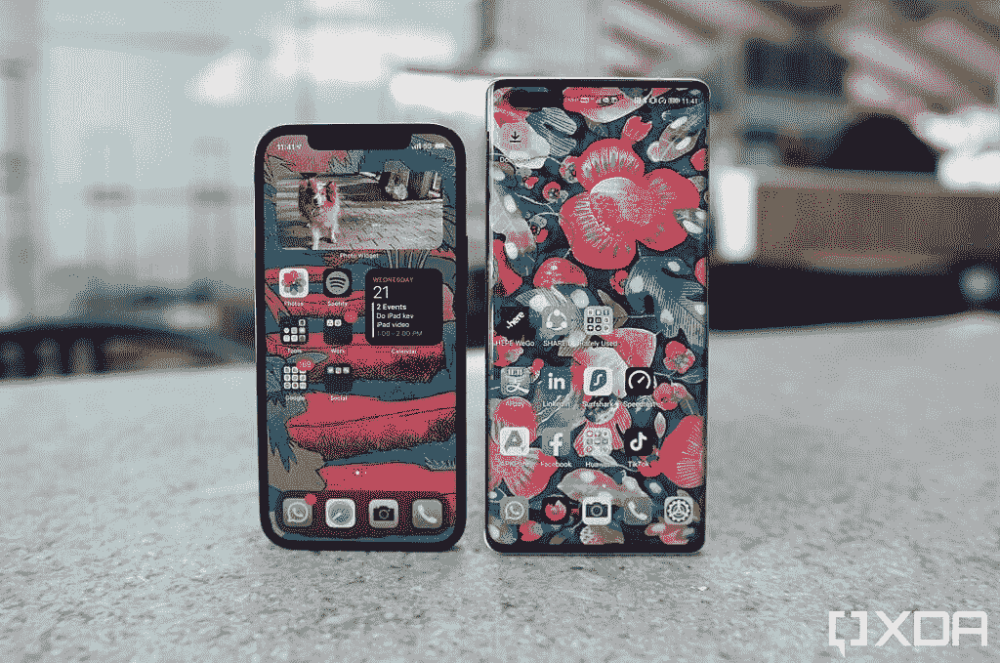

# 苹果 iPhone 12 评测:太好了，我都忍不住要换安卓了

> 原文：<https://www.xda-developers.com/apple-iphone-12-review/>

和我所有的 XDA 同事一样，我选择的手机操作系统是安卓。但与我大多数精通技术的 XDA 同事不同，我是很晚才接触到安卓的，因为我作为 iPhone 用户已经度过了智能手机时代的前七年。

我从第一天就购买了原版 iPhone，并且一路逐年升级，直到 2014 年的 iPhone 6 Plus。那是第一部加大尺寸的 iPhone，我总是想要一个更大的屏幕来观看内容，所以我选择了加大型号。我几乎立刻就后悔了——5.5 英寸的屏幕感觉很笨重，这要归功于它 16:9 的纵横比(当时的标准)。厚厚的边框，而且 iOS 不适合单手操作。

几天后，我看到了我朋友的 LG G3(T1)，它也提供了 5.5 英寸的屏幕，但在一个比 T2 小得多的外形中，我被吸引住了。那天晚上我四处看了看，第二天我把我的 iPhone 6 Plus 换成了 G3。我立刻被 Android 给我的自由惊呆了—*等等，*我可以把我的应用程序放在主屏幕的任何地方？图标可以改变美感或形状？——从那以后就一直是安卓用户。

在我看来，从 2014 年到 2017 年，确实有一段时间[最佳安卓智能手机](https://www.xda-developers.com/best-android-phones/)客观上比[最佳 iPhones 手机](https://pocketnow.com/apple-iphone-12)要好。LG 的 G 手机有更薄的边框和有用的超宽摄像头；三星的 Galaxy 设备提供了有机发光二极管屏幕，而 iPhones 还在 LCD 上；华为使用了更大的图像传感器，电池寿命延长了一倍。

苹果或许意识到竞争加剧，开始努力追赶。iPhone X 终于抛弃了十年之久的圆形 home 键设计；iPhone XS 延长了电池寿命，iPhone 11 增加了超宽摄像头。到去年，最好的 Android 手机不再客观地拥有更好的屏幕、电池寿命或相机性能。

今年的 [iPhone 12 系列](https://www.xda-developers.com/apple-iphone-12-series/)在过去几年的基础上做了如此多的改进——也解决了我对 iOS 的一些长期困扰——这是多年来我第一次想把我的 SIM 卡长期放在里面。

下面是我用了 iPhone 12 十天后得出这个结论的原因。

 <picture></picture> 

Apple iPhone 12

##### 苹果 iPhone 12

这是一款高度精致的智能手机，拥有可以说是目前最强大的处理器，配有改进的相机系统，拉近了谷歌和华为的领先优势。可以说是目前大多数人最好的 iPhone，也是第一部诱使我放弃安卓系统的 iPhone。

## 苹果 iPhone 12:规格

| 

规格

 | 

苹果 iPhone 12

 |
| --- | --- |
| **构建** | 

*   铝制中框
*   玻璃正面和背面
*   用于玻璃保护的“陶瓷护罩”

 |
| **尺寸&重量** | 

*   146.7 x 71.5 x 7.4 毫米
*   162 克(全球)
*   164 克(美国)

 |
| **显示** | 

*   6.1 英寸 Super Retina XDR 有机发光二极管显示屏
*   2，532 x 1，170 分辨率

 |
| **SoC** | 苹果 A14 仿生 SoC:

*   *   2 倍性能内核
    *   4 个能效内核

*   5 纳米工艺节点
*   四核 GPU
*   16 核神经引擎

 |
| **储物选项** |  |
| **电池&充电** | 

*   2，815 毫安时电池，符合认证列表
*   带 MagSafe 的 15W 无线充电
*   7.5W Qi 无线充电

 |
| **安全** | Face ID(原深感摄像头面部识别) |
| **后置摄像头** | 

*   **主要:** 12MP
*   **次要:** 12MP，超广角

 |
| **前置摄像头** | 12MP，f/2.2 |
| **端口** | 专有闪电端口 |
| **音频** | 支持的音频格式:AAC-LC、HE-AAC、HE-AAC v2、受保护的 AAC、MP3、线性 PCM、Apple Lossless、FLAC、Dolby Digital(AC-3)、Dolby Digital Plus(E-AC-3)、Dolby Atmos 和 Audible(格式 2、3、4、Audible Enhanced Audio、AAX 和 AAX+) |
| **连通性** | 

*   5G:低于 6GHz
*   超宽带
*   支持 2×2 MIMO 的 wi-Fi 6(802.11 ax)
*   蓝牙 5.0

 |
| **软件** | iOS 14 |
| **其他特征** | 

*   IP68
*   颜色:黑色、白色、红色、蓝色、绿色

 |

## 硬件:设计、外观和感觉

iPhone 12 延续了 iPhone X 的设计，但有足够的变化，让它感觉新鲜，并抓住人们的注意力:这款手机现在四面都是扁平的，铝栏杆故意像保险杠一样包裹着整个手机。不像最近的 Android 智能手机，抓住两侧通常包括触摸一些玻璃，你感觉这里全是金属。感觉更安全，更成熟。

与大多数安卓手机相比，iPhone 12 手感更成熟、更安全

iPhone 12 的 6.1 英寸 OLED 面板没有最多的像素或最高的刷新率，但它仍然是一个优质的面板，色彩鲜艳，亮度最高，与三星的最好产品相当。尽管“仅仅”60Hz 的刷新率，iOS 的巨大优化让动画看起来很流畅。当然，像[一加 8T](https://www.xda-developers.com/oneplus-8t-review/) 这样为速度而设计的 120Hz 面板看起来仍然更快，但差距并不像 120 和 60 的数字所暗示的那么大。冒着听起来像苹果粉丝的风险，iPhone 12 的 60Hz 面板感觉比，比如说， [LG Wing](https://www.xda-developers.com/lg-wing-preview/) 或 2019 款三星的 60Hz 面板更平滑。

面板顶部就是那个凹口，开始感觉很过时了。自从打孔切口设计在 Android 中变得无处不在以来，今年切口感觉特别侵入。是的，我知道苹果的 notch 提供真正的 3D 人脸扫描，大多数安卓手机都没有，但在这个戴口罩的时代，Face ID 一直是一个麻烦。我真的不喜欢在观看全屏媒体时凹槽对屏幕的侵蚀程度。如果有一个版本的 iPhone 12 带有指纹扫描仪和更小的凹槽，我会毫不犹豫地买下它。

据称，苹果今年在正面屏幕上注入了一些陶瓷，该公司声称这使得屏幕更加坚硬，不太可能破碎。这是否是真的仍有待讨论。一些独立机构进行了跌落测试并得出结论，iPhone 12 的屏幕更耐用，但 *Pocketnow* 的 [Jaime Rivera 指出](https://twitter.com/Jaime_Rivera/status/1319750400405237760?s=20)仅仅是在 iPhone 12 屏幕上再放一部手机就能刮伤面板。

我一直非常善于处理我的手机，所以我的单位仍然一尘不染。

12 的背面有一个不吸引指纹的哑光玻璃涂层，一个双摄像头模块，内置一对 12MP 传感器，覆盖宽焦距和超宽焦距。

## 硬件:内部

iPhone 12 系列都由苹果的 A14 Bionic 驱动，这是一款 5 纳米的 SoC，几乎在所有基准测试中都优于 7 纳米的骁龙 865+。不幸的是，我的华为 Mate 40 Pro 仍然在运行阻止大多数基准测试应用程序的预生产软件，所以我还没有能够测试华为的 5 纳米麒麟 9000 与苹果的硅。

iPhone 12 系列今年都支持 5G，美国机型的 5G 频段比其他任何手机都多，支持 mmWave 和全球所有 6 频段以下。(我单位是香港单位，所以不携带 mmWave 频段)。

我在香港一直能够连接到 5G，但好处很少:数据速度通常不会快于 4G LTE，如果连接到 5G 并执行游戏或拍摄视频等中等繁重的任务，iPhone 12 会很快升温。

 <picture></picture> 

The iPhone 12 connected to 5G.

连接到 5G 也会影响电池寿命，导致手机可以使用一天的大部分时间，但不是完全。我关了 5G，六天后就坚持用 4G。但是，正如我[在最近的一篇评论](https://www.xda-developers.com/iphone-12-5g/)中指出的，苹果支持 5G 仍然是一件好事，因为它应该刺激电信公司推动更好的 5G 性能。

## 软件:比以往更加宽松

我在 2014 年转向 Android 后坚持使用 Android 的一个主要原因是，我喜欢 Android 的无限可定制性，而 iOS 则感觉苛刻和受限制。苹果近年来对此进行了改进，iOS 14 终于带来了一些新的补充，缩小了差距。

对我来说，iOS 最大的改进是我们终于可以在主屏幕上放置小工具了。我知道，我知道，Android 用户嘲笑 iOS 花了 13 年时间才给我们这么基本的东西。但是俗话说，迟到总比不到好。

像许多职业人士一样，我使用智能手机来计划我的整个工作和个人生活，在我的 Android 设备上，我总是在主屏幕顶部放置一个议程小工具，这样我就可以随时看到我即将到来的约会、电话或截止日期。我喜欢把它放在主屏幕上，因为它会一直提醒我。那样的话，我就不能*不*看到它。

在 iOS 14 之前的 iPhones 上，我做不到这一点。我必须滑动到一个特定的页面才能看到我的小部件，只需要有意识地看到议程小部件就意味着它真的不会提醒我。更重要的是，仅仅凭借能够在 iPhone 主屏幕上放置各种小工具，就意味着最终有了某种形式的定制，而不仅仅是交换壁纸。我的装有 iOS 14 的 iPhone 主屏幕现在对我来说看起来有点独特，而不是像其他数亿部 iPhone 一样。当然，与 Android 相比，我在 iOS 14 上可以自定义主屏幕的程度仍然有限，但这是朝着正确方向迈出的一步。

(既然我们在这里，我们可以讨论一下谷歌的 Pixel launcher 似乎正在走向苹果式的严苛主屏幕这一事实吗？为什么我不能删除谷歌搜索栏或时钟小工具？这就像苹果和谷歌在 UI 理念上正在走向彼此。)

苹果的小工具在很大程度上和安卓的小工具一样——它是你主屏幕上一个应用程序的扩展或快捷方式。但在典型的苹果时尚中，它找到了几个聪明的方法来实现一个长期的想法。其中之一是“智能堆栈”，这是一个上下文感知的小部件，它会尝试向您显示与一天中的时间相关的小部件。例如，在早上，小工具可能会显示天气和交通信息。下午，它可能会显示我即将到来的下午约会。有时候，在 WhatsApp 上给我女朋友发消息只需点击一下就可以了。如果我戴着苹果手表，它正在检测一项运动，那么智能小工具可能会向我显示我的心率和健康统计数据。

当然，事实是，许多小工具在 iOS 上的设计比 Android 更好——包括谷歌自己的，正如 *The Verge 的* Chris Welch 所强调的。

然后是应用程序库，这是苹果最终实现的一个应用程序抽屉。它从一开始就是 Android 设备的支柱，按照典型的苹果风格，他们不得不尝试一些不同的东西。应用程序库允许您将应用程序移出主屏幕，并可以在最后一个活动页面的右侧访问。你也可以关闭主屏幕的整个页面，但是在你这么做之前，要注意:应用程序库很难使用。收藏是自动的，这意味着你不能定制每个文件夹中显示的内容，或者特定应用程序的位置，但谢天谢地，有一个列表视图，你可以按时间顺序查看所有应用程序。到目前为止，这是使用应用程序库最简单的方法，但坦白地说，这仍然是一个非常不必要的额外点击。

iOS 14 还允许我将第三方键盘或电子邮件应用设置为默认。iOS 13 引入的文件系统已经进一步完善，所以我现在可以管理我下载的文件了。

总的来说，iOS 比几年前自由多了。我现在对 iOS 唯一的主要不满是，它仍然迫使我的应用程序处于自上而下、从左到右的网格中。我希望能够将我的应用程序放在任何我想放的地方。

如果你沉浸在苹果的生态系统中，iOS 带来了 Android 无法比拟的无缝智能连接。能够在几秒钟内将文件从 iPhone 传输到 iPad 或 Mac，或者将 iPhone 用作 Apple TV 的遥控器，或者通过对着 Apple Watch 说话来回复所有通知，这真是太棒了。

## 相机:保持视频领先，缩小照片差距

苹果倾向于暖色调和完全不变的肤色，这使得 iPhone 照片具有不同于大多数安卓照片的独特外观。与三星、华为或 Pixel 拍摄的照片相比，iPhone 照片始终比较温暖，很少有数字锐化或处理的迹象。这对于白天的拍摄非常有用。但一旦太阳落山，香港霓虹闪烁的城市街道变得生机勃勃，我更喜欢三星图像处理的对比鲜明、色调冷峻、略带数字化的外观。

*iPhone 12 和三星 Galaxy Z Fold 2 的主摄像头拍摄的照片样本。*

对于人像拍摄，iPhone 12 保持了自然的景深，尽管 Pixel 5 似乎产生了更具美感的散景效果。

*上面一组是 iPhone 12 和 Pixel 5 拍摄的人像照片样本，下面一组是 iPhone 12 和三星 Galaxy Z Fold 2。*

iPhone 的超广角摄像头拥有最宽的视野，今年它支持夜间模式，这大大改善了弱光性能。在下面的夜间图像中，iPhone 12 的超宽比 Galaxy S20 FE 的超宽曝光更好，噪音也更少。不过，我还是更喜欢三星的超宽在夜间更酷的色调。

*iPhone 12 和 S20 FE 拍摄的超宽样本*

在一般的低夜图像中，iPhone 12 自动使用夜间模式，结果是令人满意的照片，比 iPhone X 和 XS 拍摄的平庸夜间照片有很大改善。事实上，iPhone 12 的夜拍缩小了谷歌像素 5 和 T2 华为 Mate 40 Pro 的差距。几年前，如果场景黑暗，谷歌或华为的旗舰产品会比 iPhone 好得多。

尤其是自拍，iPhone 拍出了令人不安的原始照片，向我们展示了真实生活中的我们，瑕疵等等。谷歌 Pixel 5 也做了类似的自然工作，但它在 Android 中是异常的。几乎所有其他安卓品牌，从三星到华为，小米到一加，都使用某种形式的美容滤镜来减少皱纹、瑕疵和疤痕。

我总是开玩笑说，长得好看的人更喜欢 iPhone 自拍，而像我这样皮肤不好的人更喜欢用机器人拍摄的照片。这在这里是对的。就拿下面这组自拍来说吧:iPhone 12 自拍里我的皮肤看起来有多差(真实)我有点不舒服。如果你放大足够近，你可以看到我所有的痘疤和毛孔。华为 Mate 40 Pro 做了足够的修饰，更好地缓解了我的自负。

尽管如此，苹果是否决定采用更自然、未经编辑的 vibe 来提高照片质量，这是主观的。客观来说，在焦距多功能性方面，iPhone 12 远远落后于 Android 竞争对手。没有长焦镜头意味着 iPhone 12 的每个变焦镜头都是数字的，任何超过 2 倍的镜头你都会开始看到细节的明显损失。但事情是这样的，即使是 12 Pro，有一个专用的长焦镜头，也输给了华为最近的潜望镜镜头，所以苹果只是落后于这里，句号。

*iPhone 12、iPhone 12 Pro 和华为 Mate 40 Pro 拍摄的 5X 变焦镜头。*

视频性能是 iPhone 12 非常有说服力的优势。总的来说，iPhone 12 的画面稳定性更好，在晚上，当我每走一步，安卓手机的视频都会有轻微的抖动时，iPhone 12 仍然能够保持画面相对流畅。

此外，还可以使用杜比视界(Dolby Vision)进行拍摄，这是一种 HDR 标准，可以动态调整视频元数据。因为苹果就是苹果，用 iPhone 12 拍摄的杜比视界并不兼容每一个屏幕。在很大程度上，只有苹果自己的设备才能正确显示 iPhone 12 杜比视界视频。但鉴于 iPhone 的无处不在，我确信大多数软件应用程序和屏幕将在适当的时候适应并支持苹果的格式。下面的视频收集了用 iPhone 12 拍摄的镜头，包括一些与华为 Mate 40 Pro、谷歌 Pixel 5 和 Galaxy S20 FE 对比的并排样本。

## 总性能

正如我前面提到的，如果我连接到 5G，12 的电池寿命和散热都不是很好，但一旦我换回 4G，电池寿命很容易延长到一天，手机也没有那么热。在其他地方，性能一直顺利，没有问题。

iPhone 12 的立体声扬声器声音很大，所以我可以用它来进行一些视频和语音通话，而不需要戴上耳机。我不太玩游戏，但我能感受到 A14 Bionic 的处理能力，因为我为我的 Instagram 故事编辑短视频剪辑，而运行 LumaFusion 的 iPhone 12 一直以极快的速度处理 4K 视频。

[2021 年，iPhone 12 将引领安卓手机的四大趋势](https://www.xda-developers.com/apple-iphone-12-set-trends-2021/)

给手机充电时有时无。大肆宣传的新的 [MagSafe 系统](https://pocketnow.com/best-magsafe-accessories)非常有用——我喜欢拿起电话回复一些电子邮件和短信，而不会失去电量。但与我习惯的 Oppo、华为、小米和一加相比，iPhone 12 的整体充电速度较慢。

我也希望 iPhone 12 能使用 USB-C，因为它允许我为所有设备携带一根电缆。

## iPhone 12 与其他最近发布的安卓手机相比如何

我很幸运能够测试几乎所有的新智能手机，所以在过去几周，我从三星到华为，谷歌到一加的各种手机中跳了出来。这里有一些关于 iPhone 12 与所有其他手机相比的快速提示。

**iPhone 12 vs 三星 Galaxy Note 20 Ultra:**Note 20 Ultra 是一款更大的手机，在所有重要的方面都有更好的屏幕——更高的刷新率，对自拍相机的干扰更小，更大的尺寸看起来更具沉浸感。Galaxy Note 20 Ultra 也有一个更好的变焦系统和 S-Pen，这不是一个必须使用的工具，但却是一个很好的奖励。

但是 iPhone 12 Pro 有一个更强大的处理器，更容易握持和全天使用，而且便宜很多。

**iPhone 12 vs 三星 Galaxy S20 FE:** 我写了[一整篇文章](https://www.xda-developers.com/apple-iphone-12-vs-samsung-galaxy-s20-fe/)专门做这个对比，还挺接近的。S20 FE 在屏幕和相机多功能性方面胜出，但 iPhone 12 手感更好，视频性能更好，芯片更强大。

 <picture></picture> 

The Galaxy S20 FE and the iPhone 12

**iPhone 12 vs 一加 8T:** 一加 8T 的动画速度明显更快。像滚动、打开/关闭应用程序这样的事情在 8T 上似乎都在以涡轮速度移动。这一部分只是诡计——一加制作动画的速度非常快，以唤起用户界面流畅的感觉，但这很有效。8T 和 iPhone 12 一样，也没有专用的变焦镜头，但它仍然可以产生更清晰的变焦，因为它从更大、像素密度更高的 48MP 传感器中提取数据。

但 iPhone 12 拥有更出色的视频性能、更好的构建质量和更好的处理器。

**iPhone 12 vs 谷歌 Pixel 5:** 在我看来，Pixel 5 产生了更具美感的散景拍摄和色彩科学。我也喜欢手机的正面，有统一的边框和一个小小的打孔切口。但这是不可避免的——苹果 A14 仿生踩遍了骁龙 765G。

**iPhone 12 vs 华为 Mate 40 Pro:** 华为最新的是一款巨大的曲线手机，与 iPhone 12 截然相反。它有一个摄像头，可以说在弱光下更好，毫无疑问在变焦方面更好。它一次充电的续航时间也比 iPhone 12 长得多。

但 iPhone 12 的视频性能明显更好，这可能是最大的胜利:iPhone 12 可以毫无问题地运行 YouTube 或 Google Docs 等关键的谷歌应用程序。

 <picture></picture> 

The iPhone 12 and the Huawei Mate 40 Pro.

## 结论:iPhone 12 解决了我对过去的 iPhone 的许多抱怨

就像我开头说的，从 2014 年开始，我就是一个快乐的安卓用户。我喜欢能够完全按照我喜欢的方式定制我的 Android，我喜欢多样化的外形和古怪的创新。比起新的 iPhone，我仍然对古怪和前卫的 Android 设备感到兴奋，比如具有旋转设计的 [LG Wing](https://www.xda-developers.com/lg-wing-preview/) 、具有可弯曲屏幕的 [Royole FlexPai 2](https://www.xda-developers.com/royole-flexpai-2-preview/) 或具有万向摄像头系统的 [Vivo X50](https://www.xda-developers.com/vivo-x50-pro-camera-review/) 。

iPhone 12 太棒了，我很想换成安卓

然而，我也不能否认 iPhone 比 LG，Royole 和 Vivo lack 的这些同样古怪的手机更有光泽。因为我很久以前就被 Final Cut Pro 吸引了，所以我仍然使用 Mac 作为我的主要电脑。iPhone 和苹果电脑非常匹配。通过隔空投送传输文件的能力让我希望在 Android 上也能有类似的东西；值得称赞的是，三星和华为已经建立了类似的东西，但它们的工作没有那么无缝。

过去真正困扰我的关于 iOS 的所有事情都在某种程度上得到了修复——主屏幕上的小工具，一个适当的文件系统 iPhone 过时的设计大约在 2015 年至 2017 年，或者低于标准，有限的相机系统大约在 2016 年至 2019 年得到了修复。谷歌对 iPhone 的计算摄影领先优势可以忽略不计，苹果也开始玩华为的游戏，使用更大的图像传感器(尽管这是为 iPhone 12 Pro Max 保留的)。

换句话说，过去 Android 明显胜出的领域已经明显缩小。我审查 iPhones 已经有几年了，通常我一完成审查就会把我的 SIM 卡放回安卓系统。但是今年，我很想把 SIM 卡留在那里一段时间。因为 iPhone 12 就是那么好。

最后一点:如果你正在考虑 iPhone 12 的其他版本，我建议不要买 12 Pro。Pro 在 12 的基础上没有带来足够的改进来证明额外的 200 美元是合理的。相反，你可能会考虑 iPhone 12 Pro Max 的更好的相机系统，或者 iPhone 12 Mini 的小巧手机。但 iPhone 12 可能是大多数人的正确选择——800 美元的价格感觉刚刚好。

 <picture></picture> 

Apple iPhone 12

##### 苹果 iPhone 12

这是一款高度精致的智能手机，拥有可以说是目前最强大的处理器，配有改进的相机系统，拉近了谷歌和华为的领先优势。可以说是目前大多数人最好的 iPhone，也是第一部诱使我放弃安卓系统的 iPhone。