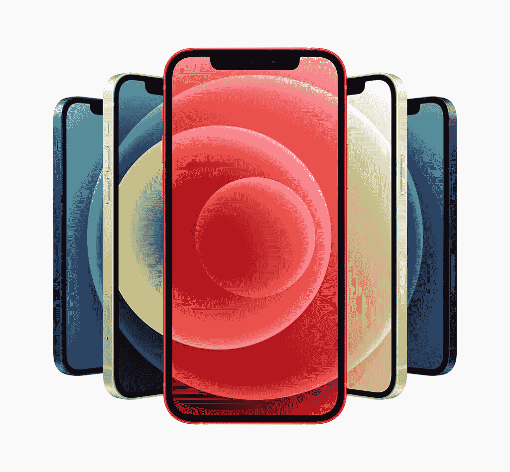

# 关于 iPhone 12，12 Pro Max，12 Pro，12 Mini 你需要知道的

> 原文：<https://www.xda-developers.com/apple-iphone-12-series/>

在 XDA，我们通常拒绝报道苹果和 iPhone 的发布会。但这家市值 2 万亿美元的公司将会继续存在，不管我们喜不喜欢，iPhone 决定了整个智能手机行业的趋势。每一款安卓旗舰产品，甚至非旗舰产品，都会与 iPhone 进行对比。随着苹果全力以赴推出 5G 技术，我们正处于智能手机历史上的一个关键点，苹果重新定义了整个行业的客户期望。

在今天的[发布会上，苹果公司宣布了四款新的 iPhones。认识一下新的](http://pocketnow.com/apple-event) [iPhone 12](https://www.xda-developers.com/apple-iphone-12-review/) ，iPhone 12 Mini，iPhone 12 Pro，和 iPhone 12 Pro Max。这是你需要知道的一切。

## 苹果 iPhone 12 系列:规格和对比

| 

规范

 | 

苹果 iPhone 12 Mini

 | 

苹果 iPhone 12

 | 

苹果 iPhone 12 Pro

 | 

苹果 iPhone 12 Pro Max

 |
| --- | --- | --- | --- | --- |
| **构建** | 

*   铝制中框
*   玻璃正面和背面
*   用于玻璃保护的“陶瓷护罩”

 | 

*   铝制中框
*   玻璃正面和背面
*   用于玻璃保护的“陶瓷护罩”

 | 

*   不锈钢中框
*   玻璃正面和背面
*   用于玻璃保护的“陶瓷护罩”

 | 

*   不锈钢中框
*   玻璃正面和背面
*   用于玻璃保护的“陶瓷护罩”

 |
| **尺寸&重量** | 

*   7.4 x 131.5 x 64.2mm 毫米
*   133 克(全球)
*   135 克(美国)

 | 

*   7.4 x 146.7 x 71.5mm 毫米
*   162 克(全球)
*   164 克(美国)

 | 

*   7.4 x 146.7 x 71.5mm 毫米
*   187 克(全球)
*   189 克(美国)

 | 

*   7.4 x 160.8 x 78.1mm 毫米
*   226 克(全球)
*   228 克(美国)

 |
| **显示** | 

*   5.4 英寸超级视网膜 XDR 有机发光二极管显示屏
*   2，340 x 1，080 分辨率，476 PPI

 | 

*   6.1 英寸超级视网膜 XDR 有机发光二极管显示屏
*   2，532 x 1，170 分辨率，460 PPI

 | 

*   6.1 英寸超级视网膜 XDR 有机发光二极管显示屏
*   2，532 x 1，170 分辨率，460 PPI

 | 

*   6.7 英寸超级视网膜 XDR 有机发光二极管显示屏
*   2，778 x 1，284 分辨率，458 PPI

 |
| **SoC** | 

*   苹果 A14 仿生 SoC
    *   2 倍性能内核
    *   4 个能效内核
*   5 纳米工艺节点
*   四核 GPU
*   16 核神经引擎

 | 

*   苹果 A14 仿生 SoC
    *   2 倍性能内核
    *   4 个能效内核
*   5 纳米工艺节点
*   四核 GPU
*   16 核神经引擎

 | 

*   苹果 A14 仿生 SoC
    *   2 倍性能内核
    *   4 个能效内核
*   5 纳米工艺节点
*   四核 GPU
*   16 核神经引擎

 | 

*   苹果 A14 仿生 SoC
    *   2 倍性能内核
    *   4 个能效内核
*   5 纳米工艺节点
*   四核 GPU
*   16 核神经引擎

 |
| **闸板** | 4GB | 4GB | 6GB | 6GB |
| **存储选项** |  |  |  |  |
| **电池&充电** | 

*   2，227 毫安时电池，符合认证列表
*   带 MagSafe 的 15W 无线充电
*   7.5W Qi 无线充电

 | 

*   2，815 毫安时电池，符合认证列表
*   带 MagSafe 的 15W 无线充电
*   7.5W Qi 无线充电

 |  |  |
| **安全** | Face ID(原深感摄像头面部识别) | Face ID(原深感摄像头面部识别) | Face ID(原深感摄像头面部识别) | Face ID(原深感摄像头面部识别) |
| **后置摄像头** |  |  |  |  |
| **前置摄像头** | 12MP，f/2.2 | 12MP，f/2.2 | 12MP，f/2.2 | 12MP，f/2.2 |
| **端口** | 专有闪电端口 | 专有闪电端口 | 专有闪电端口 | 专有闪电端口 |
| **音频** | 支持的音频格式:AAC-LC、HE-AAC、HE-AAC v2、受保护的 AAC、MP3、线性 PCM、Apple Lossless、FLAC、Dolby Digital(AC-3)、Dolby Digital Plus(E-AC-3)、Dolby Atmos 和 Audible(格式 2、3、4、Audible Enhanced Audio、AAX 和 AAX+) | 支持的音频格式:AAC-LC、HE-AAC、HE-AAC v2、受保护的 AAC、MP3、线性 PCM、Apple Lossless、FLAC、Dolby Digital(AC-3)、Dolby Digital Plus(E-AC-3)、Dolby Atmos 和 Audible(格式 2、3、4、Audible Enhanced Audio、AAX 和 AAX+) | 支持的音频格式:AAC-LC、HE-AAC、HE-AAC v2、受保护的 AAC、MP3、线性 PCM、Apple Lossless、FLAC、Dolby Digital(AC-3)、Dolby Digital Plus(E-AC-3)、Dolby Atmos 和 Audible(格式 2、3、4、Audible Enhanced Audio、AAX 和 AAX+) | 支持的音频格式:AAC-LC、HE-AAC、HE-AAC v2、受保护的 AAC、MP3、线性 PCM、Apple Lossless、FLAC、Dolby Digital(AC-3)、Dolby Digital Plus(E-AC-3)、Dolby Atmos 和 Audible(格式 2、3、4、Audible Enhanced Audio、AAX 和 AAX+) |
| **连通性** |  |  |  |  |
| **软件** | iOS 14 | iOS 14 | iOS 14 | iOS 14 |
| **其他特性** |  |  |  |  |
| **定价** | 起价 699 美元 | 起价 799 美元 | 起价 999 美元 | 起价 1099 美元 |

## 

设计

## 新的 iPhone 12 系列采用了统一的设计，因此没有太多差异。今年，我们看到了去年设计上的一个小变化。背板主要采用了令人想起 iPhone 11 的设计，但现在两侧是平的，就像 iPhone 4 上的一样。

在正面，你可以看到又一年熟悉的外观。Face ID 传感器有一个很宽的缺口——虽然尺寸可能会根据屏幕大小的比例稍微调整一下，但整体外观仍然保持一致。有一个缺口，无法逃避。

这是四部手机:

这是四部手机:

*从左到右:iPhone 12 Mini、iPhone 12、iPhone 12 Pro、iPhone 12 Pro Max*

*从左到右:iPhone 12 Mini，iPhone 12，iPhone 12 Pro，iPhone 12 Pro Max*

显示

## 苹果经常上台宣布 iPhone 有史以来最好的显示屏，今年也没有什么不同。苹果 2020 年的 iPhone 12 系列配备了 458 ppi 像素密度的有机发光二极管显示屏，并采用了苹果所谓的超级视网膜 XDR 技术。XDR 代表极端动态范围，苹果公司声称可以提供改善的显示亮度和色彩还原。苹果声称超级视网膜 XDR 显示器可以获得高达 1200 尼特的亮度。与前代 iPhones 相比，显示屏的对比度也更好。

虽然 iPhone 11 配有 LCD 显示屏，但今年所有的 iPhone 都配有有机发光二极管显示屏，包括 iPhone 12 和 iPhone 12 Mini。尺寸是最大的差异，iPhone 12 Mini 的对角线长度为 5.4 英寸，iPhone 12 和 iPhone 12 Pro 的对角线长度为 6.1 英寸，而 iPhone 12 Pro max 的对角线长度为 6.7 英寸，这是 iPhone 迄今为止最大的对角线长度。

iPhone 12 系列确实错过了[高刷新率](https://www.xda-developers.com/smartphone-display-refresh-rates-explained/)技术，所以在这些手机上找不到 90Hz 或 120Hz 的刷新率。然而，苹果确实通过“陶瓷盾”技术专注于耐用性，苹果声称，这种技术使玻璃在意外跌落时的存活率提高了四倍。这应该意味着更少的屏幕破裂。

iPhone 12 系列确实错过了[高刷新率](https://www.xda-developers.com/smartphone-display-refresh-rates-explained/)技术，所以在这些手机上找不到 90Hz 或 120Hz 刷新率。然而，苹果确实通过“陶瓷盾”技术专注于耐用性，苹果声称，这种技术使玻璃在意外跌落时的存活率提高了四倍。这应该意味着更少的屏幕破裂。

社会学

## 当然，如果没有新的 SoC，它就不是 iPhone 了。今年，我们得到了苹果 A14 仿生 SoC 的款待。苹果实际上在今年早些时候的 iPad 发布会上预演了它，所以我们已经有了一个公平的想法。苹果讨厌在发布会上详细说明，相反，更喜欢用上一代产品的对比数据。A14 Bionic 基于 5 纳米工艺节点构建，采用 2+4 内核设置，包括两个性能内核和四个效率内核。我们还在 SoC 上获得了一个四核 GPU 和一个 16 核神经引擎。

苹果也没有分享 RAM 和存储等细节的确切规格，但我们设法从各种认证清单中提取了它们。据宣布，存储选项将从 Mini 的 64GB 开始，一直到 Pro Max 的 512GB。

苹果也没有分享 RAM 和存储等细节的确切规格，但我们设法从各种认证清单中提取了它们。据宣布，存储选项将从 Mini 的 64GB 开始，一直到 Pro Max 的 512GB。

电池和充电

## 由于手机大小不同，电池自然也不同。我们正在等待准确的毫安值的细节。

然而，新款 iPhones 的新之处在于，尽管定价很高，但盒子里不再有充电块(也没有耳机)。这个决定被宣传为该公司减少电子垃圾承诺的一部分，我们也有点同意。

苹果将出售大量这种 iPhones，将充电器从主包装中分离出来将降低苹果的运输成本，对整体环境有利。苹果捆绑的充电器通常是 5W 底座充电器，在这一点上，每个人都有一个至少等于或优于这一个的充电砖。当然，这也让苹果可以将充电器单独出售给确实需要它的消费者。不过，你可以在盒子里找到一根连接 Lightning 的 USB Type-C 电缆。

随着新 MagSafe 功能的引入，无线充电也得到升级，允许充电器和其他 [MagSafe 配件](https://pocketnow.com/best-magsafe-accessories)卡在充电线圈上，可进行高达 15W 的无线充电。在某种程度上，这让人想起了 MacBook 系列首次推出的 MagSafe 充电器，它使用磁铁将电缆固定到位。苹果采用了相同的概念——并使用了相同的名称——但考虑到无线充电，这一功能解决了无线充电的最大问题之一:放置。希望这将结束早上醒来发现电池没电的情况，这一切都是因为你的手机没有正确放在无线充电器上。

随着新 MagSafe 功能的引入，无线充电也得到升级，允许充电器和其他 [MagSafe 配件](https://pocketnow.com/best-magsafe-accessories)卡在充电线圈上，实现高达 15W 的无线充电。在某种程度上，这让人想起了 MacBook 系列首次推出的 MagSafe 充电器，它使用磁铁将电缆固定到位。苹果采用了相同的概念——并使用了相同的名称——但考虑到无线充电，这一功能解决了无线充电的最大问题之一:放置。希望这将结束早上醒来发现电池没电的情况，这一切都是因为你的手机没有正确放在无线充电器上。

照相机

## 苹果 iPhone 旗舰产品被广泛誉为最佳摄影相机之一，也是最佳摄像相机。虽然三星、华为、谷歌和一加在许多领域都很接近，但 iPhone 12 摄像头的许多附加功能可以帮助树立摄影和摄像的基准。

iPhone 12 和 iPhone 12 Mini 配有两个后置摄像头:一个 12MP 主摄像头，f/1.6 光圈，26mm 焦距，一个 12MP 超宽摄像头，f/2.4 光圈，120°视野。苹果声称，新的 7 元素镜头在弱光性能方面提高了 27%，它还对夜间模式进行了改进，现在正在所有相机中提供这些改进，包括自拍相机。

同时，iPhone 12 Pro 和 12 Pro Max 保留了相同的两个主摄像头，并增加了一个 12MP 的长焦摄像头，焦距为 52mm。这使得从主相机到远摄相机的光学变焦能力高达 2.5 倍。iPad Pro 2020 也有相同的激光雷达传感器，可以对照片、视频和 AR 功能进行更好的深度分析。

所有四款 iPhone 12s 还将支持 HDR 视频录制，将更多专业级功能放入您的口袋。您将能够捕捉、编辑和观看杜比视界视频。苹果还为 iPhone 12 Pro 和 iPhone 12 Pro Max 设计了“Apple ProRaw ”,它将提供深度融合和 SmartHDR 等计算摄影优势，以及捕捉和编辑原始照片的能力。这应该会产生迄今为止最好的 iPhone 照片。

与前几年 Pro Max 只是 Pro 的更大版本不同，今年 iPhone 12 Pro Max 的主摄像头也有所变化。该传感器的像素尺寸为 1.7μm，比普通传感器大 47%，在弱光条件下的性能提高了 87%。还有一个新的夜间模式延时功能，针对天文摄影爱好者。

与前几年 Pro Max 只是 Pro 的更大版本不同，今年 iPhone 12 Pro Max 的主摄像头也有所变化。该传感器的像素尺寸为 1.7μm，比原来大 47%，在弱光条件下的性能提高了 87%。还有一个新的夜间模式延时功能，针对天文摄影爱好者。

5G

## Android 智能手机已经登上 5G 宣传列车好几年了，该技术甚至已经扩散到更低的价格水平。然而，苹果采用 5G 将极大地改变围绕该技术的营销和广告，我们可以看到由于这一宣布，5G 受到了更大的关注。

Android 智能手机已经登上 5G 宣传列车好几年了，该技术甚至已经扩散到更低的价格水平。然而，苹果采用 5G 将极大地改变围绕该技术的营销和广告，我们可以看到由于这一宣布，5G 受到了更大的关注。

**[5G 权威指南:关于 5G 你需要知道的一切](https://www.xda-developers.com/5g/)**

5G 是 iPhone 12 系列的标准功能，但这是针对 6GHz 以下的。只有美国有支持毫米波的变体，这是有意义的。世界上大部分地区仍处于这项技术的萌芽阶段，对于大多数消费者来说，在他们的家乡体验这项技术还需要一段时间。所以就目前而言，低于 6GHz 的 5G 应该可以满足大多数人的需求。

新 iPhone 上的 iOS 14 带有智能数据模式，在 5G 不可用时切换到 4G。目前还不知道 eSIM 是否会支持 5G 或只是物理 SIM 卡插槽，但当我们有更多信息时，我们会更新这一点。

新 iPhone 上的 iOS 14 带有智能数据模式，在 5G 不可用时切换到 4G。目前还不知道 eSIM 是否会支持 5G 或只是物理 SIM 卡插槽，但当我们有更多信息时，我们会更新这一点。

软件

## 苹果产品采用了苹果著名的、专有的、围墙花园式的软件开发方法。而 iPhone 12 系列也不例外。你可以在新的智能手机上获得开箱即用的 [iOS 14](https://www.xda-developers.com/google-should-adopt-these-ios-14-features-for-the-next-android-os/) 。

苹果产品采用了苹果著名的、专有的、围墙花园式的软件开发方法。而 iPhone 12 系列也不例外。你可以在新的智能手机上获得开箱即用的 iOS 14。

总结:所有 iPhone 12 型号之间的主要区别

## 这一次，iPhone 12 Pro 和 12 Pro Max 之间有相当大的差异，而 iPhone 12 Mini 的规格与 iPhone 12 相同，因此性价比极高。看四款机型最好的方法是，iPhone 12 Mini 和 iPhone 12 组成一个小家，iPhone 12 Pro 和 iPhone 12 Pro Max 组成另一个小家。这样来看，iPhone 12 是 iPhone 12 家族的长兄，而 iPhone 12 Pro Max 是 iPhone 12 Pro 家族的长兄。

考虑到这一点，iPhone 12 Mini 和 iPhone 12 之间几乎没有什么区别，除了前者的屏幕尺寸更小，并将于下个月推出。除了各自的电池差异和屏幕尺寸之外，它们共享相同的核心功能集，包括上面提到的大多数功能。

iPhone 12 Pro 系列增加了一个长焦相机和一个激光雷达传感器，改善了相机体验，在 iPhone 12 Pro Max 的情况下，一个更大的传感器可以让 87%的光线进入。如果你一直在等待有史以来最好的 iPhone 相机体验，iPhone 12 Pro Max 可能是值得购买的产品！

iPhone 12 Pro 系列增加了一个长焦相机和一个激光雷达传感器，改善了相机体验，在 iPhone 12 Pro Max 的情况下，一个更大的传感器可以让 87%的光线进入。如果你一直在等待有史以来最好的 iPhone 相机体验，iPhone 12 Pro Max 可能是值得购买的产品！

* * *

苹果 iPhone 12 系列:定价和可用性

## 新的 iPhone 12 系列将在这些地区以下列价格出售:

没有。

| 

电话

 | 

美利坚合众国

 | 

欧洲

 | 

英国

 | 

印度

 | 

1.

 |
| --- | --- | --- | --- | --- | --- |
| **苹果 iPhone 12 Mini** | **苹果 iPhone 12 Mini** |  |  |  |  |
| 64GB | $699 | €778.85 | 699 | ₹69,900 | ₹69,900 |
| 128GB | $799 | €827.55 | 749 | ₹74,900 | ₹74,900 |
| 256GB | $899 | €944.55 | 849 | ₹84,900 | ₹84,900 |
|  |  |  |  |  | 2. |
| **苹果 iPhone 12** | **苹果 iPhone 12** |  |  |  |  |
| 64GB | $799 | €876.30 | 799 | ₹79,900 | ₹79,900 |
| 128GB | $899 | €925.05 | 849 | ₹84,900 | ₹84,900 |
| 256GB | $999 | €1,042.05 | 949 | ₹94,900 | ₹94,900 |
|  |  |  |  |  | 3. |
| **苹果 iPhone 12 Pro** | **苹果 iPhone 12 Pro** |  |  |  |  |
| 128GB | $999 | €1,120 | 紧急服务电话 | ₹1,19,900 | ₹1,19,900 |
| 256GB | $1,099 | €1,237 | 1,099 | ₹1,29,900 | ₹1,29,900 |
| 512GB | $1,299 | €1,461.20 | 1,299 | ₹1,49,900 | ₹1,49,900 |
|  |  |  |  |  | 4. |
| **苹果 iPhone 12 Pro Max** | **苹果 iPhone 12 Pro Max** |  |  |  |  |
| 128GB | $1,099 | €1,217.50 | 1,099 | ₹1,29,900 | ₹1,29,900 |
| 256GB | $1,199 | €1,334.45 | 1,199 | ₹1,39,900 | ₹1,39,900 |
| 512GB | $1,399 | €1,558.65 | 1,399 | ₹1,59,900 | iPhone 12 和 iPhone 12 Pro 将于 10 月 16 日在美国接受预订，并将于 10 月 23 日上市，而 iPhone 12 Mini 和 iPhone 12 Pro Max 将于 11 月 6 日接受预订，并于 11 月 13 日上市。 |

**你对苹果 iPhone 12、iPhone 12 Mini、iPhone 12 Pro、iPhone 12 Pro Max 有什么想法？请在下面的评论中告诉我们！**

* * *

**你对苹果 iPhone 12、iPhone 12 Mini、iPhone 12 Pro、iPhone 12 Pro Max 有什么想法？请在下面的评论中告诉我们！**