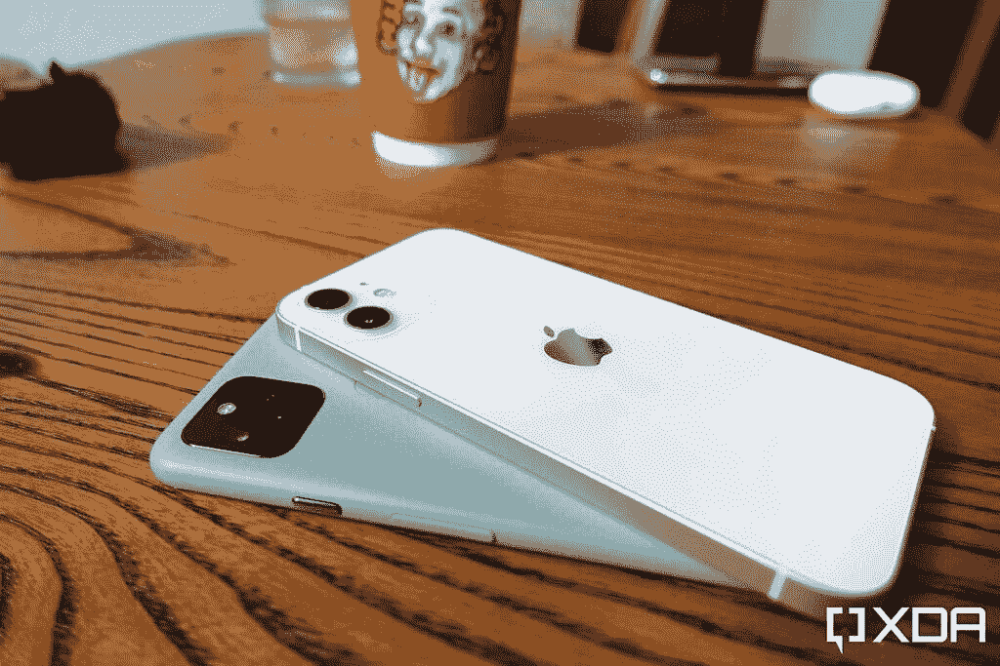
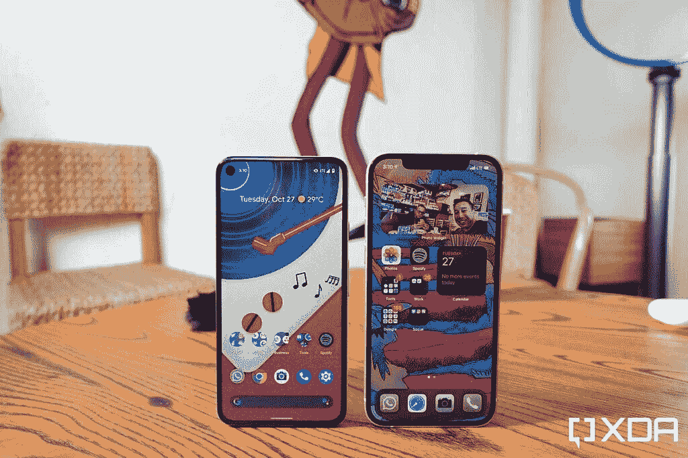
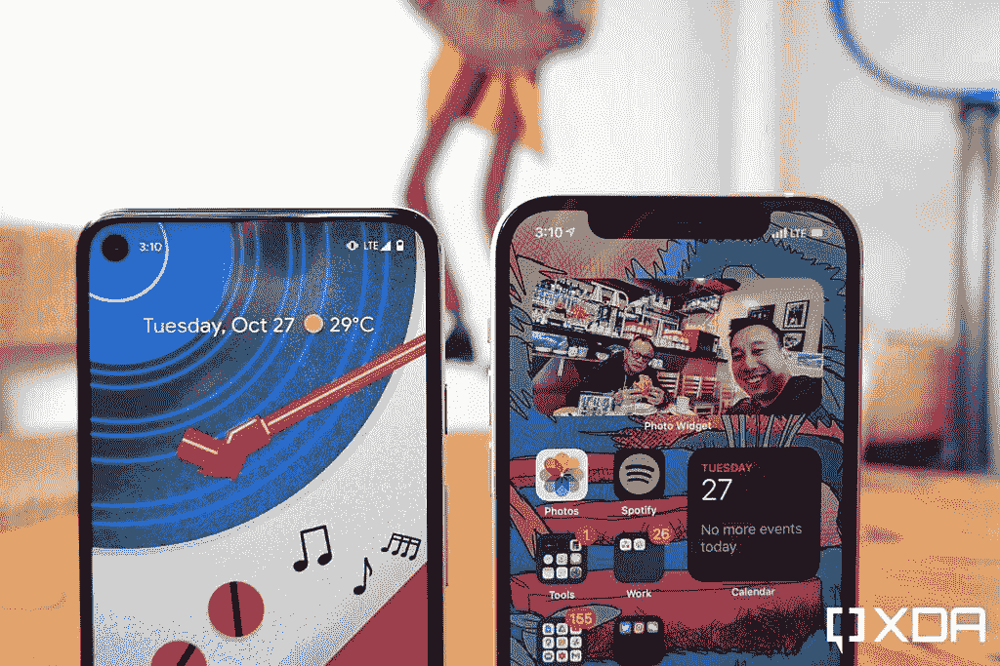
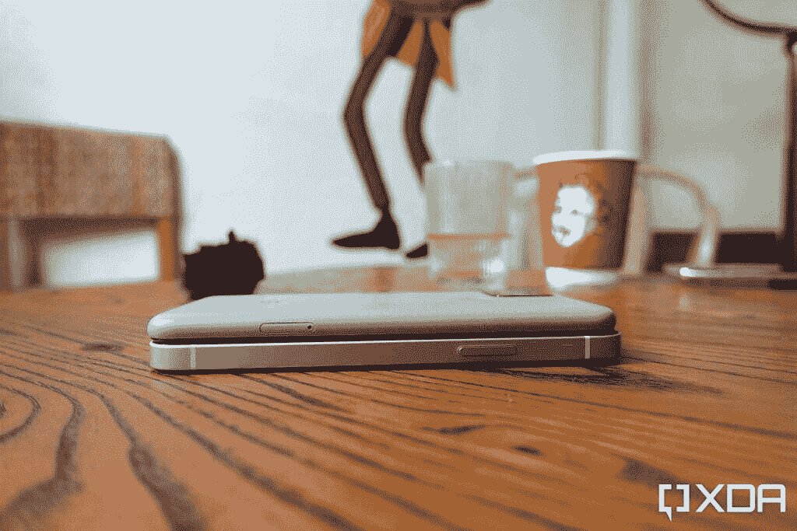
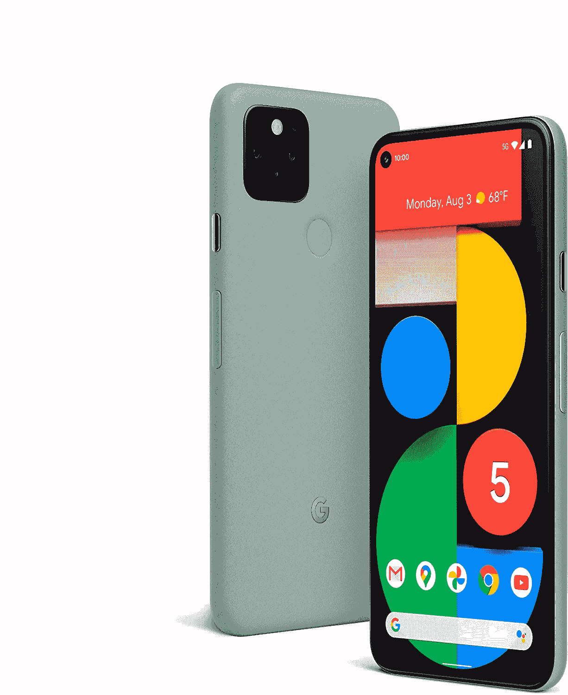

# 苹果 iPhone 12 vs 谷歌 Pixel 5:哪款手机适合你？

> 原文：<https://www.xda-developers.com/apple-iphone-12-vs-google-pixel-5-comparison/>

上周，我们在[苹果 iPhone 12](https://www.xda-developers.com/apple-iphone-12-series/) 和[谷歌 Pixel 5](https://www.xda-developers.com/google-pixel-5-review/) 之间进行了一场[相机对决](https://www.xda-developers.com/apple-iphone-12-vs-google-pixel-5-camera-shootout-comparison/)。今天，是时候对这两个科技超级大国的两款最新手机进行全面比较了。

## 苹果 iPhone 12 vs 谷歌 Pixel 5:规格对比

| 

规范

 | 

苹果 iPhone 12

 | 

谷歌像素 5

 |
| --- | --- | --- |
| **构建** | 

*   铝制中框
*   玻璃正面和背面
*   用于玻璃保护的“陶瓷护罩”

 | 

*   再生铝一体式车身
*   玻璃前部
*   大猩猩玻璃 6

 |
| **尺寸&重量** | 

*   146.7 x 71.5 x 7.4mm 毫米
*   162 克(全球)/ 164 克(美国)

 | 

*   144.7 x 70.4 x 8 毫米
*   151 克

 |
| **显示** | 

*   6.1 英寸超级视网膜 XDR 有机发光二极管显示屏
*   2，532 x 1，170 分辨率，460 PPI
*   60Hz 刷新率

 | 

*   6 英寸有机发光二极管显示器
*   2，340 x 1，080 分辨率，432 PPI
*   90Hz 刷新率

 |
| **SoC** |  |  |
| **存储选项** |  |  |
| **电池&充电** | 

*   2，815 毫安时电池，符合认证列表
*   带 MagSafe 的 15W 无线充电
*   7.5W Qi 无线充电

 | 

*   4，080 毫安时电池
*   12W Qi 无线充电
*   18W 有线充电

 |
| **安全** | Face ID(原深感摄像头面部识别) | 后置指纹传感器 |
| **后置摄像头** | 

*   **主要:** 12MP
*   **次要:** 12MP，超广角

 | 

*   **主:**1220 万像素索尼 IMX363
*   **次要:** 16MP，超广角

 |
| **前置摄像头** | 12MP，f/2.2 | 800 万像素 f/2.0 |
| **端口** | 专有闪电端口 | USB-C |
| **连通性** | 

*   5G:低于 6GHz
*   超宽带
*   支持 2x2 MIMO 的 wi-Fi 6(802.11 ax)
*   蓝牙 5.0

 | 

*   5G:低于 6GHz
*   wi-Fi 5(802.11 AC)
*   蓝牙 5.0

 |
| **软件** | iOS 14 | 安卓 11 |
| **其他特性** | 

*   IP68
*   颜色:黑色、白色、红色、蓝色、绿色

 | 

*   IP68
*   颜色:绿色、黑色

 |
| **定价** | 起价 799 美元 | 起价 699 美元 |

## 设计、外观和感觉

苹果 iPhone 12 和谷歌 Pixel 5 分别拥有 6.1 英寸和 6 英寸的屏幕，可以被认为是“小”手机。虽然 iPhone 12 是一个玻璃夹层，具有坚硬而宽阔的平坦侧面的方形设计，但 Pixel 5 具有弯曲的一体式结构，与屏幕相连(或者在某些设备中，[几乎与屏幕相连)。](https://www.xda-developers.com/pixel-5-owners-reporting-gap-display-body/)

 <picture></picture> 

Google Pixel 5 and iPhone 12

谷歌 Pixel 5 的屏幕刷新率为 90 赫兹，在技术上比 iPhone 12 的 60 赫兹“更快”。然而，由于 iOS 动画优化得如此之好，而且 Pixel 从来都不是最灵活的手机，我没有注意到动画流畅性或整体速度感的巨大差异。这并不意味着我不相信高刷新率。我认为一加和小米的 90Hz 优化得非常好，看起来比 Pixel 的 90Hz 要好。他们的 120 赫兹面板甚至更好。但就像素而言，它与 iPhone 并没有太大区别。

 <picture></picture> 

Google Pixel 5 and iPhone 12

但是尽管刷新率对我的眼睛来说不是一个巨大的差异，我仍然更喜欢 Pixel 5 的屏幕，因为它没有一个巨大的缺口。谷歌 Pixel 5 也是罕见的四面边框完全一致的安卓手机。

 <picture></picture> 

Pixel 5 and iPhone 12

当然，苹果 iPhone 12 上的这个缺口是为了容纳一个 3D 面部扫描系统，苹果称之为 Face ID。谷歌去年在 Pixel 4 上尝试了这项技术，但在 Pixel 5 上又换回了传统的指纹扫描仪。此举可能是为了削减成本，但对谷歌来说效果很好。在这个戴口罩的时代，需要依靠面部扫描来解锁手机是很烦人的。另外，我只是觉得缺口很碍眼。

 <picture></picture> 

Google Pixel 5 and iPhone 12

在我看来，我认为 iPhone 12 看起来更引人注目——咄咄逼人的边缘给人一种微调过的机器的感觉——但我更喜欢谷歌 Pixel 5 的手感。

## 苹果 iPhone 12 vs 谷歌 Pixel 5:内部组件

这一领域对苹果来说是一个明显的胜利，因为它充满了尖端的优质组件，而 Pixel 5 在几个领域受到了阻碍，因为它从未打算成为高端旗舰产品。

最大的区别在于硅:iPhone 12 运行苹果全新的 5 纳米 A14 Bionic，而谷歌 Pixel 5 [使用高通的骁龙 765G](https://www.xda-developers.com/qualcomm-snapdragon-765-processor-specifications-features/) 。在普通消费者的日常使用中，两个处理器之间的功率差异很难被注意到。但是执行更高强度的任务，差异就变得明显了。对我来说，最不和谐的体验是 iPhone 12 可以对 4K/60fps 的视频进行大规模编辑(不仅仅是基本的编辑，如修剪视频长度，还可以裁剪视频，旋转视频或应用滤镜)，并在几秒钟内渲染新的剪辑，而在谷歌 Pixel 5 上，更基本的视频编辑(只是修剪长度)需要更长的时间来渲染。

至于基准测试分数，这是一个不平衡的事情，iPhone 12 在 Geekbench 5 和 3DMark 的 Wild Life 压力测试中轻松击败了 Pixel 5。

这不仅仅是处理能力，因为苹果 iPhone 12 还拥有明显优越的触觉引擎和立体声扬声器系统。谷歌 Pixel 5 的触觉比 Pixel 4 的出色振动稍微后退了一步，其显示屏下的扬声器发出微弱的声音。

Pixel 5 拥有更大的电池和更多的 RAM。前者确实让 Pixel 5 在电池续航能力上略胜 iPhone 12，但鉴于各自软件在内存管理上的差异，后者并没有太大关系。

## 苹果 iPhone 12 vs 谷歌 Pixel 5:摄像头

从 Pixel 2 开始，谷歌的 Pixel 系列赢得了当之无愧的最佳静态照片手机的声誉，这要归功于其当时独特的方法，即主要关注软件图像处理，而不是关心百万像素计数或传感器大小等硬件实力。但在 2020 年，苹果已经在计算摄影智能方面显著缩小了差距。

这两种智能手机相机都严重依赖软件——白天使用多幅图像产生 HDR 照片，晚上默认为夜间模式——结果相当旗鼓相当。

iPhone 12 可以拍摄更好的视频，但 Pixel 5 在静态摄影方面表现更好

我写了一篇专门的文章[比较 iPhone 12 和 Pixel 5](https://www.xda-developers.com/apple-iphone-12-vs-google-pixel-5-camera-shootout-comparison/) 的摄像头，所以请务必查看。但是 TL；DR 版本是 iPhone 12 在弱光情况下表现更好，拍摄的视频更动态、更稳定，而 Pixel 5 产生的人像/散景效果更好，并且具有颜色科学，在视觉上更符合我的口味。

## 苹果 iPhone 12 vs 谷歌 Pixel 5:软件

在我的智能手机上，我更喜欢 Android 而不是 iOS，因为额外的定制水平极大地提高了我的工作效率

苹果 iPhone 12 运行 iOS 14，而谷歌 Pixel 5 运行 Android 11。在很大程度上，我在智能手机上更喜欢 Android 而不是 iOS，因为额外的定制水平极大地提高了我的工作效率。例如，我经常单手使用手机，Android 允许我将所有应用程序放在屏幕底部，这比 iOS 恼人的“从上到下，从左到右”网格更容易用拇指够到。Android 的高级通知管理系统使用起来更加直观。我喜欢通过分屏模式同时运行两个应用程序，即使在 2020 年，iPhones 也不支持这种模式。

因此，对我来说，谷歌 Pixel 5 的软件在默认情况下胜过 iPhone 12 的软件，因为我更喜欢 Android，但今年的情况有所不同。谷歌决定不允许移除 Pixel Launcher 主屏幕底部和顶部的谷歌搜索栏或时钟小工具，对此我并不支持。这是一个感觉像苹果的严厉举措，尽管我们应该注意到 Android 至少仍然允许你改变启动器。但我仍然认为，iPhone 12 与其他苹果产品的融合比 Pixel 5 与其他谷歌或安卓产品的融合更加无缝。例如，如果我打开 Apple TV，附近有一部 iPhone，我可以将 iPhone 用作遥控器。如果我在 iCloud 上有足够的存储空间，只要我有互联网连接，我的 Macbook 桌面上的任何文件都可以在我的 iPhone 上自动访问。

## 苹果 iPhone 12 vs 谷歌 Pixel 5:整体性能和使用

每天使用这两种设备都是令人愉快的。谷歌 Pixel 5 和苹果 iPhone 12 都可以连接到香港的[低于 6GHz 的 5G 网络](https://www.xda-developers.com/5g/)。我注意到 Pixel 5 偶尔会出现卡顿和应用程序冻结的情况——没什么大不了的，但考虑到这款手机才使用了一个月，还是值得一提的。我在 iPhone 12 上没有遇到过这样的问题，但在执行游戏或导出视频等密集型任务时，它会迅速升温。Sonic Dash 等基本游戏在两款手机上的运行完全相同，但 PUBG 等较重的游戏在 iPhone 12 上的帧率明显高于 Pixel 5，纹理也更好。至于电池寿命，Pixel 5 对我来说持续时间更长，我每天都带着这两款手机。

## 结论:不同的人用不同的手机

如果你是一个经常玩游戏或者在手机上编辑照片和视频等小创意工作的用户，苹果 iPhone 12 绝对是一款功能更强大的手机。iPhone 12 拍摄的视频也更好。但如果你喜欢静态摄影，我认为谷歌 Pixel 5 拍摄的照片在视觉上更有吸引力。也有 100 美元的价格差异，这可能是小钱或相当多的储蓄，取决于你的个人情况。

但最终，这两者之间的决定应该归结为品牌忠诚度或生态系统偏好。谷歌的问题是，忠诚度因素更小众。仅仅因为你喜欢 Android 并不意味着你想要 Pixel，因为三星、一加等公司有很多优秀或更有价值的设备。购买 Pixel 的人似乎想尽办法支持谷歌或 Pixel 品牌，而 iPhone 是任何不太喜欢 Android 的人的默认选择。

**[苹果 iPhone 12 论坛](https://forum.xda-developers.com/apple-iphone-12)| |[谷歌 Pixel 5 论坛](https://forum.xda-developers.com/pixel-5)**

在美国，iPhone 12 的基本 64GB 型号起价为 799 美元，而 Pixel 5 的单一 128GB 配置价格为 699 美元。在英国和欧洲其他地区，iPhone 12 的起价分别为 799 英镑和 876.30 英镑，而 Pixel 5 的起价分别为 599 英镑和 613.14 英镑。

 <picture></picture> 

Apple iPhone 12

##### 苹果 iPhone 12

如果你是一个重度用户，iPhone 12 肯定更强大，但也更贵。

 <picture></picture> 

Google Pixel 5

Pixel 5 仍然拥有市场上可以说是最好的 1x 静态相机，Android 仍然比 iOS 受到的限制少。