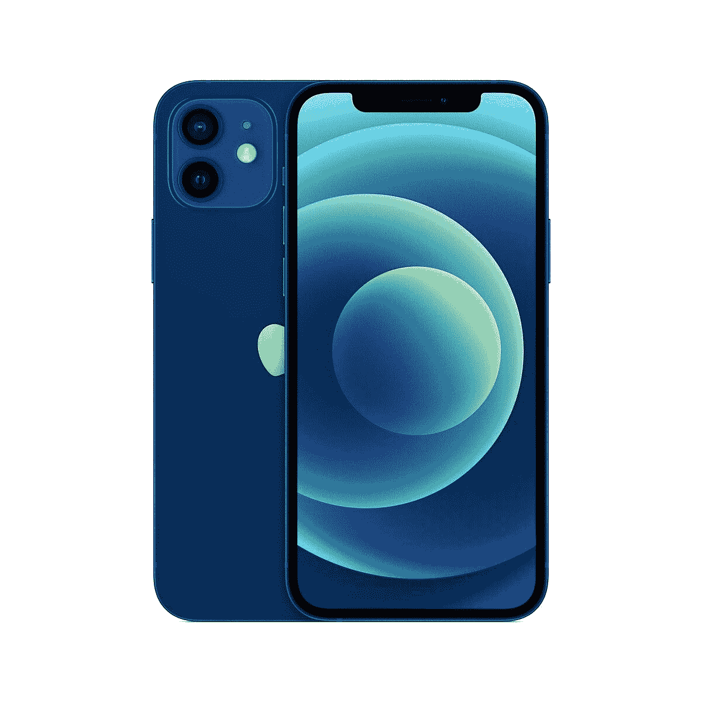
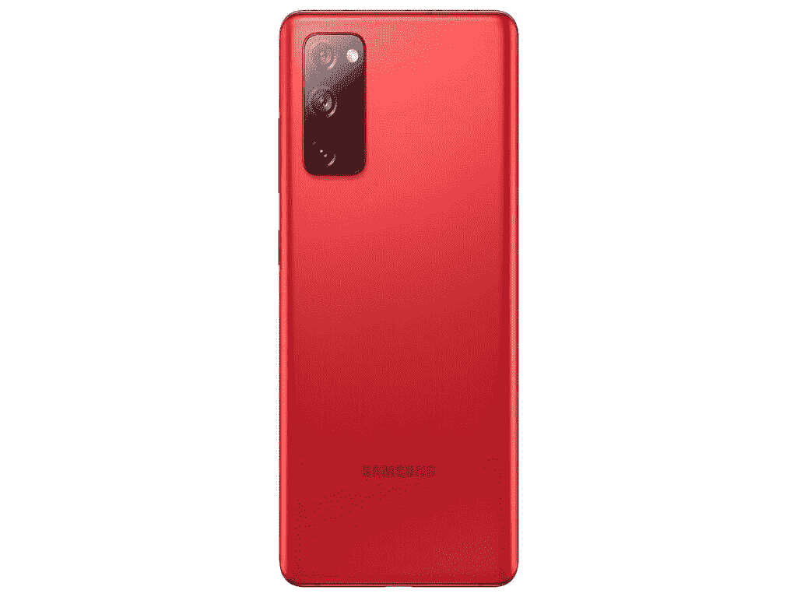

# 苹果 iPhone 12 vs 三星 Galaxy S20 FE:你该买哪个？

> 原文：<https://www.xda-developers.com/apple-iphone-12-vs-samsung-galaxy-s20-fe/>

三星 Galaxy S20 FE 上个月晚些时候以 699 美元的价格抓住了许多正面的头条新闻，同时保持了旗舰级的屏幕和 SoC。虽然我们在 Android 发烧友空间热衷于将 Galaxy S20 FE 与其他最近推出的价格类似的 Android 竞争对手在[一加 8T](https://www.xda-developers.com/oneplus-8t-review/) 和[谷歌 Pixel 5](https://www.xda-developers.com/google-pixel-5-review/) 进行竞争，但在现实世界中——对普通消费者来说——最大的(也许是唯一的？)Galaxy S20 FE 的挑战者是 [iPhone 12](https://www.xda-developers.com/apple-iphone-12-review/) 。

苹果的设备贵了 100 美元，但在发达的高消费市场，如北美、西欧、日本和三星的母国韩国，它仍被认为是一笔划算的交易。在过去的几天里，我一直在使用这两款手机，所以让我们来看看它们是如何相互竞争的。

## 显示

iPhone 12 和 Galaxy S20 FE 都有华丽的、可以说是同类最佳的有机发光二极管面板。它们对我的眼睛来说都一样亮，即使在强烈的阳光下使用也非常好。尽管三星的面板刷新速度是 iPhone 60Hz 面板的两倍，但用户界面的实际流动性并没有人们想象的那么大。

这归功于苹果的 SoC，以及 Android 品牌无法比拟的硬件和软件之间的协同作用，或者触摸面板的响应速度，但无论如何，尽管 iPhone 的 60Hz 面板“过时”，但它仍然感觉非常流畅。当然，Galaxy S20 FE 上的动画看起来更快更流畅，但很难拿起 iPhone 12，在动画和 UI 流畅性方面有很多抱怨。你可以看看下面的视频，看看我在这两款手机的用户界面上移动。

然而，我仍然把胜利给了 Galaxy S20 FE 的面板，因为它没有一个巨大的缺口。苹果粉丝可以尽情争论 Face ID 的好处——我承认，只通过扫描我的脸登录网站感觉很酷——但这个缺口在 2017 年很难看，而且很大，今天更是如此。

## 设计和手感

iPhone 12 是一款玻璃夹层手机，但不是典型的那种。它的显示面板使用了苹果公司称之为“陶瓷玻璃”的东西，这意味着它是一种注入了少量陶瓷的玻璃面板，苹果公司声称这使得它比去年的 iPhone 面板更坚硬，更耐摔。Galaxy S20 FE 使用康宁的大猩猩玻璃 3，这不是康宁提供的最好的玻璃。我没有摔过这两款手机(也不打算摔)，但在规格表上，似乎 iPhone 的玻璃面板应该更坚固。

在背面，它甚至没有接近:iPhone 12 有一个高级感的哑光玻璃面板，而 Galaxy S20 FE 有一个塑料背面。两款手机的机箱都是铝制的，但你在 iPhone 上能感受到更多，因为它更大更平。在三星设备上，你感觉主要是玻璃和塑料，因为铝栏杆相当薄。然而，尽管 Galaxy S20 FE 更大，但由于弯曲的背部，它更舒适地“适合”我的手掌，而 iPhone 12 则采用了棱角分明的方形设计。

## 相机-照片

Galaxy S20 FE 配备了三摄像头系统，由 12MP，f/1.8 主摄像头，以及 8MP 长焦变焦镜头和 12MP 超广角摄像头组成。iPhone 12 具有双摄像头系统，具有 12MP、f/1.6 主摄像头和 12MP 超广角摄像头。没有长焦变焦镜头意味着 Galaxy S20 FE 在变焦镜头方面胜出，正如下面的李小龙雕像 3xx 样本照片所示。

*iPhone 12 1x vs Galaxy S20 FE 1x；iPhone 12 3x vs Galaxy S20 FE 3x*

总的来说，这两款相机的动态范围都很出色，对焦非常快。如果光线条件很好，就哪部手机的主摄像头更好而言，这真的可以归结为个人偏好的问题。

*iPhone 12 vs Galaxy S20 FE*

凭借超宽屏幕，iPhone 12 在白天以更清晰的图像和更好的动态范围领先。但在晚上，我更喜欢三星较冷的色调，而不是 iPhone 12 过于温暖的色彩科学——至少在晚上拍摄香港建筑时是这样。

## 摄像机-视频

这两款手机都可以拍摄高达 4K/60fps 的视频，但 iPhone 12 可以在杜比视觉中拍摄，它真的可以在高对比度的场景中显示，或者当我从室内阴影场景切换到阳光下的室外场景时。在下面的视频中，包含了前置摄像头和主摄像头的视频片段，请注意，iPhone 始终曝光更好，并且周围的稳定性也略好。iPhone 一直是公认的智能手机视频之王，iPhone 12 保持领先地位。

## SoC 和整体性能

毫不奇怪，苹果全新的 A14 Bionic 比 7 个月大的骁龙 865 为 Galaxy S20 FE 提供动力的能力更强。基准测试分数对苹果来说是一边倒的胜利，但实际上，在现实世界的性能场景中，比如启动应用程序或运行基本应用程序，我看不出有多大区别，因为骁龙 865 仍然非常非常强大。然而，对于编辑 4K 视频剪辑等更密集的任务，iPhone 12 的处理和加载速度始终更快。但由于它们运行在不同的操作系统上，而我使用不同的应用程序编辑视频，这是苹果和橘子的比较。

## 电池

Galaxy S20 FE 尽管刷新率更快，但电池寿命似乎更长。Galaxy S20 FE 的 4，500 毫安时电池一直可以让我坚持一整天 14 个小时，而 iPhone 12 在我迄今为止使用它的四天中有两天没有坚持一整天 14 个小时。然而，我需要做更多的测试，因为在那些无法挂起的日子里，我使用 iPhone 12 的次数多了一点。

## 最后的想法

Galaxy S20 FE 的屏幕更好，焦距更灵活，电池寿命更长。与此同时，iPhone 12 在捕捉视频方面更好，拥有更好的超宽摄像头，以及更优质的构造。最终，在这里宣布赢家是没有意义的，因为他们运行着不同的生态系统，每个基地都有根深蒂固的忠实粉丝。每一款手机都很容易满足——世界上最著名的两个智能手机品牌以 800 美元或更低的价格给我们带来如此大的价值，这太好了。

 <picture></picture> 

Apple iPhone 12

##### 苹果 iPhone 12

苹果 iPhone 12 可能是苹果 2020 年产品线中位置最好的智能手机，其全面的包装在 iOS 生态系统中提供了巨大的价值。

 <picture></picture> 

Samsung Galaxy S20 FE

##### 三星 Galaxy S20 FE

三星 Galaxy S20 FE 是目前安卓系统中价值较高的产品之一，配有 120Hz 面板和骁龙 865，但价格比其他旗舰产品低几百美元