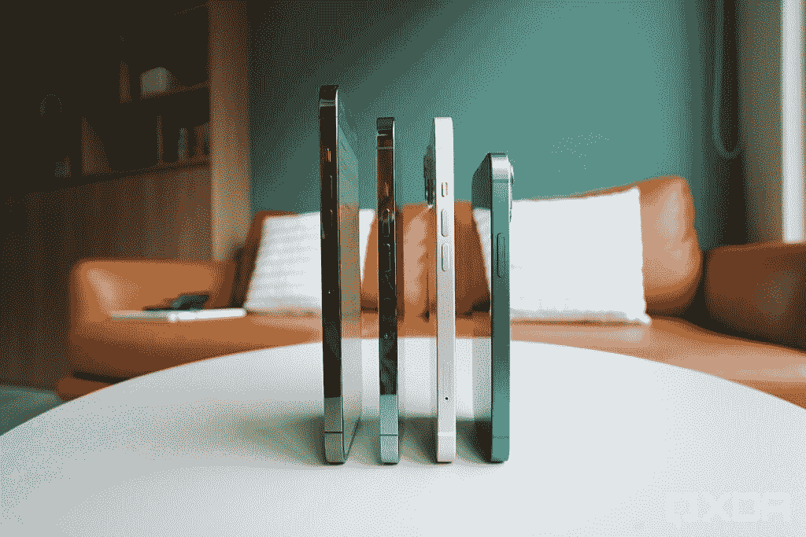
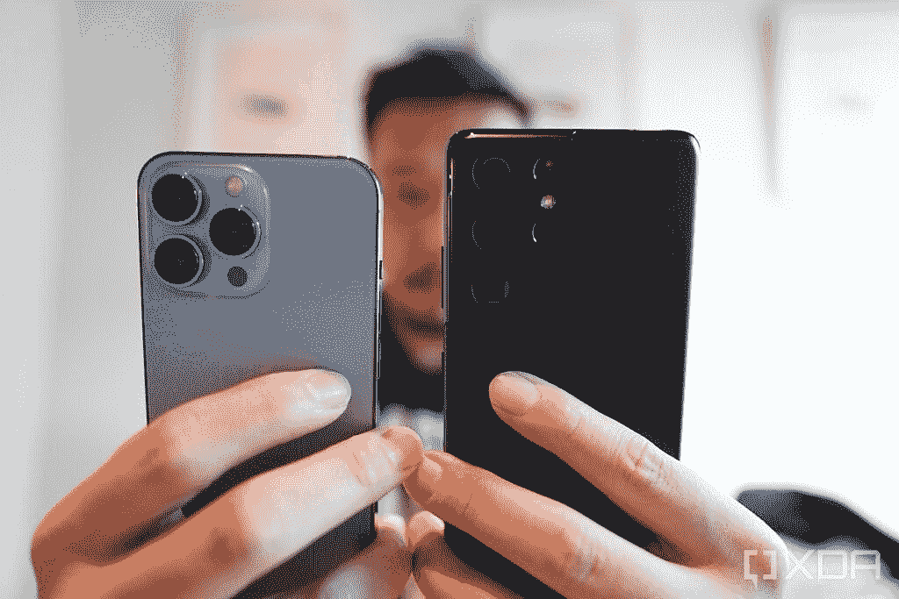
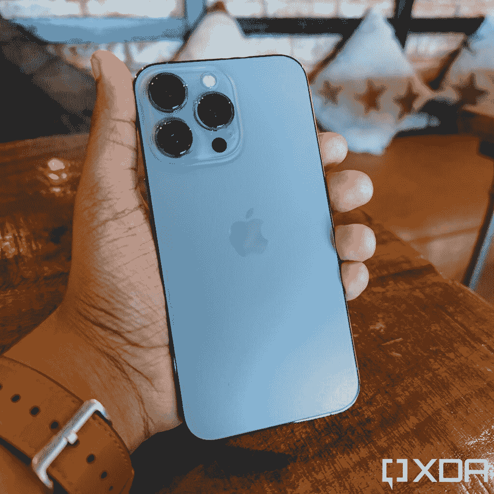

# iPhone 13 Pro 评论:苹果顶级旗舰，但有一个摄像头缺陷

> 原文：<https://www.xda-developers.com/apple-iphone-13-pro-review/>

几乎是在 iPhone 13 发布会一结束，智能手机讨论空间里就有评论说，今年的设备没有带来足够的升级来证明全新的数字跳跃是合理的。正如一些人开玩笑说的那样，他们是“12 岁”的模特。

经过五天的使用，我已经得出结论，iPhone 13 Pro 和 Pro Max 的改进比看起来要多。现在我已经广泛使用 iPhone 13 Pro 两周了，我更加相信苹果今年的手机有了实质性的变化。问题是，并非所有这些变化都是升级。

### 点击展开:苹果 iPhone 13 系列规格

| 

规范

 | 

苹果 iPhone 13 和 iPhone 13 Mini

 | 

苹果 iPhone 13 Pro 和 iPhone 13 Pro Max

 |
| --- | --- | --- |
| **建造** | 

*   铝制中框
*   玻璃正面和背面
*   前玻璃的“陶瓷护罩”

 | 

*   不锈钢中框
*   玻璃正面和背面
*   前玻璃的“陶瓷护罩”

 |
| **尺寸&重量** | 

*   iPhone 13 Mini:
    *   131.5 毫米 x 64.2mm 毫米 x 7.65mm 毫米
    *   141g

*   iPhone 13:
    *   146.7 毫米 x 71.5mm 毫米 x 7.65mm 毫米
    *   174 克

 | 

*   iPhone 13 Pro:
    *   146.7 毫米 x 71.5mm 毫米 x 7.65mm 毫米
    *   204 克

*   iPhone 13 Pro Max:
    *   160.8 毫米 x 78.1mm 毫米 x 7.65mm 毫米
    *   240 克

 |
| **显示** | 

*   超级视网膜 XDR 有机发光二极管:
    *   iPhone 13 Mini: 5.4 英寸
    *   iPhone 13: 6.1 英寸

*   60Hz

 | 

*   超级视网膜 XDR 有机发光二极管:
    *   iPhone 13 Pro: 6.1 英寸
    *   iPhone 13 Pro Max: 6.7”

*   推广 120Hz 刷新率

 |
| **SoC** | 苹果 A15 仿生 | 苹果 A15 仿生 |
| **内存&存储** | 

*   RAM 未公开
*   128GB/256GB/512GB

 | 

*   RAM 未公开
*   128GB/256GB/512GB/1TB

 |
| **电池&充电** | 

*   电池尺寸未透露；监管文件中的大致大小:
    *   iPhone 13 Mini:2438 毫安时
    *   iPhone 13:3240 毫安时

*   高达 20W 的有线充电
*   最高 7.5W 的无线充电
*   MagSafe 充电功率高达 15W

 | 

*   电池尺寸未透露；监管文件中的大致大小:
    *   iPhone 13 Pro:3125 毫安时
    *   iPhone 13 Pro 最大:4373 毫安时

*   高达 20W 的有线充电
*   最高 7.5W 的无线充电
*   MagSafe 充电功率高达 15W

 |
| **安全** | Face ID | Face ID |
| **后置摄像头** | 

*   初级:12MP 宽，f/1.6 光圈，1.6μm
*   **次要:** 12MP 超宽，f/2.4 光圈

 | 

*   **初级:** 12MP 宽，f/1.5 光圈，1.9μm
*   **次要:** 12MP 超宽，f/1.8 光圈
*   **第三:** 12MP 长焦，3 倍光学变焦，f/2.8
*   激光雷达相机

 |
| **前置摄像头** | 12MP 原深感摄像头系统 | 12MP 原深感摄像头系统 |
| **端口** | 闪电 | 闪电 |
| **音频** | 立体声扬声器 | 立体声扬声器 |
| **连通性** | 

*   5G(低于 6 GHz 和毫米波)
*   支持 4x4 MIMO 和 LAA 的千兆级 LTE
*   支持 2x2 MIMO 的 Wi-Fi 6 (802.11ax)
*   蓝牙 5.0

 | 

*   5G(低于 6 GHz 和毫米波)
*   支持 4x4 MIMO 和 LAA 的千兆级 LTE
*   支持 2x2 MIMO 的 Wi-Fi 6 (802.11ax)
*   蓝牙 5.0

 |
| **软件** | iOS 15 | iOS 15 |
| **其他特征** | 双物理 SIM 或双 eSIM 支持 | 双物理 SIM 或双 eSIM 支持 |

***关于这篇评论:**苹果借给我们 iPhone 13 系列的全部四款机型进行测试。这篇评测是我用 iPhone 13 Pro 作为我的主手机两周后写的。苹果在这篇文章中没有任何投入。*

* * *

## 苹果 iPhone 13 Pro:硬件和软件

苹果总是在别人曲折的地方曲折前进，iPhone 13 Pro 的硬件设计也是如此。许多 Android 手机感觉弯曲而圆润，几乎就像一件私人珠宝。iPhone 13 Pro 给人的感觉是致密、块状的，让人想起冰冷的金属机器的感觉，就像《2001:太空漫游》中的那块巨石。

iPhone 13 Pro 的手感一开始很棒*(这将会改变，我稍后会解释):按钮很结实，发出咔哒声，不锈钢边框摸起来很冷，覆盖 6.1 英寸显示屏的所谓“陶瓷盾”玻璃似乎比平时更硬。我喜欢塞拉蓝的颜色，特别是它看起来像不同的蓝色，甚至在不同的灯光下看起来是灰色的。哑光涂层防止指纹和污迹，同时感觉握持感。触觉引擎是一流的，当然，所有的铃铛和哨子都在这里，如立体声扬声器和 IP68 防水防尘等级。钢架确实能提取指纹，但它们很容易从侧面擦掉。*

 *当然，这种设计并不新鲜。事实上，iPhone 13 Pro 看起来和去年的 iPhone 12 Pro 几乎一样，只有四个物理变化:

*   相机模块更大
*   缺口稍微小一点
*   厚度和重量都增加了
*   屏幕以 120 赫兹的频率刷新

更大的相机模块是为了容纳新的、更大的图像传感器，它们肯定会带来明显的变化，至少到目前为止，这些变化有好有坏。我将在下一节讨论这个问题。

较小的凹口基本上不是一个因素，因为获得的额外空间不会显示更多内容，除非您正在观看跨越整个屏幕的视频。

然而，额外的重量确实带来了实实在在的好处，因为它的增加是为了容纳更大的电池，从而延长了 iPhone 12 Pro 的电池寿命。

至于可变的 120Hz 刷新率——在我的实践中，我写道，120Hz 感觉不如一加或小米手机上的 120Hz 明显。现在我们知道这部分是由于一个 bug 造成的，这个 bug 将 120Hz 的刷新率仅限于苹果自己的第一方应用。苹果已经承诺解决这个问题，但即使它不解决，我也不介意，因为苹果的 60Hz 动画实际上是非常优化的，我认为这比安卓设备的 60Hz 动画更好，iPhone 13 Pro 的电池寿命真的很好——比任何 120Hz 的安卓旗舰都好。

 <picture></picture> 

All four iPhone 13 phones are heavier and thicker than last year's counterpart.

A15 仿生击败了 Android 中的任何东西。这是苹果真正领先于其他公司的一个领域。

当然，还有一个新的处理器——A15 Bionic——在基准测试中，它击败了 Android 这边的任何东西。见鬼，即使是去年的 A14 Bionic，如果我们只使用基准数据，现在也可能击败 Android 中的任何东西。这是苹果真正领先于其他公司的一个领域。

iPhone 13 Pro 能够在基准测试中获得如此高的分数，并提供相对于其电池大小而言如此长的电池寿命，一个主要原因是苹果是少有的完全控制其硬件和软件的手机品牌，因此两者之间有更好的协同作用，这导致了更高效和优化的操作。

### iOS 15:焦点模式、新的 FaceTime 等等

iOS 15 体验稳定无 bug。但还是很 iOS

iPhone 13 Pro 开箱后就装有 iOS 15，但几天后，它就收到了 iOS 15.1 的更新。iOS 15 在很大程度上是对 iOS 14 的迭代升级，带来了相同的视觉元素和变化，例如应用程序库(苹果版的 Android 应用程序抽屉)和主屏幕上的小部件。

iOS 15 的新功能包括一个新的 FaceTime 应用程序，允许你向 Android 手机用户发送链接以加入通话。在香港，几乎没有人使用 FaceTime，所以我只尝试了一两次这项功能，只是作为测试，但它确实像宣传的那样有效。

iOS 15 的另一个新功能是焦点模式，这是本质上不同的配置文件，你可以设置为只允许特定的通信方法通过。默认有四种模式:勿扰，睡眠，个人，工作。如果你喜欢，你可以添加自定义的。拥有个人资料后，您可以指定特定联系人来联系您，还可以从应用程序接收通知。因此，对于工作模式，你可以设置它，只有与工作相关的应用程序会 ping 你的通知。相反，在周末你可能想设置为个人模式，如果你愿意的话，屏蔽掉任何工作联系。如果这听起来很像[一加在 OxygenOS 上的工作生活平衡](https://www.xda-developers.com/oxygenos-open-beta-3-oneplus-7-pro-work-life-balance-mode-india/)专题，那是因为它确实如此。

还有文字直播，工作原理类似谷歌镜头。本质上，iPhone 13 Pro(或任何运行 iOS 15 的设备)将尝试识别设备上存储的任何照片上的文字。这允许单词被突出显示并被搜索或翻译。从我的经验来看，它工作得很好——我要说有一半的时间我确实能在照片中找到一个特定的单词，但其他时间手机不能接收文本。然而，它是有用的。我曾经查找过一个商店的地址，只是简单地从一张旧照片上高亮显示商店的名称，然后搜索名称。下面的截图来自我运行 iPadOS 15 的 iPad，但它在 iPhone 13 Pro 上的效果是一样的。

总体来说，iOS 15 的体验是稳定的，没有错误。但还是 iOS，所以苹果的一些严苛的做事方式还是让我很恼火。比起 iOS 15 的死板，我更喜欢 Android 的通知管理和完全免费的主屏幕网格。

### 日常使用 iPhone 13 Pro 是什么感觉？

使用 iPhone 13 Pro 作为我的日常驱动程序基本上是一种很好的体验。我喜欢苹果在其生态系统内设备之间无与伦比的协同作用。我发现我使用的许多应用程序在 iOS 上比在 Android 上运行得更好(例如，我的汇丰银行(Hong Kong bank)iOS 应用程序允许 Face ID 登录，但同一应用程序的 Android 版本不允许指纹登录)。与 Android 手机相比，iPhone 13 Pro 的应用程序崩溃和相机快门延迟更少(顺便说一下，Android 设备上的应用程序崩溃并不频繁，但它确实时不时会发生)。

 <picture></picture> 

The iPhone 13 Pro (left) and Galaxy S21 Ultra (right).

但我确实对将 iPhone 13 Pro 作为我的主要手机有四点抱怨:

*   侧面平坦的方形设计看起来很棒，但与弯曲的 Androids 甚至 iPhone 11 系列相比，握在手中并不舒适。
*   在这个戴着面具的时代，将 Face ID 作为唯一的生物识别安全解决方案并不理想。
*   iOS 不像 Android 那样单手友好。
*   iPhone 13 Pro 相机在具有挑战性照明的场景中难以找到合适的曝光。

我们将在相机部分探讨第四个烦恼，但首先让我们简单回顾一下前三个。

**iPhone 13 Pro 的方方正正的设计看起来比摸起来更好**

我喜欢使用大型手机，在过去几年里，我选择使用 iPhone XS 和 iPhone 11 的 Pro Max 版本，没有遇到什么大问题。但自从苹果改用四四方方的平边设计以来，我已经无法使用 Pro Max 型号超过几天，直到我的手告诉我换一个更小的手机。这个问题在 iPhone 13 Pro 上没有那么糟糕，但比去年的 12 Pro 更重更厚，所以它仍然是一部全天握着都不是最舒服的手机。一个主要的警告是，我裸体使用手机，大多数消费者*不会这样做*。一旦你[在 iPhone 13 Pro](https://www.xda-developers.com/best-iphone-13-pro-cases/) 上拍一个外壳，坚硬的侧面应该会变软，这样手机拿起来应该会更舒服。

**在前面具时代，Face ID 是神奇的，但现在它是一个麻烦**

Face ID 是苹果公司从一开始就认定的一项独创性发明。能够瞥一眼手机并向上滑动解锁是自然和直观的。仅仅通过看屏幕登录网站或银行应用程序仍然给我一种“哦，我生活在未来”的感觉。

但世界仍在经历一场疫情，对在香港(以及亚洲、欧洲和其他地方的许多地方)的我来说，每次出门或在陌生人身边时，我们仍戴着口罩。这使得解锁 iPhone 变得很麻烦。我知道苹果试图解决这个问题，首先是缩短 Face ID 扫描失败后屏幕上弹出数字键盘之前的等待时间，并允许 Apple Watch 佩戴者在手表附近的情况下跳过 Face ID。但这些都是解决不了核心问题的变通办法:当我戴着口罩在外面时，解锁我的 iPhone 需要的时间是装有指纹扫描仪的安卓系统的两倍或三倍。

如果苹果公司不那么执着于移除触控 ID 的想法，这个问题本来是可以解决的。电源按钮是一个很好的集成点，这将解决整个问题。但是现在我们再等一年，看看苹果是否计划在 iPhone 上超越 Face ID。

**iOS 并不单手友好**

我已经就此写了一篇[整篇文章](https://www.xda-developers.com/iphone-12-pro-max-review/)，但是由于几个原因，iOS 比 Android 手机更难单手操作。通知面板和控制中心都必须通过从屏幕最上方滑动来触发，即使在较小的 6.1 英寸 iPhone 13 Pro 上，这种向下滑动的手势也需要重新调整握持和拉伸手掌和拇指的夸张动作(见下图)。控制中心对我来说特别难触发，因为它需要从右上角滑动，我用左手拿着我的手机。在更大的 Pro Max 手机上，这种行为完全是对用户的敌意。

iOS 也没有给你一个真正免费的主屏幕网格:应用程序必须按照从上到下，从左到右的顺序放置。这意味着，如果我想让我经常使用的应用程序更靠近屏幕底部的拇指，我就必须用应用程序或小工具填满我的主屏幕。

 <picture></picture> 

The iPhone 13 Pro's edges can feel sharp on the palm after prolonged use.

* * *

## 苹果 iPhone 13 Pro:相机

在我的实践中，我给 iPhone 13 Pro 相机打了高分，主要是因为它新的“电影模式”，本质上是视频的肖像模式。虽然我仍然喜欢这个功能，并在社交媒体上广泛使用它——可能是免费的——但我发现，在静态摄影中，iPhone 13 Pro 相机在具有挑战性的高对比度场景中与动态范围斗争。

基本上，每当我用一些明亮的灯光面对相机拍摄夜间照片时，iPhone 13 Pro 往往会过度曝光，同时保持阴影区域比平时更暗。

如果你对相机不挑剔，或者不在恶劣的光线条件下拍照，或者如果你已经从几年前的手机升级到 iPhone 13 Pro，你可能不会注意到这个问题。如果你看看 iPhone 13 Pro 拍摄的以下图像，它们看起来像是好照片，对吗？

但现在将 iPhone 13 Pro 的图像与刚刚发布的 [Vivo X70 Pro Plus 拍摄的相同镜头进行比较。](https://www.xda-developers.com/vivo-x70-pro-plus-first-impressions/)

看看光源——挂在我朋友头上的灯笼，霓虹灯 iPhone 13 Pro 过度曝光了其中一些。在 iPhone 13 Pro 图像中，第一张图片中应该是绿色灯笼的东西出现了亮白色。

对于 iPhone 的图像处理，一个常见的辩护是，苹果喜欢保持镜头更自然，更少处理，虽然这在前几年是正确的，但我认为这一次这种辩护不起作用。在下面的一组照片中，与 Galaxy S21 Ultra 或 Vivo X70 Pro Plus 拍摄的相同照片相比，iPhone 完全炸毁了天空。这些不是更“现实的镜头”，这些只是过度曝光的镜头，句号。

过去一周，我用 iPhone 13 Pro 和 Vivo X70 Pro Plus 拍摄了数百张夜间照片，几乎在所有情况下，我都更喜欢 Vivo 的颜色。好吧，色彩感知可能是主观的，但不可否认的是，iPhone 拍摄过度曝光了所有的灯笼和霓虹灯。

虽然 iPhone 一直比 poppy 具有更低调的动态范围，非常加工的 Android 品牌外观，但 iPhone 12 Pro 并没有像这样一贯地吹出灯光和天空。我认为这个问题是因为苹果使用了*全新的图像传感器*(接受更多光线)，而苹果没有足够的时间来微调软件以适应这一事实。

好消息是我很确定苹果会通过软件更新来解决这个问题。

或许更好的消息是，这些“城市灯光璀璨的夜景”在我居住的地方尤其引人注目，因为夜晚的香港基本上就是赛博朋克中心。对于生活在加州萨克拉门托或新西兰古色古香的小镇的人来说，这些拍摄条件不会经常出现，iPhone 13 Pro 相机也不必处理这些问题。

最好的消息呢？夜拍拍摄明亮的灯光只是摄影的一个方面。就像 Vivo X70 Pro Plus 在那个具体方面打败了 iPhone 13 Pro 一样，iPhone 13 Pro 在其他方面都赢了。

苹果的图像处理比安卓手机更好地捕捉了猫狗温暖、可爱的氛围

我有这样一个理论，因为构建软件处理算法的人是人，所以存在迎合他们特定文化的偏好和盲点。大多数 Android 品牌的总部都设在首尔或深圳这样的亚洲大都市，这些城市可以被描述为摩天大楼和霓虹灯随处可见的城市丛林。另一方面，苹果是一家非常加州化的公司，总部设在一个没有高楼的寂静郊区。很自然，三星(Samsung)和 Vivo 等安卓手机品牌更擅长捕捉香港天际线上忧郁、冰冷的赛博朋克氛围，而苹果相机更擅长捕捉温暖、阳光照耀下的树木和狗的海滩照片。

而这正是 iPhone 13 Pro 的过人之处。我仍然认为苹果的图像处理比安卓手机更好地捕捉了猫狗温暖、可爱的氛围；与中国和韩国手机的那种 PS 外观相比，人类的肖像似乎更自然，肤色更准确。

而且总的来说，不逆光拍摄的时候，iPhone 13 Pro 的照片都很不错。iPhone 相机系统有一个普遍的亮点，这是安卓手机所没有的。比如 2021 年几乎每一款安卓旗舰都有轻微的快门延迟(Galaxy S21 Ultra 尤为糟糕)，而 iPhone 则没有。在拍摄镜头之间过渡相对平滑的视频时，iPhone 还可以放大和缩小。在 Galaxy S21 Ultra 或小米 Mi 11 Ultra 上，每当你从超宽切换到宽，从宽切换到变焦时，都会有一点颠簸。Vivo X70 Pro Plus 根本不让你在拍摄中途切换主镜头和超宽镜头。

iPhone 13 Pro 还可以捕捉比中国或韩国手机更能代表一个人的自然自拍，无论用户是否愿意，这都会使皮肤变得白皙光滑。

最终，虽然我发现 iPhone 13 Pro 比以前更频繁地过度曝光光源，但整体相机体验与以前类似。无论如何，在过去的几年里，我从未认为任何 iPhone 是最好的静态照片相机。Vivo X70 Pro Plus 拍摄的照片在我看来更具美感，这并没有让我感到惊讶。

iPhone 13 Pro 相机真正优于其他相机的地方是视频性能。iPhone 13 Pro 的视频画面仍然是最稳定的，没有许多安卓手机在拍摄和行走时出现的微抖动。我必须再次强调，电影模式对我和抖音/Instagram 的影响者来说是一个游戏改变者。

这是 iPhone 13 Pro 放大到一只猫。请注意缩放动作是多么的平滑流畅——你无法在另一部 Android 手机上获得这种效果。当 Android 设备从主摄像头切换到变焦镜头时，总会出现一些小问题。

还有一个新功能，苹果称之为“摄影风格”，这基本上是一个更好的过滤器。我试了几次，每次我都切换回默认设置，因为过滤器看起来不太对劲。

* * *

## 苹果 iPhone 13 Pro:性能和电池寿命

苹果的 A 芯片优势在于渲染视频，渲染速度是安卓旗舰的 3-4 倍

5 纳米 A15 Bionic，搭配 Pro 机型上的 6GB 内存，足以让手机保持高速运行。我已经提到手机在基准测试中击败了所有 Android 设备。但我注意到苹果 A 芯片优势的关键领域是渲染视频。我经常拍摄视频，然后直接在 iPhone 的照片应用程序或 LumaFusion 中快速修剪和裁剪，并渲染它们。我还用 Insta360 相机拍摄 360°视频，然后通过该公司的 iOS 应用程序渲染一个重新构建的视频。这些过程的速度总是比在 Android 旗舰机上完成相同任务的速度快 3-4 倍。如果我渲染一个 15 秒的 Instagram 故事，我用一堆镜头拼接在一起，在 iPhone 13 Pro 上不到 2 秒，但在 Android 旗舰上需要 7 秒。在 Insta360 的 iOS 应用程序上渲染 45 秒的 360°镜头大约需要 30 秒。在 Galaxy S21 Ultra 或 Galaxy Z Fold 3 上进行同样的操作需要一分多钟。

如今，iPhone 13 Pro 的电池续航时间比许多流行的安卓智能手机都要好

iPhone 13 Pro 上的续航很棒。作为我的主要手机，在两个星期的大量使用中，该设备将完成一天 14 个小时的繁重工作(这将是周末，我整天都在外面大量使用手机)，剩余大约 15%的电池。在使用量较少的日子里(工作日，我一天中大部分时间都坐在电脑前)，iPhone 13 Pro 的电池续航时间约为 30-40%，可以坚持 14 个小时。这两个都是对 iPhone 12 Pro 的重大改进，iPhone 12 Pro 不能让我一天工作 14 个小时。苹果吹捧这一代 iPhone 的电池寿命有了重大改进，我们倾向于同意他们的观点，因为 iPhone 13 Pro 迄今为止一直很棒，可以说甚至比目前许多流行的 Android 智能手机都要好。

强劲的电池续航时间在 iPhone 上尤其受欢迎，因为与 Android 旗舰手机相比，这些手机的充电速度相对较慢。iPhone 13 Pro 最大充电速度 23W。我习惯使用可以以 50W 或更高速度充电的 Android 旗舰，所以相比之下，这感觉很古老。现在是苹果考虑采用快速充电解决方案的时候了，最好是像 USB PD 这样已经有配件生态系统的东西。

* * *

## iPhone 13 Pro 值得升级吗？

除了 iPhone 13 Pro 的过度曝光问题，这款手机的其他一切都经过了打磨，精致，处于最佳状态。对我来说，电影模式以及更长的电池寿命是主要的升级。如果你是一个从旧型号(11 或更旧)升级到 13 Pro 的 iPhone 用户，你不会失望的。这是一款出色的 iPhone，如果不是 iPhone 13 Pro Max 上更好的电池续航时间，甚至是今年最好的一款。

不过，已经拥有 iPhone 12 Pro 的人，升级之前还是要三思。除非你真的想拍摄电影视频或经常遭受电池焦虑，否则 iPhone 13 Pro 没有带来足够的升级来证明购买的合理性。此外，最近有传言称，iPhone 14 将进行全新设计，或许再等一年也是值得的。

如果你是升级到 iPhone 13 Pro 的 iPhone 老用户，你不会失望的。这是一部优秀的 iPhone。

如果你已经在使用 2020 年或 2021 年的安卓旗舰机，我认为你没有必要换，除非你已经对手机的视频录制功能或电池寿命感到沮丧。

最终，苹果的 iPhones 是可以通过审查的。它们无处不在，几乎是世界上大多数人的必备产品，因此它们很可能是旧 iPhone 的默认升级选项。

 <picture></picture> 

iPhone 13 Pro

##### 苹果 iPhone 13 Pro

iPhone 13 Pro 拥有同类最佳的移动 SoC 和视频录制性能。其他部分也很不错。*