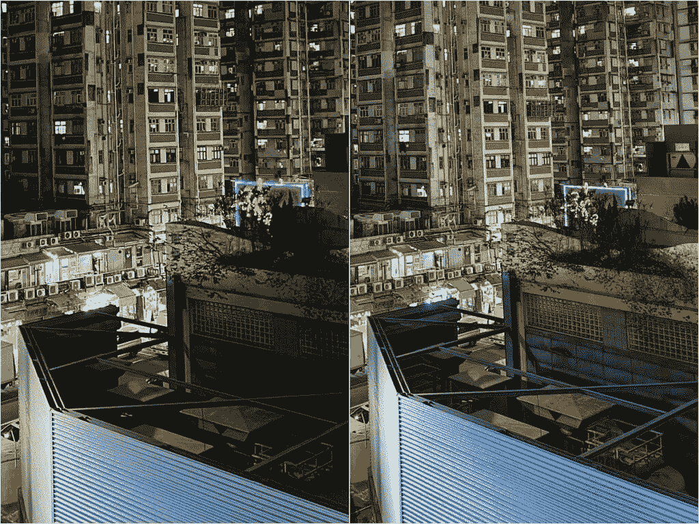
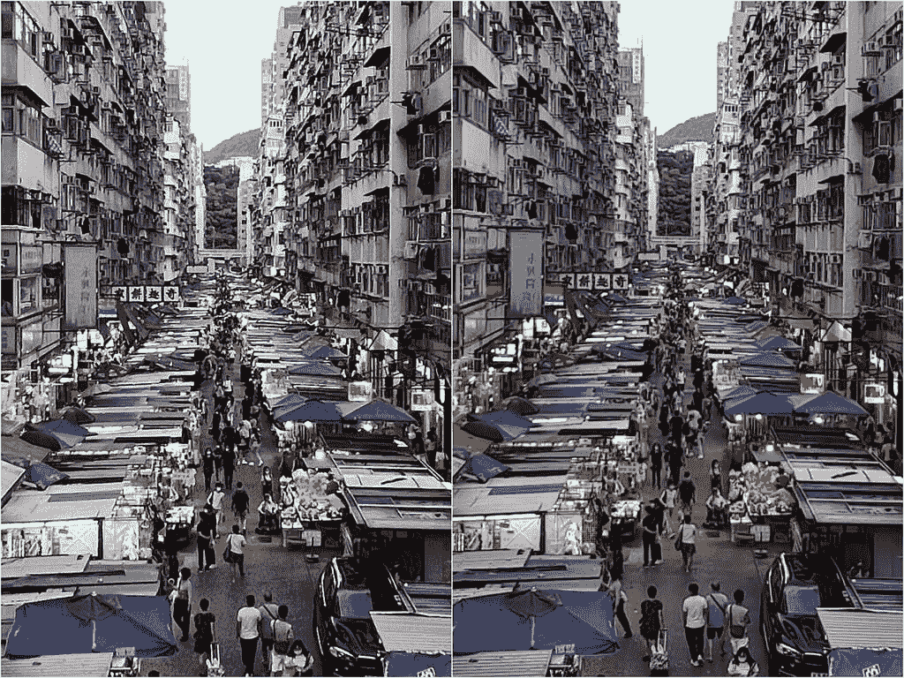
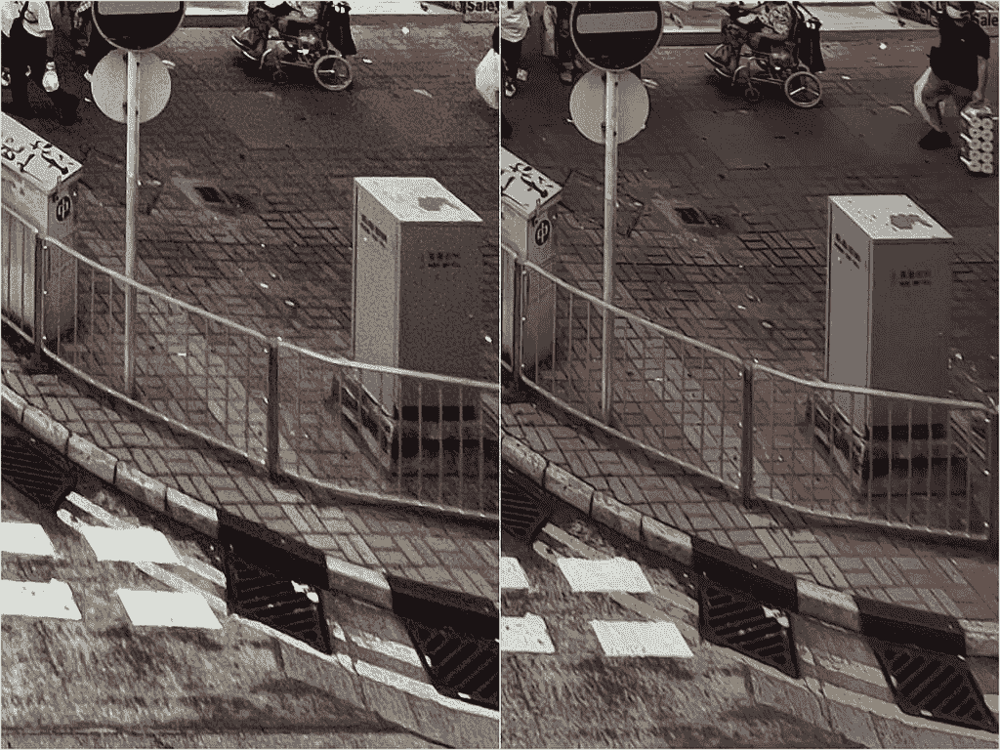
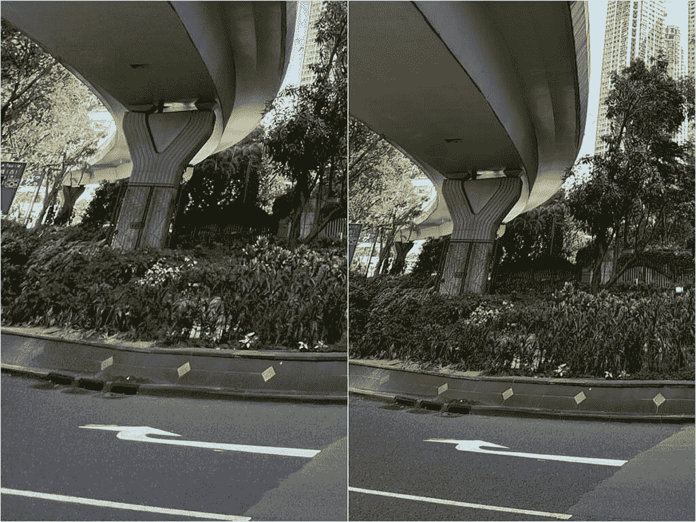
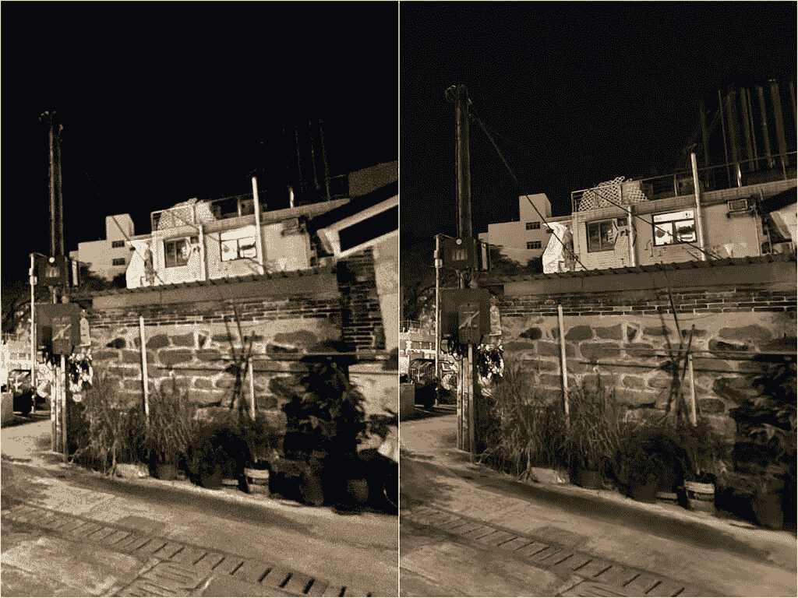

# iPhone 13 Pro vs Vivo X70 Pro Plus:Pro 手机的相机枪战

> 原文：<https://www.xda-developers.com/apple-iphone-13-pro-vs-vivo-x70-pro-plus-camera-shootout-comparison/>

在过去的几周里，iPhone 13 Pro T1 的相机系统获得了很多好评，一些知名媒体称其为最佳智能手机相机。但是如果我告诉你*最近发布了另一款*智能手机，一款不幸被 iPhone 媒体报道的冲击所埋没的智能手机，它可以与 iPhone 13 Pro 正面交锋，而*不仅仅拥有自己的*呢？我说的是 Vivo X70 Pro Plus(或者按照官方造型，X70 Pro+)。过去两周，我一直将它与 iPhone 13 Pro 或 13 Pro Max(这两款 Pro iPhones 拥有相同的相机)并排使用，在这段时间里，我在整个城镇拍摄了数百张照片。更多的时候，我更喜欢 Vivo 的相机拍摄的照片。

但这只是我的个人偏好，智能手机相机不仅仅是静态照片。所以在这篇文章中，我将分享我拍摄的照片和视频，并分享我自己的观察。

### 点击展开:Vivo X70 Pro+和苹果 iPhone 13 Pro/Pro Max:规格

## Vivo X70 Pro+和苹果 iPhone 13 Pro/Pro Max:规格

| 

规范

 | 

Vivo X70 Pro Plus

 | 

苹果 iPhone 13 Pro 和 iPhone 13 Pro Max

 |
| --- | --- | --- |
| **构建** | 

*   铝制中框
*   大猩猩玻璃 Victus 回
*   大猩猩玻璃 Victus 正面

 | 

*   不锈钢中框
*   玻璃正面和背面
*   前玻璃的“陶瓷护罩”

 |
| **尺寸&重量** | 

*   164.5 x 75.2 x 8.9 毫米
*   213 克

 | 

*   iPhone 13 Pro:
    *   146.7 毫米 x 71.5mm 毫米 x 7.65mm 毫米
    *   204 克
*   iPhone 13 Pro Max:
    *   160.8 毫米 x 78.1mm 毫米 x 7.65mm 毫米
    *   240 克

 |
| **显示** | 

*   6.78 英寸 AMOLED
*   3200 x 1440 像素
*   517ppi
*   可变 120Hz 可变刷新率

 | 

*   超级视网膜 XDR 有机发光二极管:
    *   iPhone 13 Pro: 6.1 英寸
    *   iPhone 13 Pro Max: 6.7”
*   推广 120Hz 可变刷新率

 |
| **SoC** | 高通骁龙 888+。 | 苹果 A15 仿生 |
| **闸板&存放** |  | 

*   RAM 未公开
*   128GB/256GB/512GB/1TB

 |
| **电池&充电** | 

*   4500 毫安时
*   55W 有线快速充电(充电器包含在包装盒中)
*   50W 无线充电

 | 

*   电池尺寸未透露；监管文件中的大致大小:
    *   iPhone 13 Pro:3125 毫安时
    *   iPhone 13 Pro 最大:4373 毫安时
*   高达 20W 的有线充电
*   最高 7.5W 的无线充电
*   MagSafe 充电功率高达 15W

 |
| **安全** | 光学显示指纹读取器 | Face ID |
| **后置摄像头** | 

*   **初级:** 50MP 宽，三星 GN1，f/1.57，1/1.31”
*   **次要:** 48MP 超宽，索尼 IMX 598，f/2.2，万向节技术
*   **第三:** 12MP 长焦，索尼 IMX 663，f/1.6，2x 光学
*   **四元:** 8MP 潜望镜，f/3.4，5 倍光学变焦

 | 

*   **初级:** 12MP 宽，f/1.5 光圈，1.9μm
*   **次要:** 12MP 超宽，f/1.8 光圈
*   **第三:** 12MP 长焦，3 倍光学变焦，f/2.8
*   激光雷达相机

 |
| **前置摄像头** | 32MP | 12MP 原深感摄像头系统 |
| **端口** | USB-C | 闪电 |
| **音频** | 立体声扬声器 | 立体声扬声器 |
| **连通性** | 

*   5G(毫米波)
*   支持 4x4 MIMO 和 LAA 的千兆级 LTE
*   支持 2x2 MIMO 的 Wi-Fi 6 (802.11ax)
*   蓝牙 5.0
*   国家足球联盟

 | 

*   5G(低于 6 GHz 和毫米波)
*   支持 4x4 MIMO 和 LAA 的千兆级 LTE
*   支持 2x2 MIMO 的 Wi-Fi 6 (802.11ax)
*   蓝牙 5.0
*   国家足球联盟

 |
| **软件** | Android 11 之上的 FunTouch OS 12 | iOS 15 |
| **其他功能** | 双物理 SIM | 双物理 SIM 或双 eSIM 支持 |

## 苹果 iPhone 13 Pro vs Vivo X70 Pro Plus:主摄像头

将 iPhone 的摄像头与中国的安卓旗舰产品进行比较，曾经是一个软件与硬件的故事。在过去，苹果会使用相对普通的相机硬件，然后依靠其软件智能来产生良好的图像。另一方面，中国安卓品牌多年来一直在追求更高的百万像素和更大的传感器，但他们遭受了劣质软件处理的困扰。

苹果和 Vivo 已经在这里朝着另一个阵营的方向迈出了步伐。对于 iPhone 13 Pro，苹果的营销团队重点关注其“全新的相机传感器”，在主 12MP 相机的情况下，这是一个更大的 1/1.65 英寸传感器，也具有更快的 f/1.5 光圈。另一方面，Vivo 实际上重复使用了 X60 Pro Plus 的相同 50MP GN1 传感器，然后依靠其自研的 V1 成像芯片来处理 ISP(图像信号处理)。

换句话说，苹果追求更炫的相机硬件数量，而 Vivo 已经开发了自己的 SoC，以苹果多年来的方式处理整个图像处理管道。

结果呢？两款手机都有很棒的摄像头，比 2020 年发布的版本有了很大的改进。在良好的光线下，两款手机拍摄的照片看起来都非常棒。

两款手机都有某种滤镜选项 iPhone 有“摄影风格”，而 Vivo 有“蔡司真彩色”。我忽略了这两个，并拍摄了两部手机的默认模式。我们可以看到，Vivo 普遍调高了对比度，而 iPhone 则有更多柔和、逼真的颜色。这种情况一直存在 iPhone 通常试图以眼睛感知的方式显示照片。对于上面这个特定的设置，哪个相机表现更好取决于个人喜好。

然而，一旦我们通过在更具挑战性的条件下拍摄来增加难度，例如在刺目的光线下或高对比度的场景中，iPhone 13 Pro 就有过度暴露明亮光源的趋势。

iPhone 13 Pro 有过度暴露强光来源的倾向。Vivo 要好得多。

如果你从上述四张照片的窗口往外看，你可以看到 iPhone 13 Pro 的照片显示了一个明亮的白色屏幕，而不是 Vivo 的照片中的天空。

你可以争辩说，iPhone 只是在“保持拍摄的真实性”，Vivo 的图像看起来经过了过度处理，就像是用 CGI 技术将天空加入到了照片中。但在某些情况下，iPhone 13 Pro 曝光过度，以至于无法证明其合理性。就像下面的照片——这不是一个风格上的选择，这只是吹灭灯。

这个问题在晚上变得更加明显，至少在像香港这样的城市，那里有许多明亮的霓虹灯与夜晚的黑暗形成对比。

尽管 iPhone 13 Pro 的图像传感器更大，但仍小于 X70 Pro+的 1/1.31 英寸传感器。因此，如果我们近距离拍摄物体/对象，X70 Pro+图像会因额外的景深而呈现出明显更强的自然散景。然而，在这些相同的特写镜头中，我认为 iPhone 13 Pro 的相机对这些死去的海洋动物产生了更详细的纹理和颜色。

### 弱光拍摄

因为 X70 Pro+的图像传感器更大，自然会摄入更多的光线。但 iPhone 13 Pro 有一个非常好的夜间模式，可以无缝地融入到游戏中。所以在大多数情况下，在适度低光的照片中，镜头是非常均匀的。这些通常都是优秀的夜间照片，几年前的手机可能会对此感到困惑。

如果你真的想要像素窥视和放大，Vivo 的镜头会更亮更锐利一点，但我们在吹毛求疵。

 <picture></picture> 

iPhone 13 Pro (left); X70 Pro+ (right)

### 录像

[sc name = " pull-quote-right " quote = "两款手机都有令人惊叹的摄像头，比 2020 年发布的产品有了很大的改进，但 iPhone 13 Pro 仍然是整体上的赢家"]iPhone 可以说是十年来拍摄视频的最佳手机，但 Android 智能手机正在缩小这一差距。在下面的视频样本中，以 4K/30fps 拍摄，你可以看到 Vivo 的 X70 Pro+实际上具有出色的稳定性，特别是当我跑步时(在 0:10 标记处)。在晚上，Vivo 的视频画面更亮，颜色更强烈。

但 iPhone 13 Pro 对我来说总体上还是赢了，原因有几个。它可以更自然地处理视频中的人类肤色(在 Vivo 的镜头中，我看起来过于苍白)，iPhone 可以几乎无缝地在镜头之间切换。几乎所有的安卓手机在拍摄中途切换镜头时都会出现轻微的卡顿。事实上，一旦你开始滚动相机，Vivo 的 X70 Pro Plus 根本无法在超宽相机和主相机之间切换。我甚至还没有谈到电影模式，我是一个球迷。

总而言之，iPhone 13 Pro 仍然保持着最佳摄像机的桂冠，但它比几年前更接近 2021 年。

总的来说，如果我必须选择一个获胜者，我会说我更喜欢 Vivo 的图像。对我来说，颜色看起来更美观，也没有过度曝光的问题。但是 iPhone 的主摄像头有一个更灵敏的快门。像许多其他 Android 旗舰一样，Vivo 在点击快门按钮和照片实际拍摄之间有一秒钟的延迟。iPhone 仍然可以捕捉到更好的视频和特写镜头。

* * *

## 苹果 iPhone 13 Pro vs Vivo X70 Pro Plus:超宽摄像头

iPhone 13 Pro 的超宽相机在过去两年中有所改进，这要归功于更快的光圈(可以吸收更多的光)。在很大程度上，iPhone 13 Pro 的超宽镜头看起来非常好——这是 Vivo X70 Pro+的超宽镜头的对手，Vivo X70 Pro+的超宽镜头几乎总是有更好的清晰度和适当的曝光，特别是在高对比度的场景中。

这在白天拍摄时不太明显....

....除非你在大屏幕上放大这些图像。例如，让我们仔细看看第一组样本，香港一个繁华的街头市场。下面的拼贴画是每张图片的 100%裁剪。

 <picture></picture> 

iPhone 13 Pro (left); X70 Pro+ (right)

图像的中心非常接近，尽管你可以看到 iPhone 13 Pro 的图像有更多的噪声(看看路面)，图像清晰度只是稍微柔和了一点。如果我们观察超宽镜头的边缘，差异会变得更加明显。

 <picture></picture> 

iPhone 13 Pro (left); X70 Pro+ (right)

iPhone 13 Pro 超广角拍摄的边角噪点明显更多。如果我们放大 100%到另一组白天超宽的照片，也是高速公路立交桥的照片，情况就是这样。Vivo 的镜头更好的保持了道路和高速公路立交桥水泥块的质感。这只是一个更清晰的图像。

 <picture></picture> 

iPhone 13 Pro (left); X70 Pro+ (right)

这种图像完整性的差距在夜间扩大。不仅 Vivo 的镜头几乎总是更清晰，而且 Vivo 的镜头通常曝光适当，不会遭受 iPhone 13 Pro 图像的过度曝光问题。下面是两张夜间拍摄的中国村庄的超宽照片。

即使从上面的取景中，你也应该能够看到 X70 Pro+的图像更清晰。但是放大 100%....

 <picture></picture> 

iPhone 13 Pro (left); X70 Pro+ (right)

...区别是白天和黑夜。再来一套。

一切都很好。现在放大。

 <picture></picture> 

iPhone 13 Pro (left); X70 Pro+ (right)

在 iPhone 粉丝抓起干草叉之前，请记住这是在我这边吹毛求疵(我应该这么做！).在大多数情况下，人们不会在更大的显示器上进行超广角拍摄来进行像素窥视。他们要把照片发到 Instagram 或脸书上。一旦决定那么做，iPhone 13 Pro 的超宽还是挺不错的。但是称它为最好的在技术上是不正确的，并且对 Vivo 已经取得的进步是有害的。

iPhone 13 Pro 的超宽镜头看起来非常好——这是 Vivo X70 Pro+的超宽镜头的对手，Vivo X70 Pro+的超宽镜头几乎总是有更好的清晰度和适当的曝光，特别是在高对比度的场景中。

以下是两款手机的更多超宽样本。

### 宏观模式

两款手机的超宽传感器都可以兼作微距镜头——当你足够靠近一个物体时，它会自动为两款手机服务。这就是 iPhone 13 Pro 的胜出之处，因为它的微距模式可以更接近主体，产生更准确的颜色。

### 超宽视频

Vivo 的超宽相机建立在 Vivo X50 Pro 中首次亮相的“万向节相机系统”上。我过去已经彻底测试过这个平衡架系统，我的收获是它确实在极端情况下带来了额外的稳定性，比如跑步和爬楼梯。这种情况在这里仍然存在，因为你可以看到 X70 Pro+的镜头在 0:03 分的时候明显不那么抖动了，因为我正在上楼。同样，在 0:28 分，当我跑步的时候，iPhone 的画面会抖动很多。

* * *

## 苹果 iPhone 13 Pro vs Vivo X70 Pro Plus:人像

iPhone 13 Pro 的长焦变焦镜头今年得到了升级，从之前的 2 倍(或 iPhone 12 Pro Max 的 2.5 倍)到今年的 3 倍。不仅焦距范围更长，图像传感器也更大，这与苹果的软件 smarts 一起产生了一些非常令人印象深刻的人像，具有出色的边缘检测和半自然的散景(软件仍然发挥着作用)。

Vivo 的 X70 Pro+同时使用 2 倍变焦镜头进行人像拍摄，总的来说，我认为 iPhone 在这一轮中胜出。iPhone 的 77 毫米 3 倍焦距对于人像来说是一个更理想的焦距(Vivo 的照片似乎比我想要的稍微远一点)，X70 Pro+的边缘检测不太准确。

特别是在最后两组照片中(一组是在晚上拍摄的，另一组是木制人物)，Vivo 的深度感知和软件生成的散景在这两组照片中明显不完美。

* * *

## 苹果 iPhone 13 Pro vs Vivo X70 Pro Plus:变焦镜头

iPhone 13 Pro 有一个变焦镜头——3 倍长焦变焦——而 Vivo X70 Pro+有两个变焦镜头——12MP 2 倍长焦和 8MP 潜望镜 5 倍变焦。理论上 Vivo 拿这个没错吧？结果实际上更接近，至少在短时间的缩放下。

在我看来，iPhone 的 3 倍变焦比 Vivo 的 2 倍变焦更有用，3-4.9 倍的拍摄对 iPhone 有利。在下面的示例中，iPhone 的 3 倍光学变焦镜头比 X70 Pro+的混合 3 倍变焦镜头略清晰。

一旦我们达到 5 倍，然后 X70 Pro+的潜望镜传感器开始工作，X70 Pro+的拍摄显然是一个更详细，更清晰的图像。因为 iPhone 的 1x 比 Vivo 的 1x 视野更窄，所以 iPhone 的 3x 和 5x 变焦镜头也更近。

如果我们使用 15 倍变焦，质量差距就会扩大。

所以这真的归结为偏好，因为我知道很多人说短变焦更重要，他们从来不需要超过 5 倍的东西。但就我个人而言，我喜欢将街对面或高楼上的物体放大 10 倍、15 倍。我们可以称之为平局。

* * *

## 苹果 iPhone 13 Pro vs Vivo X70 Pro Plus:自拍

正如所料，苹果的自拍往往更温暖，更真实，而 Vivo 的自拍会美白和平滑我的皮肤，即使我没有打开任何类型的美颜滤镜。通常，这归结于偏好，但在我抓拍的十几张自拍中，大多数时候我更喜欢 iPhone 13 Pro 的自拍。

不仅仅是 Vivo 的软件让我的皮肤显得比我苍白，有时候 X70 Pro+的自拍也会走火。如下图，我打开了两部手机的人像模式，但是只有一部手机产生了我想要的人工散景。

在下面的场景中，我特意在非常刺目的阳光下拍摄，以观察相机如何处理曝光，我们可以看到 X70 Pro+搞糟了第一张照片，完全炸毁了天空，而苹果找到了平衡。这很讽刺，因为对于后置主摄像头，情况正好相反。

Vivo 最终在上面的最后一组自拍中获胜，也是在逆光的情况下。但在大多数情况下，苹果自拍相机更一致，更值得信赖。对于自拍视频，两款手机都可以捕捉稳定的镜头，并以类似的水平引入光线，但 iPhone 的麦克风更胜一筹。在 X70 Pro+的镜头中，我的声音听起来太数字化/处理了。

当然，iPhone 13 Pro 的电影模式也适用于自拍，为 iPhone 13 Pro 的自拍镜头增添了另一种力量。

* * *

## 结论:两款非常称职的拍照手机，但我更喜欢 Vivo X70 Pro+

让我们算一下记分卡。Vivo 的 X70 Pro+以压倒性优势赢得超宽，而苹果的 iPhone 13 Pro 则以决定性的方式拍摄人像和自拍。对于主摄像头和变焦镜头，我个人更喜欢 X70 Pro+的摄像头，但这可以进行辩论。例如，X70 Pro+的主摄像头不像 iPhone 那样曝光过度，颜色看起来更悦目，但人们可以说 iPhone 更灵敏的快门和出色的视频录制使竞争更加公平。

[sc name = " pull-quote-right " quote = " Vivo X70 Pro+是目前最好的全能 Android 拍照手机"]最终，这些结论并不会让我感到惊讶。我一直认为 iPhone 相机是拍摄视频、自拍和肖像的最佳选择，而顶级 Android 相机拍摄的城市夜景更有冲击力，更值得 Instagram 使用。我已经测试了足够多的相机，在我看来，Vivo X70 Pro+是目前最好的全能 Android 拍照手机。但我们会看到几周后谷歌 Pixel 6 上市时会发生什么，谷歌 Pixel 6 使用了与 X70 Pro+相同的主图像传感器。

 <picture></picture> 

iPhone 13 Pro

##### 苹果 iPhone 13 Pro

iPhone 13 Pro 是市场上最强大的智能手机，拥有非常好的相机系统，在摄像方面也很出色。