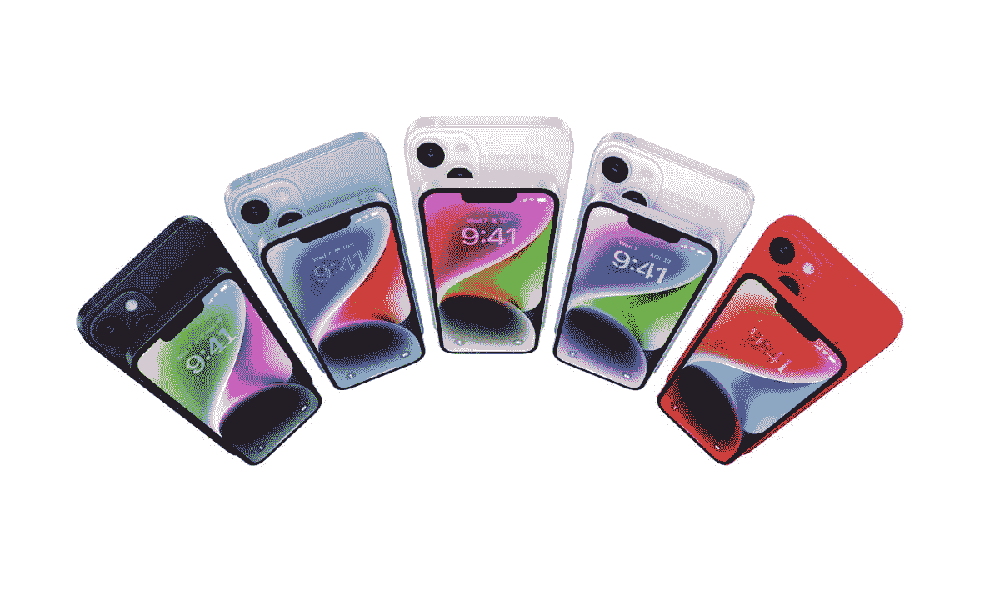

# 苹果通过可拆卸的后玻璃简化了 iPhone 14 的维修

> 原文：<https://www.xda-developers.com/apple-iphone-14-back-glass-removal/>

苹果 [iPhone 14](https://www.xda-developers.com/apple-iphone-14/) 和 [iPhone 14 Pro](https://www.xda-developers.com/apple-iphone-14-pro/) 将于 9 月 16 日首次零售。虽然大多数注意力将集中在 iPhone 14 Pro 上，但看起来 iPhone 14 可能会提供一个有趣的变化，使未来的维修变得容易得多。

据消息人士 *CNET* 和 *TechCrunch* 称，苹果 iPhone 14 不仅会提供新的内部设计，有助于热量调节，而且它的外部设计也会有一个重要的不同。消息人士称，苹果公司已经对玻璃背板进行了修改，因为现在可以在不拆卸整个手机的情况下将其移除。这是非常重要的，因为以前的型号要么需要完全拆卸，要么必须撕开后玻璃面板才能更换。根据 MacRumors 的说法，这一变化可能只适用于 iPhone 14 的标准型号，也适用于 iPhone 14 Plus，因为没有提到 Pro 系列具有相同的结构。

 <picture></picture> 

Apple iPhone 14

##### 苹果 iPhone 14

iPhone 14 由苹果的 A15 处理器驱动，具有令人印象深刻的摄像头和显示屏。

尽管有这样的变化，苹果仍然收取相当多的费用来维修 iPhone 14 上的玻璃面板。通过查看苹果支持网站，我们可以看到，如果设备不在 AppleCare Plus 服务计划下，自付费用总计将为 169 美元。如果移除过程足够简单，这可能会鼓励人们在事故发生时修理自己的设备。毕竟，苹果确实通过其新的[自我修复程序](https://www.xda-developers.com/apple-launches-self-service-repair/)提供了上门维修的选项。苹果 iPhone 14 和 iPhone 14 Pro 将于 9 月 16 日进行零售首次亮相。那些寻找更大显示屏 iPhone 的人可能对 iPhone 14 Plus 更感兴趣。除了新的 iPhone 型号，苹果还将发布 Watch Series 8、Apple Watch Ultra 和第二代 AirPods Pro。

* * *

**来源** : [CNET](https://www.cnet.com/tech/mobile/iphone-14-review-good-upgrade-for-most-people/) ， [TechCrunch](https://techcrunch.com/2022/09/14/review-apple-iphone-14-pro/)

**Via**:[MAC rumors](https://www.macrumors.com/2022/09/15/iphone-14-removable-back-glass/)