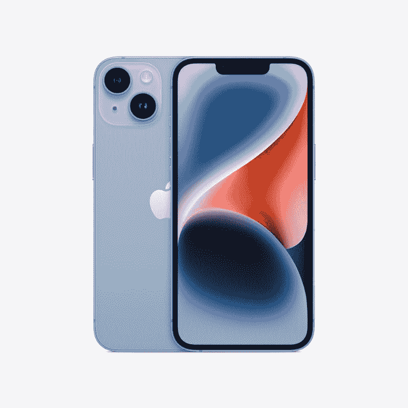
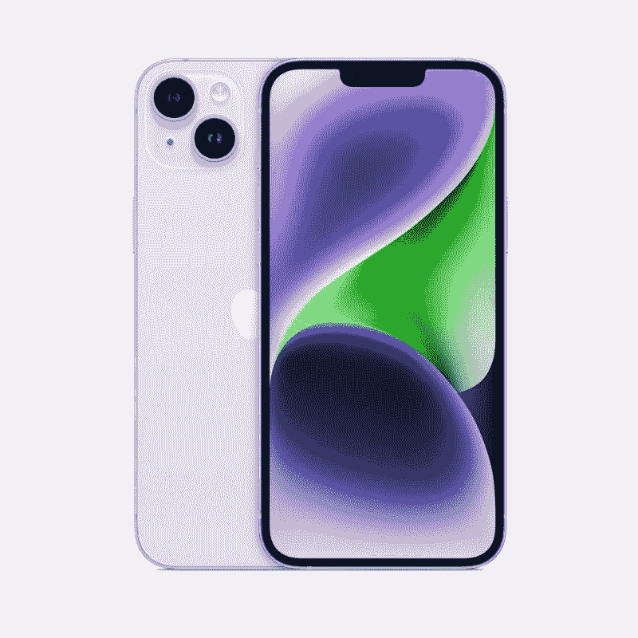

# 新的 iPhone 14 和 iPhone 14 Plus 具有新的主摄像头和自拍摄像头，双 eSIM 支持，以及通过卫星的紧急呼救功能

> 原文：<https://www.xda-developers.com/apple-iphone-14-launch/>

尽管过去的几款 iPhones 并不特别令人兴奋，但我们还是热切期待今年的阵容。这是因为在过去的几个月里，我们已经看到了大量关于 iPhone 14 阵容的泄露和传言，突出了最新型号的重大升级。等待终于结束了，在今天的“远在天边”活动上，苹果巨头揭开了 iPhone 14 系列的盖子，旁边还有 [iPhone 14 Pro 系列](https://www.xda-developers.com/apple-iphone-14-pro/)、 [AirPods Pro 2](https://www.xda-developers.com/apple-airpods-pro-2/) 、 [Apple Watch Series 8](https://www.xda-developers.com/apple-watch-series-8/) 、 [Apple Watch SE 2](https://www.xda-developers.com/apple-watch-se-2-launch/) 和 [Apple Watch Ultra](https://www.xda-developers.com/apple-watch-ultra-launch/) 。

与去年一样，全新的 iPhone 14 系列包括四款新设备。然而，苹果已经从今年的阵容中放弃了“迷你”变种，转而支持新的 Plus 变种。与 iPhone 12 Mini 和 iPhone 13 Mini 不同，新款 iPhone 14 Plus 位于普通 iPhone 14 和 iPhone 14 Pro 之间。它本质上与普通型号相同，但有一个更大的 6.7 英寸显示屏。可悲的是，这两种版本都带来了增量升级，苹果公司限制了 Pro 版本的大多数重大变化。

 <picture></picture> 

iPhone 14

iPhone 14 现在是苹果旗舰产品阵容中最实惠的设备。它对去年的机型进行了小幅升级，包括新的主摄像头和自拍摄像头。

 <picture></picture> 

Apple iPhone 14

iPhone 14 Plus 是苹果旗舰智能手机阵容中的新成员。它本质上与普通 iPhone 14 相同，但屏幕和电池更大。

鉴于非专业的变体看起来与去年的模型没有什么不同，你可能会想知道它们会带来什么变化。如果是这样，请继续阅读，了解 iPhone 14 和 iPhone 14 Plus 的新功能。

## iPhone 14 和 iPhone 14 Plus 硬件升级和新功能

尽管新款 iPhone 14 和 iPhone 14 Plus 采用了与去年型号相同的 A15 仿生芯片，但新款手机配备了一个新的 12MP 主摄像头，具有更大的传感器、190 万像素、f/1.5 光圈和传感器移位 OIS。苹果声称，新相机的弱光性能提高了 49%。超宽相机保持不变，但手机正面有一个新的真正的深度相机，具有更快的 f/1.9 光圈、自动对焦和 38%的低光性能。

苹果通过新的光子引擎进一步改善了软件方面的弱光性能，iPhone 14 系列的超宽和自拍相机的弱光性能提高了 2 倍，主相机的弱光性能提高了 2.5 倍。对于视频，新的 iPhones 有一个新的动作模式和先进的稳定功能。

此外，新的 iPhone 14 和 iPhone 14 Plus 获得了对多个 eSIMs 的支持。因此，用户现在可以在同一台设备上存储两个 eSIMs。虽然 iPhone 13 系列也有这项功能，但苹果已经取消了所有美国机型的 SIM 卡托盘，以促进 e SIM 的采用。新型号还支持碰撞检测，使用新的高动态范围陀螺仪和双核加速度计来准确检测碰撞。

此外，苹果公司在新款机型上引入了一项新的安全功能，称为卫星紧急呼救。该功能利用 iPhone 天线中的定制组件和专门的软件来连接通信卫星。该功能利用一个新的应用程序，告诉你在哪里可以将手机连接到卫星并发送紧急信息。

它使用一种定制的短文本压缩算法，将消息压缩三分之一，以便通过通信卫星快速发送。有趣的是，苹果不希望你只在紧急情况下使用这个功能。出于这个原因，该公司在“查找我的”应用程序中加入了一个新功能，让你通过卫星与你爱的人分享你的位置。从今年 11 月开始，紧急求救信号将在美国和加拿大免费提供两年。

## iPhone 14 和 iPhone 14 Plus:规格

现在，您已经了解了 iPhone 14 和 iPhone 14 Plus 的所有新功能，下面简单介绍一下它们的硬件规格。

| 

规格

 | 

iPhone 14

 | 

iPhone 14 Plus

 |
| --- | --- | --- |
| **建造** | 

*   陶瓷屏蔽前部
*   玻璃背面
*   铝制中框
*   IP68 防尘防水等级

 | 

*   陶瓷屏蔽前部
*   玻璃背面
*   铝制中框
*   IP68 防尘防水等级

 |
| **尺寸&重量** | 

*   146.7 x 71.5 x 7.8mm 毫米
*   172 克

 | 

*   160.8 x 78.1 x 7.8mm 毫米
*   203 克

 |
| **显示** | 

*   6.1 英寸 Super Retina XDR 有机发光二极管显示屏
*   2532 x 1170p 分辨率，460PPI
*   直接热轧制
*   原彩显示
*   宽颜色(P3)
*   2000000:1 对比度
*   最大亮度 800 尼特，峰值亮度 1200 尼特
*   抗指纹疏油涂层

 | 

*   6.7 英寸 Super Retina XDR 有机发光二极管显示屏
*   2778 x 1284p 分辨率，458PPI
*   直接热轧制
*   原彩显示
*   宽颜色(P3)
*   2000000:1 对比度
*   最大亮度 800 尼特，峰值亮度 1200 尼特
*   抗指纹疏油涂层

 |
| **SoC** | 

*   苹果 A15 仿生
    *   6 核 CPU
        *   2 个性能内核
        *   4 个效率核心
    *   5 核 GPU
    *   16 核神经引擎

 | 

*   苹果 A15 仿生
    *   6 核 CPU
        *   2 个性能内核
        *   4 个效率核心
    *   5 核 GPU
    *   16 核神经引擎

 |
| **存储** |  |  |
| **电池&充电** | 

*   电池额定功率为
    *   长达 20 小时的视频播放
    *   长达 16 小时的视频流
    *   长达 80 小时的音频播放
*   支持快速充电
    *   使用 20W 或更高的适配器(单独销售)，大约 30 分钟即可充满 50%的电量
*   高达 15W 的无线充电

 | 

*   电池额定功率为
    *   长达 26 小时的视频播放
    *   长达 20 小时的视频流
    *   长达 100 小时的音频播放
*   支持快速充电
    *   使用 20W 或更高的适配器(单独销售)，大约 30 分钟即可充满 50%的电量
*   高达 15W 的无线充电

 |
| **安全** | Face ID | Face ID |
| **后置摄像头** | 

*   主要:12MP f/1.5，传感器移位 OIS
*   超宽:12MP f/2.4，120 度 FoV
*   蓝宝石水晶透镜盖
*   真实色调闪光

 | 

*   主要:12MP f/1.5，传感器移位 OIS
*   超宽:12MP f/2.4，120 度 FoV
*   蓝宝石水晶透镜盖
*   真实色调闪光

 |
| **前置摄像头** | 

*   1200 万像素 f/1.9，带对焦像素的自动对焦

 | 

*   1200 万像素 f/1.9，带对焦像素的自动对焦

 |
| **端口** | 闪电连接器 | 闪电连接器 |
| **音频** | 立体声扬声器 | 立体声扬声器 |
| **连通性** | 

*   5G(低于 6GHz，毫米波)支持 4x4 MIMO
*   支持 4x4 MIMO 和 LAA 的 4G LTE
*   带 2x2 MIMO 的 Wi-Fi 6
*   蓝牙 5.3
*   用于空间感知的超宽带芯片
*   国家足球联盟
*   双 eSIM 支持(美国型号与物理 SIM 卡不兼容)

 | 

*   5G(低于 6GHz，毫米波)支持 4x4 MIMO
*   支持 4x4 MIMO 和 LAA 的 4G LTE
*   带 2x2 MIMO 的 Wi-Fi 6
*   蓝牙 5.3
*   用于空间感知的超宽带芯片
*   国家足球联盟
*   双 eSIM 支持(美国型号与物理 SIM 卡不兼容)

 |
| **软件** | iOS 16 | iOS 16 |
| **传感器** | 

*   晴雨表
*   高动态范围陀螺仪
*   高 g 加速度计
*   近程传感器
*   双环境光传感器

 | 

*   晴雨表
*   高动态范围陀螺仪
*   高 g 加速度计
*   近程传感器
*   双环境光传感器

 |

## 定价和可用性

iPhone 14 和 iPhone 14 Plus 有五种颜色——午夜、星光、蓝色、紫色和产品红。iPhone 14 的起价为 799 美元，而 Plus 版本的起价为 899 美元。这两款机型将于 9 月 9 日开始接受预购，但 iPhone 14 将于 9 月 16 日上市，iPhone 14 Plus 将于 10 月 7 日上市。查看以下部分，了解完整的定价详情。

*   iPhone 14
    *   128 GB:799 美元
    *   256 GB:899 美元
    *   512 GB:1099 美元
*   iPhone 14 Plus
    *   128 GB:899 美元
    *   256 GB:999 美元
    *   512 GB:1199 美元

* * *

*如何看待新 iPhone 14 和 iPhone 14 Plus？你会升级到新机型，还是会继续使用旧 iPhone 一年？请在下面的评论区告诉我们。*