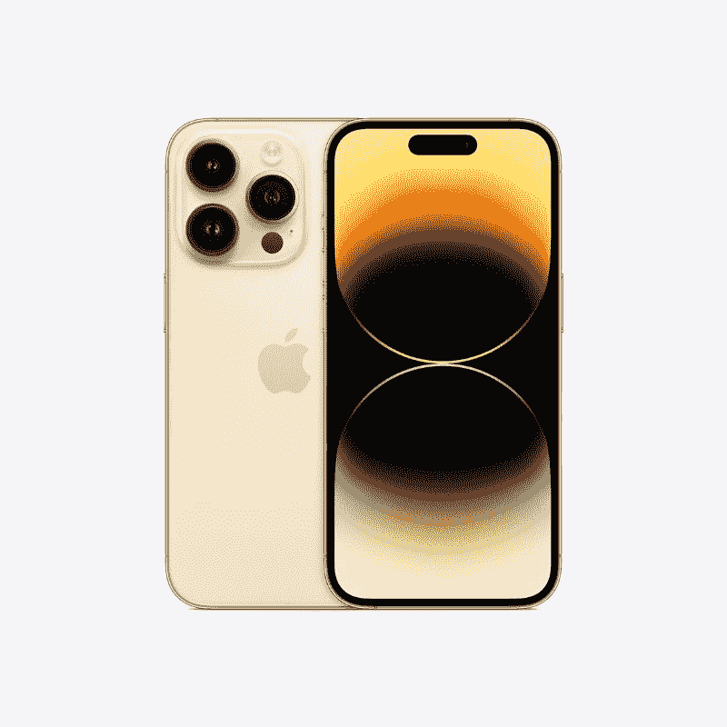
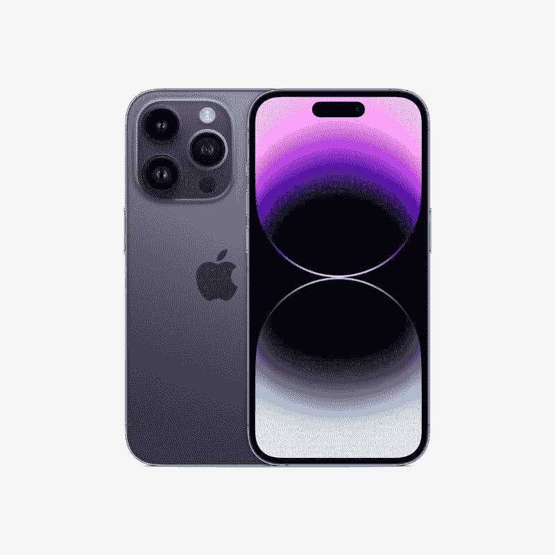
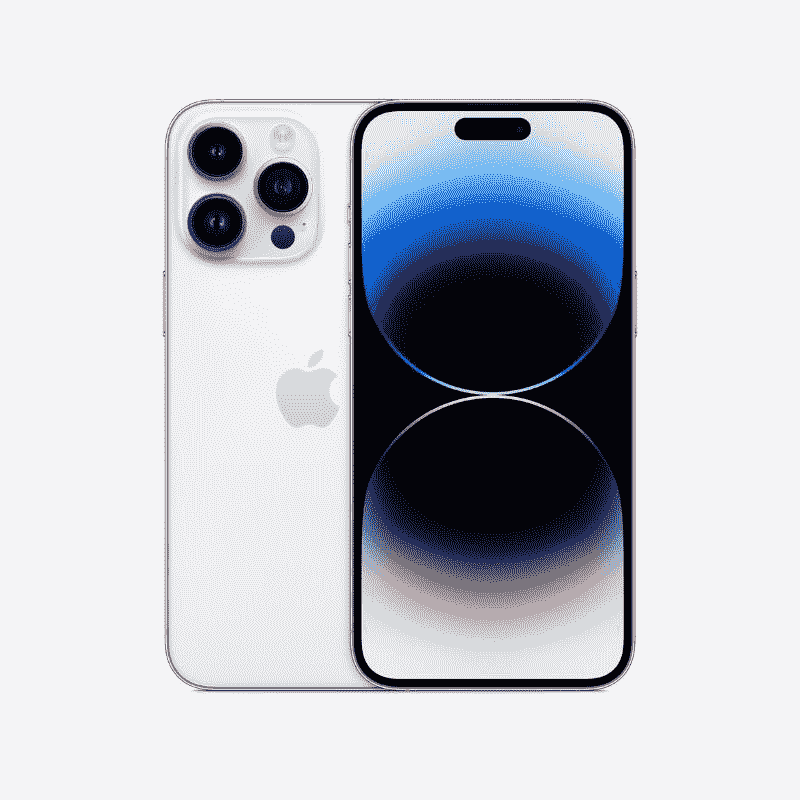

# 苹果 iPhone 14 Pro 和 iPhone 14 Pro Max 有什么颜色可选？

> 原文：<https://www.xda-developers.com/apple-iphone-14-pro-colors/>

除了普通的 [iPhone 14](https://www.xda-developers.com/apple-iphone-14/) 和更大的 Plus 版本，苹果今年还推出了被称为 [iPhone 14 Pro](https://www.xda-developers.com/apple-iphone-14-pro-review/) 和 [iPhone 14 Pro Max](https://www.xda-developers.com/apple-iphone-14-pro-max-review/) 的 Pro 型号。我们已经了解了新 iPhones 的一切，所以现在是时候将焦点转向颜色选择了。在本文中，我们将看看所有的 iPhone 14 Pro 颜色，看看哪种颜色看起来最好。

今年，新的 iPhone 14 Pro 型号有太空黑、深紫色、银色和金色。太空黑的变体看起来很大程度上类似于去年模型上的石墨涂层，所以本质上，深紫色是今年唯一的新配色。所有专业型号的背面都经过哑光处理，主机周围有一个光滑的框架。这是新颜色的样子:

## 苹果 iPhone 14 Pro:颜色

普通的 iPhone 14 Pro 型号在前面配备了 6.1 英寸的显示屏。它非常适合那些无法处理巨大的“最大”尺寸变体的人。

正如你所看到的，太空黑的颜色看起来或多或少与去年 iPhone 13 Pro 型号的石墨色相同。它看起来比现实生活中的石墨色要暗一些，但看起来仍然和旧的配色一样优雅。

 <picture></picture> 

Apple iPhone 14 Pro

银色 iPhone 14 Pro 看起来和石墨色一样干净。多年来，它一直是 iPhone 最受欢迎的颜色之一，也理所应当如此。这种颜色最好的一点是它不会轻易显示污迹和指纹。

 <picture></picture> 

Apple iPhone 14 Pro

金色可能是你能为 iPhone 14 Pro 挑选的最优雅的颜色。正如你所看到的，今年的金色表面与去年的模型相似，所以你知道会发生什么。

 <picture></picture> 

Deep Purple

今年专业型号的新品是深紫色配色。这种紫色看起来比你在普通 iPhone 14 手机上看到的更暗。如果你想买新东西，这是你应该选择的颜色。

## 苹果 iPhone 14 Pro Max:颜色

iPhone 14 Pro Max 变种比普通 Pro 型号更大。这些手机有 6.7 英寸的显示屏和更大的电池。但是，它们也有相同的颜色。来，看一看:

如果你想让人们知道你有一部新的 iPhones，就选择闪亮的深紫色吧。这是我们在普通 iPhone 14 上得到的略暗的紫色，所以请记住这一点。

 <picture></picture> 

Apple iPhone 14 Pro Max

银色是新 iPhones 最安全的颜色之一。这种特殊的表面处理已经存在很长一段时间了，所以当你把手机从盒子里拿出来的时候，你应该知道会发生什么。

 <picture></picture> 

Apple iPhone 14 Pro Max

正如我们之前提到的，金色是新款 iPhones 最优雅的颜色之一。它使手机看起来非常复杂，所以你一定会用它来吸引一些人的眼球。

 <picture></picture> 

Apple iPhone 14 Pro Max

太空黑 iPhone 14 Pro Max 看起来与去年的石墨表面非常相似。它看起来比现实生活中的石墨颜色暗一点，但在其他方面它们几乎是一样的。

* * *

## 结束语

这些是你可以为新款 iPhone Pro 选择的颜色。我们认为银色和新的太空黑是最安全的颜色，因为它们已经存在很长时间了。金色也是一种常青的颜色，让手机看起来非常精致。但是如果你今年想要新的东西，那么你必须选择深紫色。我们过去已经在其他 iPhone 上看到过这种特殊颜色的不同色调，但新款 iPhone 14 Pro 由于背面的哑光处理，看起来略有不同。

常规的 [iPhone 14](https://www.xda-developers.com/apple-iphone-14-review/) 型号也有一些有趣的配色。然而，这些表面看起来与你在专业阵容中得到的不同，所以在做出购买决定之前，一定要看看它们。不管新的表面看起来有多好，我们总是建议购买一个[最好的外壳](https://www.xda-developers.com/best-apple-iphone-14-pro-cases/)来保护你的智能手机。对于新的 iPhones 来说，它们可能有点贵，所以一定要访问我们的[最佳交易](https://www.xda-developers.com/best-apple-iphone-14-deals/)页面，看看你是否能在购买时达成交易。