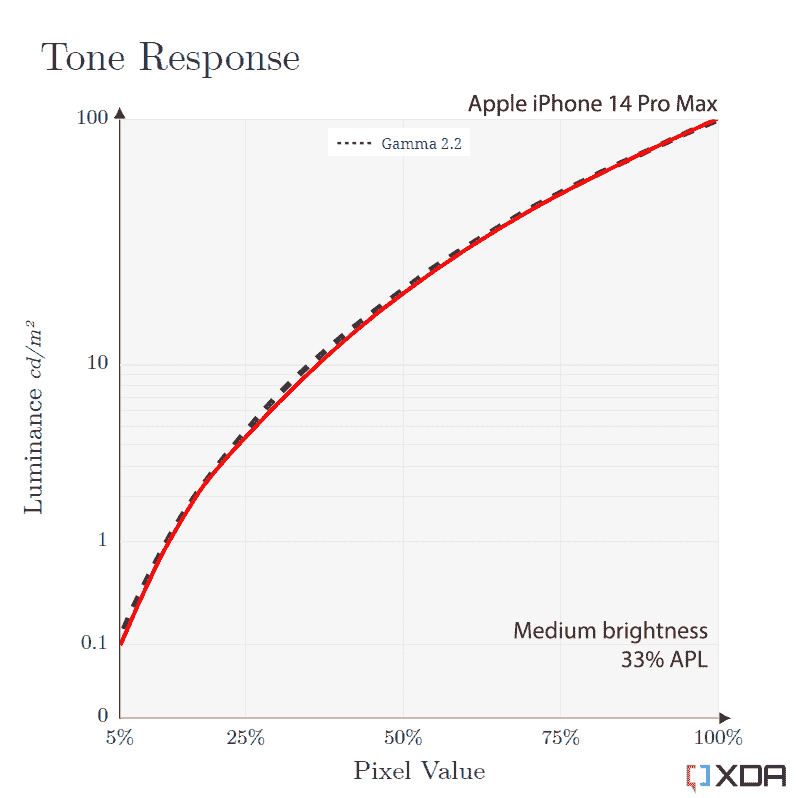
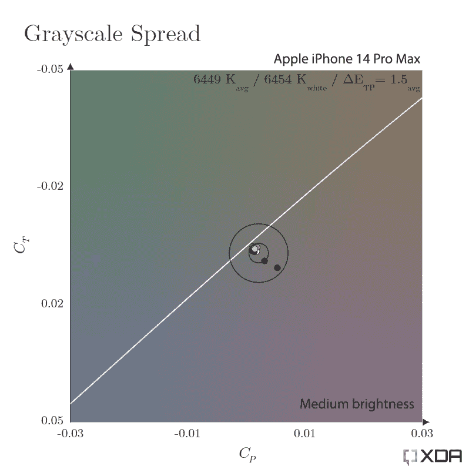
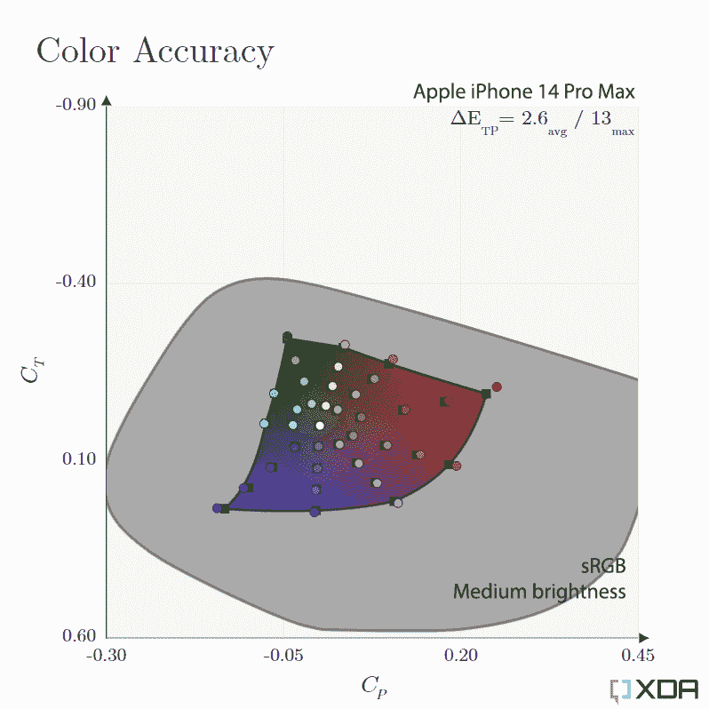

# iPhone 14 Pro Max 显示器评测:有机发光二极管的巅峰之作

> 原文：<https://www.xda-developers.com/apple-iphone-14-pro-max-display-review/>

在科技泡沫中有一句常见的话，经常会遇到两极分化的感觉:“苹果通常不是第一个采用任何特定类型技术的人，但当它这样做时，苹果通常会做得正确(T2)

听到这些只能让我的眼睛打转，因为有太多的例子表明这与事实相去甚远(*咳嗽*Siri)。但我承认，在某些情况下，这句格言非常适用，而有机发光二极管显示器恰好是其中之一。

iPhone 14 Pro 的有机发光二极管显示屏与目前市场上的其他显示屏相比是独一无二的，除了我们通常对其屏幕质量的技术评估之外，我们还将详细说明这一点。

***关于这篇评论:**这篇评论中的产品已经从 Apple Store 购买。苹果公司与这篇文章的内容无关。*

iPhone 14 Pro Max 是苹果最大最好的智能手机，在典型的苹果时尚中，它既是一个发电站，也是一个耐力怪兽。

**Specifications**

*   **品牌:**苹果
*   **显示屏:** 6.7 英寸有机发光二极管，120 赫兹，杜比视界 HDR
*   **操作系统:** iOS
*   **尺寸:** 160.7 x 77.6 x 7.9 毫米
*   **展示类型:**柔性有机发光二极管，PenTile 钻石
*   价格:1099 美元

**Pros**

*   同类最佳的户外屏幕清晰度
*   在所有条件下都具有出色的色彩准确度和精确度
*   即使在低亮度下也不会出现黑色拖影
*   一流的 HDR 观看体验
*   超高效可变刷新实现

**Cons**

*   在低亮度下阴影略显陡峭
*   无手动白平衡调节
*   在最低亮度下，被测设备周边的屏幕变色

### 浏览这篇文章

1.  [硬件和功能:不是你一般的有机发光二极管](#hardware-and-features-not-your-average-oled)
2.  [亮度和功率测试:比你想象的更多的 nits](#brightness-and-power-testing-more-nits-than-you-think)
3.  [屏幕刷新测试:自适应智能](#screen-refresh-testing-adaptive-smarts)
4.  [色域和光谱测试:颜色略多](#color-gamut-and-spectra-testing-slightly-more-colors)
5.  [对比度和色调响应测试:阳光改善](#contrast-and-tone-response-testing-sunlight-improvements)
6.  [色彩准确度和精度测试:近乎完美的校准](#color-accuracy-and-precision-testing-almost-flawless-calibration)
7.  [HDR10 再现测试:苹果的 HDR 体验更好](#hdr10-reproduction-testing-apple-39-s-hdr-experience-is-even-better)
8.  [最终想法](#final-thoughts)

## 硬件和功能:不是你的平均有机发光二极管

你可能会在显示屏上注意到的第一件事是苹果公司命名为[动态岛](https://www.xda-developers.com/apple-dynamic-island-editorial/)的大切口。它确实引起了人们对自身的注意；在最小化它的存在时，没有微妙或戏谑的努力。这是我期望很快克服的，就像我对待所有屏幕入侵一样，但这是我第一次觉得它真的很碍眼。

它是一个药丸形状的切口，内置摄像头，还可以显示苹果钱包交易和其他警报等信息。它确实提供了一些生活质量的改善，但我并没有发现这种体验有太多的革命性。这在未来可能会改变，也许一两年后会有更多的应用程序使用它。

动态岛会占据相当大的屏幕空间

正如预期的那样，iPhone 14 Pro Max 使用了三星显示最新最棒的技术(LG Display 将于 2023 年开始使用)。但在深入研究之前，有必要强调一下，有机发光二极管并不是苹果只是从显示器供应商那里“订购”最好组件的简单案例。有些人可能认为，硬件相似的每款手机都具有超强的可比性，但事实并非如此。苹果完全在内部开发其显示驱动 IC，其设计元素在其他旗舰手机上找不到。

iPhone 14 Pro 有机发光二极管拥有其他旗舰手机所没有的设计元素。

一个这样的例子是它的像素结构。自 iPhone X 以来，该公司的有机发光二极管使用了比其他手机大得多的蓝色子像素。这在理论上通过降低蓝色发射器的衰减率导致面板老化变慢，蓝色发射器具有最快的寿命。苹果的红色和绿色子像素也略大，占据了更多的 OLED 面板总面积。与三星 Galaxy S22 Ultra 有机发光二极管相比，iPhone 14 Pro Max 的相对发射面积要大 40%左右。

iPhone 14 Pro Max 和 Galaxy S22 Ultra 之间的子像素比较

我最喜欢这个屏幕的一个特点是，它是我见过的唯一一个几乎完全缓解黑色到灰色像素过渡响应时间慢的问题(也称为黑色涂抹*)的有机发光二极管。*在其他 OLEDs 上，当在低亮度下使用深色主题的应用程序时，这种黑色像素的涂抹变得非常令人讨厌，使与 UI 元素的交互感觉不太满意。一些公司通过阻止像素实际关闭，并让它们成为有机发光二极管可以输出的最暗灰色来解决这个问题。然而，这种对比度的降低在黑暗的房间里非常明显。我很高兴看到 iPhone 14 Pro 似乎没有使用这种方法，并且它确实显示纯黑色的零像素发射。

我不知道苹果用什么样的技术来消除这些文物，但这是不折不扣的黑魔法，我希望其他公司也能效仿。这些是我喜欢使用纯黑色有机发光二极管应用程序主题的唯一的手机。同样，iPhone OLEDs 是我见过的第一款完全避免近黑色剪裁(也称为黑色挤压)的产品，这是困扰许多旧款有机发光二极管手机的另一个问题。

## 亮度和功率测试:比你想象的要多

不同手机的峰值屏幕亮度与窗口大小的关系

与许多显示器一样，iPhone 14 Pro 屏幕最引人注目的规格升级是其新发现的峰值亮度。苹果在其主题演讲中声称，iPhone 14 Pro 在户外时可以达到 2000 尼特，这是目前任何其他手机都无法达到的水平。然而，与所有其他 OLEDs 一样，这种峰值亮度取决于发光像素的数量及其强度。对于 iPhone 14 Pro Max 来说，只有当屏幕有 25%或更少的像素点亮，或者整个屏幕的平均亮度低于 500 尼特时，其有机发光二极管才能达到声称的 2000 尼特。

事实证明，苹果公司声称的 2000 尼特并不夸张，因为我测得显示器在 10%的窗口下实际上可以输出 2200 尼特，在 1%的窗口下可以输出 2300 尼特。当然，对于任何类型的内容来说，1%的白色窗口都不是一个现实的场景，这是许多其他手机制造商用来推销其屏幕峰值亮度的条件。我很高兴看到苹果报告其屏幕的真实指标。明年，我们无疑会看到其他公司为这一代有机发光二极管广告 2300 尼特的峰值亮度。

iPhone 14 Pro 能够输出高达 2300 尼特的能量——超过了苹果声称的 2000 尼特。

有些人可能已经注意到，iPhone 14 Pro 看起来不会总是比三星 Galaxy S22 Ultra 甚至去年的手机更亮。这是因为当大部分屏幕是白色时(例如，在灯光主题的应用程序中)，有机发光二极管只会输出大约 1050 尼特，这与其他优质手机相同。事实上，如果我们看看 iPhone 14 Pro 的峰值亮度图，iPhone 14 Pro Max 仅在 50%的窗口下提升了高于 1，050 尼特(也称为平均像素水平，或 APL)。这意味着 iPhone 14 Pro 屏幕只能在黑暗模式应用程序中或在观看全屏媒体时以更高的亮度显示内容。否则就是和去年手机差不多的观看体验。

鉴于这些数据，苹果似乎有可能在更高的像素水平上人为限制其峰值亮度。如果我们从较低像素级别的峰值亮度测量中推断，iPhone 14 Pro 有机发光二极管应该能够达到 1400 尼特左右的全屏亮度，因为有机发光二极管亮度下降通常遵循与窗口大小相关的对数曲线。

那么为什么会有限制呢？显而易见的答案是电池问题，但目的是什么呢？对于那些一天大部分时间都在户外的人来说，当手机屏幕在明亮使用几分钟后亮度降低时，这可能会很烦人。从我的测试来看，iPhone 14 Pro 有机发光二极管似乎与 iPhone 13 Pro 的全屏峰值亮度相匹配，但新屏幕现在可以无限期地保持在这个亮度范围内。虽然当输出 2000+尼特几分钟时，屏幕会像预期的那样减速回到 1000 尼特。

各种手机的全屏亮度与显示功率图

不幸的是，我们没有 iPhone 13 Pro 或 Galaxy S22 Ultra 的显示功率测量值，但我们有 Galaxy S22 Plus 的读数，它们应该与前两者有类似的功率测量值，因为它们都使用相同的有机发光二极管材料集。最大的区别是 S22 Plus 不包含混合氧化物晶体管(LTPO/霍普)，这可能会对发光效率产生轻微影响。

与使用与 iPhone 13 Pro 相同的有机发光二极管材料集的 Galaxy S22 Plus 相比，新款 iPhone 14 Pro Max 有机发光二极管在低于 500 尼特时的功耗约低 10%。这也是因为其屏幕面积比 Galaxy S22 Plus 大 4.6%。然而，在接近峰值亮度时，iPhone 14 Pro 似乎实际上比 Galaxy S22 Plus 消耗的电量略多。我相信这是由于苹果限制了全屏峰值亮度，同时使用更高的电压状态来实现 2000+nit 峰值。

与三星 Galaxy S22 Plus 相比，这款新有机发光二极管的功耗约低 10%。

在测量新的永远在线显示器的电池消耗时，我发现该功能使用高达 350 毫瓦的显示功率，取决于环境照明。在平均约 300 勒克斯的办公室照明中，该功能仅使用了约 100 毫瓦。对于大约 16，000 毫瓦时的标称电池容量，这是每小时 0.6%到 2.2%之间的额外电池消耗。

## 屏幕刷新测试:自适应智能

苹果称其自适应高刷新率系统解决方案为 ProMotion，该公司首次在 2017 年 iPad Pro 上推出该解决方案。它于去年与 iPhone 13 Pro 一起首次出现在手机上，今年仍然是一项专业功能(我猜这就是它的名字)。一个不同之处是，今年的有机发光二极管现在下降到 1 赫兹，但只是在永远显示模式下。在此条件之外，最小刷新率仍为 10 Hz。我对 iPhone 14 Pro 有机发光二极管的时间光谱进行的测量证实了这一行为。

有人抱怨为什么苹果没有决定在空闲时将用户界面降低到 1 Hz。其原因是较低的刷新率会使像素放电更长时间，正常屏幕操作中的 1 Hz 模式在黑暗条件下可能会出现闪烁。例如，当通过我的周边视觉在弱光下观看时，总是打开的显示器已经显示出闪烁。

然而，与 10 Hz 相比，空闲到 1 Hz 的功率节省在始终开启的显示器之外是可以忽略的。作为参考，在 10 Hz 和 60 Hz 下驱动有机发光二极管的差异只有大约 50 毫瓦，或者大约为 iPhone 14 Pro Max 每小时差异的 0.3%*—*1hz 和 10 Hz 之间的差异甚至会更低。

就闪烁情况而言，iPhone 14 Pro 的脉宽调制(PWM)使用 480 Hz 的基频。一些用户报告由于下意识地注意到这种闪烁而感到不适，但 iPhone 14 Pro 的闪烁频率应该足够快，大多数人不会注意到。然而，这种频率在接近有机发光二极管的最小亮度时变慢，PWM 控制器改为在两个周期内工作，使得 240 Hz 成为低亮度时的主要闪烁频率。由于像素的上升和下降持续时间不是瞬时的，而是在低亮度下实际上更慢，所以这种下降步骤可能将像素的平均亮度保持在更可预测的值。

苹果的促销系统非常强大，能够适应比我们测试过的其他手机更多的条件。

还有一个奇怪的 60 赫兹信号，出现在低亮度下，伴随着奇次谐波。这是正常刷新周期的方波的特征，但使其神秘的是，即使当屏幕滚动超过 60 赫兹时，信号也存在。目前，我的最佳猜测是，它有助于在低亮度下进一步稳定屏幕亮度。

不同帧速率(24fps、25fps、30fps)下 iPhone 14 Pro Max 的视频回放频率

对于视频播放，可变刷新率的一个独特优势是能够将屏幕刷新率与内容的帧速率相匹配。有些人在 24 FPS 视频期间会感觉到抖动，因为这些帧速率没有完全划分为 60 Hz，如果只是为了清晰地回放 24 FPS 而以 120 Hz 运行显示器，那将是一种功率浪费。在这一类别中，苹果的推广系统确实是同类最佳的，不仅能够适应 24 FPS 的视频，而且能够适应 10 FPS、15 FPS、25 FPS，甚至 30 FPS 的视频。我测试过的其他可变刷新有机发光二极管手机都无法适应所有这些条件，这可能有助于苹果如何在视频播放期间管理如此出色的电池运行时间。当视频在屏幕上播放时，大多数其他手机只是让显示屏保持在 60 赫兹。

## 色域和光谱测试:颜色略多

iPhone 14 Pro 拥有来自面板供应商的全新有机发光二极管发射器材料。蓝色发射体的主波长从 460 纳米下移至 455 纳米，绿色发射体的光谱带宽稍微更尖锐。这些变化使 iPhone 14 Pro 色域的最大尺寸增加了约 5%。然而，这些颜色并没有真正使用，因为苹果的颜色管理仅限于在 DCI-P3 工作。相反，这些发射器可能只是促进了面板的功率效率的提高。

大多数消费内容最多只利用 DCI-P3 原色，因此这种色域限制不是什么大问题。它还可以确保 P3 显示器之间的颜色一致，至少在我们拥有可以覆盖更大部分 BT.2020 色彩空间的消费显示器之前是如此。

## 对比度和色调反应测试:阳光改善

许多老式 OLEDs 由于其自动亮度限制器(ABL)而遭受不准确的伽马校准。这种效果会降低有机发光二极管与屏幕平均像素值成比例的整体亮度，从而使校准变得困难。今天，大多数智能手机都通过最小化 ABL 的影响来解决这个问题，这是通过在 ABL 最强的时候，将像素的亮度限制在与全屏白色相关的相同亮度来实现的。

 <picture></picture> 

Medium brightness

iPhone 14 Pro Max 的色调响应图(100 尼特，33% APL)

苹果 iPhone 14 Pro Max 的音调响应图表

像大多数手机和电脑显示器一样，iPhone 14 Pro 显示屏的目标是伪标准的 2.2 伽马色调响应。从低到高的亮度，其色调校准对其目标极其精确。然而，需要理解的重要一点是，2.2-伽马色调曲线并不总是合适的响应，该约定仅真正用于中到高亮度水平(100-500 尼特)以及中到低屏幕眩光。

在阳光下改善的色调响应是对内容易读性的巨大改进。

iPhone 14 Pro 显示屏在阳光下更具可读性的部分原因不仅仅是其新的峰值白色亮度，而是它如何对其余颜色进行色调映射。这一代人的新有机发光二极管现在将提高阴影和中间色调的亮度，以抵消户外屏幕的眩光。我抱怨过以前的所有 iPhones 都没有这种行为，我很高兴终于看到它被添加进来，因为它极大地提高了内容的易读性。

大幅调整色调亮度通常会导致色调失真，但 iPhone 上的颜色在这种模式下同样准确。这表明调整应用于像素的衍生亮度信号，而不是直接应用于颜色通道，这是苹果对细节的卓越关注。

但从更坏的方面来看，我很难过地看到苹果取消了最低亮度校准。在 iPhone 13 系列之前，苹果对其 OLEDs 进行了校准，以便在低亮度水平下具有更平坦的色调曲线。这使得在弱光下阅读手机对眼睛来说更容易，并且减少了照片和视频中的黑色剪辑(或黑色挤压)的出现。现在，我发现自己更经常地需要提高屏幕亮度来分辨我正在观看的内容中的阴影。使用 2.2 伽马电源只是在低亮度下提供了太多的对比度，作为一个夜猫子，这是我最不喜欢 iPhone 14 Pro 屏幕的一个方面。另一方面，这款手机完全没有黑色涂抹，这足以弥补这一点。

## 色彩准确度和精度测试:近乎完美的校准

 <picture></picture> 

Medium brightness

苹果 iPhone 14 Pro Max 的灰度分布图(中等亮度，33% APL)

苹果 iPhone 14 Pro Max 的灰度分布图

iPhone 14 Pro 的色彩精度非常出色，因为白色在所有亮度级别下都非常接近 D65。更好的是，较深的灰色阴影仍然非常接近白色，并且在灰色调之间看不到任何颜色着色。上图中的两个圆环代表灰度测量值之间的色差阈值(实心圆)；对于受过训练的观众，内圈是临界适应参数下的绝对阈值，外圈是正常条件和正常人的软阈值。

正如我们所看到的，我的大部分灰度测量值都在绝对阈值内，只有几个非常暗的测量值稍微偏出一点，但仍在正常阈值内。苹果公司在这一校准质量方面一直名列前茅，因此这并不令人惊讶。

iPhone 14 Pro Max 的面板灰度均匀性，在极暗的 0.01 尼特拍摄。校正颜色以匹配我的眼睛所看到的。

然而，与每个有机发光二极管一样，每个单元的面板灰度均匀性不同。在最低亮度下，可以在屏幕周围看到轻微的暖色调。这并没有想象中的那么糟糕，虽然这不是一个破坏交易的因素，但在我过去两年使用旗舰手机后看到这一点有点失望，这些手机都有原始的面板。我估计这可能与新有机发光二极管材料集的当前产量有关，因为三星显示上次用三星 Galaxy S10 和 iPhone 11 Pro 中的 M10 材料集更换蓝色发射器时遇到了类似的问题。或者我可能只是运气不好。

虽然 iPhone 14 Pro 可能会精确测量到 6500 K，但现实是它实际上与 D65 规格的预期外观有所不同。这是我在过去的评论中提到的事情，我将继续这样做，直到这些公司提供这个问题的解决方案。以下是我在最近的[谷歌 Pixel 7 Pro 显示器评测](https://www.xda-developers.com/google-pixel-7-pro-display-review/)中写的内容:

> 事实是，目前的颜色测量方法并没有为颜色匹配提供一个明确的评估。事实证明，OLEDs 和 LCD 之间光谱分布的差异造成了它们白点外观的不一致。更准确地说，与相同尺寸的 LCD 显示器相比，OLEDs 上的白色通常呈现黄绿色。这被称为 [*同色异谱失效*](https://www.chromapure.com/newgear-metamericfailure.asp) ，它被广泛认为会发生在 OLEDs 等宽色域显示器上。标准光源(例如 D65)的光谱分布与 LCD 的光谱分布更接近，现在用作参考。为此，[OLED 的白点需要向品红色偏移](https://pro.sony/s3/2021/01/22153635/Monitor_Colormatching_v100_201222_E.pdf)，以在感知上匹配两种显示技术。

举个具体的例子，我把我的[谷歌 Pixel 7 Pro 有机发光二极管](https://www.xda-developers.com/google-pixel-7-pro-display-review/#lab-testing-color-accuracy-amp-precision)和我校准过的 LCD 显示器的白色进行了颜色匹配。Pixel 7 Pro 还具有出色的白平衡校准，在中等亮度及以下的情况下，测量甚至比 iPhone 14 Pro Max 更精确。在匹配我的两个显示器后，测量 Pixel 7 Pro 白点的结果是δE 色距离值为 12.2，这是很重要的。与过去配备液晶显示器的 iPhones 相比，这种区别也很明显，因为液晶显示器看起来有准确的白色。如果苹果真的努力为其显示器提供一致的色彩再现，他们绝对是这样，那么这是他们需要优先考虑的问题，以便其 OLEDs 在专业上是可靠的。

 <picture></picture> 

Medium brightness

iPhone 14 Pro Max 的 sRGB 色彩准确度图(中等亮度，50% APL，75%强度)

苹果 iPhone 14 Pro Max 的 sRGB 色彩准确度图

苹果 iPhone 14 Pro Max 的 P3D65 色彩准确度图

至于其余颜色，iPhone 14 Pro 校准*几乎*完美无瑕。一个问题是，接近最大色度的红色在默认的 sRGB 色彩空间内会稍微过饱和并发生色调偏移。但最终，除非你去寻找，否则几乎没有人会注意到这一点；那些专业处理图形和颜色的人应该意识到这一点。

在户外使用手机时，屏幕上的颜色会被反射光洗掉，影响颜色的准确性。在明亮的条件下，新 iPhones 将提高色彩饱和度，以补偿这种颜色的减少。正如我们之前所报道的，这种屏幕还将提高其色调亮度，这与它的峰值亮度一起，构成了迄今为止最清晰的手机屏幕。

## HDR10 再现测试:苹果的 HDR 体验更好

自从 iPhone XS 问世以来，苹果提供了无可挑剔的 HDR 观看体验，可以说比其他任何手机都要好。这一点在今天仍然适用，其催化剂是 iOS 显示“比白色更亮”的高光的能力。归根结底，这种从峰值参考白的抽象是高动态范围媒体的本质之一，苹果是第一批正确执行它的公司之一。四年后，谷歌 Pixel 7 Pro 是第一款提供类似功能的安卓手机。

### HDR10 入门

在各种 HDR 视频标准中， *HDR10* 格式是电影中最常用的格式。杜比视界建立在这个标准之上，两者的基线都是所谓的 ST.2084 感知量化器音调响应曲线，简称 PQ。与用于 SDR 内容的 gamma-2.2 非常相似，HDR 保真度在很大程度上依赖于屏幕准确再现这条曲线。但与 gamma-2.2 相比，一个很大的区别是 PQ 曲线是一个*绝对*色调响应，这意味着它将像素值定义为一个*精确的*屏幕亮度值。另一方面，Gamma-2.2 将像素值与屏幕亮度值相关联，屏幕亮度值是白色的屏幕当前峰值亮度的相对百分比。

如果我们从字面上理解 PQ 规范，那么这意味着当调整屏幕亮度时，遵循该曲线的 HDR 内容的曝光不会改变。显然，在日常使用中，这完全没有意义，因为内容应该随着我们想要的亮度而缩放。大多数显示器将根据屏幕的最大背光水平校准到该曲线，并在播放 HDR 内容时自动切换到该亮度。这是许多 Android 手机运行的数量，但这遇到了以峰值亮度渲染操作系统其余部分的问题。

对此的补救办法是将屏幕上除 HDR 内容外的所有内容变暗，这就是苹果(以及最近的谷歌)所做的。当 HDR 内容出现时，操作系统会逐渐提高屏幕亮度，同时按比例降低 UI 其余部分的像素值，欺骗用户认为这只是 HDR 高光变亮了。这就是软件如何实现那些“比白色更亮”的高光，看起来比 UI 的白色更强烈。

苹果 iPhone 14 Pro Max 的 HDR10 校准图(英国 2100，MCLL 1000，秋季 20)

让 iPhone HDR 观看体验更好的是苹果如何缩放 HDR10 视频的外观。ST.2084 规范的视频亮度假设观众在黑暗的房间内观看，但情况并非总是如此；同样的视频亮度在户外或办公室照明下会显得太暗。因此，苹果决定将 ST.2084 曲线的支点设置在 50%系统亮度附近。在这个中点上，iPhone 会精确地重现 ST.2084 曲线；高于或低于此亮度，系统色调会相应地映射视频亮度。许多 Android 手机将枢轴点设置为 100%的系统亮度，这意味着您需要将手机设置为最大亮度，以便在黑暗的房间中播放视频。由于这个原因，HDR 在许多安卓手机上经常显得太暗。

一个警告是，iPhone 14 Pro 似乎没有使用静态元数据将其峰值亮度色调映射到 HDR10 的最大内容亮度级别。相反，它根据用户的亮度有一个固定的衰减。正因为如此，iPhone 14 Pro 将在低亮度下裁剪高强度的颜色和高光(如我在上面的测量中所示)，而不是将它们滚掉，从而恶化画质。幸运的是，iPhone OLEDs 支持杜比视觉，它负责动态色调映射。我测试过的唯一支持正确的元数据色调映射的手机是三星 Galaxy S22 系列，它在绝对色调准确性方面超过了 iPhone 14 Pro。

## 最后的想法

在许多领域，智能手机的改进越来越多，越来越乏味。对于屏幕来说，色彩准确度已经不是问题，似乎唯一真正的基准是它们能有多亮。感觉就像是在上周，600 尼特被认为是“优秀”的户外用品，而我们正在迅速将这一数字提高到四倍。但是，关于手机的入口，还有无数其他的品质——客观的和主观的——当我终于开始写一些不仅仅是炫耀数字的东西时，这令人耳目一新。

iPhone 14 Pro Max 不仅包含了任何产品中最好的显示硬件，还散发着技术技巧和周到的工程设计。与其他公司相比，苹果不会费心用额外的活力来装饰屏幕，也不会用不切实际的基准测量来夸大亮度数字。相反，该公司专注于推动屏幕和色彩标准的前沿，无论是好是坏。

提醒你一下，iPhone 14 Pro 有机发光二极管并不完美(真是个惊喜)。有我更喜欢的其他手机的校准选择；例如，在全屏播放 SDR 视频时，我宁愿使用谷歌 Pixel 7 Pro 或索尼 2.4-gamma 的低亮度色调响应。其他手机也提供手动白平衡调节，这是修复 OLEDs 条件配色故障所必需的。但尽管它不是每个类别中绝对最好的屏幕，但这是我给出的所有评论中最受好评的一个，我可以肯定 iPhone 14 Pro Max 有机发光二极管是我在当今任何手机上看到的最令人印象深刻的屏幕。

iPhone 14 Pro Max 是苹果最大最好的智能手机，在典型的苹果时尚中，它既是一个发电站，也是一个耐力怪兽。