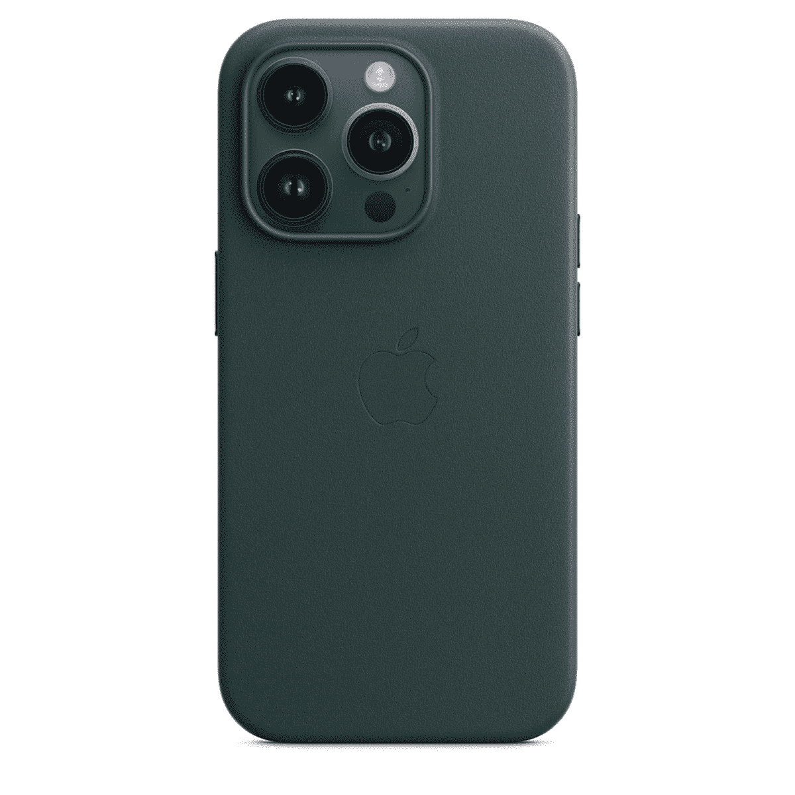
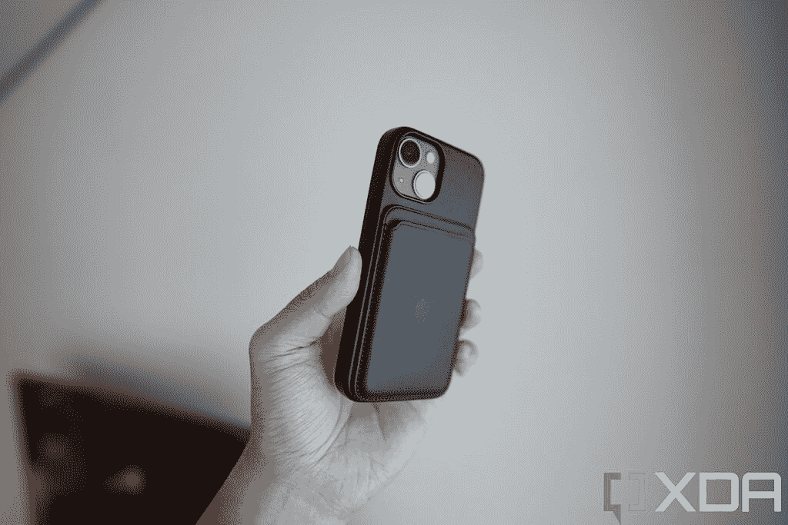

# iPhone 14 Pro Max 皮套搭配 MagSafe 点评:优质手感，完美贴合

> 原文：<https://www.xda-developers.com/apple-iphone-14-pro-max-leather-case-with-magsafe-review/>

大多数人在获得智能手机后首先购买的东西是智能手机外壳——见鬼，有人在拿到手机之前就买了外壳。虽然 iPhone 14 Pro 系列绝对不缺乏保护套选择，但购买官方第一方苹果保护套以确保它完全适合，尤其是在设备发布的前几周，这可能是值得的。我们来看看苹果官方为其 iPhone 14 系列推出的带有 MagSafe 的皮套。

所以，我实际上是在测试 [iPhone 14 Pro Max](https://www.xda-developers.com/apple-iphone-14-pro-max-review/) 的外壳，但实际上，这些外壳对所有 iPhone 14 型号(甚至 iPhone 13 型号)来说都是完全一样的，所以你可以把我在这篇评论中所说的几乎所有东西都应用到你选择的苹果官方皮套上。大小和尺寸将与你购买的产品相匹配，但除此之外，质量和适合度将在苹果的产品线中保持一致。

 <picture></picture> 

Apple iPhone 14 Pro Max Leather Case with MagSafe

##### 苹果皮革 iPhone 14 Pro Max 保护套

官方皮套确保完美贴合，符合苹果的质量标准。

* * *

## 设计、颜色和合身程度

苹果为其 iPhone 14 系列配备 MagSafe 的皮套无论你选择哪种型号，价格都是 59 美元，有五种颜色:棕色(棕色)、森林绿(绿色)、午夜(黑色)、橙色(亮橙色)，我专门测试的皮套颜色是墨色(深蓝色)。

皮革摸起来很柔软，包裹着整个背面和外壳的侧面(除了按钮)，这是我喜欢的，因为还有其他类型的皮革外壳，只有背面是皮革，侧面是塑料。我不喜欢我的手机上的任何塑料(我从来不使用大多数中国手机附带的硅胶外壳)。是的，我知道我被宠坏了。

表壳内部覆盖着这种 Alcantara(意大利织物)材料，虽然苹果没有具体说明这一点，但表壳的实际骨架很可能是塑料。这是一款一体式保护套，也就是说它可以直接扣在 iPhone 上。合身又安全——作为苹果的第一方产品，最好如此。

摄像头切口周围有一个凸起的唇缘，可以保护摄像头，防止手机面朝上平放在桌子上时镜头接触到表面。按钮上有塑料盖，提供点击触觉反馈。

接下来的这一点可能会引起分歧:我喜欢包裹手机的保险杠相对较薄，所以如果我直视 iPhone，它基本上仍然保持无边框的全屏外观。一些更具保护性的保险杠外壳在设备周围增加了如此厚的嘴唇，以至于它远离了现代超薄边框手机的幻想。

不是每个人都会同意我的观点，因为保险杠越厚，对手机的保护就越大。我没有摔过这款 iPhone 14 Pro Max，但是我摔过 iPhone 13 Pro Max 用同样的苹果官方皮套，手机一点划痕都没有。我必须提到，我一直非常小心我的手机。如果你经常摔手机，你可能想要一个更大的保护套。

外壳重约 25g，这并没有给已经很重的 iPhone 14 Pro Max 增加太多重量。基本上，如果你对 Pro Max iPhones 的尺寸和重量没问题，我不认为增加这个外壳会让它超过你的接受门槛。

我喜欢皮套的一个原因是，作为一种材料，皮革比其他材料更有个性。随着时间的推移，皮革会变得古色古香，这意味着由于皮革每天都在使用，暴露在现实世界中，皮革会产生细微的痕迹和颜色变化，为表壳增添一种有机氛围。我已经很久没有使用这种特殊的外壳和颜色来评论铜绿了，但我在 iPhone 12 和 iPhone 13 系列中使用过黑色的官方皮革外壳，这些年来它们只有轻微的颜色变化，而它们的磨损(皮革粉丝欣赏的)更明显一些。

另一件要注意的事情是:自从苹果公司从 iPhone 12 系列开始转向平侧设计以来，我一直认为 Pro Max iPhones 握起来不舒服(我对 iPhone 11 Pro Max 没有这个问题)，这款皮套对我来说真的提高了舒适度，因为皮革饰面软化了手机的尖锐点。

* * *

## 特殊特点

顾名思义，这种情况下支持 MagSafe，这是苹果磁性配件生态系统的名称。表壳内有磁铁，使 MagSafe 充电器(或其他 MagSafe 配件)每次都能精确地卡在背面。磁力强度似乎和一部裸露的 iPhone 一样强。

 <picture></picture> 

This is last year's iPhone 13 Mini with Apple's official leather case pictured, but you get the idea -- these cases work fine with all MagSafe accessories.

* * *

## 该不该买带 MagSafe 的 iPhone 14 Pro 皮套？

如果你想为你的新 iPhone 买一个高级感的皮套，并且接受 59 美元的价格，那么当然，你应该买这个。这款保护套正如广告宣传的那样，改善了手感和握持感，并为许多人提供了足够的保护。

如果你想为你的新 iPhone 买一个高级感的皮套，那么你应该买这个

然而，iPhone 保护套市场巨大，并不缺乏其他皮革保护套可供选择。在亚马逊上搜索一下，就能找到几十个关于 iPhone 14 Pro 皮套的结果，而且大多数都比苹果的要价便宜。但从产品照片来看，很多看起来并不高档，而且很多都有我不喜欢的塑料保险杠。

 <picture></picture> 

Apple iPhone 14 Pro Max Leather Case with MagSafe

##### 苹果皮革 iPhone 14 Pro Max 保护套

iPhone 14 Pro Max 官方皮套提供 MagSafe 支撑，完美贴合。