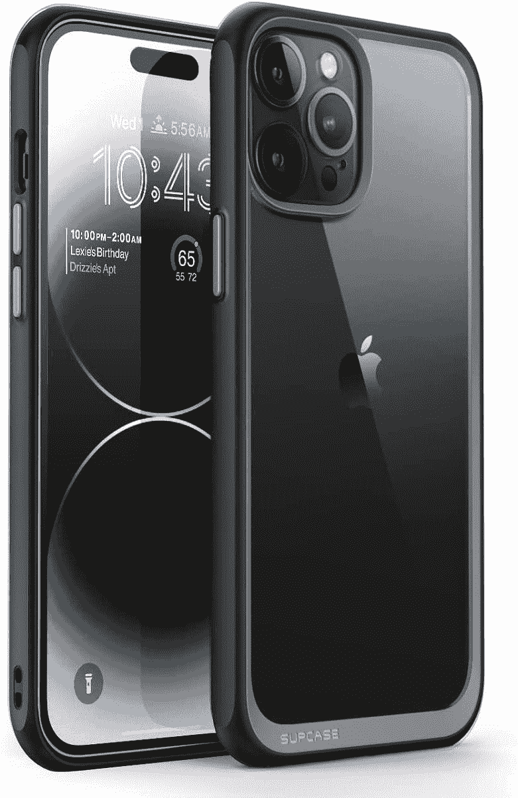

# 为什么我不在我的新 iPhone 14 Pro 上使用“始终显示”

> 原文：<https://www.xda-developers.com/apple-iphone-14-pro-why-i-dont-use-aod-editorial/>

在很大程度上， [iPhone 14 Pro](https://www.xda-developers.com/apple-iphone-14-pro-review/) 比之前的型号好一点点，提供了改进的 SoC、摄像头和一种新颜色，深紫色。以任何标准来看，它都被认为是一个相当温和的版本，但是，苹果就是苹果，它成功地加入了两个引起了相当大的狂热的新功能，即[动态岛](https://www.xda-developers.com/apple-dynamic-island-utility-android-competition-editorial/)和它的永远显示(永远显示)。

[在苹果发布](https://www.xda-developers.com/how-to-enable-always-on-display-android/)之前，一直在线的显示屏已经存在多年，存在于各种平台上，如 Symbian、Meego、Windows Phone 和 Android。虽然苹果一直以来都是通过推出在其他平台上已经存在多年的“革命性”新功能来开玩笑，但今年，它真的成功展示了一些非常独特的东西。这是因为苹果的“永远显示”与我们所看到的和预期的背道而驰。

## iPhone 14 Pro 的始终显示仅仅是 iOS 16 锁屏的延伸，这是一个问题

有了苹果，当你收到新的通知时，你不会得到一个小图标弹出来显示你的时尚和简约的外观。不，那太简单了。相反，你会得到一个锁屏显示，它看起来就像你的手机显示屏打开时一样，以全彩色呈现，有个性化的壁纸，通知像正常一样在屏幕上弹出。唯一的区别是手机的显示屏极其昏暗，但这也可以根据环境自动调节。

就像所有其他最近的永远在线实现一样，苹果已经能够依靠其新的有机发光二极管 LTPO 显示器来实现这一点，该显示器可以完成大多数繁重的工作，刷新率可以低至 1Hz。仅供参考，去年的型号只降到了 10Hz。

苹果有潜力创造一些神奇的东西，但这种体验却令人叹为观止

因此，基础就在这里，苹果有潜力创造一些神奇的东西，但这种体验令人惊叹地失败了。永远在线的显示屏很好用，它做到了它承诺的一切，但它的症结确实是苹果一直在努力的地方。它没有全力以赴，真正探索，而是剥夺了该功能的潜力，因为苹果对其实现的限制非常严格。在这种情况下,“始终显示”的强度取决于它所能显示的信息，在当前的形式下，它实际上并不能显示太多信息。

在 iOS 16.0.2 的当前迭代中，锁定屏幕提供了三个可以定制的区域。最上面一行可以显示以下内容之一:日期、日历事件、国际时钟、闹钟、活动跟踪器和各种天气信息。下面是三个空间中最大的一个，是为时间预留的。最后一个区域是最通用的，最多可以加载四个小部件或两个中等大小的部件。然而，这里可以显示的信息与第一部分相比并没有太大的变化，但它确实有所增加，比如一个电池小部件。

简而言之，目前缺乏第三方支持确实扼杀了锁屏，这也扼杀了始终显示的体验。这也相当令人分心，从字面上理解“永远在线”。一些更柔和更黑暗的东西会解决这个问题。

实际上，这里有一个更大的问题，因为 iPhone 14 Pro 上显示的新 Always 有一个更大的问题。

## 像没有明天一样啜饮着电池

始终显示的最大问题是它会影响电池寿命。现在，这是意料之中的事情，但对于一个对我来说没有那么多作用的特性，这感觉像是一个巨大的权衡。我认为，由于 iPhones 以电池续航时间长而闻名，这次电池耗尽有点令人震惊。我选择了 iPhone 14 Pro，期望获得更长的电池续航时间，但我的体验是短暂的，在一天结束前挣扎着——令人惊讶的是，这款手机没有蜂窝连接，我只依赖 Wi-Fi 连接。

虽然这可能是一个孤立的体验，但在我的使用中，我发现当打开“永远显示”功能时，手机的电池寿命增加了约 20%。iPhone 在早上六点开始一天的工作，通常会在午夜左右回到充电器上。同样，这可能是一个孤立的发现，也可能与当前的软件版本有关，但是经过几天相同的时间表，结果基本保持不变。此外，几乎没有什么互动，通知也像往常一样源源不断。

我不知道其他人如何想象永远显示和锁定屏幕，但对我来说，我认为它会更灵活，利用第三方应用程序和小工具。我也觉得总是展示实际上会很有用，并且有更多我需要看到的信息。也许这是我抱有期望的错，但在我的脑海中，我想象它会像 Apple Watch 及其复杂功能一样工作。尽管苹果手表上的定制选项有限，但它仍然能够提供良好的体验，主要是因为它可以向你展示你需要看一眼的所有内容。Apple Watch 还提供了许多应用集成，这些数据可以通过手表上的复杂功能获得。我认为值得一提的是，它从来没有被限制过。

当然，将一个新特性与一个已经成熟了七年的产品进行比较是不公平的。iPhone 14 Pro 的始终显示和锁屏仍处于初级阶段。如果苹果愿意投入精力，很多事情都可以改变。因此，就我目前的使用而言，永远显示将保持关闭，主要是因为电池寿命问题，但也因为它并不那么有用，首先，因为它依赖于有限的锁屏。也许当苹果增加对直播活动的支持时，它将值得重新审视。但是现在，我要关掉我新手机的一个主打功能。

 <picture></picture> 

Apple iPhone 14 Pro and Apple iPhone 14 Pro Max

##### 苹果 iPhone 14 Pro 和苹果 iPhone 14 Pro Max

iPhone 14 Pro 和 iPhone 14 Pro Max 是苹果的最新设备，采用 A16 仿生 SoC 和动态岛

 <picture></picture> 

Supcase Unicorn Beetle Style Case (Sponsored)

##### Supcase 独角兽甲壳虫风格的情况下(赞助)

除了简约纤薄的外形之外，这款保护套还提供了三种不同的颜色可供选择。