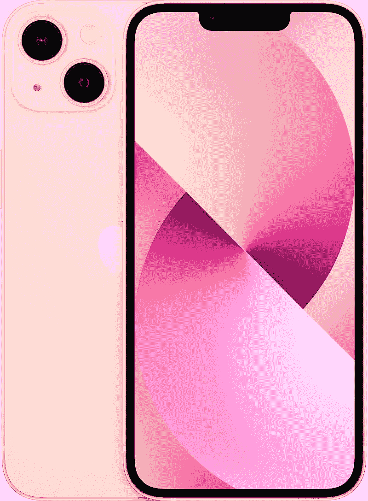

# iPhone 14 vs iPhone 12:该不该升级？

> 原文：<https://www.xda-developers.com/apple-iphone-14-vs-apple-iphone-12/>

*   iPhone 14 是 2022 年 iPhone 系列的基础型号，为普通用户提供了一套平衡的功能。

    **品牌**

    苹果

    **SoC**

    苹果 A15 仿生

    **显示屏**

    6.1 寸有机发光二极管，60Hz，HDR 10、 1200 nits

    **RAM**

    6GB

    **存储**

    128 GB/256 GB

    **电池**

    3 次要:12MP 超宽，ф/2.4

    **连接**

    Wi-Fi 6；蓝牙 5.3

    **尺寸**

    146.7 x 71.5 x 7.8mm

    **颜色**

    午夜、紫色、星光、蓝色、红色、黄色

    无线:15W Magsafe 和 7.5W Qi

    **IP 等级**

    IP68

    **价格**

    【799】

*   ##### 苹果 iPhone 12

    如果你想要一部价格合理但仍有旗舰感觉的 iPhone，看看 2020 年的 iPhone 12 就知道了。

    **品牌**

    苹果

    **SoC**

    苹果 A14 仿生

    **显示屏**

    6.1 英寸有机发光二极管，60Hz，HDR 10、 1200 nits

    **RAM**

    4GB

    **存储**

    64GB/128 GB

    **电池**

    次要:12MP 超宽，ф/2.4

    **连接**

    Wi-Fi 6；蓝牙 5.0

    **尺寸**

    146.7 x 71.5 x 7.4mm

    **颜色**

    蓝色、紫色、绿色、白色、黑色、红色

    无线:15W Magsafe 和 7.5W Qi

    **IP 等级**

    IP68

    **价格**

    【599】

    **缺点**

    *   基础型号有 64GB 的存储

iPhone 14 终于来了，除了卫星连接和略好的摄像头之外，它和它的前辈没有太大的不同。如果你正在使用 iPhone 13，没有必要升级，因为改进并不能保证一个飞跃。但是如果你拿着一部 [iPhone 12](https://www.xda-developers.com/apple-iphone-12-review/) 呢？你应该升级到最新的型号吗？或者，如果你在市场上购买新的 iPhone，你应该选择最新最好的 iPhone 14 还是省钱以优惠价格购买 iPhone 12？只有一个办法可以知道。

## 苹果 iPhone 14 vs 苹果 iPhone 12:规格

| 

**规格**

 | 

苹果 iPhone 14

 | 

苹果 iPhone 12

 |
| --- | --- | --- |
| **构建** | 

*   铝制中框
*   玻璃正面和背面
*   前玻璃的“陶瓷护罩”

 | 

*   铝制中框
*   玻璃正面和背面
*   前玻璃的“陶瓷护罩”

 |
| **尺寸&重量** | 

*   146.7 x 71.5 x 7.8mm 毫米
*   172 克

 | 

*   146.7 x 71.5 x 7.8mm 毫米
*   164 克

 |
| **显示** | 

*   6.1 英寸有机发光二极管显示屏，
*   2556 x 1179 像素分辨率，460 PPI
*   60Hz 刷新率
*   HDR 显示器，真实色调，宽颜色(P3)
*   800 尼特最大亮度，1200 尼特峰值亮度(HDR)

 | 

*   6.1 英寸有机发光二极管显示屏，
*   2556 x 1179 像素分辨率，460 PPI
*   60Hz 刷新率
*   HDR 显示器，真实色调，宽颜色(P3)
*   625 尼特最大亮度，1200 尼特峰值亮度(HDR)

 |
| **SoC** |  |  |
| **闸板&存放** | 

*   6GB 内存
*   128GB、256GB、512GB、
*   没有 microSD 卡

 | 

*   4GB 内存
*   64GB、128GB、256GB
*   没有 microSD 卡

 |
| **电池&充电** | 

*   3，279 毫安时，支持长达 20 小时的视频播放
*   20W 有线充电
*   15W MagSafe 充电
*   7.5W Qi 无线充电

 | 

*   2，815 毫安时，可播放长达 20 小时的视频
*   20W 有线充电
*   15W MagSafe 充电
*   7.5W Qi 无线充电

 |
| **安全** |  |  |
| **后置摄像头** | 

*   **主** : 12MP 宽，f/1.5 光圈，1.9μm
    *   传感器移位 OIS
    *   七元素透镜
    *   5 倍数码变焦

*   **次要:** 12MP 超宽，f/2.4 光圈

 | 

*   **主** : 12MP 宽，f/1.6 光圈，1.4μm
*   **次要:** 12MP 超宽，f/2.4 光圈

 |
| **前置摄像头** | 原深感摄像头:12MP，1.9 | 原深感摄像头:1200 万/2.2 |
| **端口** | 

*   闪电港
*   没有耳机插孔

 | 

*   闪电港
*   没有耳机插孔

 |
| **音频** | 

*   立体声扬声器
*   杜比大气
*   空间音频

 | 

*   立体声扬声器
*   杜比大气
*   空间音频

 |
| **连通性** | 

*   5G(低于 6 GHz 和毫米波)
*   支持 4×4 MIMO 和 LAA 的千兆级 LTE
*   支持 2×2 MIMO 的 Wi-Fi 6 (802.11ax)
*   蓝牙 5.3
*   超宽带(UWB)
*   国家足球联盟

 | 

*   5G(低于 6 GHz 和毫米波)
*   支持 4×4 MIMO 和 LAA 的千兆级 LTE
*   支持 2×2 MIMO 的 Wi-Fi 6 (802.11ax)
*   蓝牙 5.0
*   超宽带(UWB)
*   国家足球联盟

 |
| **软件** | 

*   现成的 iOS 14.1(可升级到 iOS 16)

 |  |
| **其他特色** |  |  |

## 设计与展示

iPhone 14 和 iPhone 12 可能相差两代，但在设计部门有很多共同点。它们大小差不多，侧面平坦，采用玻璃和铝制机身。赋予每部手机独特身份的最显著之处是背面的摄像头排列。iPhone 12 在一个方形模块内垂直堆叠了摄像头，而 iPhone 14 则对角排列(不是出于审美而是技术原因，因为新的传感器移位 OIS 机制需要更大的空间。)

iPhone 14 也比 iPhone 12 更厚更重。除此之外，两者非常相似，前面都有陶瓷保护罩，具有 IP68 防尘防水性能。iPhone 14 和 iPhone 13 之间的相似之处也延续到了显示屏领域。两款手机都提供 6.1 英寸有机发光二极管面板，分辨率为 1170 x 2532，支持杜比视觉，峰值亮度为 1200 尼特。唯一值得注意的区别是，iPhone 14 的最大亮度可以达到 800 尼特，而 iPhone 12 的面板最高可以达到 650 尼特。简单来说，iPhone 14 在阳光直射下的可读性会比 iPhone 12 更好。

* * *

## 摄像机

虽然 iPhone 14 和 iPhone 12 都配备了双 12MP + 12MP 摄像头，但它们是非常不同的相机系统。先从主摄像头说起；iPhone 12 采用 12MP f/1.6 主拍摄，OIS，像素尺寸 1.4μm。同时，iPhone 14 有一个 12MP 的拍摄器，具有更快的 f/1.5 光圈和更大的 1.9μm 像素尺寸。此外，它还具有更先进的传感器移位光学稳定功能。

来到超宽拍摄者，两款手机共享相同的 12MP f/2.4 摄像头，具有 120 度视野。至于自拍，两款手机都有 12MP 前置摄像头。然而，iPhone 14 的自拍相机更先进，因为它有更快的光圈和自动对焦。iPhone 14 有一个 12MP f/1.9 前置摄像头，具有自动对焦功能，而 iPhone 12 有一个 12MP f/2.2 定焦摄像头。

虽然两款手机都可以在良好的光线条件下拍摄出出色的照片，但 iPhone 14 在弱光条件下表现出色，这要归功于更好的硬件和苹果新的光子引擎图像管道。

就视频拍摄功能而言，iPhone 14 和 iPhone 12 可以从所有三个镜头以 60fps 的速度拍摄 4K 镜头。不过，iPhone 14 有额外的视频模式，如电影模式和动作模式，这些都是 iPhone 12 所没有的。苹果不太可能将这些功能移植到 iPhone 13 和 12 等老款 iPhone 上。

### iPhone 14 相机样品

### iPhone 12 相机样本

* * *

## 性能、电池寿命和软件

iPhone 14 由 A15 仿生芯片组驱动，与 iPhone 13 内部的芯片相同。虽然这是一个一年前的处理器，但它仍然比市场上大多数智能手机芯片组都要好，包括高通的骁龙 8 Gen 1。凭借新的 5 核 GPU，iPhone 14 的图形性能比 iPhone 13 快 18%。

至于 iPhone 12，它配备了苹果的 A14 仿生芯片组，虽然不如 A15 强大，但能够处理大多数任务和要求苛刻的游戏。在 Geekbench 5 中，iPhone 14 在单核和多核测试中的得分分别为 1，714 和 4，567，而 iPhone 12 分别为 1，323 和 3，793。

与 iPhone 12 的 2，815 毫安时电池相比，iPhone 14 配备了更大的 3，279 毫安时电池，苹果广告称前者可播放长达 20 小时的视频，后者可播放 17 小时。两款手机充电速度相同:有线 20W，mag safe 15W，Qi 无线充电 7.5W。

在软件方面，iPhone 14 运行的是开箱即用的 iOS 16，而 iPhone 12 搭载的是 14.1，但可以升级到 iOS 16。苹果通常为 iPhone 系列提供五年的软件支持，所以你可以指望这两款手机在几年内都获得 iOS 更新。但由于 iPhone 14 是一款较新的机型，因此在未来防护方面更好。

你只会在 iPhone 14 上发现的两个值得注意的功能是基本的卫星连接和崩溃检测。当你迷路或被困在一个偏远的地方，并且没有蜂窝连接时，卫星连接可以让你向紧急服务机构发送消息。同时，碰撞检测功能，顾名思义，可以检测出你是否遭遇了车祸，并自动通知紧急服务和联系人。此外，iPhone 14 还在美国放弃了物理 SIM 托盘，转而支持 eSIM。

这两款手机都提供立体声扬声器，超宽带(UWB)支持，Face ID 和 Wi-Fi 6 支持。

* * *

## iPhone 14 vs iPhone 12:该不该升级？

iPhone 14 几乎在所有方面都优于 iPhone 12，提供了更亮的屏幕、更快的芯片组、更强大的摄像头和更长的电池寿命。它还拥有基本的卫星连接和坠机检测功能。对于任何从 iPhone 11 或旧款机型升级过来的人来说，iPhone 14 都是一个值得的升级。但如果你持有 iPhone 12，我们会说等待 iPhone 15，它可能会带来许多令人兴奋的硬件升级，包括动态岛和更好的摄像头。

 <picture></picture> 

Apple iPhone 14

##### 苹果 iPhone 14

iPhone 14 由 A15 仿生芯片驱动，并提供强大的摄像头。

 <picture></picture> 

Apple iPhone 13

##### 苹果 iPhone 13

iPhone 13 提供了与 iPhone 14 类似的硬件包，价格更便宜。

iPhone 14 的起价为 799 美元，但使用[交易和折扣](https://www.xda-developers.com/best-apple-iphone-14-deals/)可以以更低的价格买到。与此同时，128GB 版本的 iPhone 12 售价为 650 美元。我们不建议此时购买 iPhone 12，因为多花 50 美元，你就可以买到 iPhone 13，它不仅更经得起未来考验，而且硬件与 iPhone 14 几乎相同。因此，如果你现在必须在 iPhone 12、13 和 14 之间做出选择，我们的建议是选择 iPhone 13，然后是 iPhone 12。iPhone 14 很棒，但 iPhone 13 更物有所值，iPhone 12 是最便宜的，也能买到很多同样的东西。iPhone 14 不值得收取所有额外的费用。

 <picture></picture> 

Apple iPhone 12

##### 苹果 iPhone 12

iPhone 12 由 A14 仿生芯片组驱动，并提供双摄像头设置。

如果你拿起 iPhone 14，一定要看看一些[推荐的保护套](https://www.xda-developers.com/best-apple-iphone-14-cases/)和[充电器](https://www.xda-developers.com/best-apple-iphone-14-chargers/)。