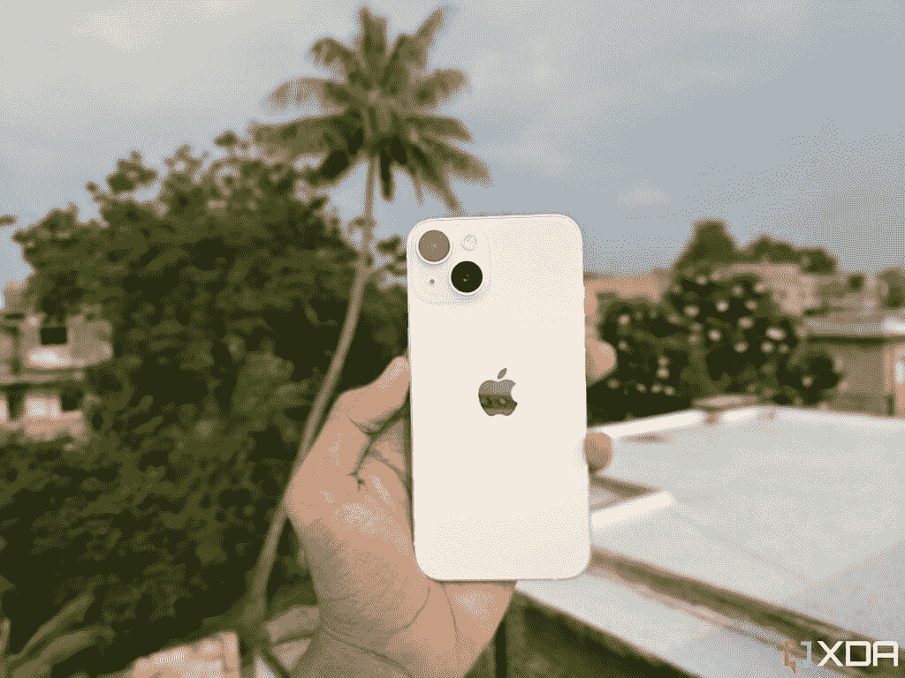
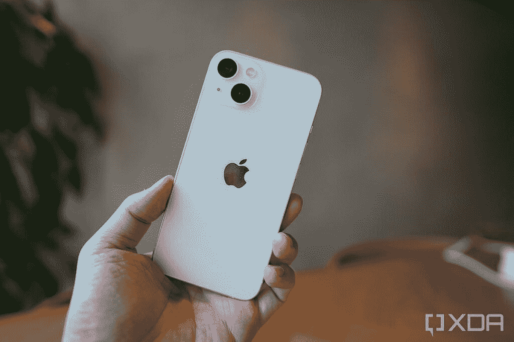
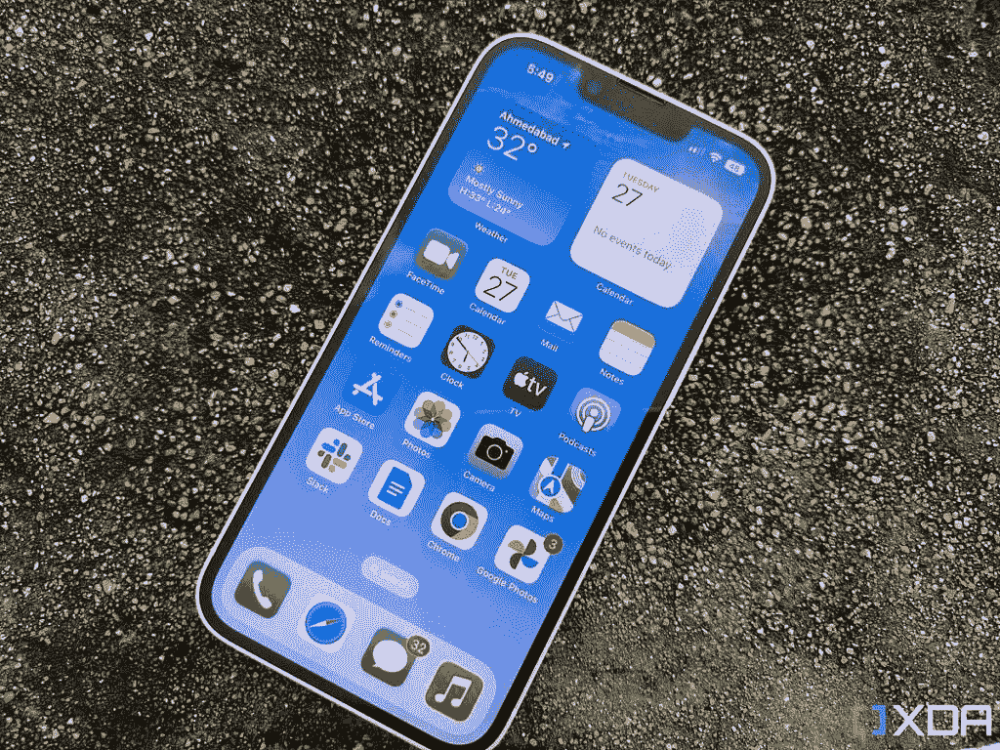
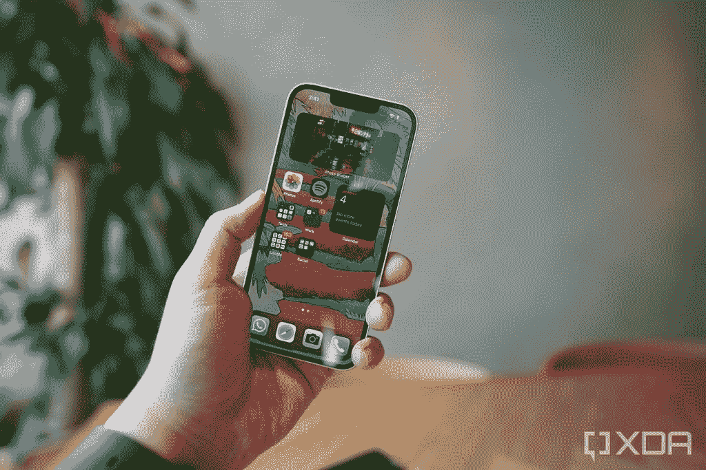
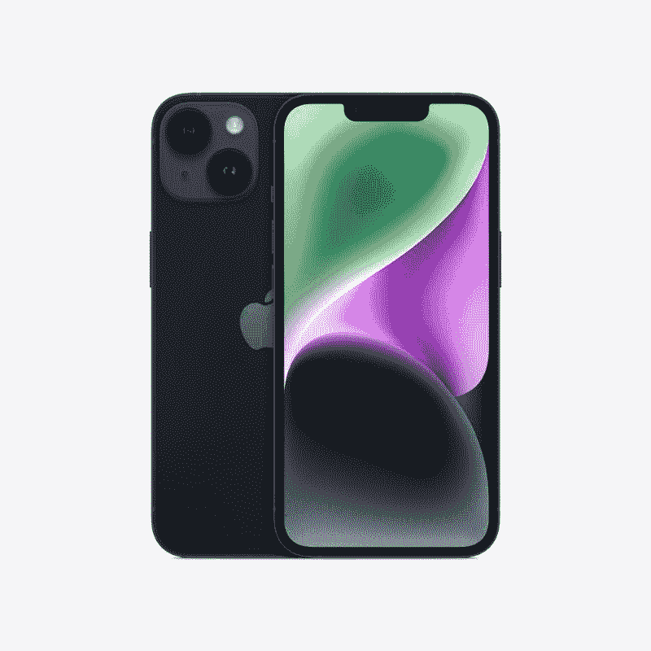
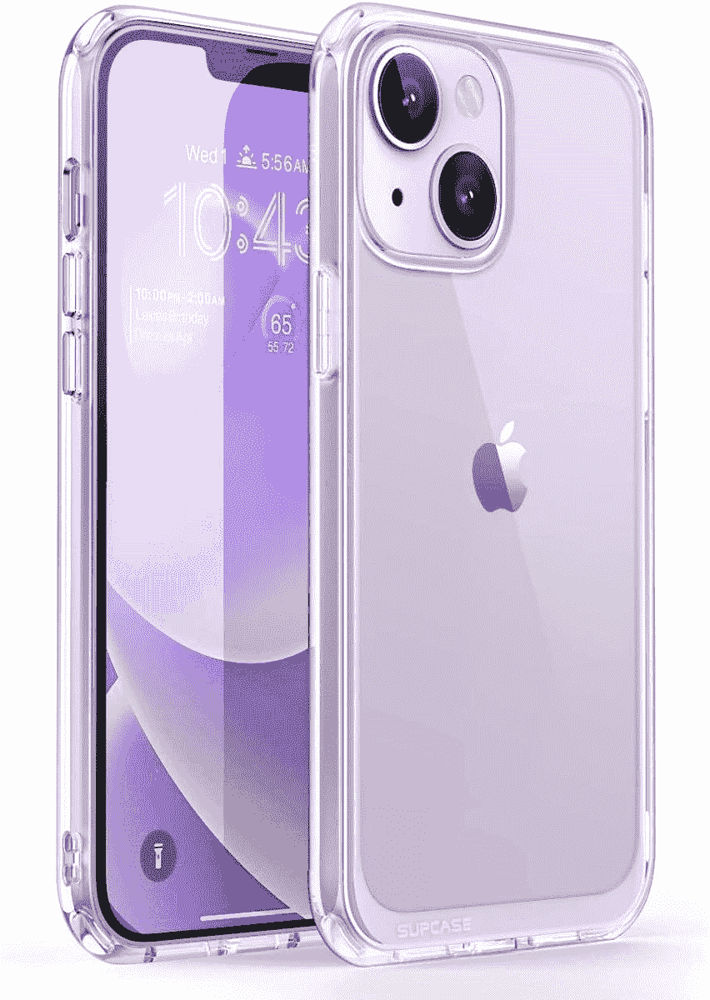

# 苹果 iPhone 14 vs 苹果 iPhone 13:该不该升级到最新的基础款？

> 原文：<https://www.xda-developers.com/apple-iphone-14-vs-apple-iphone-13/>

苹果的新 iPhone 14 系列现在已经正式发布，今年我们有多达四款新机型。但是正如我们在我们的 [iPhone 14 系列解说者](https://www.xda-developers.com/apple-iphone-14-series-explained/)中强调的每部 iPhone 之间的差异，与去年的普通 [iPhone 13](https://www.xda-developers.com/apple-iphone-13-review/) 相比，普通 [iPhone 14](https://www.xda-developers.com/apple-iphone-14-review/) 并没有带来太多。新机型真的比去年的 iPhone 好吗？让我们在这次 iPhone 14 vs iPhone 13 的对比中一探究竟。

**浏览本文:**

## 苹果 iPhone 14 vs iPhone 13:规格

下面快速浏览一下每款手机的规格，看看它们能带来什么:

| 

规格

 | 

iPhone 14

 | 

iPhone 13

 |
| --- | --- | --- |
| **打造** | 

*   陶瓷屏蔽前部
*   玻璃背面
*   铝制中框
*   IP68 防尘防水等级

 | 

*   陶瓷屏蔽前部
*   玻璃背面
*   铝制中框
*   IP68 防尘防水等级

 |
| **尺寸&重量** | 

*   146.7 x 71.5 x 7.8mm 毫米
*   172 克

 | 

*   146.7 x 71.5 x 7.6mm 毫米
*   174 克

 |
| **显示** | 

*   6.1 英寸 Super Retina XDR 有机发光二极管显示屏
*   2532 x 1170p 分辨率，460PPI
*   直接热轧制
*   原彩显示
*   宽颜色(P3)
*   2000000:1 对比度
*   最大亮度 800 尼特，峰值亮度 1200 尼特
*   抗指纹疏油涂层

 | 

*   6.1 英寸 Super Retina XDR 有机发光二极管显示屏
*   2532 x 1170p 分辨率，460PPI
*   直接热轧制
*   原彩显示
*   宽颜色(P3)
*   2000000:1 对比度
*   最大亮度 800 尼特，峰值亮度 1200 尼特
*   抗指纹疏油涂层

 |
| **SoC** | 

*   苹果 A15 仿生
*   6 核 CPU
*   2 个性能内核
*   4 个效率核心
*   5 核 GPU
*   16 核神经引擎

 | 

*   苹果 A15 仿生
*   6 核 CPU
*   2 个性能内核
*   4 个效率核心
*   四核 GPU
*   16 核神经引擎

 |
| **存储** |  |  |
| **电池&充电** | 

*   电池额定功率为
    *   长达 20 小时的视频播放
    *   长达 16 小时的视频流
    *   长达 80 小时的音频播放
*   支持快速充电
    *   使用 20W 或更高的适配器(单独销售)，大约 30 分钟即可充满 50%的电量
*   MagSafe 和 Qi 无线充电

 | 

*   电池额定功率为
    *   长达 19 小时的视频播放
    *   长达 15 小时的视频流
    *   长达 75 小时的音频播放
*   支持快速充电
    *   使用 20W 或更高的适配器(单独销售)，大约 30 分钟即可充满 50%的电量
*   MagSafe 和 Qi 无线充电

 |
| **安全** | Face ID | Face ID |
| **后置摄像头** | 

*   主要:12MP f/1.5，传感器移位 OIS
*   超宽:12MP f/2.4，120 度 FoV
*   蓝宝石水晶透镜盖
*   真实色调闪光

 | 

*   主要:12MP f/1.6，传感器移位 OIS
*   超宽:12MP f/2.4，120 度 FoV
*   蓝宝石水晶透镜盖
*   真实色调闪光

 |
| **前置摄像头** | 1200 万像素 f/1.9，带对焦像素的自动对焦 | 1200 万像素 f/2.2，带对焦像素的自动对焦 |
| **端口** | 闪电连接器 | 闪电连接器 |
| **音频** | 立体声扬声器 | 立体声扬声器 |
| **连通性** | 

*   具有 4×4 MIMO 的 5G(低于 6GHz，毫米波)
*   支持 4×4 MIMO 和 LAA 的 4G LTE
*   带 2×2 MIMO 的 Wi-Fi 6
*   蓝牙 5.3
*   用于空间感知的超宽带芯片
*   国家足球联盟
*   双 eSIM 支持(美国型号与物理 SIM 卡不兼容)

 | 

*   具有 4×4 MIMO 的 5G(低于 6GHz，毫米波)
*   支持 4×4 MIMO 和 LAA 的 4G LTE
*   带 2×2 MIMO 的 Wi-Fi 6
*   蓝牙 5.3
*   用于空间感知的超宽带芯片
*   国家足球联盟
*   双 SIM 卡支持

 |
| **软件** | iOS 16 | iOS 16 |
| **其他特性** | 

*   晴雨表
*   高动态范围陀螺仪
*   高 g 加速度计
*   近程传感器
*   双环境光传感器

 | 

*   晴雨表
*   高动态范围陀螺仪
*   高 g 加速度计
*   近程传感器
*   双环境光传感器

 |

* * *

## 设计和展示

 <picture></picture> 

Apple iPhone 14 in Starlight colorway.

iPhone 14 和 iPhone 13 有很多共同点，都是从设计开始的。它们看起来都一样，都有相同的扁平铝轨，尺寸也大致相同。新款 iPhone 比去年的型号更厚更重，但即使并排拿着两款手机，你也不会立即注意到这一点。它们都是如此的相同，如果不是因为三种新的颜色，你很难说出两者之间的区别。iPhone 14 有新的蓝色、紫色和略浅的产品红色。我们用星光色对这两款手机进行了评测，它们看起来完全一样，你可以从图片上看出来。

 <picture></picture> 

Apple iPhone 13 in Starlight colorway.

虽然 iPhone 14 从外观上看起来与 iPhone 13 一样，但两者之间有一个基本的设计差异。正如 iFixit 的拆解所揭示的那样，苹果已经完全重新设计了 iPhone 14 的内部架构，使其更容易拆卸后玻璃进行维修。这使得 iPhone 14 成为迄今为止最可修复的 iPhone。这不会改变你日常使用手机的方式，但它让新 iPhone 更容易长时间握在手中。内部设计差异不会影响耐用性，因此它们都使用相同的材料，并具有相同的 IP68 防护等级。

 <picture></picture> 

Apple iPhone 14 display.

设计并不是这次比较中唯一相似的地方，因为 iPhone 14 的屏幕——实际上和 iPhone 13 的屏幕是一样的。这意味着它仍然是一款 6.1 英寸的 OLED 面板，分辨率为 2532 x 1170p，刷新率为标准的 60Hz。60Hz 的刷新率不一定是一个交易破坏者，特别是如果你来自一个旧的 iPhone，但它肯定是 iPhone 早就应该更新的一个领域。因此，如果你希望新的 iPhone 14 型号具有更高的刷新率，那么很遗憾，这不是规格表的一部分。你还是要为 iPhone 14 Pro 机型买单。

 <picture></picture> 

Apple iPhone 13 display.

* * *

## 内部硬件和摄像头

这次比较中的两款手机都采用了苹果的 A15 仿生芯片，但它们并不完全相同。iPhone 14 中使用的 A15 Bionic 是 iPhone 13 Pro 中的 A15 Bionic，这意味着它具有一个额外的 GPU 核心。iPhone 14 内部的 A15 仿生也可能受益于新的内部设计，以更好地散热，所以这也值得考虑。然而，它不会对日常使用产生重大影响。您可能会注意到基准测试应用程序的性能略有不同，但也仅此而已。

不过，iPhone 14 中有几个硬件功能值得考虑。第一个是碰撞检测，它使用一个新的“高动态范围”陀螺仪传感器和一个高 g 加速度计来检测你是否发生了碰撞。这个特殊的功能将触发一个提示，问你是否还好，如果你在一定时间内没有回应，就会呼叫紧急服务。由于它利用了新的传感器，旧款 iPhones 不太可能支持苹果的碰撞检测功能。

iPhone 14 系列的另一个新功能是紧急求救功能。它本质上是一项服务，通过卫星通信，帮助你将信息传递给紧急救援人员。苹果公司表示，iPhones 使用一些定制的内部部件和软件，在没有手机覆盖的地区传递信息。我们不认为这项功能可以在老款 iPhones 上使用。这些都是很棒的功能，但它们足以保证更高的成本吗？那是你必须自己决定的事情。

谈到电池寿命，苹果称 iPhone 14 的电池性能有小幅提升。据该公司称，新的 iPhone 14 将获得长达 20 小时的视频播放时间，而 iPhone 13 只有 19 小时。这如何转化为现实世界的使用？当我们在评测中测试 iPhone 14 时，它提供了一整天的电池续航时间。但 iPhone 13 也是如此，去年我们在评测中测试了一整天。就像电池寿命一样，两款手机的充电速度也一样，慢得令人痛苦。使用 20W 充电器从 0 到 100%大约需要两个小时，所以它仍然无法与许多 Android 手机提供的快速充电速度相匹配。

至于光学系统，与普通的 iPhone 13 型号相比，iPhone 14 带来了一些升级的硬件。新款 iPhone 14 借用了 iPhone 13 Pro 的主摄像头，传感器更大，像素更大，f/1.5 光圈更快。超宽相机与 iPhone 13 上的相机一样，但自拍相机的光圈也更大了。将这些硬件变化与苹果新的光子引擎软件技巧相结合，你可以获得更好的弱光相机性能。与 iPhone 13 相比，iPhone 14 的相机性能会有很大的提高吗？大概不会。

我们没有在两款手机上拍摄的相同照片进行对比，但我们将在两款设备上拍摄的照片样本留给您，以便您更好地了解会发生什么。

**苹果 iPhone 14 相机样张:**

**苹果 iPhone 13 相机样品:**

众所周知，iphone 通常能提供令人印象深刻的视频性能，在这次比较中，两款 iphone 都是如此。iPhone 13 和 iPhone 14 上的三个摄像头都能够以 60fps 的速度拍摄 4K 视频。然而，iPhone 14 有几个我们认为好玩的视频功能。iPhone 13 上首次出现的电影模式现在在 4K 可以以 30fps 的速度使用，在 4K 可以以 24fps 的速度使用。苹果还增加了一个新的动作模式，让你捕捉超流畅的手持视频。

总的来说，我们认为 iPhone 13 和 iPhone 14 都可以用相机拍摄出令人印象深刻的照片和视频。新功能的加入无疑让 iPhone 14 的拍摄更加有趣，但就整体质量而言，它们都处于同一水平。

* * *

## 苹果 iPhone 14 vs iPhone 13:该买哪个？

苹果 iPhone 14 在美国的售价为 800 美元，我们认为这是一款非常棒的手机。但它仅带来了 iPhone 13 的少量升级，苹果仍以便宜 100 美元的价格出售 iPhone 13。那么应该买哪个呢？首先，如果你已经有了 iPhone 13，就不应该升级到 iPhone 14。没有令人信服的理由这样做，因为你不会错过任何重要的事情。你可能还会发现 iPhone 13 的一些[好交易，让它比现在更便宜。](https://www.xda-developers.com/best-iphone-13-deals/)

对于那些使用老款 iPhone 或者第一次使用 Android 设备的人来说也是如此。如果你不在乎像碰撞检测、紧急呼救和稍微好一点的摄像头这样的新功能，那么我们认为你应该节省 100 美元，买 iPhone 13。它仍然是一部优秀的手机，运行相同的 iOS 16 软件，性能良好。你还可以在 iPhone 13 上使用物理 SIM 卡，这本身就是许多人选择 iPhone 13 而不是美国新款的一个令人信服的原因。因此，对我们来说，选择 iPhone 13 而不是 iPhone 14 更有意义，并在这个过程中为自己节省一些钱。最新的往往不是最大的价值，iPhone 13 和 14 就是这种情绪的最好例证。

不过，这并不是说 iPhone 14 是一部糟糕的手机。如果你来自 iPhone 11 或更旧版本，并且想要所有最新的功能，那么我们认为你应该考虑购买 iPhone 14。这是对 iPhone 13 的增量升级，但它是值得的，特别是当你考虑商店中的新功能和改进时。这两款手机都运行苹果的 iOS 16 软件，但 iPhone 14 将其开箱即用，并可能拥有略长的软件支持。如果你打算拿着你的手机三年或更长时间，你也会受益于重新设计的内部部件，以防你不得不更换电池、背板或显示屏等组件。iPhone 14 多花了 100 美元，但你可以随时访问我们的[最佳 iPhone 14 交易页面](https://www.xda-developers.com/best-apple-iphone-14-deals/)，看看你是否能在购买上节省一些钱，转而在[最佳案例之一](https://www.xda-developers.com/best-apple-iphone-14-cases/)上挥霍。

*   <picture></picture>

    苹果 iPhone 14

    ##### 苹果 iPhone 14

    iPhone 14 是对 iPhone 13 的增量升级，但它代表了苹果所能提供的最好的东西。

*   <picture></picture>

    sup Case 独角甲虫风格保护套(赞助)

    ##### sup Case 独角甲虫风格保护套(赞助)

    这款保护套提供了三种不同的颜色可供选择，此外还有极简、超薄的打造。

*那么 2022 年打算买哪些 iPhone 呢？请在下面的评论中留言告诉我们！*