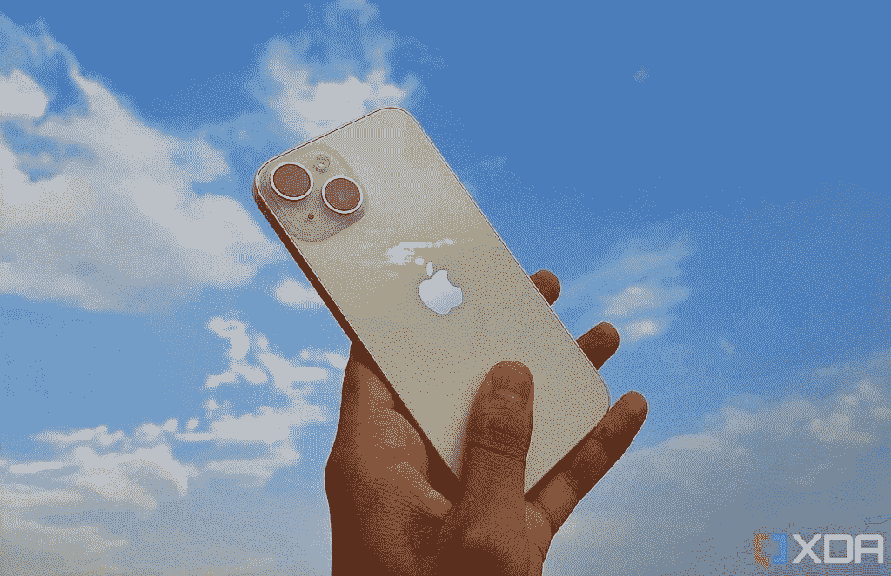

# iPhone 14 vs iPhone 14 Pro:2022 苹果手机你该买哪款？

> 原文：<https://www.xda-developers.com/apple-iphone-14-vs-apple-iphone-14-pro/>

苹果早在 2022 年 9 月就推出了 [iPhone 14](https://www.xda-developers.com/apple-iphone-14-review/) 系列，这一次，该公司开始大力区分专业版和普通版。2022 年的普通 iPhone 几乎是 iPhone 13 的无足轻重的迭代。与此同时，iPhone 14 Pro 机型在视觉和内部都有一些令人兴奋的变化。因此，这些手机不仅外观不同，而且功能也不同。如果你打算[买一部 iPhone 14](https://www.xda-developers.com/best-apple-iphone-14-deals/) ，这可能会让事情变得困难。[四款不同的 iPhone 14 你应该瞄准哪一款](https://www.xda-developers.com/apple-iphone-14-series-explained/)？好吧，这就是 iPhone 14 vs iPhone 14 Pro——苹果 2022 年旗舰手机之间的战斗。

## 规格:苹果 iPhone 14 vs 苹果 iPhone 14 Pro

|  | 

苹果 iPhone 14

 | 

苹果 iPhone 14 Pro

 |
| --- | --- | --- |
| **处理器** | 

*   A15 仿生芯片
    *   6 核 CPU，带 2 个性能和 4 个效率内核
    *   5 核 GPU
    *   16 核神经引擎

 | 

*   A16 仿生芯片
    *   6 核 CPU，带 2 个性能和 4 个效率内核
    *   5 核 GPU
    *   16 核神经引擎

 |
| **正文** | 

*   146.7 x 71.5 x 7.80mm 毫米
*   172 克

 | 

*   147.5 x 71.5 x 7.85mm 毫米
*   206 克

 |
| **显示** | 

*   超级视网膜 XDR 显示器
*   6.1 英寸(对角线)全屏有机发光二极管显示器
*   2532 x 1170 分辨率，460 ppi
*   HDR 显示器
*   原彩显示
*   宽颜色(P3)
*   2，000，000:1 对比度(典型值)
*   800 尼特最大亮度(典型值)；1200 尼特峰值亮度(HDR)

 | 

*   超级视网膜 XDR 显示器
*   6.1 英寸(对角线)全屏有机发光二极管显示器
*   2556 x 1179 分辨率，460 ppi
*   动态岛
*   始终显示
*   自适应刷新率高达 120Hz 的推广技术
*   HDR 显示器
*   原彩显示
*   宽颜色(P3)
*   2，000，000:1 对比度(典型值)
*   1000 尼特最大亮度(典型值)；1600 尼特峰值亮度(HDR)；2000 尼特峰值亮度(室外)

 |
| **摄像机** | 

*   双摄像头系统:
    *   主:12MP，1.5
    *   超宽:12MP，2.4 英寸

*   原深感摄像头:12MP，1.9

 | 

*   专业摄像系统:
    *   主:48MP，1.78
    *   超宽:12MP，2.2 英寸
    *   长焦:12MP，1.78

*   原深感摄像头:12MP，1.9

 |
| **内存** | 

*   存储:128GB256GB512GB
*   内存:6GB

 | 

*   存储:128GB256GB512GB1TB
*   内存:6GB

 |
| **电池** | 

*   长达 80 小时的音频播放

 | 

*   长达 75 小时的音频播放

 |
| **连通性** | 

*   5G
*   第四代移动通信技术
*   无线网络 6
*   蓝牙 5.3
*   通过卫星求救

 | 

*   5G
*   第四代移动通信技术
*   无线网络 6
*   蓝牙 5.3
*   通过卫星求救

 |
| **抵抗** |  |  |
| **安全** |  |  |
| **操作系统** |  |  |
| **颜色** | 

*   午夜
*   紫色
*   星光
*   红色
*   蓝色

 | 

*   太空黑
*   银
*   金色的
*   深紫乐队

 |
| **材质** | 

*   玻璃背面
*   铝制框架

 | 

*   玻璃背面
*   不锈钢框架

 |
| **价格** |  |  |

* * *

## 设计:熟悉但不同

iPhone 14 和 [iPhone 14 Pro，](http://xda-developers.com/apple-iphone-14-pro)在很大程度上看起来很相似。毕竟，苹果通常不会一步到位地引入重大变化，熟悉感是几乎任何升级 iPhone 用户都可以证明的一个因素。不过，在设计方面，iPhone 14 和 14 Pro 使用了截然不同的材料，很容易区分。

从机身开始，更便宜的型号有一个透明的玻璃背面和一个铝制框架。与此同时，作为苹果的传统，Pro 机型拥有闪亮的不锈钢框架和哑光玻璃背面。虽然我喜欢哑光玻璃的外观，但这个框架是一个指纹磁铁。我以前用过无壳的普通 iPhone，但是没有壳的 iPhone 14 Pro 我用不了。当不锈钢被弄脏时，它就失去了它的高级感。不管你的购买决定如何，你都应该[买一箱](https://www.xda-developers.com/best-apple-iphone-14-cases/)。这是为了在你把之前的 iPhone 掉在某个地方时，将潜在的损害降到最低。

## 

否则，两款 iPhones 在尺寸和整体外观方面都有相似的构建。背面除了玻璃不同，最明显的区别就是摄像头凸起。iPhone 14 Pro 有三摄像头系统，而普通 iPhone 14 只有两个后置镜头。购买普通 iPhone 14 的一个好处是有五种鲜艳的外观可供选择。专业版 iPhone 满足于四种较暗的颜色。苹果通常在最高端的 iPhones 上使用较暗的颜色。除了凹槽/动态岛之外，这两款手机看起来很相似。

我们不能在这场战斗中选出一个赢家，因为这是一场非常主观的战斗，取决于你。不过，请记住，iPhone 14 Pro 的不锈钢比 iPhone 14 的铝要重得多。因此，如果你每天花很多时间在手机上，你的手可能会因为拿着手机而感到疲劳(真实的故事)。我的意思是，它的屏幕时间功能是你无法绕过的，所以就这样了。

## 显示器:更高端的 iPhone 14 为你提供了一个孤岛

在 iPhone 14 vs iPhone 14 Pro 显示屏部门，有几个值得注意的区别。从最明显的一个开始，您需要在缺口和动态岛之间进行选择。虽然凹口更大，但许多用户发现动态岛是一个噱头，不必要的分心。你更喜欢哪个是主观的，所以我们不能在这里权衡。然而，显示器之战远未结束。

两款 iPhone 都有 6.1 英寸的屏幕，像素密度为 460 像素。然而，iPhone 14 Pro 提供了推广技术，允许刷新率达到 120Hz，而不是标准的 60Hz。因此，您可以获得更平滑的动画和过渡。此外，Pro iPhone 具有更高的最大亮度，使您可以在阳光直射下轻松查看屏幕内容。值得注意的是，iPhone 14 Pro 还引入了苹果手机上的永远显示功能。这会将刷新率降低到 1Hz，并使屏幕始终保持打开状态。

显然，iPhone 14 Pro 的显示屏更胜一筹。然而，它所包装的大多数独家产品并不是必备的。因此，如果你预算紧张，普通的 iPhone 14 可以很好地完成你的任务。最终，两者之间唯一明显的区别是动态岛和始终显示。这两个特征对于大部分用户来说都是可有可无的。普通的 iPhone 14 有一个华丽的屏幕，只是没有那么先进，这没关系。如果你以前没有使用过刷新率高于 60Hz 的显示器，你也不会注意到普通 iPhone 14 有什么不合适的地方。

## 性能:普通 iPhone 14 属于 2021 年

随着 iPhone 14 系列的推出，苹果开始通过各自的流程区分普通和专业型号。该公司在整个高端产品线中使用相同的芯片，直到今年，因此普通 iPhone 14 从 2021 年开始使用 A15 仿生芯片，而 Pro 型号则使用 A16 仿生芯片。两款手机都有 6GB 的内存，并提供至少 128GB 的存储空间。不过，Pro 型号只能有 1TB 的存储空间，而普通手机的最大存储空间为 512GB。

我个人认为性能部门不应该影响你的购买决定。其他网点已经称 2022 芯片 *A15 加*而不是 *A16* 。最终，性能提升很小，除非你需要 1TB 的 iPhone，否则任何一款 iOS 设备都应该没问题。

## 相机:双摄像头与专业摄像头

对于大多数用户来说，智能手机相机已经取代了专用的数码相机。人们通常只是拿出手机拍摄。正如你可能已经猜到的，iPhone Pro 14 与普通型号相比，拥有更好的摄像头。它还独家拥有一个长焦镜头。与此同时，普通 iPhone 只能满足于主镜头和超宽镜头。两款 iPhones 都支持拍摄新的[动作模式镜头](https://www.xda-developers.com/iphone-14-action-mode-is-making-a-play-to-replace-your-gopro/)，但普通模式错过了某些专业福利，如微距模式和夜间人像。

在前置部分，这两款手机提供了相同的 TrueDepth 摄像头。诚然，这两款设备的屏幕截图看起来不同，但它们都有相同的传感器和镜头。两者都首次支持自动对焦，并支持 Face ID 生物认证。就像旧的缺口 iPhone 型号一样，由于集成在相机系统中的 3D 映射功能，您可以拍摄人像模式的照片。

如果你是一个活跃的摄影师或需要激光雷达扫描仪进行 3D 测绘，你会更欣赏 Pro 模型。如果你只是一个休闲的拍摄者或者主要是自拍，普通的 iPhone 14 没问题。

## 电池:低端的 iPhone 14 更保守

苹果官方并没有分享很多关于 iPhone 电池的信息。话虽如此，但它确实强调了 iPhone 14 在一次充电后的续航时间比 Pro 机型更长，尽管差异并不明显，因为两者都可以轻松让你使用一天。为了帮助保持 Pro 机型的电池寿命，您可以禁用始终显示功能，我们发现该功能会消耗相对较多的电池电量。

说到充电，如果你使用兼容的 20W 砖块，两款手机都可以在 30 分钟内充电到 50%，尽管你必须单独购买充电器，因为盒子里只有一根 USB Type-C to Lightning 电缆。它们都支持 Qi 和 MagSafe 无线充电标准。两者都不兼容反向无线充电，所以不能通过 iPhone 给 AirPods 外壳或 Apple Watch 充电。

## Plus 和 Max:普通和专业型号的较大复制品

既然我们已经分解了常规的 iPhone 14 和 14 Pro，现在是时候解决它们更大的对应产品了。2022 年的高端 iPhone 阵容包括一款 iPhone 14 Plus 和 [iPhone 14 Pro Max](https://www.xda-developers.com/apple-iphone-14-pro-max-review/) 。谢天谢地，差别很小。iPhone 14 Plus 和 14 Pro Max 只是更大的 14 和 14 Pro 型号。因此，您可以在利用更大电池和 6.7 英寸显示屏的同时获得相同的功能。因此，你是选择 6.1 英寸还是 6.7 英寸的 iPhone 取决于你是否喜欢大屏幕。归根结底，这是一个主观的问题，因为包括我在内的一些人会认为大屏幕是一个负面因素。

* * *

## 一句话:熟悉、实惠，而不是昂贵

iPhone 14 和 14 Pro 迎合了两种不同的受众。前者价格合理，但保留了其前身的大部分元素。与此同时，Pro 车型拥有今年所有引人注目和令人兴奋的变化。然而，这些服务的价格相当昂贵，尤其是如果你不住在美国的话。

最终，这实际上取决于您的预算、需求以及您对此次升级的期望。如果你正在寻找一部好用的手机，iPhone 14 是一个可靠的升级。如果你对专业相机系统和显著的显示器升级(亮度、AOD、120Hz、动态岛等)感兴趣，那么 iPhone 14 Pro 或 Pro Max 就是你的选择。

不过，如果你不打算购买 iPhone 14 Pro，你可能会考虑购买普通的 iPhone 13。苹果仍然以折扣价销售这款手机，这使得它比普通的 iPhone 14 更具价值。此外，它包含了 iPhone 14 上大多数面向用户的技术。就个人而言，如果我不被说服购买 iPhone 14 Pro，我肯定会满足于 iPhone 13，而不是 14。毕竟两款手机都有缺口，外观一样，封装一样的处理器，支持 iOS 16 等等。

当然，iPhone 14 包含了一些独家功能，比如动作模式、碰撞检测、通过卫星的 SOS。然而，许多用户可能不关心他们。iPhone 13 是一款坚固的设备，将在未来许多年得到支持，它包含了 2021 项今天仍然相关的技术。事实上，我认为苹果应该在 2022 年只发布 Pro iPhones，并跳过常规的 iPhone 14，转而支持 2021 年的 iPhone 13。

*   ##### 苹果 iPhone 13

    iPhone 13 是相当于普通 iPhone 14 的体面之作。它采用相同的处理器，相同的设计，运行相同的操作系统，成本更低。

*   iPhone 14 是 2022 年 iPhone 系列的基础型号，为普通用户提供了一套平衡的功能。

*   iPhone 14 Plus 配备了更大的 6.7 英寸屏幕，但缺少动态岛和永远显示功能。

*   iPhone 14 Pro 为迄今为止最高端的 iPhone 带来了新的正面设计、升级的摄像头和新的全能苹果硅。

*   iPhone 14 Pro Max 是苹果最大最好的智能手机，在典型的苹果时尚中，它既是发电站，也是耐力怪兽。

    T13

*两款 2022 年的 iPhones 你会买哪一款？你会换成 iPhone 13 吗？请在下面的评论区告诉我们。*