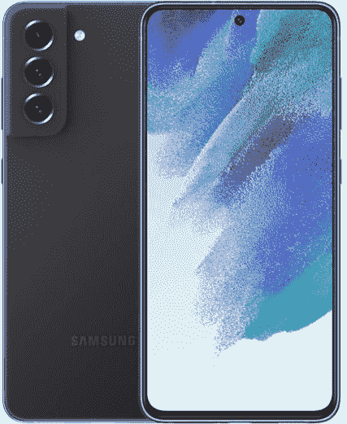

# 苹果 iPhone 14 vs 三星 Galaxy S21 FE:哪款手机更好？

> 原文：<https://www.xda-developers.com/apple-iphone-14-vs-samsung-galaxy-s21-fe/>

我们的 [iPhone 14](https://www.xda-developers.com/apple-iphone-14-review/) 与 [Galaxy S21 FE](https://www.xda-developers.com/samsung-galaxy-s21-fe-review/) 对比将苹果的标准旗舰产品与三星的平价旗舰产品进行对比。iPhone 14 是新 iPhone 14 系列中最实惠的型号，但它也是该系列中最无聊的手机，因为它与前代相比几乎没有什么改进。它在一个太熟悉的包中提供了一个久经考验的硬件包。另一方面，Galaxy S21 FE 本质上是 Galaxy S21 的精简版，以实惠的价格提供了高级机型的许多最佳功能。但是哪个更值呢？我们在这篇文章中找到答案。

## 苹果 iPhone 14 vs 三星 Galaxy S21 FE:规格

| 

**规格**

 | 

苹果 iPhone 14

 | 

三星 Galaxy S21 FE

 |
| --- | --- | --- |
| **构建** | 

*   铝制中框
*   玻璃正面和背面
*   前玻璃的“陶瓷护罩”

 |  |
| **尺寸&重量** | 

*   146.7 x 71.5 x 7.8mm 毫米
*   172 克

 | 

*   155.7 x 74.5 x 7.9 毫米
*   177 克

 |
| **显示** | 

*   6.1 英寸有机发光二极管显示屏，
*   2556 x 1179 像素分辨率，460 PPI
*   60Hz 刷新率
*   HDR 显示器，真实色调，宽颜色(P3)
*   800 尼特最大亮度，1200 尼特峰值亮度(HDR)

 | 

*   6.4 英寸 FHD+ AMOLED
*   2340 x 1080
*   120 赫兹刷新率

 |
| **SoC** |  | 

*   美国:高通骁龙 888
*   国际:Exynos 2100

 |
| **闸板&存放** | 

*   6GB 内存
*   128GB、256GB、512GB、
*   没有 microSD 卡

 | 

*   6GB 内存/128GB 存储空间
*   8GB 内存/256GB 存储空间
*   没有 microSD 卡插槽

 |
| **电池&充电** | 

*   3，279 毫安时，可播放长达 20 小时的视频
*   20W 有线充电
*   15W MagSafe 充电
*   7.5W Qi 无线充电

 | 

*   4500 毫安时电池
*   25W 有线快速充电
*   15W 无线充电
*   4.5W 反向无线充电

 |
| **安全** |  | 

*   显示指纹扫描仪

 |
| **后置摄像头** | 

*   **主** : 12MP 宽，f/1.5 光圈，1.9μm
    *   传感器移位 OIS
    *   七元素透镜
    *   5 倍数码变焦

*   **次要:** 12MP 超宽，f/2.4 光圈

 | 

*   主要:12MP，f/1.8，120˚ FoV
*   广角:12MP，f/2.2，123 FoV
*   长焦:800 万像素，f/2.4，32 FOV

 |
| **前置摄像头** | 原深感摄像头:12MP，1.9 | 32MP，f/2.2，81 视场角 |
| **端口** | 

*   闪电港
*   没有耳机插孔

 | 

*   USB 类型-C
*   没有耳机插孔

 |
| **音频** | 

*   立体声扬声器
*   杜比大气
*   空间音频

 |  |
| **连通性** | 

*   5G(低于 6 GHz 和毫米波)
*   支持 4×4 MIMO 和 LAA 的千兆级 LTE
*   支持 2×2 MIMO 的 Wi-Fi 6 (802.11ax)
*   蓝牙 5.3
*   超宽带(UWB)
*   国家足球联盟

 | 

*   Sub6/mmWave 5G
*   4G LTE
*   Wi-Fi 802.11 a/b/g/n/ac/x(双频)
*   蓝牙 5.0
*   超宽带

 |
| **软件** |  |  |
| **其他特性** |  | 

*   支持 NFC 的 Samsung Pay
*   IP68 等级

 |

## 设计与展示

iPhone 14 的设计几乎没有改变。除了新的颜色，它看起来和 iPhone 13 一样。这不是一件坏事，因为 iPhone 14 是一款非常好看的手机，我们喜欢它的一切都延续到了新机型上。它有平坦的铝制侧面，玻璃背面，前面有陶瓷保护罩。

Galaxy S21 FE 与 Galaxy S21 有着相似的设计，具有塑料背面、金属框架和容纳三个相机镜头的轮廓切割相机模块。Galaxy S21 FE 诚然没有 iPhone 14 那么昂贵，但无论如何它看起来或感觉上都不便宜。

转到显示屏，iPhone 14 配备了 6.1 英寸的 OLED 面板，像素为 1170 x 2532，支持杜比视觉内容，峰值亮度高达 1200 尼特。Galaxy S21 FE 拥有更大的 6.4 英寸 AMOLED 显示屏，像素为 1080 x 2400，刷新率为 120Hz，支持 HDR10+。两者都是高品质的显示器，提供丰富的色彩，深黑色，以及良好的日光清晰度。对于内容消费，Galaxy S21 FE 看起来是一个更好的选择，因为它有更大的屏幕和更少的分散注意力的打孔凹槽，提供了更身临其境的观看体验。

* * *

## 照相机

Galaxy S21 FE 采用了从 Galaxy S22 借来的三摄像头系统。该设置由一个 12MP f/1.8 主拍摄器、一个 8MP 具有 3 倍光学变焦的长焦镜头和一个 12MP f/2.2 超宽拍摄器组成。另一方面，iPhone 14 配备了一个熟悉的双摄像头设置，具有 12MP f/1.5 主摄像头和 12MP f/2.4 超广角摄像头。

两款手机都可以在大白天拍摄出色的图像，但在弱光和夜间摄影方面，iPhone 14 更有优势。得益于更大的像素尺寸、更快的光圈和苹果新的光子引擎，iPhone 14 的主摄像头即使在充满挑战的光线下也能拍摄出色彩逼真的清晰图像。

Galaxy S21 FE 有一个更通用的相机系统，因为它有一个 iPhone 14 没有的额外变焦镜头。iPhone 14 确实通过主摄像头提供了 5 倍数码变焦，尽管它无法与 S21 FE 的专用变焦镜头相媲美。

iPhone 14 占据主导地位的另一个领域是视频部门。iPhone 上的视频性能一直在同类产品中名列前茅，iPhone 14 也不例外。iPhone 13 上首次亮相的电影模式已经升级，同时还有一个新的动作模式，为激烈的运动提供类似万向节的稳定。

### iPhone 14 相机样品

### Galaxy S21 FE 相机样品

* * *

## 性能、电池和软件

iPhone 14 采用 A15 仿生芯片组。虽然这是与 iPhone 13 相同的芯片组，但它的 GPU 速度略快。Galaxy S21 FE 有两种型号可供选择:面向美国市场的骁龙 888 型号和面向其他市场的 Exynos 2100 型号。

就原始功率而言，iPhone 14 显然更胜一筹——事实上，它的 A15 仿生芯片甚至击败了更近的骁龙 8 Gen 1 SoC。但这并不是说 Galaxy S21 是一款慢手机，远非如此。与 iPhone 14 相比，Galaxy S21 FE 应该感觉更快更流畅，因为它有 120Hz 的高刷新率显示屏。对于游戏来说，iPhone 14 是一个更好的选择，因为它装有更强大的 5 核 GPU 和改进的散热设计。Galaxy S21 FE 也可以很好地玩游戏，但在玩 Genshin Impact 等要求苛刻的游戏时，你可能会注意到掉帧和反应迟钝。

Galaxy S21 FE 配备了一个 4，500 毫安时的大电池，比 Galaxy S21 的 4，000 毫安时电池更高。同时，iPhone 14 有一个 3279 毫安时的电池。Galaxy S21 FE 可能在纸面上有更大的电池，但在续航能力方面，两款手机都差不多。这两款手机都能让你轻松使用一整天，不会出现任何问题。至于充电，Galaxy S21 FE 提供 25W 快速有线充电，15W 无线充电，4.5W 反向无线充电。而 iPhone 14 则支持 20W 有线充电，15W MagSafe 磁充，7.5W Qi 无线充电。无论你用的是 iPhone 14 还是 Galaxy S21 FE，盒子里都不会有充电器。你现有的充电器应该可以正常工作，如果不行，你就得花钱买一个兼容的快速充电器。注意，iPhone 14 使用苹果专有的 Lightning 连接器，而 Galaxy S21 FE 使用通用 USB-C 端口。

软件体验是 iPhone 14 和 Galaxy S21 FE 的另一个重要区别。有了 iPhone 14，你将得到苹果手机操作系统的最新版本 iOS 16。Galaxy S21 FE 运行 Android 12，计划在今年晚些时候更新 Android 13。两款手机都提供长期软件支持。三星承诺四年操作系统更新和五年安全更新。与三星不同，苹果没有公开披露其软件承诺，但根据过去的记录，我们可以预计 iPhone 14 至少会有五年的 iOS 更新。

至于生物识别，Galaxy S21 FE 有一个显示指纹扫描仪，而 iPhone 14 使用 Face ID。你只能在 iPhone 14 上找到的一个有趣的功能是基本的卫星连接，当你发现自己被困在一个没有手机或互联网连接的偏远地区时，可以通过它与紧急服务联系。

* * *

## iPhone 14 vs Galaxy S21 FE:结论

如果你不想花费 1000 美元以上，iPhone 14 和 Galaxy S21 FE 是绝佳的选择。Galaxy S21 FE 拥有更大、更高刷新率的显示屏、更多功能的相机系统和更大的电池。与此同时，iPhone 14 拥有更高级的构造、更强劲的动力和更好的游戏性能。iPhone 14 的相机系统可能不如 Galaxy S21 FE 那么通用，但它的一致性和可靠性要高得多。此外，iPhone 14 还提供顶级的视频性能，具有基本的卫星连接，并提供更长的软件支持。

 <picture></picture> 

Apple iPhone 14

##### 苹果 iPhone 14

iPhone 14 由 A15 仿生芯片组驱动，是第一款提供基本卫星连接的智能手机。

 <picture></picture> 

Samsung Galaxy S21 FE

##### 三星 Galaxy S21 FE

Galaxy S21 FE 以实惠的价格提供了 6.4 英寸 AMOLED 显示屏和三摄像头系统。

iPhone 14 起价 799 美元，但你可以利用[交易和](https://www.xda-developers.com/best-apple-iphone-14-deals/)折扣来节省很多钱。Galaxy S21 FE 以 700 美元的价格推出，但你可以在亚马逊和百思买上找到 600 美元或更低的价格。虽然这款手机在三星官网上有点贵(650 美元)，但你可以通过三星的增强以旧换新计划获得高达 635 美元的即时信用。