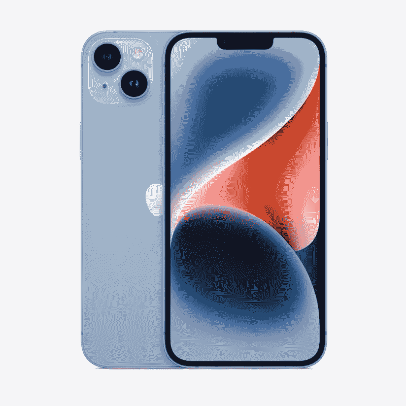
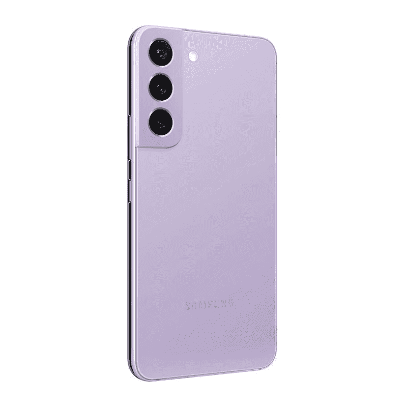

# 苹果 iPhone 14 vs 三星 Galaxy S22:一般用户应该买哪款手机？

> 原文：<https://www.xda-developers.com/apple-iphone-14-vs-samsung-galaxy-s22/>

如果你正在寻找一款价格低于 1000 美元的像样的旗舰产品，iPhone 14 和 T2 Galaxy S22 是市场上的两个最佳选择。这两款手机有很多共同点。它们的起价相同:799 美元，是相对较小的手机，也是各自产品线中最便宜的型号。但是对于一般用户来说，哪款更好购买呢？我们试图在这场 iPhone 14 vs Galaxy S22 的对决中找到答案。

## 三星 Galaxy S22 vs 苹果 iPhone 14:规格

| 

**规格**

 | 

**三星 Galaxy S22**

 | 

苹果 iPhone 14

 |
| --- | --- | --- |
| **打造** | 

*   玻璃背面
*   铝制框架

 | 

*   铝制中框
*   玻璃正面和背面
*   前玻璃的“陶瓷护罩”

 |
| **尺寸&重量** | 

*   146 x 70.6 x 7.6mm 毫米
*   非毫米波型号为 167 克
*   168g 用于毫米波型号

 | 

*   146.7 x 71.5 x 7.8mm 毫米
*   172 克

 |
| **显示** | 

*   6.1 英寸 AMOLED 2X 显示屏
*   2340 x 1080，425 PPI
*   HDR10+认证
*   120 赫兹刷新率
*   始终展示

 | 

*   6.1 英寸有机发光二极管显示屏，
*   2556 x 1179 像素分辨率，460 PPI
*   60Hz 刷新率
*   HDR 显示器，真实色调，宽颜色(P3)
*   800 尼特最大亮度，1200 尼特峰值亮度(HDR)

 |
| **SoC** | 

*   高通骁龙 8 第 1 代(美国，选择其他地区)
*   三星 Exynos 2200(大多数其他国家)

 |  |
| **闸板&存放** | 

*   128/256GB 内部存储
*   8GB LPDDR5 RAM
*   没有 microSD 卡插槽

 | 

*   6GB 内存
*   128GB、256GB、512GB、
*   没有 microSD 卡

 |
| **电池&充电** | 

*   3700 毫安时电池
*   25W USB PD 3.0 PPS 有线充电
*   快速无线充电 2.0(仅适用于三星超快速无线充电器和超快速无线充电器 Duo)
*   无线 PowerShare(反向无线充电)

 | 

*   3，279 毫安时，可播放长达 20 小时的视频
*   20W 有线充电
*   15W MagSafe 充电
*   7.5W Qi 无线充电

 |
| **安全** | 

*   超声波指纹传感器

 |  |
| **后置摄像头** | 

*   50MP 干线(F/1.8，1.0μm，85 FOV)，装箱
*   12MP 超宽(F/2.2/1.4 μm/120 FOV)
*   10MP 长焦(2.4/1.0 μm/36 FOV)

 | 

*   **主** : 12MP 宽，f/1.5 光圈，1.9μm
    *   传感器移位 OIS
    *   七元素透镜
    *   5 倍数码变焦
*   **次要:** 12MP 超宽，f/2.4 光圈

 |
| **前置摄像头** | 100 万像素(2.2 微米/1.22 微米/80 FOV) | 原深感摄像头:12MP，1.9 |
| **端口** | 

*   USB 类型-C
*   没有耳机插孔

 | 

*   闪电港
*   没有耳机插孔

 |
| **音频** | 

*   立体声扬声器
*   蓝牙双音频

 | 

*   立体声扬声器
*   杜比大气
*   空间音频

 |
| **连通性** | 

*   5G:非独立(NSA)，独立(SA)，Sub6 / mmWave
*   LTE:增强型 4×4 MIMO，最高 7CA，LTE Cat.20
*   wi-Fi 802.11 a/b/g/n/AC/ax(2.4/5/6 GHz)
*   蓝牙 v5.2
*   国家足球联盟
*   GPS，伽利略，格洛纳斯，北斗

 | 

*   5G(低于 6 GHz 和毫米波)
*   支持 4×4 MIMO 和 LAA 的千兆级 LTE
*   支持 2×2 MIMO 的 Wi-Fi 6 (802.11ax)
*   蓝牙 5.3
*   超宽带(UWB)
*   国家足球联盟

 |
| **软件** | 

*   带有一个 UI 4.1 的 Android 12
*   承诺四大 Android 操作系统更新
*   五年的安全补丁

 |  |
| **其他特色** | 

*   Samsung Pay(某些国家的 MST，NFC)

 |  |

## 设计与展示

苹果 iPhone 14 和 Galaxy S22 采用了熟悉的设计。对于 iPhone 14 来说尤其如此，除了新的配色之外，它看起来与前代没有什么区别。它有平坦的侧面，背面有一个方形的摄像头模块。槽口还在，底部的闪电口也在。

说到 Galaxy S22，它保留了前任的总体设计，但有一些变化。首先，Galaxy S22 将 S21 的塑料后盖换成了玻璃后盖。其次，它采用了颜色匹配的相机岛，不会融入中框。

iPhone 14 比 Galaxy S22 略高，略重。这两款手机都采用了高质量的材料，采用了铝边框和玻璃背面。至于耐用性，S22 的正面采用了大猩猩玻璃 Victus Plus，而 iPhone 14 则有陶瓷盾保护。此外，这两款设备均通过了 IP68 防尘防水认证。但即使这样，你也绝对应该[拿起一个保护套](https://www.xda-developers.com/best-apple-iphone-14-cases/)来保护你闪亮的新手机免受跌落和刮擦。

无论你选择哪一款手机，你都会有多种颜色可供选择。Galaxy S22 有黑色、白色、玫瑰金、绿色、石墨色、天蓝色、紫色、奶油色和宝来紫。同时，iPhone 14 有午夜、紫色、星光、蓝色和红色可供选择。

Galaxy S22 和 iPhone 14 都有 6.1 英寸的显示屏，以今天的标准来看，这已经算是小尺寸了。Galaxy S22 的 AMOLED 面板具有 1080 x 2340 像素，120Hz 刷新率，1300 峰值亮度，支持 HDR10+。iPhone 14 面板提供 1170 x 2532 像素的更高分辨率，并提供 1200 尼特亮度和杜比视觉支持。此外，它支持苹果的 True Tone 功能，在不同的光照条件下提供更具可读性的体验。

说到刷新率，iPhone 14 处于劣势，因为它被锁定在 60Hz。另一方面，Galaxy S22 可以将其刷新率一直提高到 120Hz，以提供更流畅的滚动体验，并将其调低到 48Hz 以节省电池。iPhone 14 也不提供类似 Galaxy S22 的永远在线显示屏。

我们不要在这里拐弯抹角了。Galaxy S22 拥有出众的显示屏。Galaxy S22 不仅因为不太分散注意力的打孔凹槽而具有更身临其境的显示屏，而且比 iPhone 14 的面板更光滑，更明亮。

## 照相机

iPhone 14 的背面是一个熟悉的双摄像头设置，由 12MP f/1.5 主摄像头和 12MP f/2.4 超宽摄像头组成。超宽拍摄器与 iPhone 13 保持不变，但主摄像头进行了升级，升级速度更快，像素尺寸更大，提高了感光度。前面还有一个全新的 12MP f/1.9 自拍相机，它承诺在弱光下有很大的改善。

Galaxy S22 采用了三摄像头设置，具有 50MP f/1.8 主拍摄镜头，10MP f/2.4 长焦镜头和 12MP f/2.2 超宽传感器。

正如你所看到的，Galaxy S22 有一个更通用的相机设置。它拥有一个 10MP 专用长焦镜头，提供 3 倍光学变焦和高达 30 倍的数字变焦。与此同时，iPhone 14 没有变焦镜头，但它提供了主摄像头的 5 倍数码变焦。

就图像质量而言，这两款手机并驾齐驱。在白天，两款手机的主摄像头都可以提供清晰的图像，细节保留良好，动态范围高，对比度高。然而，正如你在下面附上的样本中所注意到的那样，Galaxy S22 喜欢看起来赏心悦目的饱和色，而 iPhone 14 的照片则展示了逼真的颜色。

对于弱光和夜间摄影，两款手机都提供了专用的夜间模式。iPhone 14 还受益于苹果新的图像管道，称为光子引擎，该公司表示，主摄像头的中低光性能提高了 2.5 倍，超宽摄像头提高了 2 倍。

### iPhone 14 相机样品

### Galaxy S22 图像样本

虽然在静态摄影领域没有明显的赢家，但 iPhone 14 在视频领域占据领先地位。iPhone 阵容一直提供一流的视频性能，iPhone 14 也不例外。无论您选择何种格式或分辨率，您都会获得极其流畅的视频画面和坚如磐石的稳定性。此外，新的动作模式通过提供类似万向节的稳定性进一步加强了手机的视频功能。Galaxy S22 相对于 iPhone 14 的一个优势是，它可以拍摄 8K 镜头，而前者在 4K 的表现最佳。

## 性能、电池寿命和软件

iPhone 14 包装了去年的 A15 仿生芯片组。这是标准 iPhone 第一次没有最新最棒的苹果硅胶，该公司将新的 A16 仿生芯片组保留给更昂贵的 Pro 机型。Galaxy S22 的处理包取决于市场。在欧洲，你得到的是三星内部的 Exynos 2200 芯片组，而其他市场得到的是高通骁龙 8 Gen 1。

虽然 iPhone 14 有一个更老的芯片组，但它在原始性能上击败了 Galaxy S22。在 Geekbench 中，iPhone 14 单核得分为 1714，多核得分为 4567，而 Galaxy S22 分别只有 1216 和 3126。

虽然 iPhone 14 主导了基准测试，但 Galaxy S22 在现实生活中表现出色，由于其 120Hz 的显示屏，提供了快速流畅的性能。由于 60Hz 的面板，iPhone 14 的滚动和系统导航感觉很慢。只有当您使用 90Hz 或 120Hz 的显示器时，这种差异才会明显。如果您以前从未使用过高刷新率显示器，这应该不是问题。

两款手机都有多种存储配置。Galaxy S22 有 128GB 和 256GB 版本，内存为 8GB，而 iPhone 14 有 128GB、256GB 和 512GB 版本，内存为 6GB。

电池寿命是 iPhone 14 击败 Galaxy S22 的另一个领域。Galaxy S22 的 3700 毫安时电池比其前身小 300 毫安时。三星认为更小的显示屏和更高效的芯片组将补偿 Galaxy S22 中减少的电池，但事实并非如此，因为这款手机在大量使用的情况下很难坚持一整天。另一方面，iPhone 14 更加可靠，即使在大量使用的情况下，你也可以轻松度过一整天。

谈到充电速度和便利性，三星的旗舰产品远远胜过 iPhone 14。与 iPhone 14 的 20W 充电速度相比，Galaxy S22 提供了更快的 25W 有线充电。两款手机都支持无线充电，但只有 Galaxy S22 提供反向无线充电。

iPhone 14 继续使用专有的 Lightning 端口，而不是包括 Galaxy S22 在内的所有 Android 手机都使用的通用 USB-C 端口。这意味着你在旅行时必须携带一根单独的 iPhone 充电线。

在软件方面，iPhone 14 自带 iOS 16，而 Galaxy S22 运行 Android 12，顶部有一个 UI 4。如果苹果的优秀记录有任何迹象的话，我们可以预计 iPhone 14 将获得至少 5 年的软件更新。Galaxy S22 也不算太远。它承诺将获得四个主要的 Android 操作系统更新和五年的安全更新。

## iPhone 14 vs Galaxy S22:该买哪个？

iPhone 14 和 Galaxy S22 的对比没有产生明显的赢家，因为两款设备都有自己的优势和劣势。Galaxy S22 拥有更好的显示屏、更多功能的相机系统和更好的充电体验。与此同时，iPhone 14 提供了更多的原始功率、卓越的视频性能和更好的软件支持。

 <picture></picture> 

Apple iPhone 14

##### 苹果 iPhone 14

iPhone 14 由 A15 仿生芯片组驱动，是第一款提供基本卫星连接的智能手机。

到底该买 iPhone 14 还是 Galaxy S22，没有明确的答案。由于两款手机属于两个完全不同的生态系统，让你的个人需求、优先事项和个人偏好来决定哪一款手机更适合你。如果你已经深深地投入到苹果生态系统中，iPhone 14 可能会更好地为你服务。另一方面，如果你看重 Android 平台的定制化、开放性和多功能性，Galaxy S22 是你能买到的最好的 Android 旗舰之一。

 <picture></picture> 

Samsung Galaxy S22

Galaxy S22 提供了华丽的 6.1 英寸 AMOLED 显示屏和功能强大的摄像头。

iPhone 14 起价为 799 美元，但你可以利用特价优惠以更低的价格买到它。如果你正在使用 iPhone 13 或 12，没有必要升级到 iPhone 14，因为没有足够的改进和升级值得你这么做。Galaxy S22 也是如此。它的起价也是 799 美元，但可以以更低的价格买到。与前代相比，它没有太多升级，如果你使用的是 Galaxy S21 系列设备，很容易跳过这一步。