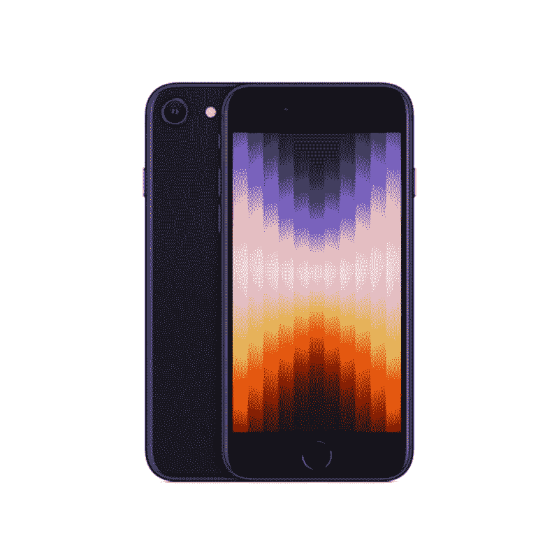

# 苹果 iPhone SE 3 (2022)支持 5G 网络吗？

> 原文：<https://www.xda-developers.com/apple-iphone-se-3-5g-support/>

苹果公司在其 Peek 性能活动中展示了 [iPhone SE 3 (2022)](https://www.xda-developers.com/apple-iphone-se-3-review/) 。这款手机配备了与上一代机型相同的底盘，与 iPhone 8 相似。然而，它配备了增强的内部部件，包括更多的内存和苹果的 A15 仿生芯片。这种 SoC 与高端 iPhone 13 系列的 SoC 相同。因此，只需 429 美元，你就可以使用该公司迄今最快的移动处理器。如果你[购买 iPhone SE 3](https://www.xda-developers.com/best-apple-iphone-se-3-deals/) ，你可以在红色、午夜和星光三种颜色中选择。如果你不是这些颜色的粉丝或者想保护你的手机，你总是可以[买一个保护套](https://www.xda-developers.com/best-apple-iphone-se-3-cases/)。另外值得一提的是，这款 iPhone 的包装盒不包含充电砖。因此，您需要[单独购买一个充电器](https://www.xda-developers.com/best-apple-iphone-se-3-chargers/)。现在，你一定在想——苹果 iPhone SE 3 (2022)支持 5G 网络吗？这是你需要知道的。

## iPhone SE 3 支持 5G 网络吗？

除了苹果的 A15 仿生芯片，iPhone SE 3 的主要卖点之一就是 5G 支持。事实上，如果你住在受支持的地区，这款价格实惠的手机可以利用 5G 网络。如果你不能满足所有的 5G 要求，那么你的 iPhone SE 3 将降回 4G (LTE)。此 iPhone 支持以下频段:n1、n2、n3、n5、n7、n8、n12、n20、n25、n28、n29、n30、n38、n40、n41、n48、n66、n71、n77、n78 和 n79。如果你想知道，苹果没有销售 iPhone SE 3 的 4G 版本。即使你不打算使用 5G 网络，你也必须购买 5G 型号——因为这是唯一可用的型号。最终，你可以在蜂窝设置中从 5G 切换到 4G。

 <picture></picture> 

Apple iPhone SE 3

##### 苹果 iPhone SE (2022)

全新的 iPhone SE 3 (2022)包含苹果的 A15 仿生芯片、5G 支持和过时的设计。它有三种颜色可供选择。

*你会购买苹果 iPhone SE 3 (2022)吗？为什么或为什么不？请在下面的评论区告诉我们。*