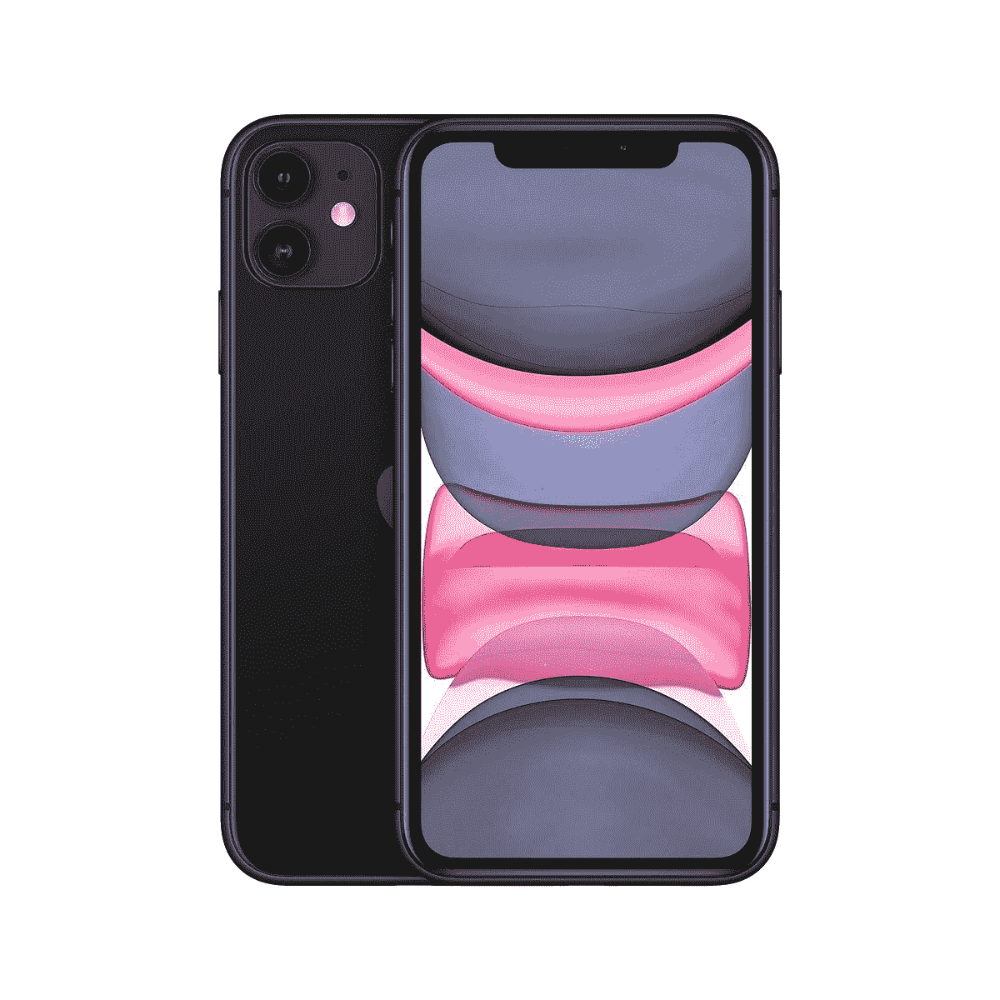

# 苹果 iPhone SE 3 (2022) vs 苹果 iPhone 11 (2019):买哪个？

> 原文：<https://www.xda-developers.com/apple-iphone-se-3-vs-apple-iphone-11/>

决定接下来买哪部智能手机可能会令人困惑——即使你的预算有限。品牌、型号和规格是无穷无尽的。苹果早在 2019 年就发布了 iPhone 11。相对而言，这是一款坚固的手机，尽管处理器有点旧。另一方面， [iPhone SE 3](https://www.xda-developers.com/apple-iphone-se-3-review/) 是一款 2022 年的手机，其特点是强大的内部部件被包装在一个过时的机箱中。这是 iPhone SE 3 和 iPhone 11——这两款手机提供了现代和过时元素的不同融合，以迎合不同的客户。如果你[买了 iPhone SE 3](https://www.xda-developers.com/best-apple-iphone-se-3-deals/) ，别忘了用[外壳](https://www.xda-developers.com/best-apple-iphone-se-3-cases/)保护它，看看我们的[最佳充电器](https://www.xda-developers.com/best-apple-iphone-se-3-chargers/)列表。同样，如果你想买 iPhone 11，[拿一个保护套](https://www.xda-developers.com/best-iphone-11-cases/)，确保它得到很好的保护。

## 苹果 iPhone SE 3 vs 苹果 iPhone 11:规格

|  | 

苹果 iPhone SE 3

 | 

苹果 iPhone 11

 |
| --- | --- | --- |
| **CPU** |  |  |
| **正文** | 

*   138.4 x 67.3 x 7.3mm 毫米
*   144 克

 | 

*   150.9 x 75.7 x 8.3mm 毫米
*   194 克

 |
| **显示** | 

*   4.7 英寸 Retina 高清液晶显示屏
*   1334 x750 像素
*   真音技术
*   触觉触摸支持
*   625 尼特最大亮度

 | 

*   6.1 英寸液态视网膜高清液晶显示屏
*   1792 x 828p 像素
*   真实色调显示
*   触觉
*   625 尼特最大亮度

 |
| **摄像机** | 

*   初级:12MP，f/1.8
*   前置:700 万像素，f/2.2

 | 

*   宽:12MP，f/1.8
*   超宽:f/2.4，120 FoV
*   前置:12MP，f/2.2

 |
| **记忆** | 

*   4GB 内存
*   64GB/128GB/256GB 存储空间

 | 

*   4GB 内存
*   64GB/128GB 存储

 |
| **电池** | 

*   2018 毫安时
*   20W 有线快速充电
*   7.5W Qi 无线充电

 | 

*   3110 毫安时
*   20W 有线快速充电
*   7.5W Qi 无线充电

 |
| **连通性** | 

*   Sub6/mmWave 5G
*   4G LTE
*   无线保真
*   蓝牙 5.0

 | 

*   4G LTE
*   无线保真
*   蓝牙 5.0

 |
| **水**水**阻力** | IP67 | IP68 |
| **安全** | 触控 ID | Face ID |
| **操作系统** | iOS 15 | iOS 15 |
| **颜色** |  | 

*   黑色
*   格林（姓氏）；绿色的
*   黄色
*   紫色
*   红色
*   怀特（姓氏）

 |
| **材质** | 

*   玻璃背面
*   铝制框架

 | 

*   玻璃背面
*   铝制框架

 |
| **价格** | 起价 429 美元 | 起价 499 美元 |

* * *

## 建造和设计

拥有一部时尚、坚固耐用的智能手机可能是许多潜在客户关心的问题。毕竟，很多人喜欢炫耀他们的设备，把它们当作奢侈品。说到构造，iPhone SE 3 和 iPhone 11 都采用了混合铝/玻璃机身。苹果声称，SE 3 型号上使用的玻璃是它在智能手机上使用过的最坚硬的玻璃。另一方面，iPhone 11 的防水性更好，达到了 IP68 的等级(相比之下，它的同类产品为 IP67)。

设计是一件非常主观的事情，但是我们可以在这里进行客观的观察，来突出两款 iPhones 的区别。大多数人可能会同意 iPhone 11 看起来比 iPhone SE 3 更简约和现代。这是因为中档手机采用了经典的 iPhone 正面设计——在这个时代可以说已经过时了。另一方面，iPhone 11 走的是 iPhone X 的风格——取消了厚厚的边框，采用了臭名昭著的 Face ID 凹槽。

说到它们的背面，这两款手机都是玻璃的，外观有点相似。最显著的区别是 iPhone 11 上的双摄像头系统。iPhone SE 3 满足于一个看起来不那么突出的单摄像头。另外值得一提的是，iPhone 11 有六种饰面可供选择，而更实惠的 iPhone 只提供三种。因此，如果你正在寻找一款有多种颜色选择的更时尚的手机，iPhone 11 将赢得这一轮。如果你宁愿为了拥有最坚硬的玻璃结构而牺牲化妆品，那就去买 iPhone SE 3 吧。

## 显示

购买新手机时，显示屏是需要考虑的一个重要方面。这是因为如今数字世界更加关注视频内容——更不用说手机游戏和电子书阅读了。考虑到 iPhone 11 是(曾经是)高端手机，iPhone SE 3 是中端手机，这一轮的赢家是相当明显的。

 <picture></picture> 

Apple iPhone 11

iPhone 11 采用了更大的 6.1 英寸边到边显示屏，分辨率为 1792×828 像素。另一方面，iPhone SE 3 的屏幕较小，为 4.7 英寸，分辨率较低，为 1334 x 750 p，边框较厚。这两款手机都支持触觉触摸和 True Tone 技术。尽管如此，iPhone 11 的显示屏在各方面都更好或一样好。有些人可能不喜欢*侵入式*凹槽，但对于许多用户来说，Face ID 相对于触控 ID 的优势和薄边框使得*入侵者*物有所值。

## 表演

在 iPhone SE 3 和 iPhone 11 的性能大战中，没有太多可以比较的。两款手机都有 4GB 的内存，运行相同的操作系统( [iOS 15](http://xda-developers.com/ios-15) )，并在基本款上包括 64GB 的存储空间。不过值得注意的是，最新的 A15 仿生芯片为 iPhone SE 3 提供了动力，其内存可以扩展到 256GB。而 iPhone 11 则包了 2019 年的 A13 仿生芯片，各方面都不如苹果 A15。此外，iPhone 11 的存储空间最大为 128GB。如果你不需要额外的存储空间，也不打算在手机上运行大量任务，iPhone 11 将为日常事务提供足够的电力。否则，选择 iPhone SE 3——因为它在性能战中遥遥领先。

## 摄像机

在当今时代，许多人依靠智能手机来记录他们去餐馆(有时是自然度假村)的激动人心的旅程。毕竟，如果我们不在 Instagram 上发布每个小细节，生活*真的是*过的吗？这就是为什么买一部装有可靠摄像系统的手机至关重要。在这场战役中，iPhone 11 在大部分方面占据优势。毕竟，它有一个双镜头系统，这使得 iPhone SE 3 的单镜头很难竞争。不过，中端 iPhone 利用 A15 仿生芯片来提高相机输出。它还支持智能 HDR 4，这是 iPhone 11 所没有的。否则 iPhone 11 有 120°视野的超宽镜头。这可以在设备上实现 2 倍光学变焦和其他摄影功能。

iPhone 11 上的 12MP 前置摄像头也胜过 iPhone SE 3。前者拥有 TrueDepth 系统，允许它为 Face ID 认证和人像模式效果 3D 映射面部。更实惠的 iPhone 有一个 700 万像素的 iPhone，通过机器学习支持人像模式效果——但缺乏 Face ID。

## 电池寿命和充电

随着世界慢慢开放，我们在 COVID19 锁定后花更多时间在户外，坚固的手机电池变得必不可少。如果智能手机在一天的中途没电，那么每 24 小时充电两次就会变得很麻烦。幸运的是，在*正常*，非大范围使用的情况下，这两款 iPhones 应该可以支持你一整天。然而，根据苹果公司的说法，iPhone 11 应该比 iPhone SE 3 更耐用。

作为参考，该公司声称前者一次充电最多可以播放 65 小时的音频，而前者最多只能播放 50 小时。最终，差别并不大，这不应该影响你的购买决定。另外值得注意的是，两者都不支持 MagSafe 充电。而是支持 7.5W 的 Qi 无线充电和 20W 的快速有线充电。

* * *

## 苹果 iPhone SE 3 vs 苹果 iPhone 11:该买哪款智能手机？

在美国，iPhone SE 3 和 iPhone 11 的基本款价格相差 70 美元。前者起价 429 美元，后者起价 499 美元。就我个人而言，如果我必须选择其中一个，我肯定会选择 iPhone 11。这是因为在习惯了窄边框屏幕和 Face ID 之后，我不认为自己会切换回触控 ID 和厚边框显示屏。对于那些只想在未来五年内获得软件支持的可靠手机的人来说，iPhone SE 3 速度更快，而且仍然新鲜，因此在未来几年内它将获得 iOS 更新。iPhone 11 很可能会提前失去软件支持。

在这场战斗中，选择一个胜利者是一件非常主观的事情。一款设备看起来过时，但具有更快的 SoC，而另一款设备具有更现代的机箱，其中包含过时的内部部件。最终，你不可能同时拥有未来的外表和坚实的内在——你必须牺牲一个，满足于另一个，这取决于你个人的期望、需求和标准。

 <picture></picture> 

Apple iPhone SE 3

##### 苹果 iPhone SE (2022)

全新的 iPhone SE 3 (2022)包含苹果的 A15 仿生芯片、5G 支持和过时的设计。它有三种颜色可供选择。

 <picture></picture> 

Apple iPhone 11

##### 苹果 iPhone 11

iPhone 11 早在 2019 年就发布了。然而，与 iPhone SE 3 (2022 年)相比，它仍然是一款坚固的手机。

你会买这两款 iPhones 中的哪一款，为什么？请在下面的评论区告诉我们。