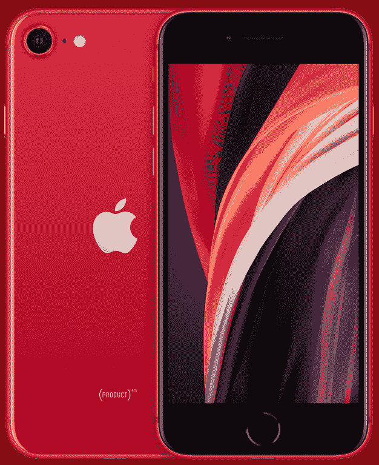

# 苹果 iPhone SE 3 (2022) vs 苹果 iPhone SE 2 (2020)

> 原文：<https://www.xda-developers.com/apple-iphone-se-3-vs-apple-iphone-se-2/>

人们出于不同的原因觉得有必要升级他们的智能手机。这可能是由于故障，失去软件支持，或者只是想要最新和最好的。大多数寻求升级的人都会想到的一个常见问题是*接下来我应该买什么手机？*可供选择的东西数不胜数，有无数的品牌、型号和价格标签。买哪个手机最好，看你自己和个人需求。这是[苹果 iPhone SE 3 (2022)](http://xda-developers.com/apple-iphone-se-3-review) vs 苹果 iPhone SE 2(2020)——来自同一制造商的两款平价手机之间的战争。如果你决定[购买 iPhone SE 3](https://www.xda-developers.com/best-apple-iphone-se-3-deals/) ，别忘了也为它抢一个[外壳](https://www.xda-developers.com/best-apple-iphone-se-3-cases/)和一个[充电器](https://www.xda-developers.com/best-apple-iphone-se-3-chargers/)。这些配件也可以在 iPhone SE 2 上使用。

## 苹果 iPhone SE 3 vs 苹果 iPhone SE 2:规格

|  | 

苹果 iPhone SE 3

 | 

苹果 iPhone SE 2

 |
| --- | --- | --- |
| **CPU** |  |  |
| **正文** | 

*   138.4 x 67.3 x 7.3mm 毫米
*   144 克

 | 

*   138.4 x 67.3 x 7.3mm 毫米
*   148 克

 |
| **显示** | 

*   4.7 英寸 Retina 高清液晶显示屏
*   1334 x750 像素
*   真音技术
*   触觉触摸支持
*   625 尼特最大亮度

 | 

*   4.7 英寸 Retina 高清液晶显示屏
*   1334 x750 像素
*   真音技术
*   触觉触摸支持
*   625 尼特最大亮度

 |
| **摄像机** | 

*   初级:12MP，f/1.8
*   前置:700 万像素，f/2.2

 | 

*   初级:12MP，f/1.8
*   前置:700 万像素，f/2.2

 |
| **记忆** | 

*   4GB 内存
*   64GB/128GB/256GB 存储空间

 | 

*   3GB 内存
*   64GB/128GB/256GB 存储空间

 |
| **电池** | 

*   2018 毫安时
*   20W 有线快速充电
*   7.5W Qi 无线充电

 | 

*   1821 毫安时
*   18W 有线快速充电
*   7.5W Qi 无线充电

 |
| **连通性** | 

*   Sub6/mmWave 5G
*   4G LTE
*   无线保真
*   蓝牙 5.0

 | 

*   4G LTE
*   无线保真
*   蓝牙 5.0

 |
| **水**水**阻力** | IP67 | IP67 |
| **安全** | 触控 ID | 触控 ID |
| **操作系统** | iOS 15 | iOS 15 |
| **颜色** |  |  |
| **材质** | 

*   玻璃背面
*   铝制框架

 | 

*   玻璃背面
*   铝制框架

 |
| **价格** | 起价 429 美元 | 起价 399 美元 |

* * *

## 建造和设计

苹果 iPhone SE 3 和苹果 iPhone SE 2 的外观设计完全相同。它们都采用了古代 iPhone 8 的机身。这是经典的 iPhone 设计，包括厚边框、物理 home 键和 4.7 英寸显示屏。如果你不在乎窄边框屏幕和 Face ID，这款过时的机箱应该不会成为问题。

尽管这两款手机拥有相同的设计和颜色(午夜和星光分别是黑色和白色)，但它们实际上具有不同的构建质量。苹果在 iPhone SE 3 的正面和背面改用了更坚固的玻璃材质。因此，通过购买这种型号，您可以获得更耐用的手机。除此之外，这两款手机在设计和使用的材料上都是一样的。

## 显示

iPhone SE 3 和 iPhone SE 2 的显示屏完全相同。这是一款 4.7 英寸的液晶显示器，分辨率为 1334 x 750 p，支持 True Tone 和触觉触摸技术。从 2022 年的角度来看，屏幕显然不起眼。然而，*它完成了*的工作——考虑到它是一部中档手机。不出所料，这款显示器保留了过去 iPhone 型号的厚顶部和底部边框。底部挡板包括容纳触控 ID 指纹传感器的物理 home 按钮。

考虑到这两款手机都有相同的屏幕，没有什么可比较的。因此，我们为您列出了共享规范，让您决定它们是否可接受并符合您的标准。

## 表演

iPhone SE 3 和 iPhone SE 2 分别于 2022 年和 2020 年发布。因此，它们有望由相隔两代的处理器驱动。iPhone SE 3 装有 A15 仿生芯片——苹果迄今为止最高端的移动芯片——而 iPhone SE 2 包括 A13 仿生芯片。两种芯片都很强大，但很明显，A15 在每个方面都优于 A13。更不用说 iPhone SE 3 有 4GB 的内存，而 iPhone SE 2 只有 3GB。两款手机都有相同的存储配置，从 64GB 开始，到 256GB 的固态硬盘。

## 摄像机

在我们日益数字化的世界里，智能手机摄像头对**非常重要**。虽然两款 iPhones 都包括一个后置摄像头和一个前置摄像头，但它们实际上并不相同。是的，它们确实有相同的技术规格，但我们不应该低估 A15 仿生芯片的能力。由于基于软件的改进，iPhone SE 3 上的后置摄像头支持 iPhone SE 2 上仍然不可用的功能。其中包括智能 HDR 4，深度融合和夜间模式延时。

## 电池寿命和充电

电池寿命和充电速度是购买新手机时需要考虑的重要方面。没有人想要一部中途没电、需要几个小时才能充满电的智能手机。尽管 iPhone SE 3 和 iPhone SE 2 看起来一样，但实际上它们的电池寿命不同。毕竟，内部结构是不同的——包括电池大小、处理器及其效率和 RAM。

iPhone SE 3 和 iPhone SE 2 分别包含 2,018mAh 和 1,821mAh 电池。苹果声称，2022 款 iPhone 一次充电可以播放 50 小时的音频。另一方面，2020 年的 iPhone 做同样的任务只能持续 40 个小时。在正常使用情况下，这两款手机充一次电应该可以使用一整天。此外，它们都支持 Qi 无线充电和快速有线充电。所以这一轮 iPhone SE 3 赢了，很明显。

* * *

## 苹果 iPhone SE 3 vs 苹果 iPhone SE 2:该买哪款智能手机？

在许多方面，iPhone SE 3 和 iPhone SE 2 是相同的。尽管如此，新型号仍然有显著的改进，包括 5G 支持。考虑到 iPhone SE 2 售价 399 美元，iPhone SE 3 售价 429 美元，购买前者没有意义。再付 30 美元，你就可以享受所有附带的升级服务。最终，一款手机于今年发布，而另一款则比它老了两年。

 <picture></picture> 

Apple iPhone SE 3

##### 苹果 iPhone SE (2022)

全新的 iPhone SE 3 (2022)包含苹果的 A15 仿生芯片、5G 支持和过时的设计。它有三种颜色可供选择。

 <picture></picture> 

iPhone SE 2 (2020)

##### 苹果 iPhone SE (2020 年)

iPhone SE 2 (2020)包括苹果的 A13 仿生芯片，不支持 5G，设计过时。它有三种颜色可供选择。

你会买这两款手机中的哪一款，为什么？请在下面的评论区告诉我们。