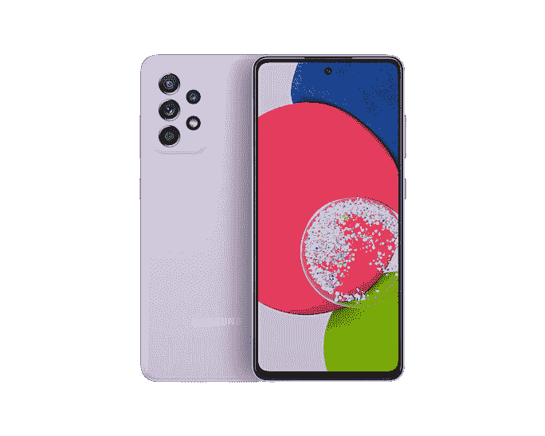

# 苹果 iPhone SE 3 (2022) vs 三星 Galaxy A52s 5G:该买哪款智能手机？

> 原文：<https://www.xda-developers.com/apple-iphone-se-3-vs-samsung-galaxy-a52s-5g/>

智能手机在我们的日常生活中非常重要。过去不必要的东西现在成了我们不可或缺的工具。可以说，定期升级它们也是必要的。这是因为当一部手机不受支持和过时时，它就变得不那么有用了。因此，即使你的手机功能正常，当它变旧时，你可能会发现自己被迫升级。人们在决定购买新手机时面临的一个常见困境是选择型号。不同的用户需要不同的规格，我们随时为您提供帮助。这是 [iPhone SE 3 (2022)](http://xda-developers.com/apple-iphone-se-3-review) 对[三星 Galaxy A52s 5G](https://www.xda-developers.com/samsung-galaxy-a52/)——两个竞争公司的两款经济型手机之间的战争。如果你[购买 iPhone SE 3 (2022)](https://www.xda-developers.com/best-apple-iphone-se-3-deals/) ，为设备抢一个[外壳](https://www.xda-developers.com/best-apple-iphone-se-3-cases/)和一个[充电器](https://www.xda-developers.com/best-apple-iphone-se-3-chargers/)很重要。如果你选择 Galaxy 手机，也不要忘了用[外壳](https://www.xda-developers.com/best-galaxy-a52-cases/)保护它。

## 苹果 iPhone SE 3 vs 三星 Galaxy A52s 5G:规格

|  | 

三星 Galaxy A52s 5G

 | 

苹果 iPhone SE 3

 |
| --- | --- | --- |
| **CPU** | 

*   高通骁龙 778G
    *   4 个内核@ 2.4 GHz+4 个内核@1.9GHz

*   Adreno 642L

 |  |
| **正文** | 

*   159.9 x 75.1 x 8.4mm 毫米
*   189 克

 | 

*   138.4 x 67.3 x 7.3mm 毫米
*   144 克

 |
| **显示** | 

*   6.5 英寸全高清+ Super AMOLED
*   2400 x 1080p 像素
*   120 赫兹刷新率
*   800 尼特最大亮度

 | 

*   4.7 英寸 Retina 高清液晶显示屏
*   1334 x750 像素
*   真音技术
*   触觉触摸支持
*   625 尼特最大亮度

 |
| **摄像机** | 

*   初级:6400 万像素，f/1.8
*   广角:12MP，f/2.2
*   宏:500 万像素，f/2.4
*   深度:5 百万像素，f/2.4
*   前置:32MP，f/2.2

 | 

*   初级:12MP，f/1.8
*   前置:700 万像素，f/2.2

 |
| **记忆** | 

*   6GB 内存
*   128GB 存储空间(可通过 Micro SD 卡扩展)

 | 

*   4GB 内存
*   64GB/128GB/256GB 存储空间

 |
| **电池** | 

*   4500 毫安时
*   25W 有线快速充电

 | 

*   2018 毫安时
*   20W 有线快速充电
*   7.5W Qi 无线充电

 |
| **连通性** | 

*   5G
*   4G LTE
*   无线保真
*   蓝牙 5.2

 | 

*   Sub6/mmWave 5G
*   4G LTE
*   无线网络 6
*   蓝牙 5.0

 |
| **水**水**阻力** | IP67 | IP67 |
| **安全** | 显示指纹扫描仪 | 触控 ID |
| **操作系统** | 一个基于 Android 11 的 UI 3.1 | iOS 15 |
| **颜色** |  |  |
| **材料** | 

*   塑料背面
*   塑料框架

 | 

*   玻璃背面
*   铝制框架

 |
| **价格** | 起价 350 美元 | 起价 429 美元 |

* * *

## 建造和设计

当我们看苹果 iPhone SE 3 (2022)和三星 Galaxy A52s 5G 的构建和设计时，我们注意到非常明显的差异。每部智能手机都有自己独特的功能和外观，这使得区分它们变得很容易。iPhone SE 3 拥有苹果随 iPhone 8 推出的经典机箱。它有厚厚的顶部和底部挡板，包括标志性的 Home 按钮。另一方面，Galaxy A52s 5G 拥有更具未来感的机身，具有更薄的边框和打孔前置摄像头。

说到构建材料，苹果手机包括铝框架和玻璃背面。相反，Galaxy A52s 5G 采用塑料外壳。这使得 iPhone SE 3 在这方面成为一款更高端的手机——因为它的材料更加优质。如果对你来说设计比构造更重要，那么三星手机赢得了这一轮，因为它的正面有着现代的外观。

在这一轮颜色中，Galaxy A52s 5G 获胜。这是因为它有四种颜色可供选择，而竞争对手只有三种。如果颜色与你无关，那么你可以跳过这一轮。别忘了，保护套不仅能保护手机，还能让手机焕然一新。说到底，设计是一个主观的事情，只有你个人才能判断哪个更好。

## 显示

当你购买一部新的智能手机时，拥有一个像样的显示屏是很重要的。这是因为在使用手机时，我们大部分时间都盯着屏幕。三星 Galaxy A52s 5G 获得了这一轮的奖牌，原因非常明显。

从最基本的开始，Galaxy 手机有 6.5 英寸的显示屏，分辨率为 2400 x 1080 p。这完全破坏了 iPhone 1334 x 750 p 的 4.7 英寸屏幕。更不用说 Galaxy A52s 5G 的峰值亮度更高，支持 120Hz 刷新率以实现更流畅的滚动等。苹果手机放在竞争对手旁边看起来很古老，特别是当我们考虑到苹果自 iPhone 6 以来一直使用的厚厚的史前挡板时。如果你喜欢较小的显示器，更好的选择可能是 iPhone。不过客观来说，三星手机屏幕更好。

由于我们正在处理屏幕，三星 Galaxy 手机有一个显示指纹扫描仪。因此，屏幕延伸到手机的顶部和底部。另一方面，iPhone SE 3 的物理 Home 键内置了一个触控 ID 传感器。因此，它占据了不必要的空间，并且手机的边框明显更厚。

## 表演

手机的 SoC 是决定智能手机性能的最大因素之一。当然，还有其他因素影响结果，但芯片仍然是支柱。从发布日期开始，苹果的 A15 Bionic 和高通的骁龙 778G 都是在 2021 年发布的。它们是相对较新的处理器，但是它们的能力差别很大。值得指出的是，A15 Bionic 与支持最高端 iPhone 13 系列的芯片组相同。尽管 iPhone SE 3 是一款廉价手机，但苹果在提升它的时候并没有退缩。相反，它牺牲了自己的设计，只为了价格合理的无与伦比的性能。

苹果 A15 仿生芯片在单核和多核 CPU 测试、GPU 测试和能效测试中胜出。不出所料，它有更高的总得分，轻松击败骁龙芯片。更不用说苹果有 5nm 的晶体管，打败了对手的 6nm。另一方面，不要让三星手机上的 2GB 额外内存欺骗了你。iOS 客观上比 Android 需要更少的处理资源。仅仅因为一个数字较低，并不意味着总的结果必然较差。

## 摄像机

手机摄像头已经成为购买新设备时要考虑的主要方面。在我们日益数字化的世界中，我们几乎有义务通过在线空间记录我们的个人生活——也称为社交媒体服务。更清晰的照片只会更好地反映你真实的微笑，更高的分辨率可能会带来更多的参与。如今销售的几乎所有智能手机都能很好地完成日常任务。这就把摄像头变成了使某个设备脱颖而出的区别因素。

这一轮我们有一个明显的赢家，那就是 Galaxy A52s 5G。它有四个后置摄像头，主摄像头胜过 iPhone SE 3。另一方面，苹果手机只有一个后置摄像头。尽管这两款手机都有一个前置摄像头，但三星手机也击败了竞争对手。我们不能低估 iPhone SE 3 (2022)的视频录制能力。然而，三星在这一轮比赛中获得了更高的综合得分。

## 电池寿命和充电

电池寿命也恰好是我们在选择购买新手机时不应该忽视或想当然的一个方面。首先，让我们强调一下，更大的电池并不总是等同于更长的电池寿命。有些 SOC 比较耗电，某个操作系统的优化直接影响续航。iPhone SE 3 的电池容量为 2018 毫安时，而其竞争对手的电池容量为 4500 毫安时。苹果的一次充电可以持续 15 个小时左右。另一方面，在做同样的任务时，三星 Galaxy A52s 5G 的电池可以持续 19.5 小时左右。

不过，值得注意的是，手机在观看视频时的续航时间并不是一个准确反映日常工作时电池寿命的测量单位。通常情况下，人们不会花一整天的时间在手机上不停地看视频——或者我们愿意这么认为。他们通常使用不同的应用程序，以不同的频率消耗不同的电量。iPhones 在待机模式下的续航时间更长，而 Android 手机在不执行任何任务时，续航时间会更快。这两款手机充一次电应该够你用一整天，假设你不是用它们来完成繁重、密集的任务。不过，如果我们必须选择一个获胜者，我们会选择 Galaxy A52s 5G，因为它的规格和其他相关测试击败了 iPhone SE 3。

设备充电的快慢也是购买新智能手机时要考虑的一点。这些手机各有各的亮点。三星 Galaxy A52s 5G 支持 25W 快速有线充电，击败了 iPhone 的 20W。然而，iPhone SE 3 支持高达 7.5W 的 Qi 无线充电。因此，如果无线充电对你来说很重要，你只能使用苹果手机。如果你喜欢更快的充电速度，那就选三星吧。

* * *

## 苹果 iPhone SE 3 vs 三星 Galaxy A52s 5G:该买哪款智能手机？

我们已经分解了三星和苹果两款平价智能手机的重要规格。哪一个适合你取决于你的视角、优先级和工作流程。你需要什么？什么适合你的日常生活？你是否被束缚在一个特定的生态系统中？问自己这些问题，然后权衡我们在本文中剖析的每种设备的利弊。最终，在这件事上，你是最好的法官。

两款手机的起价都在预算友好的范围内，iPhone SE 3 在美国的起价为 429 美元。另一方面，三星 Galaxy A52 5G 起价 350 美元。不过，值得一提的是，三星手机是 2021 年发布的，而 iPhone SE 3 是今年发布的。同样值得记住的是，苹果可能会在更长的时间内支持 iPhone。因此，如果软件更新对你很重要，我们建议你选择新款 iPhone，而不是三星 Galaxy A52s 5G。

 <picture></picture> 

Apple iPhone SE 3

##### 苹果 iPhone SE (2022)

全新的 iPhone SE 3 (2022)包含苹果的 A15 仿生芯片、5G 支持和过时的设计。它有三种颜色可供选择。

 <picture></picture> 

Samsung Galaxy A52s

##### 三星 Galaxy A52s 5G

Galaxy A52s 是三星的 2021 A 系列手机，在 A52 5G 的基础上进行改进。它拥有更强大的处理器，支持更快的充电速度。

您会购买这两款智能手机中的哪一款，为什么？请在下面的评论区告诉我们。