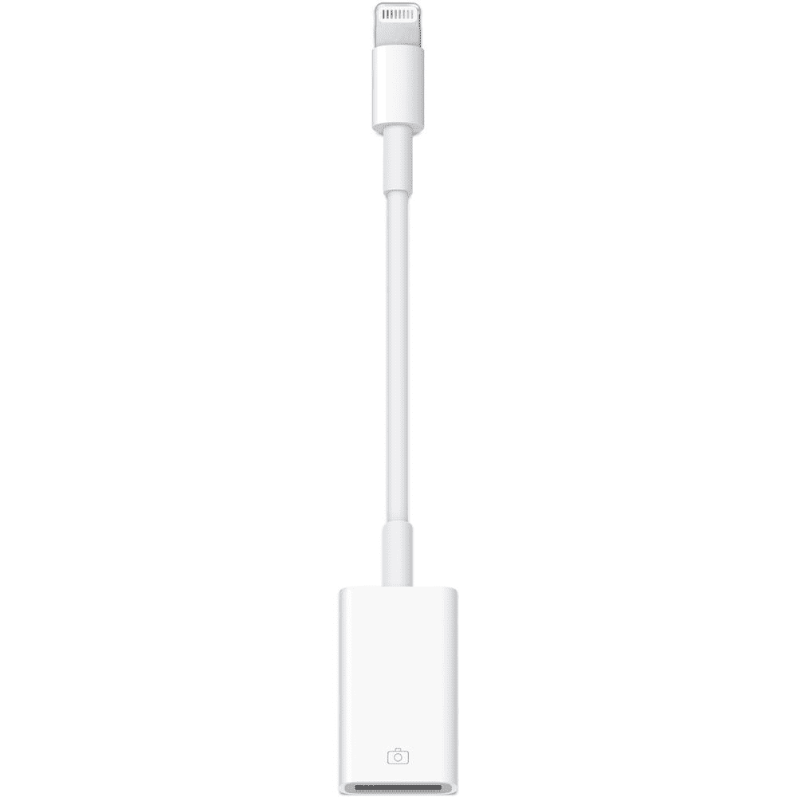

# 以有史以来最低的价格购买苹果闪电转 USB 摄像头适配器

> 原文：<https://www.xda-developers.com/apple-lightning-usb-camera-adapter-lowest-price/>

# 以有史以来最低的价格购买苹果闪电转 USB 摄像头适配器

你现在可以从亚马逊美国以有史以来最低的价格买到苹果 Lightning 转 USB 摄像头适配器，它支持不止一个摄像头。

苹果的 Lightning to USB 摄像头适配器可以做的不仅仅是摄像头，尽管它的名字如此。它可以像你在 Android 智能手机上一样用作 USB OTG 适配器，允许你安装驱动器，连接键盘，麦克风等等。大多数时候这是一个昂贵的适配器，但现在它在亚马逊上的价格是最低的。它通常会花掉你 29 美元，但如果你动作快，只需 8.91 美元就能买到。

 <picture></picture> 

Apple Lightning to Camera Adapter

##### 苹果闪电到相机适配器

苹果 Lightning to USB 摄像头适配器支持的不仅仅是摄像头，你可以在亚马逊上以有史以来最低的价格买到它。

苹果 Lightning 转 USB 摄像头适配器有一些非常酷的用途，如果你想在 iPhone 或 iPad 上使用 USB 供电的设备，它绝对是你的武器库中想要的一个适配器。请记住，这个适配器没有电荷传递功能，所以你不能在有东西插入的时候给你的手机充电。也不是所有的设备都能工作，所以值得研究是否真的有可能把它用在你想用的地方。亚马逊上的评论是一个很好的起点，因为许多客户已经概述了他们对这种适配器的一些特定用途。

如果你对挑选一个感兴趣，那么赶快行动，因为这种特殊的适配器在亚马逊上经常缺货。如果你想将它用于预期目的，它的工作原理是，当你插入相机时，你的 iPhone 或 iPad 会自动打开照片应用程序。然后，您可以选取要导入的视频或照片，并将它们整理到相册中。它支持 JPEG 和 RAW 等标准图像格式，以及 SD 和 HD 视频格式，包括 H.264 和 MPEG-4。它需要 iOS 9.2 或更高版本才能运行。