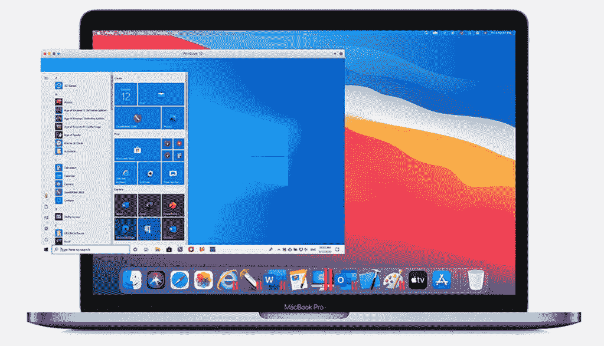

# 苹果 M1 的 24 寸 iMac 能运行 Windows 10 吗？

> 原文：<https://www.xda-developers.com/apple-m1-imac-run-windows-10/>

苹果新推出的 24 英寸 iMac 是其首款采用苹果芯片的台式电脑。如果你正在考虑加入，并且你以前没有玩过苹果 M1 个人电脑，有一些事情你需要知道，例如[你是否可以用它来使用外部显示器](https://www.xda-developers.com/use-external-monitor-with-m1-imac/)。此外，根据你目前使用电脑的方式，你可能会想，你的新 M1 iMac 电脑能否运行 Windows 10。

答案是肯定的，但不是通过传统手段。

## 新兵训练营已经不存在了

早在 2005 年的 WWDC，库比蒂诺公司宣布 MAC 电脑将从 PowerPC 过渡到英特尔。到 2006 年，苹果推出了一款名为 Boot Camp 的产品，随 Mac OS X 10.4 Tiger 一起推出。它允许你双重启动 Windows 和 Mac OS X(后来改名为 OS X，然后到 Mac OS)。

苹果硅苹果电脑的训练营已经结束了。事实上，图标仍然显示，但是如果你点击它，你会被告知它不存在。

所以不，你不能在裸机上运行 Windows，但是你可以通过虚拟化来运行它。这就是 Parallels 的用武之地。

## 通过 Parallels 实现 Windows 10 虚拟化

Parallels 生产使用多年的虚拟化软件。好消息是苹果 M1 对 Parallels 的支持正在生产中。

请注意，这些说明适用于任何 M1 Mac 电脑，甚至更实惠的 MacBook Air(这是苹果爱好者在[推荐的笔记本电脑](https://www.xda-developers.com/best-laptops/#bestaffordablemac))。然而，除非 Parallels 将其产品的一个版本带到 iPadOS，否则这不会对 [M1 iPad Pro](https://www.xda-developers.com/ipad-pro/) 起作用。

### 你需要什么

*   订购 Parallels Desktop，家庭版和学生版 79.99 美元，专业版或商业版每年 99.99 美元。你可以[在这里](https://www.anrdoezrs.net/links/100122946/type/dlg/sid/UUxdaUeUpU2368/https://www.parallels.com/)得到平行线。
*   为 ARM64 芯片编译的 Windows 10 VHDX。目前，官方提供的唯一图片是预览版。这样做的原因是因为它们是为微软的 Hyper-V 设计的，而用于 ARM 上 Windows 的 Hyper-V 是预览版。你可以从这里下载图片。就像 Boot Camp 一样，您需要自带 Windows 许可证。

设置它非常简单。只需按照 Parallels Desktop 中的说明开始即可。

## Apple Silicon 上 Parallels Desktop 的局限性

既然你已经在 24 英寸的 M1 iMac 上安装并运行了 Windows 10，有些事情你需要知道。

*   ARM 上的 Windows 支持 32 位 ARM 应用、64 位 ARM 应用和模拟 x86/x64 应用。苹果 M1 芯片组**不支持 32 位 ARM 应用**。它没有真正的理由，因为苹果生态系统中没有任何 32 位 ARM 应用程序。
*   这只是一些 Microsoft 商店应用程序的问题。微软将推出 x64 版本的收件箱应用程序。事实上，当你第一次打开像微软商店或照片这样的东西时，你会收到一条消息，提示该应用程序需要更新。

## Parallels Desktop 相当不错

Parallels Desktop 做了很多繁重的工作来弥补 macOS 和 Windows 10 之间的差距。您可以从 Windows 访问 macOS 文件。事实上，macOS 桌面上的所有快捷方式都会出现在 Windows 桌面上。您也可以设定某些内容在 macOS 中打开的默认位置。例如，在 Parallels 的 Windows 10 中，您可以将其设置为默认浏览器仍然是 Safari。

总之，简短的回答是，是的，你可以在 M1 iMac 上运行 Windows 10，但有一些限制。没有新的训练营了，所以你必须进行虚拟化。

 <picture></picture> 

Parallels Desktop

##### Parallels 桌面

Parallels Desktop 是运行 Windows、Linux 或任何其他系统的虚拟化软件

 <picture></picture> 

24-inch iMac with 4.5K display

##### 苹果 iMac (2021 年)

苹果的新一体机有 4.5K 显示屏，M1 芯片组，并且有漂亮的颜色