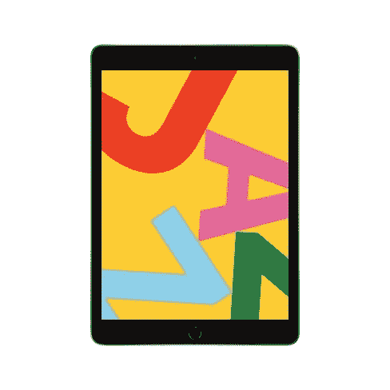
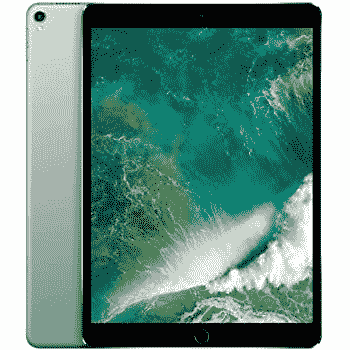
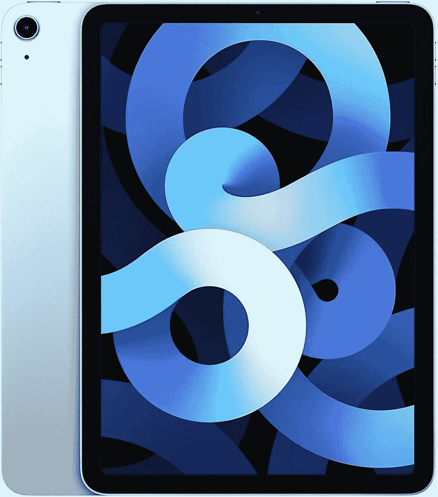
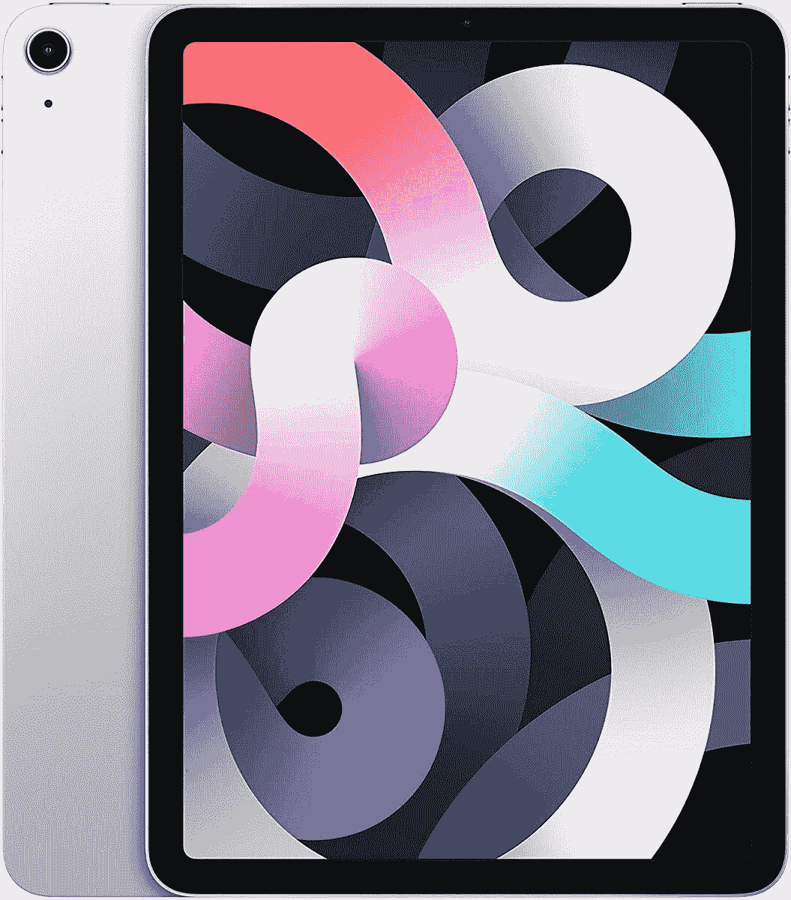

# 通过 iPads 和苹果 Mac Mini 的销售投资苹果！

> 原文：<https://www.xda-developers.com/apple-mac-mini-apple-deals/>

即使你是一个死忠的 Android 粉丝，你也不得不承认-[iPhone 12 相当不错](https://www.xda-developers.com/apple-iphone-12-review/)。有四种型号可供选择，你也会找到一款适合你的 iPhone。如果你已经决定跳槽到苹果，你可能会想...苹果还有什么好东西？嗯，原来是很多啊！不过，问题是苹果产品往往价格较高，尤其是与安卓和 Windows 设备相比。不过，你总是可以依靠一些销售来降低一点成本！无论你是在寻找带有 M1 芯片的苹果 Mac Mini，iPad，还是其他任何东西，我们都可以满足你！

首先，沃特！正在进行为期一天的 iPads 销售。就在今天，你可以在各种各样的[翻新 ipad](https://www.anrdoezrs.net/links/100122946/type/dlg/sid/UUxdaUeUpU1044/https://www.woot.com/plus/apple-ipads-11)上省下一大笔钱。这些都不是新型号，但如果你不觉得你需要尖端技术，这是一个伟大的，廉价的方式获得一个优秀的平板电脑。只要确保赫里-伍特的销售将持续到今天*或*结束，直到商品售完。如果看到喜欢的 iPad，马上抢过来！

 <picture></picture> 

Apple iPad 7th Gen (2019)

 <picture></picture> 

Apple iPad Pro (2017)

##### 苹果 iPad Pro 9.7 英寸(2017)

 <picture></picture> 

Refurbished Apple MacBook Sale

也许你想要最新最好的。我不怪你！我更喜欢更新的技术，因为这样它会(希望)持续更长时间。我在本月早些时候写了关于 iPad Airs 处于其最低价格的文章，并且它们在亚马逊仍然处于那个价格！570 美元的售价目前适用于三种颜色——天蓝色、银色和绿色。与以前不同的颜色选择，但如果你不挑剔，那么没有问题，对不对？黑色和天空粉色仍然打折，但价格不一样低了。更高的价格值不值这个颜色，就看你自己了！

 <picture></picture> 

Apple iPad Air 4

 <picture></picture> 

iPad Air (2020) - Green

 <picture></picture> 

iPad Air (2020) - Silver

让我们不要忘记球的美女(至少在这篇文章中)，苹果 Mac Mini。这款迷你电脑的 256GB 和 512GB 型号在亚马逊都降价 50 美元，分别为 649 美元和 849 美元。Mac Mini 内置强大的 M1 芯片，这种新技术降价 50 美元对苹果来说很罕见。如果你一直在寻找升级你的 Mac，并且不需要太多的内存和空间，这是你省钱的机会。

 <picture></picture> 

2020 Mac Mini (256GB)

##### 苹果 Mac Mini (M1，2020 年)

 <picture></picture> 

2020 Mac Mini (256GB)

##### 苹果 Mac Mini (M1，2020 年)

当你在这里的时候，一定要好好利用免费的苹果健身升级套餐！