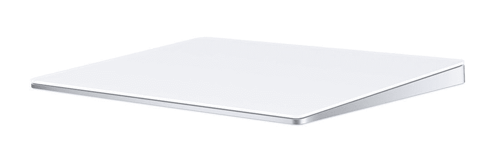

# 苹果 Mac Studio 盒子里有什么？

> 原文：<https://www.xda-developers.com/apple-mac-studio-unboxing/>

苹果个人电脑阵容的最新成员是 [Mac Studio](https://www.xda-developers.com/mac-studio/) ，它有望成为历史上最强大的 Mac。基本型号配备了 M1 Max，这在现有的 [MacBook Pro](https://www.xda-developers.com/macbook-pro-2021/) 中可以找到，但更高端的型号提供了新的 M1 Ultra。基本上，苹果把两个 M1 Max 芯片粘在一起，创造了新的 beastly 芯片组。事实上，M1 Ultra 型号大约重两磅，这是因为更强大、更热的处理器需要不同的散热方式。

作为一台台式电脑，你可能想知道盒子里是什么。与购买一体式 iMac 不同，Mac Studio 没有配备魔法键盘或魔法轨迹板。

像往常一样，苹果有无障碍包装。顶部有一个长条，你可以很容易地撕开它，然后两侧折叠起来，方便进入 Mac Studio。在那下面，你会发现电源线，这似乎不是任何方式的专利。

为了明确起见，您将在包装盒中找到以下内容:

*   Mac 工作室
*   电力电缆
*   一个苹果贴纸，是黑色的
*   带有安全信息和产品端口图的常规文件

苹果 Mac Studio 的尺寸比更高的 [Mac Mini](https://www.xda-developers.com/mac-mini/) 还要大。就像它的短同胞一样，它是 7.7 英寸乘 7.7 英寸。然而，它只有 3.7 英寸高，仍然短到足以在许多显示器下轻松放置。对于这样一个强大的钻机，它当然有一个小的足迹。M1 Max 和 M1 Ultra 型号的重量分别为 5.9 磅和 7.9 磅。

这里最重要的一点是，如果你想买一台 Mac Mini，当你买一台 Mac Studio 时，你需要自带键盘和鼠标。

 <picture></picture> 

Apple Mac Studio

##### 苹果 Mac 工作室

Mac Studio 是这一系列产品中的佼佼者，它的体积仍然很小。

 <picture></picture> 

Magic Keyboard with Touch ID

##### 带触控 ID 的苹果魔法键盘

Magic Keyboard 不仅是苹果的第一方设备，它还将为你的 Mac 启用触控 ID。

 <picture></picture> 

Magic Trackpad

##### Apple Magic Trackpad

苹果的 Magic Trackpad 是无线和可充电的，有黑白两种颜色。