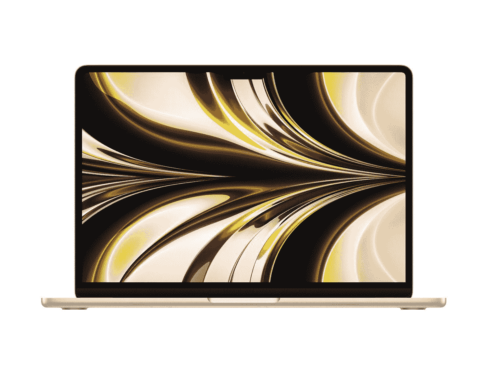

# 苹果 MacBook Air M2 打折，零售价降低了 100 美元

> 原文：<https://www.xda-developers.com/apple-macbook-air-m2-gets-100-discount/>

6 月，在 WWDC 期间，苹果公司发布了其新款笔记本电脑， [MacBook Air M2 2022](https://www.xda-developers.com/m2-macbook-air-announced/) 。这一发布意义重大，因为它标志着多年来第一次新的 MacBook Air 重新设计。它还采用了苹果 M2 硅的全新处理器。虽然笔记本电脑的折扣很少，但我们现在有两款机型打折，比零售价低 100 美元。

亚马逊和 BHPhotoVideo 已经贴出折扣，提供 MacBook Air M2 零售价 100 美元的折扣。虽然两家公司都在基本型号 MacBook Air 上提供折扣，但 BHPhotoVideo 有一个额外的产品，对 10 核型号和 512GB 内部存储进行折扣。前者的售价为 1099.99 美元，比零售价低 100 美元。后者售价 1399.99 美元，也比零售价便宜 100 美元。有一点要注意的是，出售的基本款只有星光色打折出售。512GB 的高端机型，目前只有太空灰机型在打折。

MacBook Air M2 机型配有 13.6 英寸显示屏，重 2.7 磅，厚度为 0.44 英寸。这款笔记本电脑提供了一个 MagSafe 3 充电端口、3.5 毫米耳机插孔和两个 Thunderbolt / USB 4 端口。虽然小，轻，紧凑，笔记本电脑提供了出色的电池寿命，苹果声称上网时长达 15 小时。在很大程度上，如果你正在寻找一台电池寿命长的苹果笔记本电脑，这将是最好的选择。

如果你需要更多的说服力来进行购买，一定要看看我们的[MacBook Air M2 动手操作](https://www.xda-developers.com/apple-macbook-air-m2-first-look/)。你也可以通过阅读获得最高荣誉的[我们的评论](https://www.xda-developers.com/macbook-air-m2-2022-review/)，进行更深入的探究。如果你对新的笔记本电脑感兴趣，你可以从亚马逊或 BHPhotoVideo 购买。如前所述，亚马逊和 BHPhotoVideo 都有基本款，而只有 BHPhotoVideo 会打折销售 512GB 的太空灰款。

 <picture></picture> 

MacBook Air M2 2022

##### 苹果 MacBook Air (2022)

苹果公司最新的 MacBook Air 采用了 M2 处理器

 <picture></picture> 

MacBook Air M2 2022

##### 苹果 MacBook Air (2022)

苹果公司最新的 MacBook Air 采用了 M2 处理器