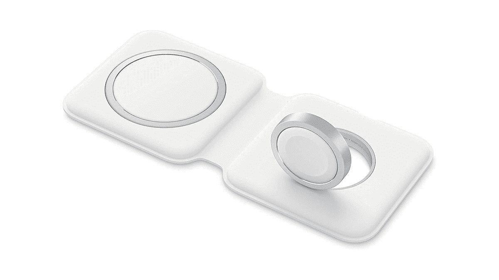

# 苹果 MagSafe Duo 充电器在亚马逊 Prime Day 享受 25 美元的适度折扣

> 原文：<https://www.xda-developers.com/apple-magsafe-duo-charger-amazon-prime-day-sale/>

# 苹果 MagSafe Duo 充电器在亚马逊 Prime Day 享受 25 美元的适度折扣

如果你想让家里或办公室里的东西都是苹果的，你会很高兴知道苹果 MagSafe Duo 充电器现在正在销售。

经过缓慢的积累，亚马逊的黄金日终于到来了。为期两天的活动接管了零售业，再一次展示了自己，带来了来自行业各个角落的偷窃和交易。很多时候，我们甚至真的不需要任何东西，但价格实在太好了，让人难以抗拒。如果你已经厌倦了给 iPhone 充电，并一直在寻找替代方法，苹果的 MagSafe Duo 充电器可能是你一直在寻找的无线解决方案。由于亚马逊 Prime Day，该产品享受了 25 美元的健康折扣，价格降至 103.99 美元。

Apple MagSafe Duo 充电器外观独特，有两个 MagSafe 充电器。左边的是平的，用来给你的 iPhone 充电，而右边的是向上倾斜的，用来支撑你的 Apple Watch。无线充电板的占地面积非常小。这种充电板的另一个好处是，它可以通过它的 Lightning 端口接收电力。这意味着你下次出门时不必再带一根额外的电缆。MagSafe Duo 充电器最大可以达到 14W 的无线充电速度，但需要更强大的充电适配器才能做到这一点。

 <picture></picture> 

Apple MagSafe Duo Charger

##### 苹果 MagSafe Duo

苹果的终极无线充电解决方案

MagSafe Duo 充电器不是最便宜的选择，但它是苹果公司的产品。如果你需要在生活中拥有苹果的一切，这可能是你的无线充电器。当然，如果你愿意走出苹果的领域，并有一个开放的思维，你可以随时看看 [Anker 提供了什么](https://www.xda-developers.com/anker-amazon-prime-day-deals-2022/)。该公司在业内享有盛誉，为不同类型的设备提供多种充电解决方案。它在尽可能高的水平上做到了这一点，同时仍然提供许多不同的价位。