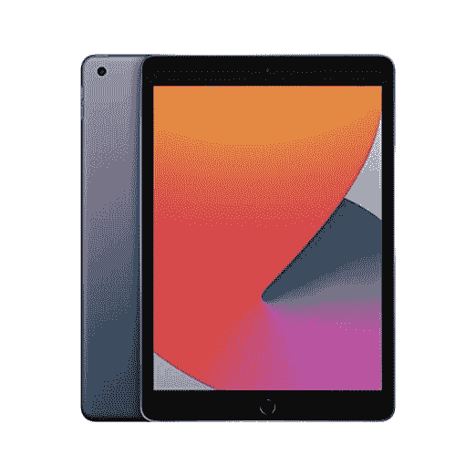

# 苹果最受欢迎的 iPad 现在售价仅为 269 美元

> 原文：<https://www.xda-developers.com/apple-most-popular-ipad-prime-early-access-sale/>

自 2010 年推出第一代产品以来，苹果的入门级 iPad 已经走过了漫长的道路。然后，它配备了苹果的 A4 芯片，256GB 内存，最大 64GB 存储空间，可以让你在 9.7 英寸的 LED 背光 IPS 液晶显示器上观看你最喜欢的节目。

当前版本在一年多前推出，它有足够的功能和特性来对抗 iPad Pro 的前几代产品。我的意思是，你现在可以获得一个更大的 10.2 英寸显示屏，支持手写笔，一个新的 12MP 超宽前置摄像头，带中央舞台，True tone，立体声扬声器，触控 ID，等等，只需 329 美元。然而，我们有一个好消息给任何想得到第 9 代 iPad 的苹果粉丝，因为最新的报价将让你以低至 269 美元的价格得到一台。

亚马逊最新的 Prime Day 销售活动目前让你在最新的入门级 iPad 型号上节省 60 美元。这将有助于你获得一款新的 10.2 英寸平板电脑，64GB 存储空间，3GB 内存，以及苹果 A13 仿生芯片，仅售 269 美元。以前的交易最多只能让你节省 30 美元，这意味着你必须在任何一天为你的新 iPad 支付 299 美元。

 <picture></picture> 

10.2-inch iPad

##### 10.2 英寸 iPad

苹果最受欢迎和最实惠的 iPad 在最近的折扣后变得更加引人注目。它配有 10.2 英寸显示屏，苹果的 A13 芯片，3GB 内存和高达 256GB 的存储空间。

假设你需要更多的存储空间。在这种情况下，你可以看看 [256GB 存储选项](https://www.amazon.com/dp/B09G91TLNJ?tag=xda-5c4aj9d-20&ascsubtag=UUxdaUeUpU44073&asc_refurl=https%3A%2F%2Fwww.xda-developers.com%2Fapple-most-popular-ipad-prime-early-access-sale%2F&asc_campaign=Affiliate)，现在售价为 419 美元，对于任何有兴趣购买的人来说，这意味着节省了 60 美元。当然，你可以用这些节省下来的钱去买[第一代 Apple Pencil](https://www.amazon.com/dp/B016NY7784?tag=xda-5c4aj9d-20&ascsubtag=UUxdaUeUpU44073&asc_refurl=https%3A%2F%2Fwww.xda-developers.com%2Fapple-most-popular-ipad-prime-early-access-sale%2F&asc_campaign=Affiliate) ，因为这是入门级 iPad 支持的唯一型号。它目前售价 99 美元，但我们已经看到它低至 70 美元。得到这些小玩具中的一个会让你的 iPad 变得更好，因为你可以记笔记，涂鸦，并且总的来说使它成为一个生产力工具。