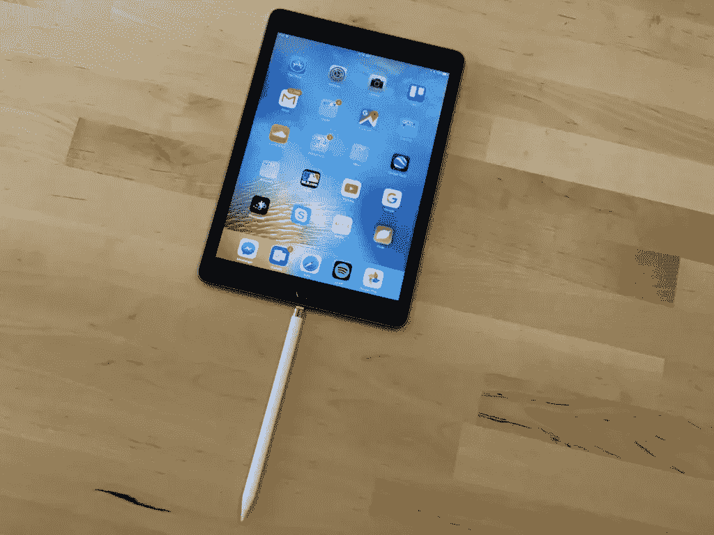
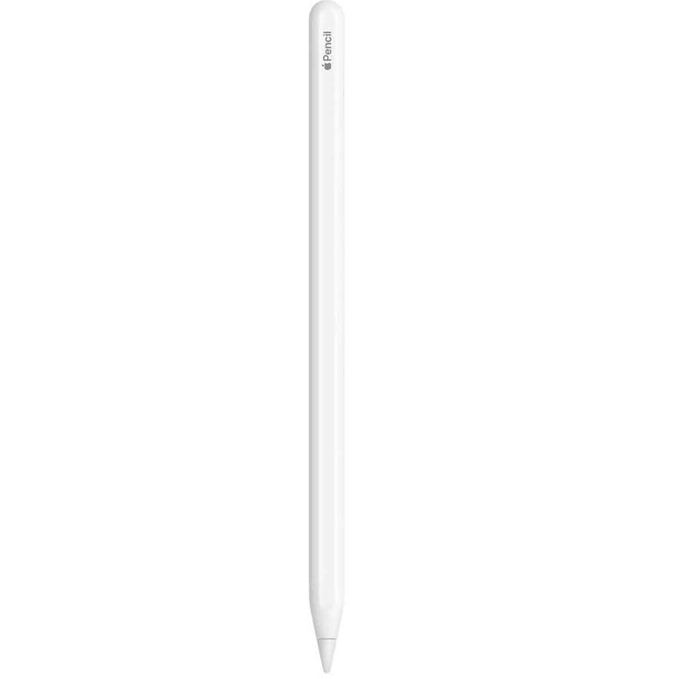

# Apple Pencil 2 并不是我所希望的魔法棒

> 原文：<https://www.xda-developers.com/apple-pencil-2-isnt-magic-wand-editorial/>

自从第一代 Apple Pencil 问世以来，我就一直在关注它。如果你是《XDA》的忠实读者，你可能知道我对苹果产品以及将它们联系在一起的紧密生态系统的热情。不管是否被 FanBoi 洗脑，不可否认的是，这些设备在终端用户看不到的深层次上进行交流。例如，一旦你熟悉了操作系统，你就不会再考虑在 iPhone 上复制然后粘贴到 macOS 上。它只是成为工作流程中无意识的一部分。只有当你换到不同的品牌时，你才会想念它——在那里它不受支持。

Apple Pencil 2 实际上对现有的单独 iPad 体验没有太大贡献。

我对 Apple Pencil 2 抱有很高的期望。背后的原因之一是它不是第一代产品。所以该公司已经从以前的错误中吸取了教训(你会这么想)。不过，更重要的是，这是因为我看到了苹果配件，比如 AirPods 系列，可以有多神奇。我原以为 Apple Pencil 2 是某种魔杖。我曾认为并希望它能释放 iPad 的全部潜力——一个迷人的罗密欧对一个孤独的朱丽叶。然而，在我得到它之后，我突然意识到:~~爱情不是真实的。~~它实际上对现有的、单独的 iPad 体验没有太大贡献。除非你是一名平面设计师或热衷于创作数字艺术的人，否则你很可能会得出和我作为普通用户一样的结论。一个[好的 iPad](http://xda-developers.com/best-ipad) 性能根本不依赖可选的铅笔。

* * *

## 苹果铅笔 2:耶

让我们从好处开始，因为在我看来，坏处肯定比好处多。但在此之前，让我强调一下是什么促使我最终购买了这款产品。 *Freeform* 是苹果将在今年晚些时候发布的一款应用，作为 [iOS 16](https://www.xda-developers.com/ios-16-developer-beta-1-hands-on/) 、 [iPadOS 16](https://www.xda-developers.com/ipados-16-developer-beta-1-hands-on/) 和 [macOS Ventura](https://www.xda-developers.com/macos-ventura-hands-on/) 的一部分。这几乎是一个没有什么限制的白板。作为一个喜欢将自己的想法可视化的人——尤其是在头脑风暴和准备详细内容的时候——我非常期待能得到它。此外，我想以一种原始的/ *自由的形式*使用它——不是通过键盘和手指触摸控制，而是通过回归纯粹纸张、铅笔和涂鸦的基础。

### 真正的第二代

 <picture></picture> 

*The iPad Lollipop in question. -- Credit: Jordan Novet/VentureBeat*

当你将 Apple Pencil 2 与原始型号进行比较时，无论是在设计还是功能方面，都有许多显著的差异。从充电开始，你再也不用依赖 *iPad 棒棒糖*技术给你的苹果味手写笔充电了。该公司已经意识到，将一支铅笔垂直插入 iPad 的 Lightning 端口并不太符合苹果的 T2 风格。这让我们想起了神奇鼠标荒谬的颠倒充电机制。

Apple Pencil 2 更现代，更直观，看起来也不可笑。

新款 Apple Pencil 通过放在兼容的 iPad 边缘来配对和充电。很现代，更直观，看起来也不可笑。除此之外，它还非常适合存储和携带。你不再需要一个专门的口袋来装铅笔，也不用担心丢失。说到丢东西，第二代铅笔也有一个平的边缘——所以它不会在平面上滚动，比如办公桌，也不会给地面一个致命的拥抱。

### 有点聪明

我不否认 Apple Pencil 2 有一些*的智能*。是的，它们令人失望，但我们仍然必须承认它们。首先，双击快捷键可以在橡皮擦和正在使用的绘图工具之间快速切换。苹果支持提到你可以重新映射它来显示调色板，但出于某种原因，这些特定的选项没有出现在我在 iPadOS 16 上的*设置*应用中。

此外，你可以从 iPad 的任意一个底部对角滑动，以拍摄屏幕截图或创建快速笔记。这些手势也可以通过手指来实现，但我发现在使用 Apple Pencil 2 时，它们更可靠/更一致。除此之外，当你使用这款*智能*手写笔时，许多应用都支持手掌拒绝，所以你不必处理意外的触摸输入。

### 苹果电脑的配件

你可以把你的 iPad 变成各种各样的 Wacom 显示器。

也许艺术家会欣赏的一个方面是 macOS 上的 Apple Pencil 支持。不，你不能在 Mac 的显示屏上使用它。然而，多亏了 Sidecar，你可以把你的 iPad 变成各种各样的 Wacom 显示器。这样你就可以将功能强大的 Mac 电脑的屏幕镜像到支持 Apple Pencil 2 输入的 iPad 上。对于那些想要快速注释或签署文档，而不是将整个任务交给 iPad 应用程序的人来说，它也很棒。

* * *

## 苹果铅笔 2:反对

现在我们已经把 Apple Pencil 2 的积极因素放在一边，让我们深入到更有趣的细节——这东西有多可怕。还是那句话，这是我自己的，个人观点和未实现的期望。我意识到铅笔迎合了某一类用户——我似乎不属于这一类——但我还是记录了我的经历。

### 我的手指是高级的(并且不花我 129 美元)

信不信由你，我曾经是一个铁杆安卓用户和粉丝。大约十年前，我使用的是三星 Galaxy Note 2 LTE。信不信由你，我再次认为它附带的手写笔比 Apple Pencil 2 更有用。首先，它不需要动力就能运行。你不需要充电或维护它。其次，它允许我在不接触显示屏的情况下与显示屏互动。如果我没记错的话，我会通过点击屏幕底部来滚动列表。更不用说当你悬停在它上面时，屏幕上还有一个可见的指针。

Apple Pencil 2 不会像 Galaxy Note 2 的手写笔那样取代你的手指。

Apple Pencil 2 仅在“令人兴奋”的功能方面支持双击工具切换快捷方式。不过，更重要的是，它不会像 Galaxy Note 2 的手写笔那样取代你的手指。*哑*手写笔支持所有种类的触摸输入，你可以用一根手指完成。在 iPad 上，你不能使用铅笔做任何系统级的手势，如切换应用程序、前往主屏幕、打开控制中心或检查通知中心。因此，如果我只是将所谓的*智能*手写笔作为手指的等价物，我必须在 Apple Pencil 2 和我的手指之间切换。嘿，你的手指是内置的，不会花你一百多美元。

### 晚...ncy

考虑到苹果的生态系统倾向于立即和毫不费力地工作，我期待 Pencil 2 能够完全集成到 iPadOS 中。我本以为输入会是即时的——因为该公司已经开发了这两种产品，并且可以雇佣智囊来找出两者之间的无缝连接。不幸的是，在绘图时，您可能会注意到几毫秒的延迟。您正在绘制的线条不会立即出现在笔尖接触显示器的地方。延迟非常小，但是我确信高级用户——尤其是数字插画师——会注意到这一点。我读到过，由于推广(120Hz)支持，新款 [iPad Pro](https://www.xda-developers.com/ipad-pro/) 的性能更好。记住，我使用的是 iPad Air 5(其刷新率峰值为 60Hz)，我无法评论 Pencil 与 Pro iPads 搭配时的性能。

### 手写的噩梦

Apple Pencil 的卖点之一就是*潦草*。这个 iPadOS 功能可以让你当场将手写内容转换成文本。它还支持选择单词、删除单词等手势。我希望我的字迹清晰可辨。我的意思是，这不是你在古代羊皮纸上找到的草书，从一个国王传到另一个国王。但是很明显。

我认为 Scribble 完全理解我 85-90%的手写输入。考虑到该功能在设备上也能工作，这真是令人印象深刻。然而，我无法想象自己在时间敏感的情况下用它做笔记——比如去上课或面试。不得不不时停下来纠正一个单词，这只会打断流畅的表达。更重要的是，键盘更快更精确。对于那些怀旧的人来说，Apple Pencil 2 是一个很酷的噱头，他们希望以传统的方式写诗，而不需要遵守截止日期或赶上发言者。

### 有非常明确的受众

Galaxy Note 2 中包含的手写笔不仅仅受到艺术家的喜爱。我曾经发现自己依赖它而不是手指来随意浏览手机。我不知道如何解释，但在随机的、非艺术的场合使用它有时是有意义的。Apple Pencil 2 就不是这样了——因为你甚至不能通过它执行所有的操作。如果我每次跳转到不同的应用程序时都必须在铅笔和手指之间切换，我宁愿一直用手指。

Apple Pencil 2 显然是针对重度笔记型电脑和插图画家的。根据我的使用情况，我会说它不是为系统交互而构建的。你只是把它用在非常特定的应用中，用于非常特定的目的，仅此而已。我希望我能更普遍地使用它——就像我对 Galaxy Note 2 那样。我只希望苹果在未来的 iPadOS 更新中取消这些限制，因为它们纯粹是软件限制。

* * *

Apple Pencil 2 非常令人失望，因为十年前的一支手写笔击败了它。

我会退回 Apple Pencil 2 吗？不，不是因为我需要它。这支手写笔肯定不适合我，更何况我并不是以创作图形为生，也不是把它作为一种爱好。然而，考虑到我的工作领域，我想保留一个——因为它可以在我围绕它作为主题创建内容时派上用场。更不用说我计划今年晚些时候在 Freeform 应用程序中使用它。在注释我在文章中包含的截图时，这也很有帮助，所以就这样了。如果我在不同的领域工作，我可能会在购买后的一两天内退货。这非常令人失望，因为在我看来，十年前的手写笔在许多方面都超过了它。

 <picture></picture> 

Apple Pencil 2

##### 苹果铅笔(第二代)

Apple Pencil 2 通过磁力与兼容的 iPads 配对，并通过相同的机制进行无线充电。如果你认为这个产品适合你，你可以花 129 美元买一个。

*你用 Apple Pencil 2 吗？为什么或为什么不？请在下面的评论区告诉我们。*