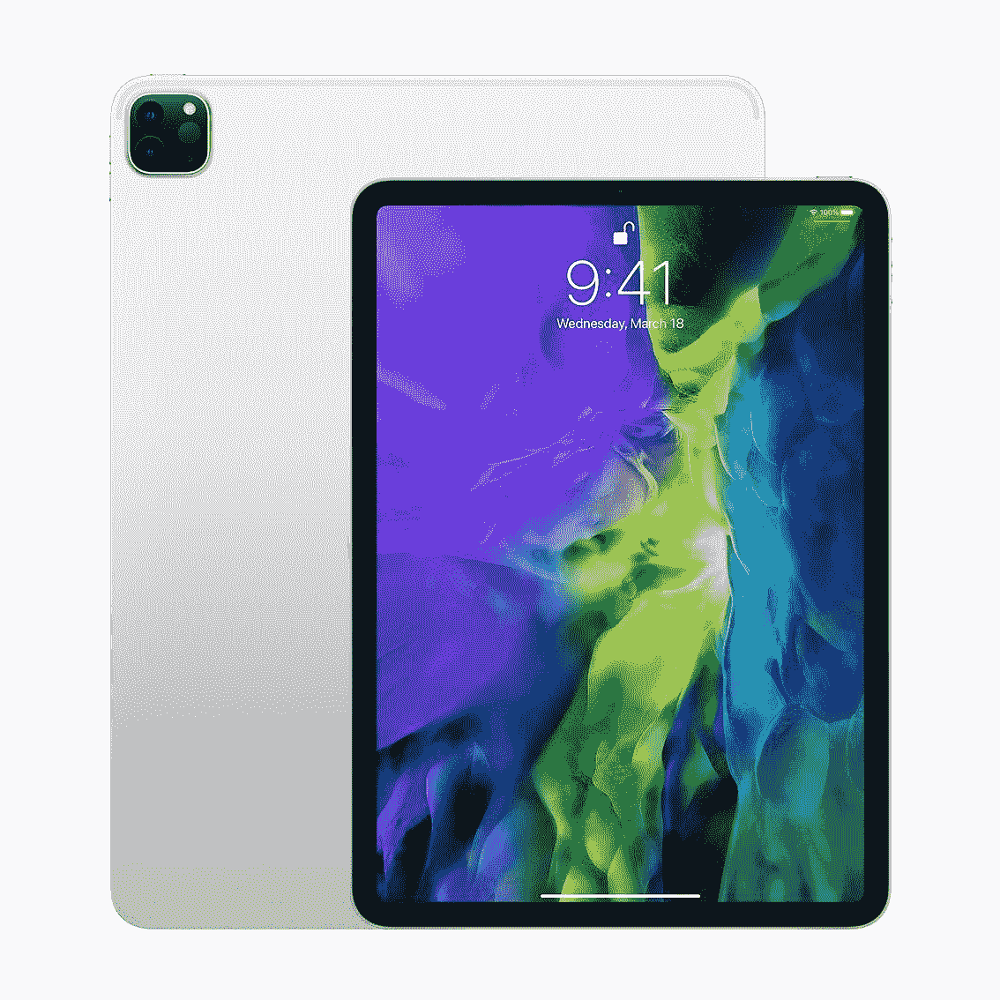

# 花 80 美元买一支苹果铅笔，把你的 iPad 变成一个艺术平板电脑

> 原文：<https://www.xda-developers.com/apple-pencil-amazon/>

对我来说，拥有一台平板电脑最吸引人的地方之一就是能够用它来画画。虽然艺术平板电脑是为桌面而存在的，但在平板电脑上画画，看到线条在其他地方的屏幕上弹出，感觉很尴尬，我发现这不是一件容易克服的事情。一台好的平板电脑和一支好的数码笔有助于缓解这个问题。苹果铅笔通常值 99 美元，但现在你可以在亚马逊上只花 80 美元买到一支！

如果你用 iPad 工作，Apple Pencil 是一个很好的配件。据报道，这种铅笔感觉非常类似于物理纸笔，但当然是以数字形式。一个更习惯于传统媒体的艺术家可以通过 Apple Pencil 和 iPad 组合跳到数字艺术，并且没有太多的进入障碍。或者，那些喜欢做笔记或写日记的人会发现他们非常喜欢这个设置。当你可以用你已经拥有的平板电脑来复制这种感觉时，就不需要购买昂贵的笔、纸和邮票了！

如果你现在从亚马逊上买苹果铅笔，你会在圣诞节前拿到它。这可能是送给你生命中苹果爱好者的完美礼物！

 <picture></picture> 

Apple Pencil (2nd gen)

##### 苹果铅笔

用 Apple Pencil 为你的 iPad 找到完美的配件。这可能是你能在纸上得到的最接近真实的笔的东西，你可以以 80 美元的价格买到这支打折的铅笔！

顺便说一下，iPad 的一些型号也在亚马逊销售。例如，你可以以 1000 美元的价格买到新款苹果 iPad Pro 256GB，比建议零售价低 100 美元。这款平板电脑也将在圣诞节前上市...那么为什么不两者兼得，让它成为最完美的礼物呢？我能想到我生命中有很多人会欣赏这样的东西！

 <picture></picture> 

Apple iPad Pro (256GB)

##### 苹果 iPad Pro 12.9 英寸(2020 年)

寻找一款出色的平板电脑？你不可能比 iPad Pro 做得更好。256GB 型号比建议零售价低 100 美元，它将在圣诞节前上市！

如果你在寻找更多苹果主题的节日礼物，他们也为此建立了一个特殊的亚马逊页面。我听说[新款 iPhones 很不错](https://www.xda-developers.com/apple-iphone-12-review/)，毕竟！