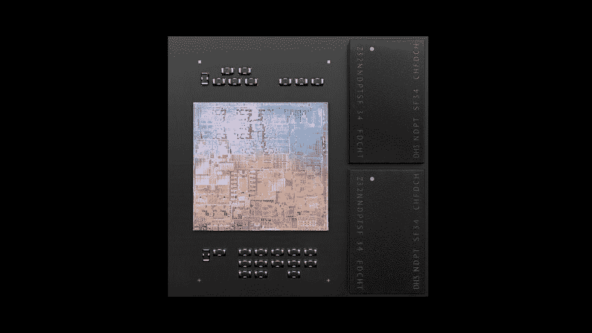
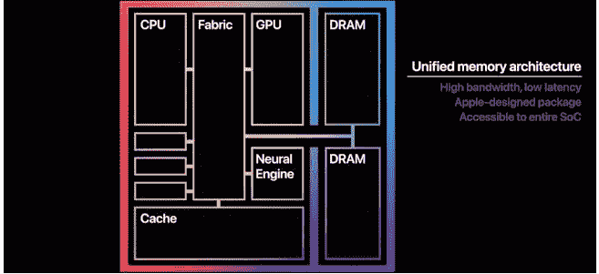

# 什么是统一内存，它在 Apple Silicon 上是如何工作的？

> 原文：<https://www.xda-developers.com/apple-silicon-unified-memory/>

随着苹果 M-powered 设备的不断发布，人们对这一芯片组家族的惊人效率重新产生了兴趣。早在 2020 年，M1 芯片的推出就让这家位于库比蒂诺的公司首次在苹果芯片上使用了统一内存架构(UMA)。这种内存方法使苹果能够从更少的总内存中挤出更高的性能。那么苹果芯片上的统一内存到底是如何工作的呢？让我们来看一看，从内存的一些基本知识开始，以及 M 驱动的 MAC 电脑的新特性。

## 什么是 RAM，这里的 M 芯片有何不同？

RAM 代表“随机存取存储器”。这是任何计算机上系统内存的主要组成部分。系统内存为计算机在给定时刻使用的数据提供了一个临时存储库。储存在系统内存中的数据可能包括您当前正在查看的文件，以及 macOS 需要的文件。传统上，RAM 在物理上是一根长棍，可以插入主板上的插槽。M1 实际上也是这样一场革命。

苹果公司将 M1 设计成一个片上系统(SoC ), RAM 是这个包的一部分。虽然将 RAM 与 SoC 集成在智能手机中很常见，如 [iPhone 14 系列](https://www.xda-developers.com/apple-iphone-14)，但这对于台式机和笔记本电脑来说是一个相对较新的想法。将 RAM 添加到 SoC 设计中可以更快地访问存储器，从而提高效率。

 <picture></picture> 

Credit: Apple

除了将 RAM 物理添加到 SoC 中，苹果还改变了系统使用内存的基本方式。这就是苹果芯片上的统一内存发挥作用的地方。那么统一内存是如何工作的呢？

## 什么是统一内存，它是如何工作的？

统一内存旨在最大限度地减少 CPU、GPU 等使用的不同内存部分之间复制的数据冗余。复制速度慢，浪费内存容量。在传统的内存实现中，部分 RAM 是为 GPU 保留的。如果您的笔记本电脑宣传有 16GB 的 RAM，2GB 分配给 GPU，那么您只有 14GB 可用于系统任务。苹果通过 UMA 解决了这个问题，使内存分配更加流畅，提高了性能。

游戏是理解统一内存优势的最佳范例。当你在 Mac 上玩游戏时，CPU 首先接收游戏的所有指令，然后将 GPU 需要的数据推送到显卡。图形卡然后获取所有数据，并在自己的处理器(GPU)和内置 RAM 中处理这些数据。

如果你有一个集成图形的处理器，GPU 仍然保持自己的内存块，处理器也是如此。CPU 和 GPU 独立处理相同的数据，然后在它们的内存库之间来回传递结果。如果您不再需要来回移动数据，那么很容易看到将所有内容保存在同一个存储区域可以如何提高性能。统一内存方法通过允许所有组件在同一位置访问同一内存，真正革新了性能。

 <picture></picture> 

Credit: Apple

苹果凭借 M 系列芯片真正实现了伟大。除了物理集成 RAM 之外，新的统一内存架构还允许更高效地使用可用内存。使用这种新的内存实现，M-powered MAC 可以做任何事情，包括运行 Windows 10 的[。将所有内存放在一个池中意味着任何组件都可以在需要时增加使用量，在需要的地方无缝地分配资源。](https://www.xda-developers.com/apple-m1-imac-run-windows-10/)

*   <picture></picture>

    12.9 英寸 iPad Pro

    ##### 苹果 iPad Pro 12.9 英寸(2021)

    这款 12.9 英寸 iPad Pro 上的屏幕要亲眼看到才能相信加上 M1 芯片，这对于一台 iPad 来说几乎太强大了。

*   <picture></picture>

    配备 4.5K 显示屏的 24 英寸 iMac

    ##### 苹果 iMac (2021)

    苹果目前的一体机拥有 4.5K 显示屏，M1 芯片组，并有漂亮的颜色