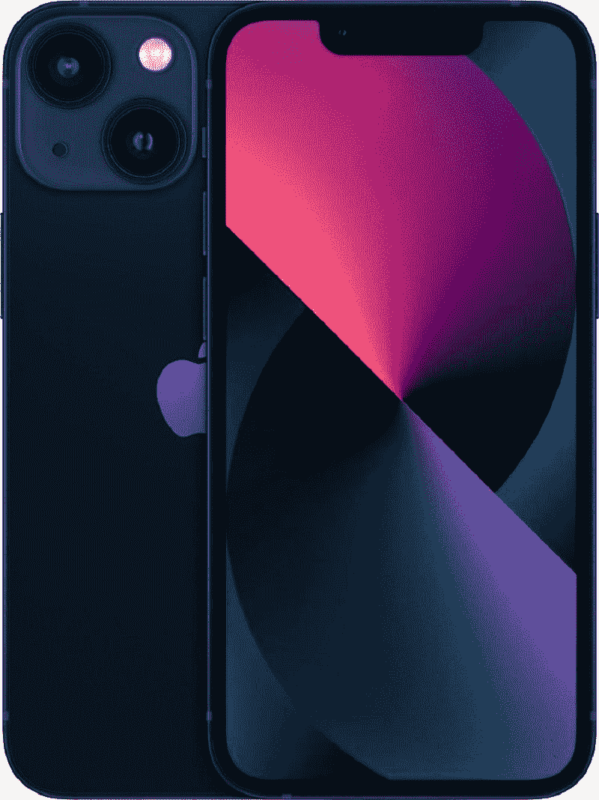
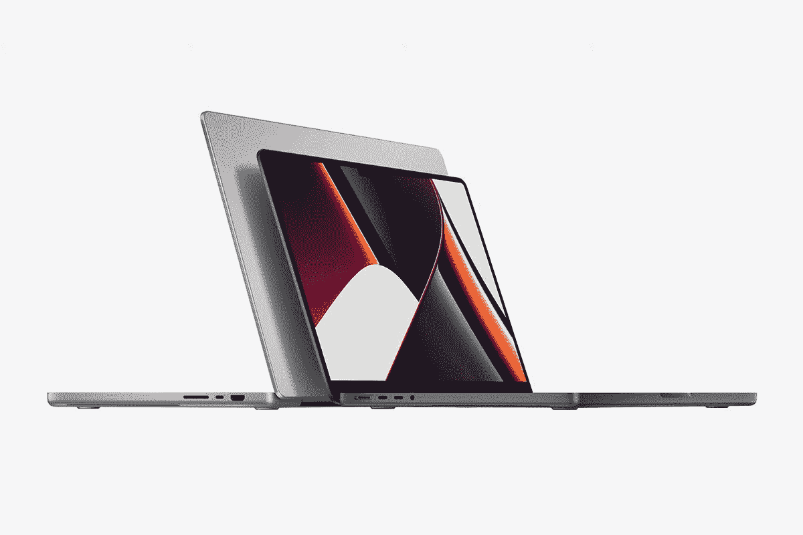

# 苹果芯片:这里是你需要知道的关于苹果自己的 SOC 的一切

> 原文：<https://www.xda-developers.com/apple-silicon/>

除了制造高端消费硬件，包括 iPhones、iPads 等，苹果还制造了一系列片上系统(SoC)。这些 SOC 旨在用于苹果自己的消费类硬件产品，主要采用 ARM 架构。除了新的 Mac 电脑，各种不同的苹果产品，包括 iPhones，iPads，Apple TV，Apple Watch 等，都使用苹果硅。谈到苹果芯片，有很多东西需要解开，所以我们决定创建一个专门的中心，展示你需要知道的关于苹果芯片的一切。

早在发布 M1 芯片之前，苹果就已经在 A 系列下为 iPhones、iPads 等产品制造自己的 SOC。虽然我们不会深入研究追溯到 2010 年的所有 A 系列处理器，但我们会包括那些仍然相关并且没有被苹果停产的处理器。现在，让我们开始吧:

## 苹果 A 系列家族

Apple A 系列包括用于各种型号的 iPhone、iPad、iPod Touch、Apple TV 等的 SOC 系列。A 系列 SOC 在芯片内集成了一个或多个基于 ARM 的处理器、一个图形单元、高速缓存和其他组件，这些组件对于提供全方位的计算体验至关重要。

从技术上讲，苹果 A4 是 A 系列的第一款 SoC。这也是苹果内部设计的第一款 SoC。该公司使用 APL0098、APL0278、APL0298 和 APL2298 等较旧的 SOC，分别用于其第一代 iPhone、第二代 iPod Touch、iPhone 3GS 和第三代 iPod Touch 等设备。

回到苹果 A4，它是由苹果设计，三星制造的。A4 于 2010 年首次亮相，搭载 ARM Cortex-A8 CPU 和 PowerVR SGX 535 图形处理器。这种特殊的芯片首先用于苹果的 iPad，后来用于 iPhone 4。A4 后来被苹果停产，取而代之的是 2011 年 3 月推出的新 A5 芯片。在不涉及太多细节的情况下，让我们快速浏览一下迄今为止推出的每一款苹果 A 系列 SKU:

### **苹果 A 系列 SoC SKU**

| 

苹果 SoC

 | 

晶体管

 | 

CPU 指令体系结构

 | 

中央处理器

 | 

人工智能加速器

 | 

记忆

 | 

出厂日期

 | 

使用的设备

 |
| --- | --- | --- | --- | --- | --- | --- | --- |
| **苹果 A4** | 钠 | ARMv7 | 0.8–1.0 GHz 单核 Cortex-A8 | 钠 | LPDDR-400 双通道 32 位(64 位)@ 200 MHz (3.2 GB/s) | 2010 年 4 月 3 日 | 

*   iPhone 4
*   苹果电视(第二代)
*   iPad(第一代)
*   iPod Touch(第四代)

 |
| **苹果 A5** | 钠 | ARMv7 | 0.8–1.0 GHz 双核 Cortex-A9 | 钠 | LPDDR2-800 双通道 32 位(64 位)@ 400 MHz (6.4 GB/s) | 2011 年 3 月 11 日 | 

*   iPad 2
*   iPhone 4S
*   苹果电视(第三代)
*   iPad 2
*   iPad Mini(第一代)
*   iPod Touch(第五代)
*   苹果电视(第三代)

 |
| **苹果 A5X** | 钠 | ARMv7s | 1.0 GHz 双核 Cortex-A9 | 钠 | LPDDR2-800 四通道 32 位(128 位)@ 400 MHz (12.8 GB/s) | 2012 年 3 月 16 日 |  |
| **苹果 A6** | 钠 | ARMv7s | 1.3 GHz[112]双核 Swift | 钠 | LPDDR2-1066 四通道 32 位(128 位)@ 533 MHz (17.1 GB/s) | 2012 年 9 月 21 日 |  |
| **苹果 A6X** | 钠 | ARMv7s | 1.4 GHz 双核 Swift | 钠 | LPDDR2-1066 四通道 32 位(128 位)@ 533 MHz (17.1 GB/s) | 2012 年 11 月 2 日 |  |
| **苹果 A7** | 约 10 亿英镑 | ARMv8.0-A | 1.3-1.4 GHz 双核气旋 | 钠 | LPDDR3-1600 单通道 64 位，800 MHz (12.8 GB/s) | 2013 年 9 月 20 日 | 

*   iPad Mini 2
*   iPad Mini 3
*   iPhone 5S
*   iPad Air(第一代)

 |
| **苹果 A8** | 大约 20 亿英镑 | ARMv8.0-A | 1.1–1.5 GHz 双核台风 | 钠 | LPDDR3-1600 单通道 64 位，800 MHz (12.8 GB/s) | 2014 年 9 月 19 日 | 

*   iPhone 6
*   iPhone 6 Plus
*   iPod Touch(第六代)
*   苹果高清电视
*   HomePod
*   iPad Mini 4

 |
| **苹果 A8X** | 约 30 亿英镑 | ARMv8.0-A | 1.5 GHz 三核台风 | 钠 | LPDDR3-1600 双通道 64 位(128 位)@ 800 MHz (25.6 GB/s) | 2014 年 10 月 22 日 |  |
| **苹果 A9** | 超过 20 亿 | ARMv8.0-A | 1.85 GHz 双核倍捻机 | 钠 | LPDDR4-3200 单通道 64 位，1600 MHz (25.6 GB/s) | 2015 年 9 月 25 日 | 

*   iPad(第五代)
*   iPhone 6S
*   iPhone 6S Plus
*   iPhone SE(第一代)

 |
| **苹果 A9X** | 超过 30 亿 | ARMv8.0-A | 2.16–2.26 GHz 双核捻线机 | 钠 | LPDDR4-3200 双通道 64 位(128 位)@ 1600 MHz (51.2 GB/s) | 2015 . 11 . 11 | 

*   iPad Pro(第一代)

 |
| **A10 融合** | 33 亿 | ARMv8.1-A | 四核，2.34 GHz (2 倍飓风)+ 1.092 GHz (2 倍泽法) | 钠 | LPDDR4-3200 单通道 64 位，1600 MHz (25.6 GB/s) | 2016 年 9 月 16 日 | 

*   iPad(第六代)
*   iPad(第七代)
*   iPhone 7
*   iPhone 7 Plus
*   iPod Touch(第七代)

 |
| **A10X 融合** | 超过 40 亿 | ARMv8.1-A | 6 核，2.36 GHz (3 倍飓风)+ 1.3 GHz (3 倍泽法) | 钠 | LPDDR4-3200 双通道 64 位(128 位)@ 1600 MHz (51.2 GB/s) | 2017 年 6 月 13 日 | 

*   苹果电视 4K (2017)
*   iPad Pro(第二代)

 |
| **A11 仿生** | 43 亿 | ARMv8.2-A | 6 核，2.39 GHz (2 倍季风)+ 1.19 GHz (4 倍西北风) | 神经引擎(双核)600 GOPS(十亿次运算/秒) | LPDDR4X-4266 单通道 64 位，2133 MHz(34.1 GB/秒) | 2017 年 9 月 22 日 | 

*   iPhone 8
*   iPhone 8 Plus
*   iPhone X

 |
| **A12 仿生** | 69 亿 | ARMv8.3-A | 6 核，最高 2.49 GHz (2 倍涡流)+最高 1.59 GHz (4 倍 Tempest) | 神经引擎(八核)最多 5 个 | LPDDR4X-4266 单通道 64 位，2133 MHz(34.1 GB/秒) | 2018 年 9 月 21 日 | 

*   iPhone XR
*   iPhone XS
*   iPhone XS Max
*   苹果电视 4K (2021 年)
*   iPad(第八代)
*   iPad Air(第三代)
*   iPad Mini(第五代)

 |
| **A12X 仿生** | 一百亿 | ARMv8.3-A | 八核，最高 2.49 GHz (4 倍涡流)+最高 1.59 GHz (4 倍 Tempest) | 神经引擎(八核)最多 5 个 | LPDDR4X-4266 双通道 64 位(128 位)@ 2133 MHz (68.2 GB/s) | 2018 年 11 月 7 日 | 

*   iPad Pro(第三代)

 |
| **A12Z 仿生** | 一百亿 | ARMv8.3-A | 八核，最高 2.49 GHz (4 倍涡流)+最高 1.59 GHz (4 倍 Tempest) | 神经引擎(八核)最多 5 个 | LPDDR4X-4266 双通道 64 位(128 位)@ 2133 MHz (68.2 GB/s) | 2020 年 3 月 25 日 | 

*   iPad Pro(第四代)

 |
| **A13 仿生** | 85 亿 | ARMv8.4-A | 6 核，最高 2.65 GHz(2 倍雷电)+最高 1.8 GHz(4 倍雷电) | 神经引擎(八核)最高 5.5 | LPDDR4X-4266 单通道 64 位，2133 MHz(34.1 GB/秒) | 2019 年 9 月 20 日 | 

*   iPad(第九代)
*   iPhone 11
*   iPhone 11 Pro
*   iPhone 11 Pro Max
*   iPhone SE(第二代)
*   工作室展示

 |
| **A14 仿生** | 118 亿 | ARMv8.5-A | 6 核，最高 3.0 GHz(2 倍 Firestorm) +最高 1.823 GHz(4 倍 Icestorm) | 神经引擎(16 核)11 个最高 | LPDDR4X-4266 单通道 64 位，2133 MHz(34.1 GB/秒) | 2020 年 10 月 23 日 | 

*   iPad Air(第四代)
*   iPhone 12
*   iPhone 12 mini
*   iPhone 12 Pro
*   iPhone 12 Pro Max

 |
| **A15 仿生** | 一百五十亿 | ARMv8.5-A | 6 核，最高 2.93 或 3.23 GHz(2 倍雪崩)+最高 2.016 GHz(4 倍暴雪) | 神经引擎(16 核)15.8 最高 | LPDDR4X-4266 单通道 64 位，2133 MHz(34.1 GB/秒) | 2021 年 9 月 24 日 | 

*   iPhone 13
*   iPhone 13 mini
*   iPhone 13 Pro
*   iPhone 13 Pro Max
*   iPhone SE(第三代)
*   iPad Mini(第六代)

 |

在所有的苹果设备中，苹果高清电视使用了最古老的 A 系列芯片之一，苹果 A8。这是一款 64 位 SoC，它在 2014 年首次出现在 iPhone 6 和 iPhone 6 Plus 上。苹果公司只在官方网站上销售 iPhone 11 及以上版本，这意味着苹果 A13 Bionic 从技术上来说是最古老的苹果 A 系列芯片，你可以正式从苹果公司购买，作为其 iPhone 系列的一部分。然而，你可以购买包括 Apple TV HD 在内的其他设备，以获得更老的 A 系列。这也很好的提醒了苹果需要更新硬件。

最新的 iPhone 即 iPhone 13 系列使用了苹果的 A15 仿生芯片。这些手机利用了高达 2.93 或 3.23 GHz(2 倍雪崩)+高达 2.016 GHz(4 倍暴雪)的六核处理器以及单通道 LPDDR4X 内存。我们建议你阅读我们对 iPhone 13 Pro 的评论，以了解更多关于 A15 仿生芯片的性能。

*   <picture></picture>

    苹果 iPhone 13 Pro

    ##### 苹果 iPhone 13 Pro

    苹果 iPhone 13 Pro 是 iPhone 13 的更高级版本。它使用相同的苹果 A15 仿生芯片，但有一个三摄像头系统。

*   <picture></picture>

    苹果 iPhone 13 Mini

    ##### 苹果 iPhone 13 Mini

    苹果 iPhone 13 Mini 是 iPhone 13 和 iPhone 13 Pro 的更紧凑版本。

## 苹果 M 系列家族

苹果开始在除笔记本和台式电脑以外的几乎所有设备上使用自己的芯片。然而，这改变了苹果新 M1 芯片的到来。苹果 M1 标志着该公司成为英特尔和 AMD 笔记本和台式电脑芯片的竞争对手。M1 SoC 于 2020 年 11 月首次亮相，当时它被用于苹果 MacBook Air，M1 Air 2020，Mac Mini，M1 Mac mini 2020 和 MacBook Pro (M1 MacBook Pro 2020)。从那以后，M1 芯片也进入了 iMac (24 英寸，M1，2021 年)、iPad Pro(第五代)和 iPad Air(第五代)。如果你不知道，苹果 M1 芯片配有四个高性能的“Firestorm”和四个节能的“Icestorm”内核。它本质上提供了一种混合配置，类似于我们在英特尔的新[第 12 代 Alder Lake 处理器](https://www.xda-developers.com/intel-12th-gen-alder-lake/)中看到的配置。

苹果公司扩大了 M 系列家族，于 2021 年 10 月宣布了两款新芯片——M1 Pro 和 M1 Max。两款新处理器都在 M1 的基础上进行升级，为 14 英寸和 16 英寸 MacBook Pro 笔记本电脑中的“专业”用户提供了更精致、更强大的用户体验。如果你有兴趣，你可以查看我们的[苹果 M1 Pro vs M1 Max deep dive 文章](https://www.xda-developers.com/deep-dive-apple-m1-pro-max/)，了解更多关于新芯片的信息。最近，该公司宣布了新的 M1 超，据说是迄今为止最强大的苹果硅。与 M1 家族中的其他芯片不同，M1 超是为台式电脑制造的。因此，新的 M1 超 SoC 将成为苹果新的 Mac Studio 台式电脑的专属。这是一种昂贵的硬件，全套设备的价格高达 8000 美元。苹果 Mac Studio 现在可以购买，你可以查看我们的 [Mac Studio 交易页面](https://www.xda-developers.com/best-deals-mac-studio/)，看看你是否能在购买上节省一些钱。

说完这些，我们来快速了解一下 M 系列中的不同 SKU:

### **苹果 M 系列 SoC SKU**

| 

苹果 SoC

 | 

晶体管

 | 

CPU 指令体系结构

 | 

中央处理器

 | 

CPU 缓存

 | 

国家政治保卫局。参见 OGPU

 | 

人工智能加速器

 | 

记忆

 | 

出厂日期

 | 

使用的设备

 |
| --- | --- | --- | --- | --- | --- | --- | --- | --- | --- |
| **苹果 M1** | 一百六十亿 | ARMv8.4-A | 八核，3.2 GHz (4 倍 Firestorm) + 2.064 GHz (4 倍 Icestorm) | 

*   性能核心:L1i: 192 kB L1d: 128 kB L2: 12 MB 共享
*   高效核心:L1i: 128 kB L1d: 64 kB L2: 4 MB 共享
*   SLC: 16 MB

 | 苹果设计(最高 8 核)@ 1278 MHz (112-128 个执行单元，896-1024 个算术逻辑单元) (峰值 2.29-2.61 万亿次浮点运算) | 神经引擎(16 核)11 个最高 | LPDDR4X-4266 双通道 64 位(128 位)@ 2133 MHz (68.2 GB/s) | 2020 年 11 月 17 日 | 

*   MacBook Air(2020 年末)
*   MacBook Pro(2020 年末)
*   苹果迷你电脑(2020 年末)
*   iMac(2021 年初)
*   iPad Pro(第五代)
*   iPad Air(第五代)

 |
| **苹果 M1 Pro** | 337 亿 | ARMv8.4-A | 10 核，3.23 GHz(8 倍 Firestorm)+2.064 GHz(2 倍 Icestorm) | 

*   性能核心:L1i: 192 kB L1d: 128 kB L2: 24 MB 共享
*   高效核心:L1i: 128 kB L1d: 64 kB L2: 4 MB 共享
*   SLC: 32 MB

 | 苹果设计(最高 16 核)@ 1296 MHz (224-256 个 eu，1792-2048 个 alu)(4.58-5.3 TFLOPS 峰值) | 神经引擎(16 核)11 个最高 | LPDDR5-6400 双通道 128 位(256 位)@ 3200 MHz (204.8 GB/s) | 2021 年 10 月 26 日 | 

*   MacBook Pro 14 英寸(2021 年末)
*   MacBook Pro 16 英寸(2021 年末)

 |
| **苹果 M1 Max** | 570 亿 | ARMv8.4-A | 10 核，3.23 GHz(8 倍 Firestorm)+2.064 GHz(2 倍 Icestorm) | 

*   性能核心:L1i: 192 kB L1d: 128 kB L2: 24 MB 共享
*   高效核心:L1i:128 kB L1d: 64 kB L2: 4 MB 共享
*   SLC: 64 MB

 | 苹果设计(最高 32 核)@ 1296 MHz (256-384 个 eu，2048-3072 个 alu)(峰值 5.3-7.83 TFLOPS | 神经引擎(16 核)11 个最高 | LPDDR5-6400 四通道 128 位(512 位)@ 3200 MHz (409.6 GB/s) | 2021 年 10 月 26 日 | 

*   MacBook Pro 14 英寸(2021 年末)
*   MacBook Pro 16 英寸(2021 年末)

 |
| **苹果 M1 超** | 1140 亿 | ARMv8.4-A | 20 核，3.23 GHz(16 倍 Firestorm)+2.064 GHz(4 倍 Icestorm) | 

*   性能核心:L1i: 192 kB L1d: 128 kB L2: 48 MB 共享
*   高效核心:L1i:128 kB L1d: 64 kB L2: 8 MB 共享
*   SLC: 128 兆

 | 苹果设计(最高 64 核)@ 1296 MHz (768-1024 个 eu，6144-8192 个 alu)(15.7-21.2 TFLOPS 峰值) | 神经引擎(32 核)最多 22 个 | LPDDR5-6400 八通道 128 位(1024 位)@ 3200 MHz (819.2 GB/s) | 2022 年 3 月 8 日 |  |

预计苹果将在今年晚些时候用一套新的“M2”芯片更新 M 系列。虽然我们对这些芯片了解不多，但我们知道它们将驱动下一代 MacBook Air 和更小的 13 英寸 MacBook Pro 笔记本电脑。一旦 M2 正式上市，我们将有更多的内容来谈论它的性能和规格。与此同时，请务必查看我们的[对 24 英寸 iMac](https://www.xda-developers.com/imac-24-inch-review/) 和 [16 英寸 MacBook Pro 笔记本电脑](https://www.xda-developers.com/apple-macbook-pro-2021-m1-max-review/)的评测，以分别了解更多关于 M1 和 M1 Max 芯片的性能。你也可以到我们的[苹果 Mac 工作室页面](https://www.xda-developers.com/mac-studio/)去了解更多关于苹果的新台式电脑，它是由新的 M1 超处理器驱动的。

*   <picture></picture>

    苹果 MacBook Pro(2021)

    ##### 苹果 MacBook Pro 16 寸(2021)

    16 寸苹果 MacBook Pro 笔记本有苹果 M1 Pro 和 M1 Max 芯片两种。

*   <picture></picture>

    Apple Mac Studio

    ##### Apple Mac Studio

    最顶级的 Apple Mac Studio 台式机搭载 M1 Ultra 芯片，起价 3999 美元。

## 苹果硅的优势

正如我们前面提到的，苹果多年来一直在制造自己的芯片。多年来 iPhones、iPads 甚至 iPods 使用的所有芯片大多是由苹果工程师开发的定制设计芯片。能够设计自己的芯片让苹果在整体性能和电源效率方面获得了巨大的收益。该公司还为这些设备定制软件，旨在充分利用现有的硬件。

苹果芯片大部分时间——如果不是一直的话——都在提供最佳性能的同时保持最低的功耗。这是苹果从英特尔芯片过渡到 MAC 电脑的主要原因之一。在 Mac 电脑上使用自己的芯片使该公司能够进一步提升 Mac 的性能，并使其从市场上的其他芯片中脱颖而出。苹果芯片可能不是最强大的芯片，特别是当你与 AMD 的其他高性能芯片相比时，但它们绝对能够与英特尔和 AMD 的大多数消费级主流处理器相抗衡。

## 苹果硅:美国和 W 系列芯片

除了广为人知的 A 和 M 系列芯片，苹果还在内部制造了一些芯片，用于 Apple Watch 及其可穿戴设备等设备。例如，苹果的 S 系列芯片就用于苹果手表。这是一个定制的芯片，使用应用处理器、内存、存储和一些其他支持无线连接的处理器，等等。第一代苹果手表由苹果 S1 芯片驱动。该公司此后推出了这种芯片的各种版本。Apple Watch Series 7 使用 s 7 芯片，这是一种定制的 64 位双核处理器，与 W3 无线芯片协同工作。

另一方面，W 系列是一系列 SOC 和无线芯片，由苹果公司设计用于蓝牙和 Wi-Fi 连接。W 系列芯片的最新迭代 W3 用于 Apple Watch Series 7。还有苹果公司用于耳机的“H”系列芯片。苹果 H1 芯片首次用于 AirPods。此后，它又进入了苹果的其他音频产品，包括 AirPods Pro 和 AirPods Max。

## 常见问题

如何检查你的苹果设备有没有苹果自己的硅片？"]现在市场上所有的 iPhones 都是由苹果自己的 A 系列芯片驱动的。在 Mac 电脑端，你可以点击“关于这台 Mac”选项来查看它使用的是哪种处理器。

### **苹果最新的芯片是什么？**

苹果公司最近推出了新的 M1 超 SoC，为其新的 Mac Studio 电脑提供动力。

### **苹果的下一个芯片是什么？**

预计苹果将为下一代 iPhones 和 iPads 推出一款新的 SoC A16。预计该公司还将为 MacBook Air (2022 年)和 13 英寸 MacBook Pro (2022 年)推出 M2 芯片。

### **苹果硅比英特尔好吗？**

从性能和功耗的差异来看，苹果自己的芯片肯定比 MAC 电脑的英特尔芯片更有优势。

### **为什么苹果硅快？**

很多不同的因素影响着苹果芯片的整体性能。例如，苹果使用集成到芯片本身的内存，从而减少了任何延迟。它旨在以尽可能短的时间提供大量数据。

## 最后的想法

鉴于苹果喜欢拥有一个紧密结合的产品生态系统，苹果向自有芯片的过渡是不可避免的。能够为特定产品设计硬件和软件使苹果能够真正定制和完善体验，带来许多好处。我们希望苹果在未来也能不断推出新的创新 SOC，所以请一定要关注这个页面，因为我们会随着时间的推移不断更新新信息。或者，你也可以加入我们的 [XDA 论坛](https://forum.xda-developers.com/),讨论苹果设备、他们自己的芯片等等。