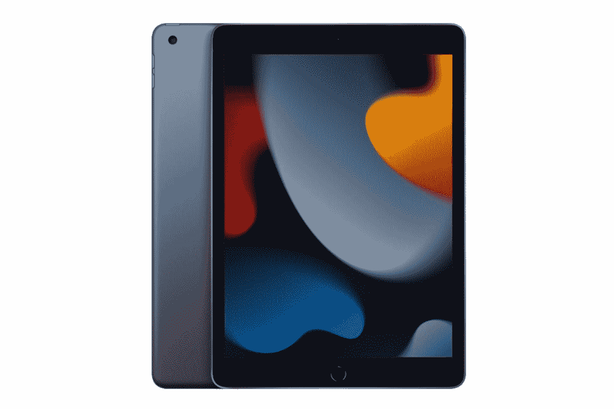

# 苹果仍然提供低价的第九代 iPad，售价 329 美元

> 原文：<https://www.xda-developers.com/apple-still-offers-9th-generation-ipad/>

# 苹果仍然提供低价的第九代 iPad，售价 329 美元

尽管发布了新的 iPad，苹果仍在销售其第九代平板电脑，起价 329 美元。

尽管苹果公司今天发布了一款新的平价 iPad，但该公司仍然保留了第九代产品，以 329 美元的价格为那些想要它的人提供了一个较低的准入门槛。在讨论[ipad](https://www.xda-developers.com/best-ipad/)时，平板电脑在相当长一段时间内一直是性价比最高的产品，现在看来依然如此。

iPad 9 代拥有 10.2 英寸的 Retina 显示屏，采用 LED 背光，由苹果的 A13 仿生芯片供电。除了装有触控 ID 传感器的 home 键，这款平板电脑还支持第一代 Apple Pencil。由于这个型号有一个 Lightning 端口，所以你可以方便地将 Apple Pencil 直接插入平板电脑进行充电。就电池寿命而言，一次充电大约可以使用 10 个小时。这款平板电脑的背面还有一个 800 万像素的摄像头，可以以每秒 30 帧的速度录制 1080p 的视频，还有一个 1200 万像素的前置摄像头。

虽然这是一个旧型号，但它仍然非常强大，能够连接到键盘，将生产力提高到一个新的水平。第九代 iPad 有两种颜色，太空灰和银色，目前 Wi-Fi 型号的起价为 329 美元，内置 64GB 存储空间。还有一款具有蜂窝连接功能的机型起价为 459 美元，也有 64GB 的内部存储空间。如果您需要更多空间，您可以随时升级到 256GB 版本。

如果运气好的话，你有时会发现平板电脑的价格降低了，比苹果的零售价低得多。最近，在亚马逊的 [Prime 早期访问销售](https://www.xda-developers.com/apple-most-popular-ipad-prime-early-access-sale/)期间，它被打折至 269 美元。谢天谢地，价格仍然保持在 269 美元，所以如果你感兴趣，现在将是购买的最佳时机。

 <picture></picture> 

Apple iPad 9th generation (2021)

##### 苹果 iPad 第九代(2021 年)

第九代 iPad 采用 A13 仿生处理器、10.2 英寸显示屏和触控 ID。

* * *

**来源** : [苹果](https://www.apple.com/ipad-10.2/)