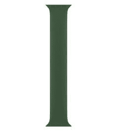
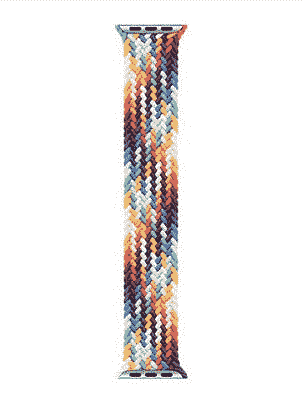
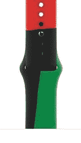
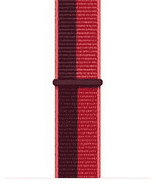
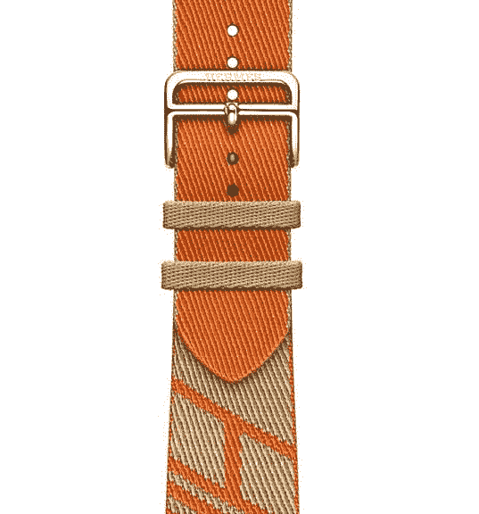
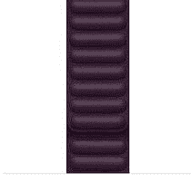
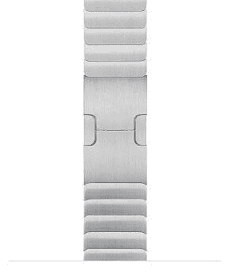

# 苹果手表系列 7:这里是所有的颜色和官方带选项

> 原文：<https://www.xda-developers.com/apple-watch-7-colors-official-bands/>

早在 2021 年 9 月，苹果在加州流媒体活动上发布了苹果手表系列 7。关于 Apple Watch Series 7，你会注意到的一件事是它有丰富的颜色和表带选择。更不用说它有 41 毫米和 45 毫米两种屏幕尺寸。因此，我们对可用的定制进行了细分，以帮助您进行选择。

* * *

## Apple Watch 系列 7:外壳选项

在购买 Apple Watch 7 之前，你需要知道的第一件事是，你需要首先决定你想要主体上的哪种材料和随之而来的光洁度。材料的选择会影响腕表模块的重量、颜色和光泽，也会对耐用性产生一些微小的影响。当然，不同的材料价格也不同。

### 铝金属

铝制 Apple Watch 是最便宜也是最受欢迎的型号。它由可回收的耐用铝制成，有五种颜色可供选择。您可以选择蓝色、午夜、星光、绿色和(产品)红色。尽管它是最便宜的型号，但它的制作材料看起来和感觉上都比较高档。它在美国的起价为 399 美元。

 <picture></picture> 

Aluminum Apple Watch Series 7

##### 铝制苹果手表系列 7

铝模型是最实惠的，并有各种颜色可供选择。苹果的 41mm 和 45mm 版本都可以买。

### 不锈钢

不锈钢 Apple Watch 的价格更高，因为它增加了光泽和耐用性。它看起来比铝模型更高级，但是它有更少的颜色选择。你可以从银、金和石墨中选择。与一些“有趣”的铝色相比，这些颜色更正式。它在美国的起价为 699 美元。

 <picture></picture> 

Apple Watch Series 7

##### 不锈钢苹果手表系列 7

不锈钢的价格不太实惠，但是更正式，更耐用。苹果的 41mm 和 45mm 版本都可以买。

### 钛

钛金属 Apple Watch 的价格最高，因为这种材料非常坚固。它比不锈钢型号更钝，但在更恶劣的条件下可以持续更长时间。它只有两种颜色——太空黑和钛。它在美国的起价为 799 美元。值得一提的是，只有 Apple Watch 版提供钛金属材质。“版本”只是普通 Apple Watch 的一个品牌。它不提供任何额外的东西，除了它是由钛制成的这一事实。

 <picture></picture> 

Titanium Apple Watch Series 7

##### 钛苹果手表系列 7

与铝和不锈钢相比，钛型号是最贵的。然而，它是三者中最耐用的。苹果的 41mm 和 45mm 版本都可以买。

* * *

## Apple Watch 系列 7:表带选项

苹果提供了几十种不同颜色/材质的表带组合。它们有不同的价格、颜色、建筑材料、正式程度等等。几乎可以保证找到一个符合你风格的苹果乐队。然而，您也可以[查看第三方选项](https://www.xda-developers.com/best-apple-watch-bands/)以获得更便宜、更广泛的设计和颜色选项。

### 独奏循环

Solo Loop，顾名思义，是一个单件乐队。所以每次穿上都没什么扣不扣的。它由硅胶制成，有七种不同的颜色。你可以选择英国薰衣草，粉笔粉，金盏花，三叶草，黑樱桃，深渊蓝，星光。当通过苹果购买时，有一个关于如何选择与你的手腕匹配的完美尺寸的指南。你可以打印一张苹果公司的纸条来引导你。或者，你可以用尺子创建自己的长条，苹果也列出了步骤。在美国售价 49 美元。

 <picture></picture> 

Solo Loop

##### Apple Watch Solo Loop 乐队

Solo Loop 是一个单件硅胶带，有多种颜色可供选择。可以直接从苹果买。

### 编织独奏循环

编织独奏环也是一个单件乐队，但它具有更大的拉伸，编织设计。它可以轻松地戴在手腕上或从手腕上取下，并且坐在那里很舒服。说到材料，这款是由回收的聚酯纱线细丝和硅胶线制成的。有六种颜色可供选择——玉米色、(产品)红色、深樱桃色、英国薰衣草色、深渊蓝和骄傲版。在美国售价 99 美元。

 <picture></picture> 

Braided Solo Loop

##### 苹果手表编织独奏环带

编织独奏环是一个单件编织带，有丰富多彩的变化，并具有可拉伸的设计。可以直接从苹果买。

### 运动乐队

运动表带是经典的 Apple Watch 硅胶表带。不像 Solo Loops，买之前不需要量手腕。无论你的手腕减掉或增加多少重量，它都会很合身。它有 14 种不同的颜色可供选择。您可以从三叶草、金盏花、黑樱桃、英国薰衣草、深渊蓝、(产品)红、星光、午夜、黑色统一、橄榄灰/货物卡其(耐克版)、烬/深红极乐(耐克版)、午夜海军/神秘海军(耐克版)、无烟煤/黑色(耐克版)、铂金/黑色(耐克版)中选择。在美国售价 49 美元。

 <picture></picture> 

Sport Band

##### Apple Watch 运动表带

Sport Band 有十几种颜色可供选择，并非定制尺寸。可以直接从苹果买。

### 运动环路

Sport Loop 由编织尼龙制成，配有粘扣带。它很容易穿上，缓冲皮肤，并允许水分通过。它有九种不同的颜色可供选择。您可以选择玉米/白色、粉柚/褐色、深渊蓝/苔绿、深樱桃/森林绿、(产品)红色、龙卷风/灰色、卡其色(耐克版)、顶峰白(耐克版)和黑色(耐克版)。在美国售价 49 美元。

 <picture></picture> 

Sport Loop

##### 苹果手表 Sport Loop

Sport Loop 有九种颜色可供选择，并非定制尺寸。可以直接从苹果买。

### 尼龙

尼龙带是爱马仕的专属品，正如你所料，它们标有爱马仕的价格。它们有两种不同的颜色可供选择。可以选择牛皮/橙跳单游和牛皮/酸橙跳单游。在美国,*每台仅售 319 美元。*

 <picture></picture> 

Nylon Band

##### 苹果手表爱马仕跳跃单巡回乐队

尼龙带是爱马仕的专属。这是一款设计精致的奢华配饰。可以直接从苹果买。

### 皮革

皮带有各种形状、尺寸、颜色和价格标签。总共有二十一个选项可供选择。在美国，起价为 99 美元，价格高达 849 美元。皮革表带比其他硅胶和尼龙表带更高档、更专业。其中一些是爱马仕的独家产品，因此价格很高。

 <picture></picture> 

Leather Band

##### Apple Watch 皮革链带

皮革表带有各种设计和颜色，其中包括爱马仕专属款。可以直接从苹果买一个。

### 不锈钢

不锈钢表带有两种不同的型号——米兰尼斯环和链节手镯。前者有金色、银色和石墨色可选，后者有银色和太空黑可选。它们在美国的起价分别为 99 美元和 349 美元。苹果还出售一个链接手镯套件，以防你失去了你的银色或太空黑色链接手镯带的任何链接，并希望添加更多链接。

 <picture></picture> 

Stainless Steel Band

##### 苹果手表米兰环路乐队

不锈钢带有两种设计和几种颜色。它们既耐用又专业。可以直接从苹果买一个。

* * *

## Apple Watch 工作室

如果你想通过挑选表壳和选择特定的表带来创造自己的风格，苹果商店提供了一个 [Apple Watch Studio](https://www.apple.com/shop/studio/apple-watch) 在线工具。所以现在你可以随心所欲地混搭！

这个工具允许你选择外壳的尺寸、材料和颜色。然后你被要求选择一个乐队去。你会看到最终组合的现场照片。完成后，您可以按照自己选择的配置购买它。苹果还会在浏览器上保存你的风格，以防你想设计手表，但以后再买。

* * *

值得一提的是，有些特别版手表是由特定材料制成的。例如，耐克版只有铝制版本。所以不能买不锈钢做的。同样，爱马仕版只有不锈钢材质。普通的 Apple Watch 有三种材料可供选择——铝、不锈钢和钛——尽管苹果将钛版作为 Edition Watch 销售。

*你想要 Apple Watch Series 7 和表带的什么组合？请在下面的评论区告诉我们。*