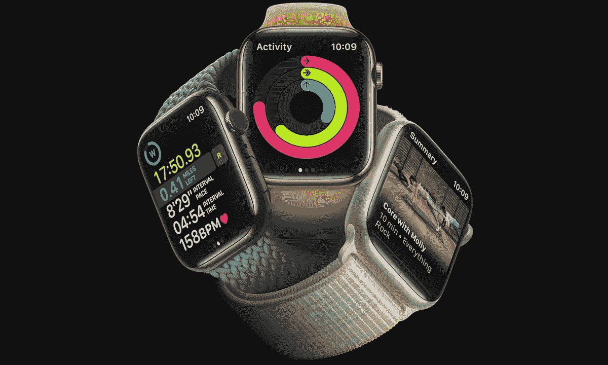

# Apple Watch Series 8 上可以用老款表带吗？

> 原文：<https://www.xda-developers.com/apple-watch-8-older-watch-bands/>

# Apple Watch Series 8 上可以用老款表带吗？

Apple Watch Series 8 有 41mm 和 45mm 两种型号。这是否意味着它支持旧的表带？让我们找出答案。

 <picture></picture> 

Apple Watch Series 8

自 2015 年以来，库比提诺公司已经发布了六种不同的 [Apple Watch](http://www.xda-developers.com/best-apple-watch/) (不包括 [Apple Watch Ultra](http://www.xda-developers.com/apple-watch-ultra-review/) 的 49 毫米):38 毫米、40 毫米、41 毫米、42 毫米、44 毫米和 45 毫米。 [Apple Watch Series 8](http://www.xda-developers.com/best-apple-watch-8-deals/) 只有 41 毫米和 45 毫米两种型号。如果你有一个旧型号的带子，它可以工作——取决于尺寸组是否匹配。38 毫米、40 毫米和 41 毫米表带相互兼容。同样，42 毫米、44 毫米和 45 毫米的带子也是相互兼容的。因此，如果你有一个 40 毫米 Apple Watch 的表带，并且已经购买了 45 毫米 Apple Watch Series 8，那么这个表带根本就不兼容。然而，一个 42 毫米的老表带可以很好地配合这款手表。

另外值得注意的是，你可以将 Apple Watch Ultra 的专属表带与 Apple Watch Series 8 45mm 变型(非 41mm)搭配使用。如果你拥有 41 毫米的手表，并且真的想使用 Ultra bands，那么你可以寻找与较小的手表兼容的第三方复制品。

Apple Watch Series 8 是苹果公司最新推出的智能手表。与 Series 7 相比，这不是一个巨大的变化，但它提供了一些新功能，如碰撞检测、新的温度传感器等。

老乐队与新的 Apple Watch 型号合作真的是一件很棒的事情，只要他们属于相同的规模组。这样，如果你买了一个昂贵的手环，你就不需要仅仅因为升级了智能手表就转售它。同样，如果你已经投资了大量的 Apple Watch 表带来搭配不同的服装风格和颜色，你就不需要每次升级你的可穿戴设备时从头开始重建你的收藏。

*你多久换一次 Apple Watch 的表带？请在下面的评论区告诉我们。*