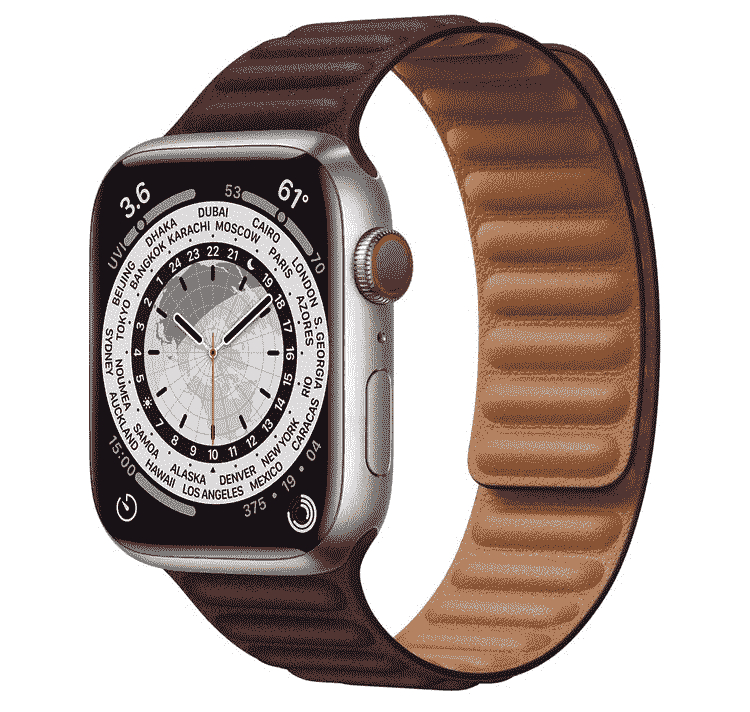

# 在黄金时段购买这些官方 Apple Watch 手环最多可节省 14 美元

> 原文：<https://www.xda-developers.com/apple-watch-bands-prime-day-deals-2022/>

# 在黄金时段购买这些官方 Apple Watch 手环最多可节省 14 美元

在亚马逊 Prime Day 限时交易期间，您可以在精选的 Apple Watch 手环上节省高达 14 美元。在此交易到期前抓住一个！

对于[健身追踪](https://www.xda-developers.com/apple-watch-series-7-fitness/)来说，Apple Watch 是一款出色的可穿戴设备。对于那些寻找[非健康相关功能](https://www.xda-developers.com/apple-watch-more-than-fitness/)的人来说，这也很棒。如果你已经利用了[亚马逊 Prime Day](https://www.xda-developers.com/amazon-prime-day/)[Apple Watch deals](https://www.xda-developers.com/apple-watch-prime-day-deals-2022/)，那么你可能会想看看其他的波段。手表的盒子里有一个。然而，默认的太枯燥了，而且很快就变得乏味了。更不用说你可能想在不同的场合穿不同的颜色和风格。这就是这些表带的伟大之处——你可以轻松地在它们之间切换，完全改变你的 Apple Watch 的外观。你也可以为这些配饰搭配一个与它们颜色相得益彰的表盘。

我们不常看到 Apple Watch 表带打折。然而，今天是你的幸运日——因为有几件商品只在有限的时间内打折。其中包括:

 <picture></picture> 

Titanium Apple Watch Series 7

##### Apple Watch 皮革链带

在这里你可以找到 Apple Watch 配件的完整列表，包括所有可用颜色和款式的打折表带。

你可能知道，Apple Watch 有两种尺寸可供选择。当你买这些带子时，确保你选择了正确的尺寸。如果你买错了，你可能无法在苹果手表上使用它。如果你倾向于经常刷新你的外表，买几个也是一个明智的想法。最终，在接下来的几个月里，你可能找不到同样有回报的交易。

你可能也想记住，不是所有的表带都是防水的。戴着它洗澡或游泳之前，请仔细阅读 Apple 的文档。或者，如果你似乎找不到你想要的答案，你可以避免让它们接触水。

*您会购买这些 Apple Watch 表带中的哪一款，为什么？请在下面的评论区告诉我们。*